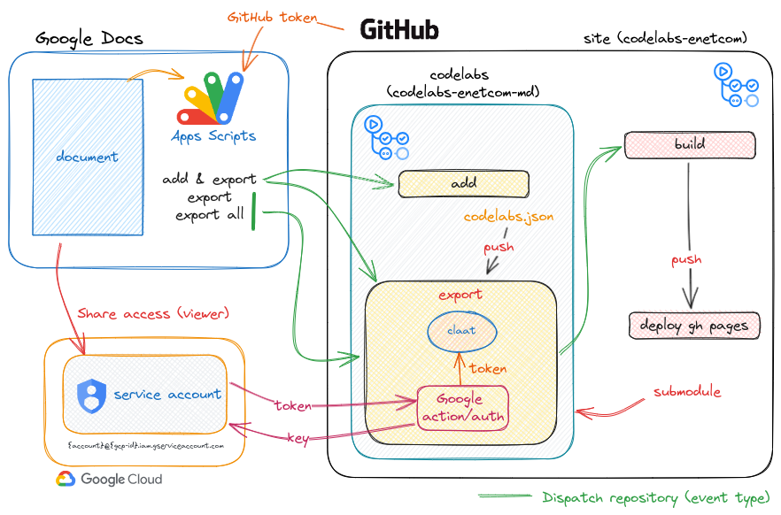
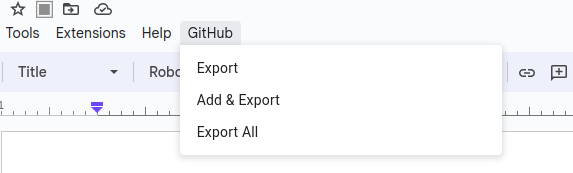

# :gear: Codelabs for Enet'Com practicals

>[!CAUTION]
>
> This repository is under active development, meaning many features are experimental and subject to change. While direct pushes to the main branch are possible, it's important to note that these changes haven't undergone thorough validation through a pull request process.

This repository contains codelabs ready for deployment. These codelabs have been exported from Google documents using an automated workflow that utilizes the [claat tool](https://github.com/googlecodelabs/tools) to convert them from Google Doc format to Codelab format.

## :hammer_and_wrench: Essential Tools

* [Google Docs](https://docs.google.com/)
* [Google Cloud Project](https://developers.google.com/workspace/guides/create-project) ([Service Account](https://cloud.google.com/iam/docs/service-account-overview)): Houses the service account used for accessing the Google Drive API.
* [Google Apps Script](https://developers.google.com/apps-script/guides/docs)
* `claat`  ([Google Codelabs CLI](https://github.com/googlecodelabs/tools)): Command-line tool for converting Google Docs/markdown files to Codelabs format.
* GitHub Actions: Automates the export and deployment process.
  * [CLaaT export](https://github.com/marketplace/actions/claat-export)
  * [Authenticate to Google Cloud](https://github.com/marketplace/actions/authenticate-to-google-cloud)

## :scroll: Workflows



| Workflow                | Description                                                                                                        | Trigger(s)                                                           | event_type (`repository_dispatch`)          |
|-------------------------|--------------------------------------------------------------------------------------------------------------------|----------------------------------------------------------------------|-------------------------------------------|
| [`export.yml`](.github/workflows/export.yml)              | Export Google document(s) and create a pull request (PR) with the changes in the codelabs.                                             | `workflow_dispatch` (manual), `repository_dispatch`, `push`([`codelabs.json`](codelabs.json)) | `gdocs_export`, `gdocs_add`, `gdocs_export_all` |
| [`add.yml`](.github/workflows/add.yml)                 | Add the Google document that dispatched the workflow to [`codelabs.json`](codelabs.json)                                               | `workflow_call`( other workflow), `repository_dispatch`                  | `gdocs_add`                                 |
| [`dispatch_repository.yml`](.github/workflows/dispatch_repository.yml) | Once a pull request (PR) containing codelabs changes is merged into the main branch, it will trigger a build workflow in the main repository. | `pull_request`                                                         | `closed` (merged)                           |

## :thinking: How does this work and how can it be achieved?

### :footprints: Steps

1. **Google Document Creation:**
    * Start by creating a Google document from a formatted template. This document will serve as the basis for your codelab content. (check [Codelab formating guide](https://github.com/googlecodelabs/tools?tab=readme-ov-file#ok-how-do-i-use-it))
2. **Google Cloud Project Setup:**
    * [Create a Google Cloud Project](https://developers.google.com/workspace/guides/create-project).
    * [Enable Google Drive API](https://support.google.com/googleapi/answer/6158841?hl=en) (read-only access) in the project.

3. **Service Account Creation:**
    * Within the Google Cloud Project, [create a service account](https://cloud.google.com/iam/docs/service-accounts-create).
    * This service account acts like an email and will be used by the claat tool to access the Google document.
    * Share viewer access of the Google document with this service account.
    * [Generate a key](https://cloud.google.com/iam/docs/keys-create-delete) (JSON file) for the service account credentials.
    * These credentials will be used by Google auth action to generate an OAuth 2.0 token for claat to access the document. Copy the content of the JSON file into [a repository secret](https://docs.github.com/en/actions/security-guides/using-secrets-in-github-actions#creating-secrets-for-a-repository) under the name `SERVICE_ACCOUNT_CREDS`
4. **Apps Script Development:**
    * Add an Apps Script for the Google Doc (code available [here](google-apps-scripts/code.gs)).
    * This script requires a GitHub token to operate. ([The personal access token (classic)](https://docs.github.com/en/authentication/keeping-your-account-and-data-secure/managing-your-personal-access-tokens#creating-a-personal-access-token-classic) need the `repo` scope  and `contents:write` for [fine-grained access tokens](https://docs.github.com/en/authentication/keeping-your-account-and-data-secure/managing-your-personal-access-tokens#creating-a-fine-grained-personal-access-token))
    * Add your Github token as [a script proprety](https://developers.google.com/apps-script/guides/properties#manage_script_properties_manually) in Google Apps Script under the name `github_token`
    * Reload your Google documents and authorize your script once prompted.
    * The script provides a menu to export the current document, triggering a workflow in the GitHub repo to export the document.

    

    | Option       | Description                                         | event_type       |
    |--------------|-----------------------------------------------------|------------------|
    | Export       | Export current document                             | `gdocs_export`     |
    | Add & Export | Add current document to `codelabs.json` and export it | `gdocs_add`        |
    | Export All   | Export all documents in `codelabs.json`               | `gdocs_export_all` |  

5. **GitHub Actions Workflow:**
    * When the export menu option is selected in Google Docs, it dispatches an event to start a workflow in the GitHub repository.
    * The workflow generates an OAuth token for the service account, which has already been granted access to the Google document.
    * The generated authentication token is passed to the claat action to access the document and export the codelab.
    * After the codelab is generated, the workflow checks for any changes in the repository and creates a pull request with those changes.
6. **Pull Request Handling:**
    * Once the pull request is merged, a `repository_dispatch` event is sent to the main repository containing the site for deployment.
    * This repository only contains codelabs.

## :outbox_tray: Exporting multiple documents

To export multiple documents simultaneously, I created a JSON file named [`codelabs.json`](codelabs.json). This JSON file serves as a structured data container that stores an array of objects, each representing a document. Every object within the array possesses two attributes:

```json
[
  {
    "id": "document-id",
    "source": "google_doc_id"
  },
  {
    "id": "document-id-md",
    "source": "path/to/index.md"
  }
]
```

1. `id`: This attribute is optional and primarily used for reference purposes. (same `id` you've defined in the document)
2. `source`: This attribute is required, it specifies the source file that needs to be exported. (Google document ID or markdown file path)

I wrote [a script](scripts/aggregate_codelabs.sh) that creates a file named `codelabs.json` if you've already exported your codelabs. Each exported codelab likely contains a file named "codelab.json". The script extracts a specific attribute (likely named "need") from these individual files and uses the extracted information to create a list within the main `codelabs.json` file. This `codelabs.json` file is intended to be used with a composite action [CLaaT export](https://github.com/marketplace/actions/claat-export).

## :balance_scale: License

The scripts and documentation in this project are released under the [Apache 2.0 License](LICENSE)

## :handshake: Code of Conduct

:wave: Be nice. See [our code of conduct](.github/CODE_OF_CONDUCT.md)
