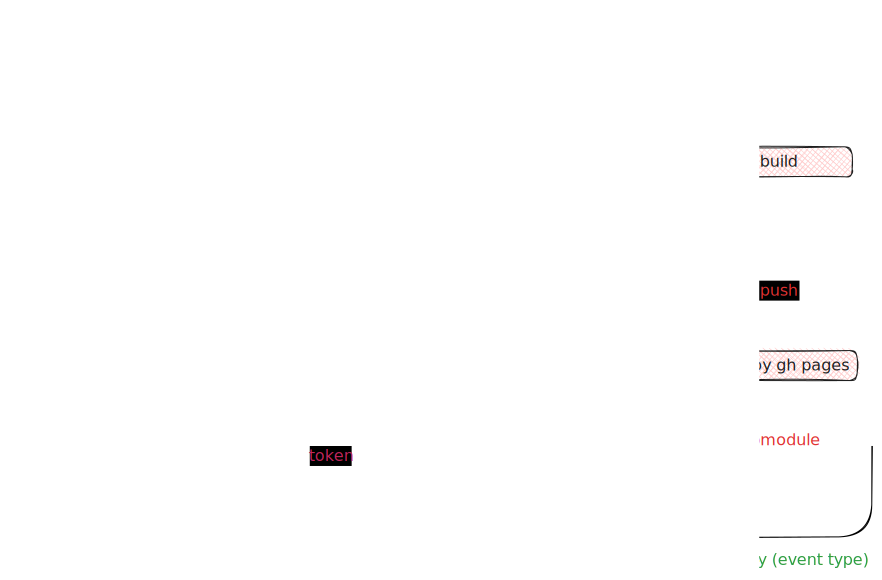

# Codelabs for Enet'Com practicals

## Workflows



>[!important]
>
> Use the Go module installer to get the latest version of claat with support for Google Analytics v4.

Command claat to export document from gdocs in md file format:

```shell
claat export -f=md -ga="UA-XXXXX" [gdocs_guid]
```

Command to get gdocs source from json file:

```shell
cat codelabs.json | grep "source" | sed 's/.*": "\(.*\)"/\1/'
```
