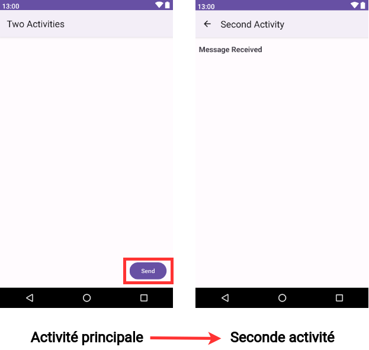
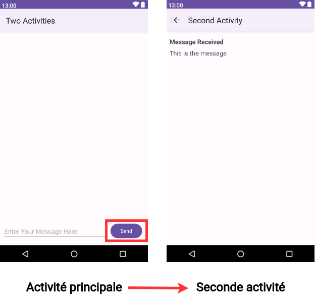
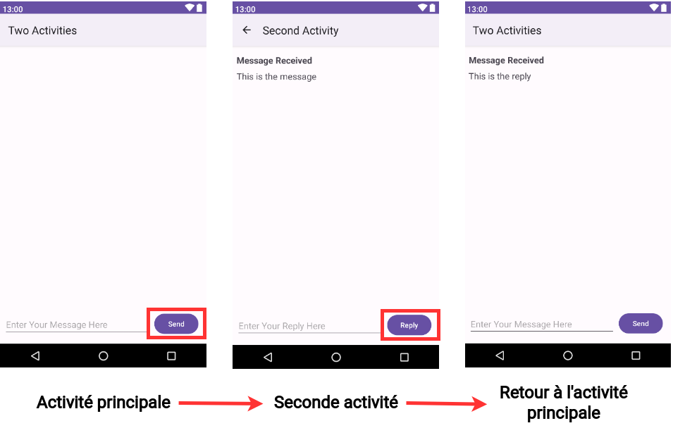
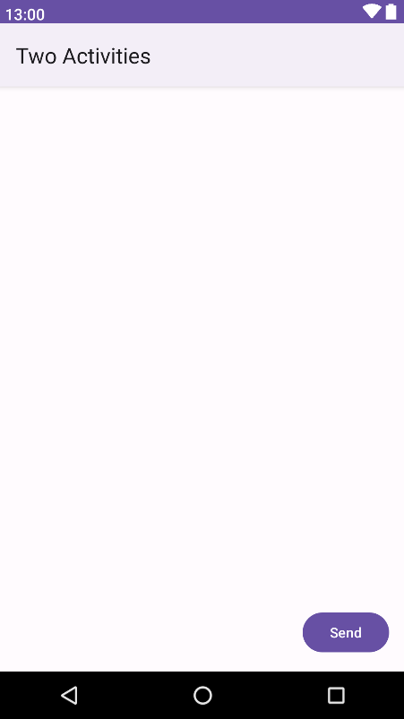
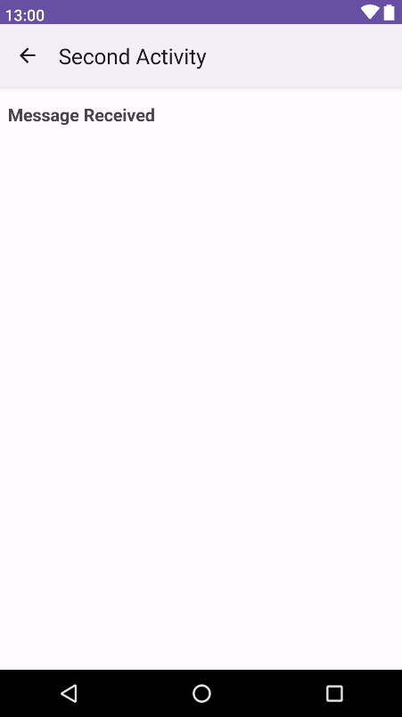
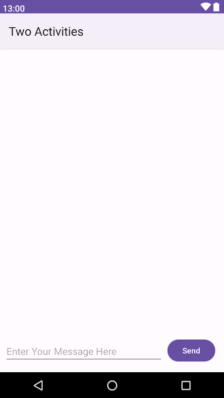
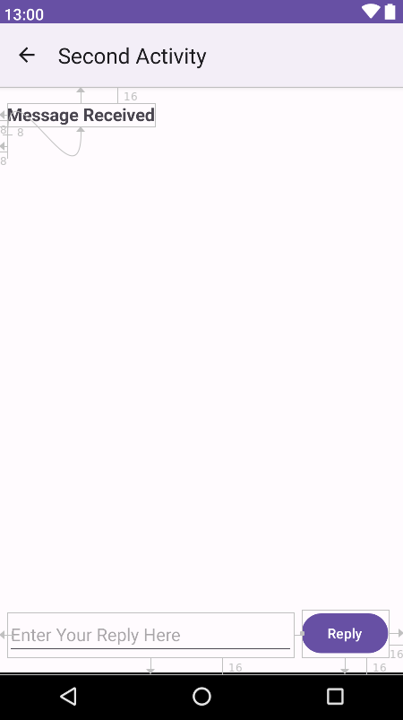
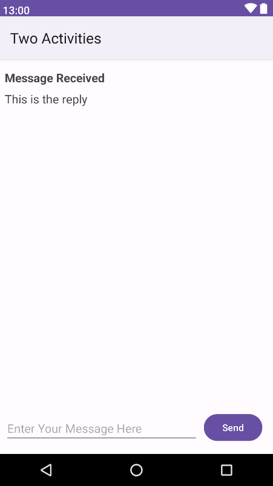
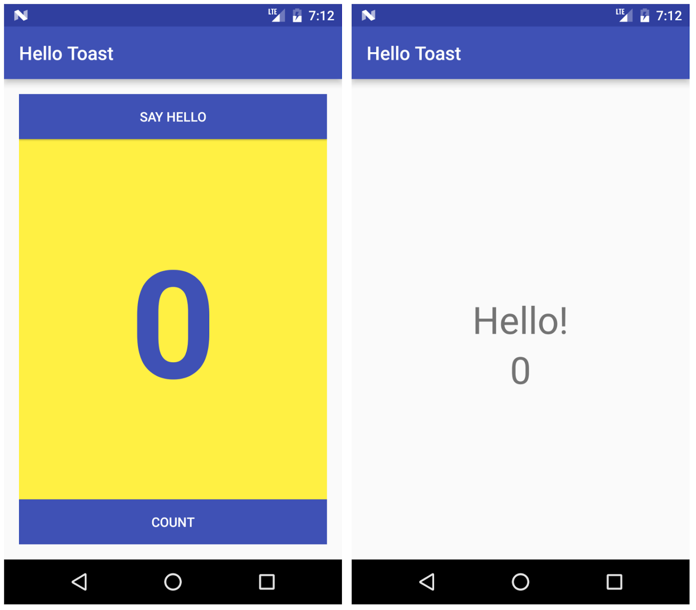

# TP 02.1: Activités et "intents"

[Codelab Feedback](https://github.com/khammami/codelabs-enetcom/issues)


## Bienvenue


Ces travaux pratiques sont basés sur le cours de base pour les développeurs Android fourni par Google, qui prépare les participants au test de certification  [Associate Android Developer](https://developers.google.com/training/certification/associate-android-developer/). Pour tirer le meilleur parti de ce TP, il est recommandé de travailler successivement dans les codelabs.

### Introduction

Une activité ( [`Activity`](https://developer.android.com/reference/android/app/Activity.html)) représente un seul écran dans votre application avec lequel votre utilisateur peut effectuer une tâche unique, telle que prendre une photo, envoyer un courrier électronique ou afficher une carte. Une activité est généralement présentée à l'utilisateur sous la forme d'une fenêtre plein écran.

Une application est généralement composée de plusieurs écrans liés de manière approximative. Chaque écran est une activité. En règle générale, une activité dans une application est spécifiée comme activité principale (`MainActivity.java`), qui est présentée à l'utilisateur lors du lancement de l'application. L'activité principale peut alors démarrer d'autres activités pour effectuer différentes actions.

Chaque fois qu'une nouvelle activité démarre, l'activité précédente est arrêtée, mais le système conserve l'activité dans une pile ("back stack"). Quand une nouvelle activité commence, cette nouvelle activité est poussée dans la pile arrière et prend le focus de l'utilisateur. La pile arrière suit la logique de pile de base "dernier entré, premier sorti". Lorsque l'utilisateur a terminé l'activité en cours et appuie sur le bouton Précédent, cette activité est extraite de la pile, détruite et l'activité précédente reprend.

Une activité est démarrée ou activée avec une intention. Une intention ( [`Intent`](https://developer.android.com/reference/android/content/Intent.html)) est un message asynchrone que vous pouvez utiliser dans votre activité pour demander une action à une autre activité ou à un autre composant d'application. Vous utilisez l'intention pour démarrer une activité à partir d'une autre activité et de transmettre des données entre les activités.

Une intention peut être explicite ou implicite:

* Une "*explicit intent"* est une intention dans laquelle vous connaissez la cible de cette intention. C'est-à-dire que vous connaissez déjà le nom de classe complet de cette activité spécifique.
* Une "*implicit intent"* est une intention dans laquelle vous n'avez pas le nom du composant cible, mais une action générale à effectuer.

Dans cette pratique, vous créez des intentions explicites. Vous découvrirez comment utiliser les intentions implicites dans une pratique plus tard.

### What you should already know

Vous devriez être familier avec:

* Créez et exécutez des applications dans Android Studio.
* Utilisez l'éditeur de disposition (layout) pour créer une disposition dans un `ConstraintLayout`
* Éditez le code XML de la mise en page (layout).
* Ajouter la fonctionnalité `onClick` à un bouton (`Button`).

### What you'll learn

* Comment créer une nouvelle activité (`Acitivity`) dans Android Studio.
* Comment définir les activités parent et enfant pour la navigation vers le haut.
* Comment démarrer une activité (`Activity`) avec une intention (`Intent`) explicite.
* Comment transmettre des données entre chaque activité (`Activity`) avec une intention (`Intent`) explicite.

### What you'll do

* Créez une nouvelle application Android avec une activité (`Activity`) principale et une deuxième activité (`Activity`).
* Transmettez des données (une chaîne de caractère) de l'activité (`Activity`) principale à la seconde à l'aide d'une intention, puis affichez ces données dans la deuxième activité (`Activity`).
* Envoyez un second ensemble de données différent à l'activité (`Activity`) principale, en utilisant également une intention (`Intent`).


## Aperçu de l'application


Dans cette pratique, vous créez et construisez une application appelée Deux activités (Two Activities) qui, sans surprise, contient deux implémentations d' `Activity`. Vous construisez l'application en trois étapes.

Dans la première étape, vous créez une application dont l'activité principale contient un bouton, "**Send**". Lorsque l'utilisateur clique sur ce bouton, votre activité principale utilise l'intention pour démarrer la deuxième activité.



Dans la deuxième étape, vous ajoutez une vue `EditText` à l'activité principale. L'utilisateur entre un message et clique sur "**Send**". L'activité principale utilise l'intention pour démarrer la deuxième activité et d'envoyer le message de l'utilisateur à la deuxième activité. La deuxième activité affiche le message reçu.



Dans la dernière étape de la création de l'application "**Two Activities**", vous ajoutez `EditText` et un bouton "**Reply**" à la deuxième activité. L'utilisateur peut désormais saisir un message de réponse, puis appuyez sur "**Reply**", et la réponse est affichée sur l'activité principale. À ce stade, vous utilisez une intention (`Intent`) pour renvoyer la réponse de la deuxième activité à l'activité principale.




## Créer le projet TwoActivities


Dans cette tâche, vous configurez le projet initial en créant une activité (`Activity`) principale, en définissant la mise en page et en définissant une méthode pour l'événement `onClick` du bouton.

> aside negative
> 
> Pour suivre ce codelab, vous devez activer la nouvelle interface utilisateur dans Android Studio Giraffe:
> 
> * à partir de la fenêtre "Welcome to Android Studio":
> **Customize &gt; All settings**
> * à partir de la fenêtre du projet ouvert:
> **File &gt; Settings**
> 
> 
> 
> Pour activer la nouvelle interface utilisateur et afficher le menu principal dans une barre d'outils séparée, cochez les deux paramètres suivants :
> 
> * **Enable new UI**
> * **Show main menu in separate toolbar**
> 
> Une fois ces paramètres cochés, vous devez redémarrer Android Studio pour que les changements soient appliqués.

### 1.1 Créer le projet TwoActivities

1. Démarrez Android Studio et créez un nouveau projet Android Studio.

Nommez votre application "**Two Activities**" et choisissez les mêmes paramètres de **Phone and Tablet** que ceux que vous avez utilisés dans les travaux pratiques précédents. Le dossier du projet est automatiquement nommé `TwoActivities` et le nom de l'application qui apparaît dans la barre des applications sera "Two Activities".

2. Choisissez "**Empty Views Activity**" pour le modèle d'activité (`Activity`). Cliquez sur "**Next**".
3. Assurez-vous que la langue du projet est **Java** et le "Build Configuration" sur **Groovy (build.gradle)**.
4. Cliquez sur "**Finish**".
5. Changez le parent de du thème de l'application par **Theme.Material3.Light** et supprimez le fichier `themes.xml (night)`

### 1.2 Définir la mise en page (layout) de l'activité principale

1. Ouvrez **res &gt; layout &gt; activity_main.xml** dans le volet **Project &gt; Android**. L'éditeur de layout apparaît.
2. Sélectionnez le mode de vue **Design** s'il n'est pas déjà sélectionné et supprimez le `TextView` (celui qui dit "Hello World") dans le volet **Component Tree**.
3. Avec la connexion automatique (Autoconnect) activée (paramètre par défaut), faites glisser un bouton du volet **Palette** vers le coin inférieur droit de la présentation (layout). La connexion automatique (Autoconnect) crée des contraintes pour le bouton (`Button`).
4. Dans le volet **Attributes**, définissez l'**ID** sur **button_main**, les propriétés **layout_width** et **layout_height** sur `wrap_content` et entrez **Send** pour le champ Text. La mise en page devrait maintenant ressembler à ceci:



5. Sélectionnez le mode de vue **Code** pour modifier le code XML. Ajoutez l'attribut suivant au bouton (`Button`):

```
android:onClick="launchSecondActivity"
```

La valeur de l'attribut est soulignée en rouge car la méthode `launchSecondActivity()` n'a pas encore été créée. Ignorer cette erreur pour l'instant; vous le corrigez dans la tâche suivante.

6. Extrayez la ressource chaîne, comme décrit dans une pratique précédente, pour "**Send**" et utilisez le nom `button_main` pour la ressource.

Le code XML du bouton (`Button`) devrait ressembler à ceci:

```
<Button
   android:id="@+id/button_main"
   android:layout_width="wrap_content"
   android:layout_height="wrap_content"
   android:layout_marginEnd="16dp"
   android:layout_marginBottom="16dp"
   android:text="@string/button_main"
   android:onClick="launchSecondActivity"
   app:layout_constraintBottom_toBottomOf="parent"
   app:layout_constraintEnd_toEndOf="parent" />
```

### 1.3 Définir l'action du bouton

Dans cette tâche, vous implémentez la méthode `launchSecondActivity()` à laquelle vous avez fait référence dans la présentation (layout) pour l'attribut `android:onClick`.

1. Cliquez sur `"`**`launchSecondActivity`**`"` dans le code XML `activity_main.xml`.
2. Appuyez sur **Alt + Entrée** et sélectionnez **Create 'launchSecondActivity(View)' in 'MainActivity'**.

Le fichier `MainActivity` s'ouvre et Android Studio génère une méthode squelette pour le gestionnaire `launchSecondActivity()`.

3. Dans la section `launchSecondActivity()`, ajoutez une instruction de journal (`Log`) indiquant "Button Clicked!".

```
Log.d(LOG_TAG, "Button clicked!");
```

`LOG_TAG` s'affiche en rouge. Vous ajoutez la définition de cette variable dans une étape ultérieure.

4. En haut de la classe `MainActivity`, ajoutez une constante pour la variable `LOG_TAG`:

```
private static final String LOG_TAG = 
                            MainActivity.class.getSimpleName();
```

Cette constante utilise le nom de la classe elle-même comme étiqutte (tag).

5. Exécutez votre application. Lorsque vous cliquez sur le bouton **Send**, vous voyez le  message "Button Clicked!" dans le volet **Logcat**. S'il y a trop de sorties dans le moniteur, tapez **MainActivity** dans le champ de recherche. Le volet "**Logcat"** n'affichera que les lignes correspondant à cette étiqutte (tag).

Le code de `MainActivity` devrait ressembler à ceci:

```
public class MainActivity extends AppCompatActivity {
   private static final String LOG_TAG = 
                               MainActivity.class.getSimpleName();

   @Override
   protected void onCreate(Bundle savedInstanceState) {
       super.onCreate(savedInstanceState);
       setContentView(R.layout.activity_main);
   }

   public void launchSecondActivity(View view) {
       Log.d(LOG_TAG, "Button clicked!");
   }
}
```


## Créer et lancer la deuxième activité


Chaque nouvelle activité que vous ajoutez à votre projet a sa propre structure et ses propres fichiers Java, distincts de ceux de l'activité principale. Ils ont également leurs propres éléments `&lt;activity&gt;` dans le fichier `AndroidManifest.xml`. Comme pour l'activité principale, les nouvelles implémentations d'activité que vous créez dans Android Studio s'étendent également à partir de la classe `AppCompatActivity`.

Chaque activité de votre application est uniquement liée vaguement à d'autres activités. Cependant, vous pouvez définir une activité en tant que parent d'une autre activité dans le fichier `AndroidManifest.xml`. Cette relation parent-enfant permet à Android d'ajouter des astuces de navigation telles que des flèches orientées vers la gauche dans la barre de titre pour chaque activité.

Une activité communique avec d'autres activités (dans la même application et à travers différentes applications) avec une intention (`Intent`). Une intention peut être explicite ou implicite:

* Une "*explicit intent"* est une intention dans laquelle vous connaissez la cible de cette intention. c'est-à-dire que vous connaissez déjà le nom de classe complet de cette activité spécifique.
* Une "*implicit intent"* est une intention dans laquelle vous n'avez pas le nom du composant cible, mais une action générale à effectuer.

Dans cette tâche, vous ajoutez une deuxième activité à notre application, avec sa propre mise en page (layout). Vous modifiez le fichier `AndroidManifest.xml` pour définir l'activité principale en tant que parent de la deuxième activité. Ensuite, vous modifiez la méthode `launchSecondActivity()` dans `MainActivity` pour inclure une intention (`Intent`) qui lance la deuxième activité lorsque vous cliquez sur le bouton.

### 2.1 Créer la deuxième activité

1. Cliquez sur le module d'application de votre projet et choisissez **File &gt; New &gt; Activity &gt; Empty Views Activity**.
2. Nommez la nouvelle activité **SecondActivity**. Assurez-vous que l'option  **Generate Layout File** soit cochée. Le nom de la présentation (layout) est nommé sous la forme `activity_second`. Ne cochez pas l'option **Launcher Activity**.
3. Cliquez sur Finish. Android Studio ajoute à la fois un nouveau layout d'activité (`activity_second.xml`) et un nouveau fichier Java (`SecondActivity.java`) à votre projet pour la nouvelle activité (`Activity`). Il met également à jour le fichier `AndroidManifest.xml` pour inclure la nouvelle activité.

### 2.2 Modifier le fichier AndroidManifest.xml

1. Ouvrez **manifests &gt; AndroidManifest.xml**.
2. Recherchez l'élément `activity` créé par Android Studio pour la deuxième activité.

```
<activity android:name=".SecondActivity"></activity>
```

3. Remplacez l'intégralité de l'élément `activity` par ce qui suit:

```
<activity android:name=".SecondActivity"
    android:label = "Second Activity"
    android:parentActivityName=".MainActivity">
</activity>
```

L'attribut `label` ajoute le titre de l'activité à la barre des applications.

Avec l'attribut `parentActivityName`, vous indiquez que l'activité principale est le parent de la deuxième activité. Cette relation est utilisée pour la navigation vers le haut dans votre application: la barre d'application de la deuxième activité comporte une flèche orientée vers la gauche pour permettre à l'utilisateur de naviguer "vers le haut" vers l'activité principale.

4. Extrayez une ressource de chaîne de caractère pour "**Second Activity**" dans le code ci-dessus et utilisez `activity2_name` comme nom de ressource.

### 2.3 Définir la mise en page (layout) pour la deuxième activité

1. Ouvrez **activity_second.xml** et sélectionnez le mode de vue **Design** s'il n'est pas déjà sélectionné.
2. Faites glisser un **TextView** du volet **Palette** vers le coin supérieur gauche de la disposition (layout) et ajoutez des contraintes aux côtés supérieur et gauche de la disposition (layout). Définissez ses attributs dans le volet **Attributes** comme suit:

| <strong>Attribut</strong> | <strong>Valeur</strong> |
| --- | --- |
| id | text_header |
| Top margin | 16 |
| Left margin | 8 |
| layout_width | wrap_content |
| layout_height | wrap_content |
| text | Message Received |
| textAppearance | @style/TextAppearance.AppCompat.Medium |
| textStyle | bold |

La valeur de **textAppearance** est un attribut spécial du thème Android qui définit les styles de police de base.

La mise en page (layout) devrait maintenant ressembler à ceci:



3. Sélectionnez le mode de vue **Code** pour modifier le code XML et extrayez la chaîne "Message Received" dans une ressource nommée `text_header`.
4. Ajoutez l'attribut `android:layout_marginLeft="8dp"` à `TextView` pour compléter l'attribut `layout_marginStart` pour les anciennes versions d'Android.

Le code XML pour `activity_second.xml` devrait être le suivant:

```
<androidx.constraintlayout.widget.ConstraintLayout xmlns:android="http://schemas.android.com/apk/res/android"
    xmlns:app="http://schemas.android.com/apk/res-auto"
    xmlns:tools="http://schemas.android.com/tools"
    android:layout_width="match_parent"
    android:layout_height="match_parent"
    tools:context="com.example.twoactivities.SecondActivity">

    <TextView
        android:id="@+id/text_header"
        android:layout_width="wrap_content"
        android:layout_height="wrap_content"
        android:layout_marginStart="8dp"
        android:layout_marginLeft="8dp"
        android:layout_marginTop="16dp"
        android:text="@string/text_header"
        android:textAppearance=
                          "@style/TextAppearance.AppCompat.Medium"
        android:textStyle="bold"
        app:layout_constraintStart_toStartOf="parent"
        app:layout_constraintTop_toTopOf="parent" />
</androidx.constraintlayout.widget.ConstraintLayout>
```

### 2.4 Ajouter une intention (Intent) à l'activité principale

Dans cette tâche, vous ajoutez une intention (`Intent`) explicite à l'activité (`Activity`) principale. Cette intention (`Intent`) est utilisée pour activer la deuxième activité lorsque l'utilisateur clique sur le bouton **Send**.

1. Ouvrez **MainActivity**.
2. Créez une nouvelle intention (`Intent`) dans la méthode `launchSecondActivity()`.

Le constructeur d'intention (`Intent`) prend deux arguments pour une intention (`Intent`) explicite: un contexte ( [`Context`](https://developer.android.com/reference/android/content/Context.html)) d'application et le composant spécifique qui recevra cette intention (`Intent`). Ici, vous devez utiliser `this` en tant que contexte (`Context`) et `SecondActivity.class` en tant que classe spécifique:

```
Intent intent = new Intent(this, SecondActivity.class);
```

3. Appelez la méthode `startActivity()` avec le nouvel `Intent` comme argument.

```
startActivity(intent);
```

4. Exécutez l'application.

Lorsque vous cliquez sur le bouton **Send**, `MainActivity` envoie l'intention (`Intent`) et le système Android lance `SecondActivity`, qui apparaît à l'écran. Pour revenir à `MainActivity`, cliquez sur le bouton Haut (**Up** la flèche gauche dans la barre d'application) ou sur le bouton Précédent (Back) en bas de l'écran.


## Envoyer les données de l'activité principale à la deuxième activité


Dans la dernière tâche, vous avez ajouté une intention explicite à `MainActivity` qui a lancé `SecondActivity`. Vous pouvez également utiliser une intention pour envoyer des données d'une activité à une autre lors de son lancement.

Votre objet d'intention peut transmettre des données à l'activité cible de deux manières: dans le champ de données ou dans les extras d'intention (intent *extras)*. Les données d'intention sont un URI indiquant les données spécifiques sur lesquelles il faut agir. Si les informations que vous souhaitez transmettre à une activité par le biais d'une intention ne sont pas un URI ou si vous souhaitez envoyer plus d'une information, vous pouvez insérer ces informations supplémentaires dans les extras.

Les extras d'intention (`Intent`) sont des paires clé / valeur dans un  [`Bundle`](https://developer.android.com/reference/android/os/Bundle.html). Un `Bundle` est un ensemble de données stockées sous forme de paires clé / valeur. Pour transmettre des informations d'une activité à une autre, vous devez insérer des clés et des valeurs dans le Bundle supplémentaire d'intention (Intent extras) à partir de l'activité d'envoi, puis les récupérer dans l'activité de réception.

Dans cette tâche, vous modifiez l'intention (`Intent`) explicite dans `MainActivity` afin d'inclure des données supplémentaires (dans ce cas, une chaîne de caractère entrée par l'utilisateur) dans un `Bundle`  supplémentaire de l'intention (`Intent`). Vous modifiez ensuite `SecondActivity` pour extraire ces données du `Bundle` supplémentaire de l'intention et les afficher à l'écran.

### 3.1 Ajouter un EditText à la mise en page (layout) de MainActivity

1. Ouvrez **activity_main.xml**.
2. Faites glisser un élément **EditText** (Plain Text) du volet **Palette** vers le bas de la disposition (layout) et ajoutez des contraintes au côté gauche de la disposition (layout), au bas de la disposition (layout) et au côté gauche du bouton **Send**. Définissez ses attributs dans le volet **Attributes** comme suit:

| <strong>Attribut</strong> | <strong>Valeur</strong> |
| --- | --- |
| id | editText_main |
| Right margin | 8 |
| Left margin | 8 |
| Bottom margin | 16 |
| layout_width | match_constraint |
| layout_height | wrap_content |
| inputType | textLongMessage |
| hint | Enter Your Message Here |
| text | (Supprimer tout texte dans ce champ 👀) |

La nouvelle présentation dans `activity_main.xml` ressemble à ceci:



3. Basculez vers le mode de vue **Code** pour modifier le code XML et extrayez la chaîne "**Enter Your Message Here**" dans une ressource nommée `editText_main`.

Le code XML de la mise en page (layout) doit ressembler à ce qui suit:

```
<androidx.constraintlayout.widget.ConstraintLayout xmlns:android="http://schemas.android.com/apk/res/android"
    xmlns:app="http://schemas.android.com/apk/res-auto"
    xmlns:tools="http://schemas.android.com/tools"
    android:layout_width="match_parent"
    android:layout_height="match_parent"
    tools:context="com.example.twoactivities.MainActivity">

    <Button
        android:id="@+id/button_main"
        android:layout_width="wrap_content"
        android:layout_height="wrap_content"
        android:layout_marginBottom="16dp"
        android:layout_marginRight="16dp"
        android:text="@string/button_main"
        android:onClick="launchSecondActivity"
        app:layout_constraintBottom_toBottomOf="parent"
        app:layout_constraintRight_toRightOf="parent" />

    <EditText
        android:id="@+id/editText_main"
        android:layout_width="0dp"
        android:layout_height="wrap_content"
        android:layout_marginBottom="16dp"
        android:layout_marginEnd="8dp"
        android:layout_marginStart="8dp"
        android:ems="10"
        android:hint="@string/editText_main"
        android:inputType="textLongMessage"
        app:layout_constraintBottom_toBottomOf="parent"
        app:layout_constraintEnd_toStartOf="@+id/button_main"
        app:layout_constraintStart_toStartOf="parent" />
</androidx.constraintlayout.widget.ConstraintLayout>
```

### 3.2 Ajouter une chaîne aux extras d'intention (Intent)

Les extras d'intention (`Intent`) sont des paires clé / valeur dans un  [`Bundle`](https://developer.android.com/reference/android/os/Bundle.html). Un `Bundle` est un ensemble de données stockées sous forme de paires clé / valeur. Pour transmettre des informations d'une activité à une autre, vous devez insérer des clés et des valeurs dans le `Bundle`  supplémentaire d'Intention (`Intent`) à partir de l'activité d'envoi, puis les récupérer à nouveau dans l'activité de réception.

1. Ouvrez **MainActivity**.
2. Ajoutez une constante publique (`public`) en haut de la classe pour définir la clé de l'extra de l'intention:

```
public static final String EXTRA_MESSAGE = "key.for.extra.MESSAGE";
```

3. Ajoutez une variable privée en haut de la classe pour contenir l' `EditText`:

```
private EditText mMessageEditText;
```

4. Dans la méthode `onCreate()`, utilisez  [`findViewById()`](https://developer.android.com/reference/android/view/View.html#findViewById(int)) pour obtenir une référence à `EditText` et l'affecter à cette variable privée:

```
mMessageEditText = findViewById(R.id.editText_main);
```

5. Dans la méthode `launchSecondActivity()`, juste sous le nouvel `Intent`, obtenez le texte de `EditText` sous la forme d'une chaîne de caractère:

```
String message = mMessageEditText.getText().toString();
```

6. Ajoutez cette chaîne à l'intention (`Intent`) en tant qu'extra avec la constante `EXTRA_MESSAGE` en tant que clé et la chaîne en tant que valeur:

```
intent.putExtra(EXTRA_MESSAGE, message);
```

La méthode `onCreate()` dans `MainActivity` devrait maintenant ressembler à ceci:

```
@Override
protected void onCreate(Bundle savedInstanceState) {
        super.onCreate(savedInstanceState);
        setContentView(R.layout.activity_main);
        mMessageEditText = findViewById(R.id.editText_main);
}
```

La méthode `launchSecondActivity()` dans `MainActivity` devrait maintenant ressembler à ceci:

```
public void launchSecondActivity(View view) {
        Log.d(LOG_TAG, "Button clicked!");
        Intent intent = new Intent(this, SecondActivity.class);
        String message = mMessageEditText.getText().toString();
        intent.putExtra(EXTRA_MESSAGE, message);
        startActivity(intent);
}
```

### 3.3 Ajouter un TextView à SecondActivity pour le message

1. Ouvrez **`activity_second.xml`**.
2. Faites glisser un autre **`TextView`** vers la présentation (layout) sous `text_header`, puis ajoutez des contraintes à gauche et à la fin de `text_header`.
3. Définissez les nouveaux attributs `TextView` dans le volet **Attributes** comme suit:

| <strong>Attribut</strong> | <strong>Valeur</strong> |
| --- | --- |
| id | text_message |
| Top margin | 8 |
| Left margin | 8 |
| layout_width | wrap_content |
| layout_height | wrap_content |
| text | (Supprimer tout texte dans ce champ 👀) |
| textAppearance | @style/TextAppearance.AppCompat.Medium |

La nouvelle présentation (layout) a la même apparence que dans la tâche précédente, car la nouvelle `TextView` ne contient pas (encore) de texte et n'apparaît donc pas à l'écran.

Le code XML de la présentation (layout) `activity_second.xml` devrait ressembler à ceci:

```
<androidx.constraintlayout.widget.ConstraintLayout xmlns:android="http://schemas.android.com/apk/res/android"
    xmlns:app="http://schemas.android.com/apk/res-auto"
    xmlns:tools="http://schemas.android.com/tools"
    android:layout_width="match_parent"
    android:layout_height="match_parent"
    tools:context="com.example.twoactivities.SecondActivity">

    <TextView
        android:id="@+id/text_header"
        android:layout_width="wrap_content"
        android:layout_height="wrap_content"
        android:layout_marginStart="8dp"
        android:layout_marginTop="16dp"
        android:text="@string/text_header"
        android:textAppearance=
                          "@style/TextAppearance.AppCompat.Medium"
        android:textStyle="bold"
        app:layout_constraintStart_toStartOf="parent"
        app:layout_constraintTop_toTopOf="parent" />

    <TextView
        android:id="@+id/text_message"
        android:layout_width="wrap_content"
        android:layout_height="wrap_content"
        android:layout_marginStart="8dp"
        android:layout_marginTop="8dp"
        app:layout_constraintStart_toStartOf="parent"
        app:layout_constraintTop_toBottomOf="@+id/text_header" />
</androidx.constraintlayout.widget.ConstraintLayout>
```

### 3.4 Modifier SecondActivity pour obtenir les extras et afficher le message

1. Ouvrez **SecondActivity** pour ajouter du code à la méthode `onCreate()`.
2. Obtenez l'intention (`Intent`) qui a activé cette activité (`Activity`):

```
Intent intent = getIntent();
```

3. Obtenez la chaîne contenant le message des extras d'intention (`Intent`) en utilisant la variable statique `MainActivity.EXTRA_MESSAGE` en tant que clé:

```
String message = intent.getStringExtra(MainActivity.EXTRA_MESSAGE);
```

4. Utilisez `findViewByID()` pour obtenir une référence à `TextView` pour le message à partir de la présentation (layout):

```
TextView textView = findViewById(R.id.text_message);
```

5. Définissez le texte de `TextView` sur la chaîne extraite de l'intention (`Intent`):

```
textView.setText(message);
```

6. Exécutez l'application. Lorsque vous tapez un message dans `MainActivity` et cliquez sur **Send**, `SecondActivity` démarre et affiche le message.

La méthode `onCreate()`  de `SecondActivity` devrait ressembler à ceci:

```
@Override
protected void onCreate(Bundle savedInstanceState) {
    super.onCreate(savedInstanceState);
    setContentView(R.layout.activity_second);
    Intent intent = getIntent();
    String message = intent.getStringExtra(MainActivity.EXTRA_MESSAGE);
    TextView textView = findViewById(R.id.text_message);
    textView.setText(message);
}
```


## Renvoyer les données à l'activité principale


Maintenant que vous avez une application qui lance une nouvelle activité et lui envoie des données, la dernière étape consiste à renvoyer les données de la deuxième activité à l'activité principale. Pour ce faire, vous utilisez également une intention et des extras d'intention.

### 4.1 Ajouter un EditText et un bouton à la disposition (layout) SecondActivity

1. Ouvrez **strings.xml** et ajoutez des ressources de chaîne pour le text du bouton et le hint pour `EditText` que vous ajouterez à `SecondActivity`:

```
<string name="button_second">Reply</string>
<string name="editText_second">Enter Your Reply Here</string>
```

2. Ouvrez **activity_main.xml** et **activity_second.xml**.
3. **Copiez** les propriétés `EditText` et `Button` du fichier de mise en forme (layout) `activity_main.xml` et **collez**-les dans la mise en forme (layout) `activity_second.xml`.
4. Dans `activity_second.xml`, modifiez les valeurs d'attribut du bouton comme suit:

| <strong>Ancien attribut</strong> | <strong>Nouvelle valeur d&#39;attribut</strong> |
| --- | --- |
| android:id=&#34;@+id/button_main&#34; | android:id=&#34;@+id/button_second&#34; |
| android:onClick=&#34;launchSecondActivity&#34; | android:onClick=&#34;returnReply&#34; |
| android:text=&#34;@string/button_main&#34; | android:text=&#34;@string/button_second&#34; |

5. Dans `activity_second.xml`, modifiez les valeurs d'attribut pour `EditText` comme suit:

| <strong>Ancien attribut</strong> | <strong>Nouvelle valeur d&#39;attribut</strong> |
| --- | --- |
| android:id=&#34;@+id/editText_main&#34; | android:id=&#34;@+id/editText_second&#34; |
| app:layout_constraintEnd_toStartOf=&#34;@+id/button&#34; | app:layout_constraintEnd_toStartOf=&#34;@+id/button_second&#34; |
| android:hint=&#34;@string/editText_main&#34; | android:hint=&#34;@string/editText_second&#34; |

6. Dans l'éditeur de disposition XML, cliquez sur **returnReply**, appuyez sur **Alt + Entrée**, puis sélectionnez **Create 'returnReply(View)' in 'SecondActivity'**.

Android Studio génère une méthode squelette pour le gestionnaire `returnReply()`. Vous implémentez cette méthode dans la tâche suivante.

La nouvelle mise en page (layout) pour `activity_second.xml` ressemble à ceci:



Le code XML du fichier de mise en page (layout) `activity_second.xml` est le suivant:

```
<androidx.constraintlayout.widget.ConstraintLayout xmlns:android="http://schemas.android.com/apk/res/android"
    xmlns:app="http://schemas.android.com/apk/res-auto"
    xmlns:tools="http://schemas.android.com/tools"
    android:layout_width="match_parent"
    android:layout_height="match_parent"
    tools:context="com.example.twoactivities.SecondActivity">

    <TextView
        android:id="@+id/text_header"
        android:layout_width="wrap_content"
        android:layout_height="wrap_content"
        android:layout_marginStart="8dp"
        android:layout_marginLeft="8dp"
        android:layout_marginTop="16dp"
        android:text="@string/text_header"
        android:textAppearance="@style/TextAppearance.AppCompat.Medium"
        android:textStyle="bold"
        app:layout_constraintStart_toStartOf="parent"
        app:layout_constraintTop_toTopOf="parent" />

    <TextView
        android:id="@+id/text_message"
        android:layout_width="wrap_content"
        android:layout_height="wrap_content"
        android:layout_marginStart="8dp"
        android:layout_marginLeft="8dp"
        android:layout_marginTop="8dp"
        app:layout_constraintStart_toStartOf="parent"
        app:layout_constraintTop_toBottomOf="@+id/text_header" />

    <Button
        android:id="@+id/button_second"
        android:layout_width="wrap_content"
        android:layout_height="wrap_content"
        android:layout_marginBottom="16dp"
        android:layout_marginRight="16dp"
        android:text="@string/button_second"
        android:onClick="returnReply"
        app:layout_constraintBottom_toBottomOf="parent"
        app:layout_constraintRight_toRightOf="parent" />

    <EditText
        android:id="@+id/editText_second"
        android:layout_width="0dp"
        android:layout_height="wrap_content"
        android:layout_marginBottom="16dp"
        android:layout_marginEnd="8dp"
        android:layout_marginStart="8dp"
        android:ems="10"
        android:hint="@string/editText_second"
        android:inputType="textLongMessage"
        app:layout_constraintBottom_toBottomOf="parent"
        app:layout_constraintEnd_toStartOf="@+id/button_second"
        app:layout_constraintStart_toStartOf="parent" />
</androidx.constraintlayout.widget.ConstraintLayout>
```

### 4.2 Créer une intention (Intent) de réponse dans la deuxième activité

Les données de réponse de la deuxième activité à l'activité principale sont envoyées dans l'extra d'une intention (`Intent`). Vous construisez cette intention (`Intent`) de retour et y insérez les données de la même manière que vous le feriez pour l'intention d'envoi.

1. Ouvrez **SecondActivity**.
2. En haut de la classe, ajoutez une constante publique pour définir la clé de l'objet `Intent` extra:

```
public static final String EXTRA_REPLY = "key.for.extra.REPLY";
```

3. Ajoutez une variable privée en haut de la classe pour contenir le `EditText`.

```
private EditText mReply;
```

4. Dans la méthode `onCreate()`, avant le code d'intention (Intent), utilisez `findViewByID()` pour obtenir une référence à `EditText` et l'affecter à cette variable privée:

```
mReply = findViewById(R.id.editText_second);
```

5. Dans la méthode `returnReply()`, obtenez le texte de `EditText` en tant que chaîne de caractère:

```
String reply = mReply.getText().toString();
```

6. Dans la méthode `returnReply()`, créez une nouvelle intention (`Intent`) pour la réponse. Ne réutilisez pas l'intention que vous avez reçue de la demande d'origine.

```
Intent replyIntent = new Intent();
```

7. Add the reply string from the EditText to the new intent as an Intent *extra*. Because *extras* are key/value pairs, here the key is EXTRA_REPLY, and the value is the reply:

```
replyIntent.putExtra(EXTRA_REPLY, reply);
```

8. Définissez le résultat sur `RESULT_OK` pour indiquer que la réponse a abouti. La classe d'activité ( [`Activity`](https://developer.android.com/reference/android/app/Activity.html)) définit les codes de résultat, y compris `RESULT_OK` et `RESULT_CANCELLED`.

```
setResult(RESULT_OK,replyIntent);
```

9. Appelez `finish()` pour fermer l'activité et revenir à `MainActivity`.

```
finish();
```

Le code de `SecondActivity` devrait maintenant être le suivant:

```
public class SecondActivity extends AppCompatActivity {
    public static final String EXTRA_REPLY = "key.for.extra.REPLY";
    private EditText mReply;

    @Override
    protected void onCreate(Bundle savedInstanceState) {
        super.onCreate(savedInstanceState);
        setContentView(R.layout.activity_second);
        mReply = findViewById(R.id.editText_second);
        Intent intent = getIntent();
        String message = intent.getStringExtra(MainActivity.EXTRA_MESSAGE);
        TextView textView = findViewById(R.id.text_message);
        textView.setText(message);
    }

    public void returnReply(View view) {
        String reply = mReply.getText().toString();
        Intent replyIntent = new Intent();
        replyIntent.putExtra(EXTRA_REPLY, reply);
        setResult(RESULT_OK, replyIntent);
        finish();
    }
}
```

### 4.3 Ajouter des éléments TextView pour afficher la réponse

`MainActivity` a besoin d'un moyen d'afficher la réponse envoyée par `SecondActivity`. Dans cette tâche, vous allez ajouter des éléments `TextView` à la présentation (layout) `activity_main.xml` pour afficher la réponse dans `MainActivity`.

Pour faciliter cette tâche, vous copiez les éléments `TextView` que vous avez utilisés dans `SecondActivity`.

1. Ouvrez **`strings.xml`** et ajoutez une ressource de chaîne pour l'en-tête de réponse:

```
<string name="text_header_reply">Reply Received</string>
```

2. Ouvrez **`activity_main.xml`** et **`activity_second.xml`**.
3. Copiez les deux éléments `TextView` du fichier de mise en page (layout) `activity_second.xml` et collez-les dans la mise en page (layout) `activity_main.xml` au-dessus du bouton.
4. Dans `activity_main.xml`, modifiez les valeurs d'attribut pour le premier `TextView` comme suit:

| <strong>Ancien attribut</strong> | <strong>Nouvelle valeur d&#39;attribut</strong> |
| --- | --- |
| android:id=&#34;@+id/text_header&#34; | android:id=&#34;@+id/text_header_reply&#34; |
| android:text=&#34;@string/text_header&#34; | android:text=&#34;@string/text_header_reply&#34; |

5. Dans `activity_main.xml`, modifiez les valeurs d'attribut pour le deuxième `TextView` a comme suit:

| <strong>Ancien attribut</strong> | <strong>Nouvelle valeur d&#39;attribut</strong> |
| --- | --- |
| android:id=&#34;@+id/text_message&#34; | android:id=&#34;@+id/text_message_reply&#34; |
| app:layout_constraintTop_toBottomOf=&#34;@+id/text_header&#34; | app:layout_constraintTop_toBottomOf=&#34;@+id/text_header_reply&#34; |

6. Ajoutez l'attribut `android:visibility` à chaque `TextView` pour les rendre initialement invisibles. (Après les avoir visibles à l'écran, mais sans aucun contenu, peut être source de confusion pour l'utilisateur.)

```
android:visibility="invisible"
```

Vous rendrez ces éléments `TextView` visibles une fois que les données de réponse auront été renvoyées de la deuxième activité.

La présentation (layout) `activity_main.xml` est identique à celle de la tâche précédente, bien que vous ayez ajouté deux nouveaux éléments `TextView` à la présentation (layout). Parce que vous définissez ces éléments sur invisible, ils n'apparaissent pas à l'écran.

Voici le code XML du fichier `activity_main.xml`:

```
<androidx.constraintlayout.widget.ConstraintLayout xmlns:android="http://schemas.android.com/apk/res/android"
    xmlns:app="http://schemas.android.com/apk/res-auto"
    xmlns:tools="http://schemas.android.com/tools"
    android:layout_width="match_parent"
    android:layout_height="match_parent"
    tools:context="com.example.twoactivities.MainActivity">

    <TextView
        android:id="@+id/text_header_reply"
        android:layout_width="wrap_content"
        android:layout_height="wrap_content"
        android:layout_marginStart="8dp"
        android:layout_marginLeft="8dp"
        android:layout_marginTop="16dp"
        android:text="@string/text_header_reply"
        android:textAppearance="@style/TextAppearance.AppCompat.Medium"
        android:textStyle="bold"
        android:visibility="invisible"
        app:layout_constraintStart_toStartOf="parent"
        app:layout_constraintTop_toTopOf="parent" />

    <TextView
        android:id="@+id/text_message_reply"
        android:layout_width="wrap_content"
        android:layout_height="wrap_content"
        android:layout_marginStart="8dp"
        android:layout_marginLeft="8dp"
        android:layout_marginTop="8dp"
        android:visibility="invisible"
        app:layout_constraintStart_toStartOf="parent"
        app:layout_constraintTop_toBottomOf="@+id/text_header_reply" />

    <Button
        android:id="@+id/button2"
        android:layout_width="wrap_content"
        android:layout_height="wrap_content"
        android:layout_marginBottom="16dp"
        android:layout_marginRight="16dp"
        android:text="@string/button_main"
        android:onClick="launchSecondActivity"
        app:layout_constraintBottom_toBottomOf="parent"
        app:layout_constraintRight_toRightOf="parent" />

    <EditText
        android:id="@+id/editText_main"
        android:layout_width="0dp"
        android:layout_height="wrap_content"
        android:layout_marginBottom="16dp"
        android:layout_marginEnd="8dp"
        android:layout_marginStart="8dp"
        android:ems="10"
        android:hint="@string/editText_main"
        android:inputType="textLongMessage"
        app:layout_constraintBottom_toBottomOf="parent"
        app:layout_constraintEnd_toStartOf="@+id/button2"
        app:layout_constraintStart_toStartOf="parent" />
</androidx.constraintlayout.widget.ConstraintLayout>
```

### 4.4 Obtener la réponse de l'extra de l'intention (Intent) et afficher-la

Lorsque vous utilisez une intention (`Intent`) explicite pour démarrer une autre activité, vous ne pouvez pas vous attendre à récupérer des données. Vous activez simplement cette activité. Dans ce cas, vous utilisez `startActivity()` pour démarrer la nouvelle activité, comme vous l'avez fait précédemment dans cette pratique. Si vous souhaitez récupérer les données de l'activité activée, vous devez le démarrer avec `startActivityForResult()`.

Dans cette tâche, vous modifiez l'application pour que `SecondActivity` attend un résultat, pour extraire ces données renvoyées de l'intention (Intent) et pour afficher ces données dans les éléments `TextView` que vous avez créés dans la dernière tâche.

1. Ouvrez **MainActivity**.
2. Ajouter une constante publique au sommet de la classe pour définir la clé pour un type particulier de réponse que vous êtes intéressé par:

```
public static final int TEXT_REQUEST = 1;
```

3. Ajoutez deux variables privées pour contenir l'en-tête de réponse et les éléments `TextView` de réponse:

```
private TextView mReplyHeadTextView;
private TextView mReplyTextView;
```

4. Dans la méthode `onCreate()`, utilisez `findViewByID()` pour obtenir des références de la disposition (Layout) vers l'en-tête de réponse et les éléments `TextView` de réponse. Affectez ces instances de vue aux variables privées:

```
mReplyHeadTextView = findViewById(R.id.text_header_reply);
mReplyTextView = findViewById(R.id.text_message_reply);
```

La méthode complète `onCreate()` devrait maintenant ressembler à ceci:

```
@Override
protected void onCreate(Bundle savedInstanceState) {
        super.onCreate(savedInstanceState);
        setContentView(R.layout.activity_main);
        mMessageEditText = findViewById(R.id.editText_main);
        mReplyHeadTextView = findViewById(R.id.text_header_reply);
        mReplyTextView = findViewById(R.id.text_message_reply);
}
```

5. Dans la méthode `launchSecondActivity()`, remplacez l'appel `startActivity()` par `startActivityForResult()` et incluez la clé `TEXT_REQUEST` en tant qu'argument:

```
startActivityForResult(intent, TEXT_REQUEST);
```

> aside negative
> 
> La méthode `startActivityForResult` est obsolète (deprecated) et doit être remplacée par l'API Activity Result, qui offre une meilleure sécurité de typage grâce à un `ActivityResultContract` et aux contrats prédéfinis pour les intentions courantes disponibles dans `androidx.activity.result.contract.ActivityResultContracts`. Elle fournit également des points d'accroche pour les tests et permet de recevoir les résultats dans des classes distinctes et testables, indépendantes de votre activité. Pour plus d'informations voir  [Obtenir un résultat depuis une activité](https://developer.android.com/training/basics/intents/result?hl=fr)

6. Remplacez la méthode de rappel (callback) `onActivityResult()` par cette signature:

```
@Override
    protected void onActivityResult(int requestCode, int resultCode, @Nullable Intent data) {

}
```

Les trois arguments de `onActivityResult()` contiennent toutes les informations nécessaires pour gérer les données de retour: le `requestCode` que vous avez défini lorsque vous avez lancé `Activity` avec `startActivityForResult()`, le `resultCode` défini dans l'activité lancée (généralement l'un des `RESULT_OK` ou `RESULT_CANCELED`), et les données d'intention (`Intent`) contenant les données renvoyées par l'activité de lancement.

7. Dans `onActivityResult()`, appelez `super.onActivityResult()`:

```
super.onActivityResult(requestCode, resultCode, data);
```

8. Ajoutez du code à tester pour `TEXT_REQUEST` afin de vous assurer de traiter le bon résultat de l'intention (Intent), s'il en existe plusieurs. Testez également `RESULT_OK` pour vous assurer que la requête a abouti:

```
if (requestCode == TEXT_REQUEST) {
    if (resultCode == RESULT_OK) { 
    }
}
```

La classe d'activité ( [`Activity`](https://developer.android.com/reference/android/app/Activity.html)) définit les codes de résultat. Le code peut être `RESULT_OK` (la requête a abouti), `RESULT_CANCELED` (l'utilisateur a annulé l'opération) ou `RESULT_FIRST_USER` (pour définir vos propres codes de résultat).

9. Dans le bloc if interne, obtenez l'extra de l'intention (`Intent`) de la réponse (`data`). Ici, la clé pour l'extra est la constante `EXTRA_REPLY` de `SecondActivity`:

```
String reply = data.getStringExtra(SecondActivity.EXTRA_REPLY);
```

10. Définissez la visibilité de l'en-tête de réponse sur true:

```
mReplyHeadTextView.setVisibility(View.VISIBLE);
```

11. Définissez le texte `TextView` de "`reply`" sur la réponse et définissez sa visibilité sur true:

```
mReplyTextView.setText(reply);
mReplyTextView.setVisibility(View.VISIBLE);
```

La méthode complète `onActivityResult()` devrait maintenant ressembler à ceci:

```
@Override
    protected void onActivityResult(int requestCode, int resultCode, @Nullable Intent data) {
        super.onActivityResult(requestCode, resultCode, data);

    if (requestCode == TEXT_REQUEST) {
        if (resultCode == RESULT_OK) {
            String reply = 
                    data.getStringExtra(SecondActivity.EXTRA_REPLY);
            mReplyHeadTextView.setVisibility(View.VISIBLE);
            mReplyTextView.setText(reply);
            mReplyTextView.setVisibility(View.VISIBLE);
        }
    }
}
```

12. Exécutez l'application.

Désormais, lorsque vous envoyez un message à la deuxième activité et obtenez une réponse, l'activité principale se met à jour pour afficher la réponse.




## Résumé


Vue d'ensemble:

* Une activité (`Activity`) est un composant d'application qui fournit un seul écran centré sur une tâche à un seul utilisateur.
* Chaque activité a son propre fichier de disposition (layout) d'interface utilisateur (UI).
* Vous pouvez affecter une relation parent / enfant à vos implémentations d'Activité pour activer la navigation vers le haut dans votre application.
* Une vue peut être rendue visible ou invisible avec l'attribut `android:visibility`.

Pour implémenter une activité:

* Choisissez **File &gt; New &gt; Activity** pour démarrer à partir d'un modèle et procédez automatiquement comme suit.
* Si vous ne commencez pas à partir d'un modèle, créez une classe Java d'activité (`Activity`), implémentez une interface utilisateur (UI) de base pour l'activité dans un fichier de présentation (layout) XML associé et déclarez la nouvelle activité dans `AndroidManifest.xml`.

`Intent`:

* Une intention (`Intent`) vous permet de demander une action à un autre composant de votre application, par exemple, pour démarrer une activité à partir d'une autre. Une intention (`Intent`) peut être explicite ou implicite.
* Avec une intention explicite, vous indiquez le composant cible spécifique pour recevoir les données.
* Avec une intention implicite, vous spécifiez la fonctionnalité souhaitée, mais pas le composant cible.
* Une intention peut inclure des données sur lesquelles effectuer une action (en tant qu'URI) ou des informations supplémentaires en tant que suppléments (`extras`) d'intention.

Les extras d'intention (`Intent`) sont des paires clé / valeur dans un `Bundle` qui sont envoyées avec l'intention.


## Apprendre encore plus


Documentation d'Android Studio:

*  [Meet Android Studio](https://developer.android.com/studio/intro/index.html)

Documentation développeur Android:

*  [Application Fundamentals](http://developer.android.com/guide/components/fundamentals.html)
*  [Activities](http://developer.android.com/guide/components/activities.html)
*  [Intents and Intent Filters](http://developer.android.com/guide/components/intents-filters.html)
*  [Designing Back and Up navigation](https://developer.android.com/training/design-navigation/ancestral-temporal)
*  [`Activity`](http://developer.android.com/reference/android/app/Activity.html)
*  [`Intent`](http://developer.android.com/reference/android/content/Intent.html)
*  [`ScrollView`](https://developer.android.com/reference/android/widget/ScrollView.html)
*  [`View`](http://developer.android.com/reference/android/view/View.html)
*  [`Button`](http://developer.android.com/reference/android/widget/Button.html)
*  [`TextView`](http://developer.android.com/reference/android/widget/TextView.html)
*  [String resources](https://developer.android.com/guide/topics/resources/string-resource.html)


## Travail à faire (Compte Rendu)


> aside negative
> 
> Pour soumettre votre compte rendu, veuillez suivre ce codelab : 
> 
> [Comment soumettre votre compte rendu](https://codelabs-enetcom.khammami.tn/codelabs/soumettre-compte-rendu/)

### Créer et exécuter une application

Ouvrez l'application  [HelloToast](https://github.com/khammami/android-fundamentals-apps-v2/tree/master/HelloToast) que vous avez créée dans une pratique antérieure.

1. Modifiez le bouton **Toast** pour qu'il lance une nouvelle activité et affiche le mot "Hello!" et le nombre actuel, comme indiqué ci-dessous.
2. Modifiez le texte sur le bouton `Toast` en **Say Hello**.



### Répondre à ces questions

#### Question 1

Quelles modifications sont apportées lorsque vous ajoutez une deuxième activité à votre application en choisissant **File &gt; New &gt; Activity** et un modèle d'activité? Choisissez-en un:

* La deuxième activité est ajoutée en tant que classe Java. Vous devez toujours ajouter le fichier de mise en page (layout) XML.
* Le deuxième fichier de mise en page XML d'activité est créé et une classe Java ajoutée. Vous devez toujours définir la signature de la classe.
* La deuxième activité est ajoutée en tant que classe Java, le fichier de présentation (layout) XML est créé et le fichier `AndroidManifest.xml` est modifié pour déclarer une deuxième activité.
* Le deuxième fichier de présentation (layout) XML d'activité est créé et le fichier `AndroidManifest.xml` est modifié pour déclarer une deuxième activité.

#### Question 2

Que se passe-t-il si vous supprimez les éléments `android:parentActivityName` et `&lt;méta-data&gt;` de la deuxième déclaration d'activité du fichier `AndroidManifest.xml`? Choisissez-en un:

* La deuxième activité n'apparaît plus lorsque vous essayez de la démarrer avec une intention (`Intent`) explicite.
* Le deuxième fichier de mise en page (layout) XML d'activité est supprimé.
* Le bouton Back (Précédent) ne fonctionne plus dans la deuxième activité pour renvoyer l'utilisateur à l'activité principale.
* Le bouton Up (Haut) de la barre d'applications n'apparaît plus dans la deuxième activité pour renvoyer l'utilisateur à l'activité parent.

#### Question 3

Quelle méthode de constructeur utilisez-vous pour créer une nouvelle intention (`Intent`) explicite? Choisissez-en un:

* `new Intent()`
* `new Intent(Context context, Class&lt;?&gt; class)`
* `new Intent(String action, Uri uri)`
* `new Intent(String action)`

#### Question 4

Dans l'application HelloToast (du Travail à faire), comment ajoutez-vous la valeur actuelle du comptage à l'intention (Intent)? Choisissez-en un:

* Comme les données d'intention (`Intent`)
* Comme `TEXT_REQUEST` de  l'intention (`Intent`)
* En tant qu'action d'intention (`Intent`)
* Comme extra d'intention (`Intent`)

#### Question 5

Dans l'application HelloToast (du Travail à faire), comment afficher le nombre actuel dans la deuxième activité "Hello"? Choisissez-en un:

* Obtenez l'intention (`Intent`) avec laquelle l'activité a été lancée.
* Obtenez la valeur actuelle du comptage de l'intention.
* Mettez à jour le `TextView` pour le comptage.
* Tout ce qui précède.

### Soumettez votre application pour la notation

Vérifiez que l'application dispose des éléments suivants:

* Il affiche le bouton **Say Hello** au lieu du bouton **Toast**.
* La deuxième activité commence lorsque le bouton **Say Hello** est enfoncé et affiche le message "Hello!" et le nombre actuel de `MainActivity`.
* Les fichiers de présentation (layout) XML et Java de la deuxième Activité ont été ajoutés au projet.
* Le fichier de présentation (layout) XML de la deuxième activité contient deux éléments `TextView`, l'un avec la chaîne "Hello!" et le second avec le compte.
* Il inclut une implémentation d'une méthode de gestion des clics pour le bouton **Say Hello** (dans `MainActivity`).
* Il inclut une implémentation de la méthode `onCreate()` pour la deuxième activité et met à jour le décompte `TextView` avec le décompte de `MainActivity`.


