# TP 01.1: Android Studio et Hello World

[Codelab Feedback](https://github.com/khammami/codelabs-enetcom/issues)


## Bienvenue


Ces travaux pratiques se base sur le cours de base pour les développeurs Android fourni par Google afin de  les préparer pour le test de certification  [Associate Android Developer](https://developers.google.com/training/certification/associate-android-developer/). Vous obtiendrez le plus de valeur de ce TP si vous travaillez successivement dans les codelabs.

### Introduction

Dans cette pratique, vous apprendrez comment installer Android Studio, l'environnement de développement Android. Vous créez également et lancez votre première application Android, Hello World, sur un émulateur et sur un périphérique physique.

### What you should already know

Vous devriez pouvoir:

* Comprendre le processus général de développement de logiciels pour les applications orientées objet utilisant un environnement de développement intégré (IDE) tel que Android Studio.
* Démontrez que vous avez au moins 1 à 3 ans d'expérience de la programmation orientée objet, dont une partie est axée sur le langage de programmation Java. (Ces travaux pratiques n'expliquent pas la programmation orientée objet ni le langage Java.)

### What you'll need

* Un ordinateur sous Windows ou Linux ou un Mac sous MacOS. Voir  [la page de téléchargement Android Studio](https://developer.android.com/studio/index.html) pour connaître la configuration requise actualisée.
* Accès Internet ou autre moyen de charger les dernières installations d'Android Studio et Java sur votre ordinateur.
* Android Studio version Koala (2024.1.2).

### What you'll learn

* Comment installer et utiliser l'IDE Android Studio.
* Comment utiliser le processus de développement pour créer des applications Android.
* Comment créer un projet Android à partir d'un modèle.
* Comment ajouter des messages de journal à votre application à des fins de débogage.

### What you'll do

* Installer l'environnement de développement Android Studio.
* Créer un émulateur (périphérique virtuel) pour exécuter votre application sur votre ordinateur.
* Créer et exécuter l'application Hello World sur les périphériques virtuels et physiques.
* Explorer la disposition du projet.
* Générer et afficher les messages de journalisation à partir de votre application.
* Explorer le fichier `AndroidManifest.xml`.


## Aperçu de l'application


Une fois Android Studio installé avec succès, vous créerez, à partir d'un modèle, un nouveau projet pour l'application Hello World. Cette application simple affiche une fenêtre (Activity) vide sur l'écran du périphérique virtuel ou physique Android.

Voici à quoi ressemblera l'application finie:


## Installer Android Studio
Duration: 08:00


Android Studio fournit un environnement de développement intégré complet comprenant un éditeur de code avancé et un ensemble de modèles d'application. En outre, il contient des outils de développement, de débogage, de test et de performance qui facilitent le développement d'applications. Vous pouvez tester vos applications avec une large gamme d'émulateurs préconfigurés ou sur votre propre appareil mobile, créer des applications de production et les publier sur le magasin Google Play.

> aside positive
> 
> Remarque: Android Studio est en constante amélioration. Pour obtenir les dernières informations sur la configuration système requise et les instructions d'installation, voir  [Android Studio](https://developer.android.com/studio).

Android Studio est disponible pour les ordinateurs fonctionnant sous Windows ou Linux et pour les Mac exécutant macOS. Le plus récent OpenJDK (Java Development Kit) est livré avec Android Studio.

Pour être opérationnel avec Android Studio, commencez par vérifier  [la configuration système requise](https://developer.android.com/studio/index.html#Requirements) pour vous assurer que votre système les respecte. L'installation est similaire pour toutes les plateformes. Toutes les différences sont notées ci-dessous.

1. Accédez au  [site des développeurs Android](https://developer.android.com/sdk/index.html) et suivez les instructions pour télécharger et  [installer Android Studio](https://developer.android.com/studio/install.html).
2. Acceptez les configurations par défaut pour toutes les étapes et assurez-vous que tous les composants sont sélectionnés pour l'installation.
3. Une fois l'installation terminée, l'assistant d'installation télécharge et installe des composants supplémentaires, notamment le SDK Android. Soyez patient, cela peut prendre un certain temps en fonction de votre débit Internet, et certaines étapes peuvent sembler redondantes.
4. Une fois le téléchargement terminé, Android Studio démarre et vous êtes prêt à créer votre premier projet.

> aside positive
> 
> Dépannage: Si vous rencontrez des problèmes avec votre installation, consultez  [les notes de publication d'Android Studio](https://developer.android.com/studio/releases/index.html) ou obtenez l'aide de vos enseignants.


## Créer l'application Hello World
Duration: 08:00


Dans cette tâche, vous allez créer une application simple qui affiche le message "Hello World". Cette application vous permettra de vérifier que le studio Android est correctement installé et de vous familiariser avec les bases du développement avec Android Studio.

> aside negative
> 
> Pour suivre ce codelab, vous devez activer la nouvelle interface utilisateur dans Android Studio Koala:
> 
> * à partir de la fenêtre "Welcome to Android Studio":
> **Customize &gt; All settings**
> * à partir de la fenêtre du projet ouvert:
> **File &gt; Settings**
> 
> 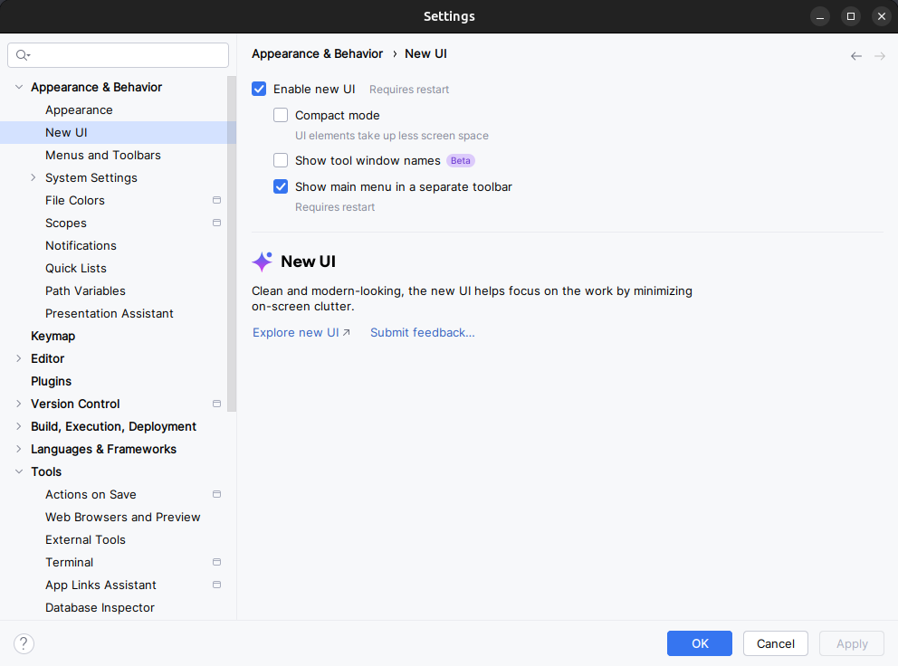
> 
> Pour activer la nouvelle interface utilisateur et afficher le menu principal dans une barre d'outils séparée, cochez les deux paramètres suivants :
> 
> * **Enable new UI**
> * **Show main menu in separate toolbar**
> 
> Une fois ces paramètres cochés, vous devez redémarrer Android Studio pour que les changements soient appliqués.

### 2.1 Créer le projet d'application

1. Ouvrez Android Studio s'il n'est pas déjà ouvert.
2. Dans la fenêtre principale **Welcome to Android Studio**, cliquez sur **New Project**.
3. Dans la fenêtre **New Project** sous l'onglet **Phone and Tablet**, sélectionner le modèle de projet **No Activity**. Puis appuyer sur **Next.**
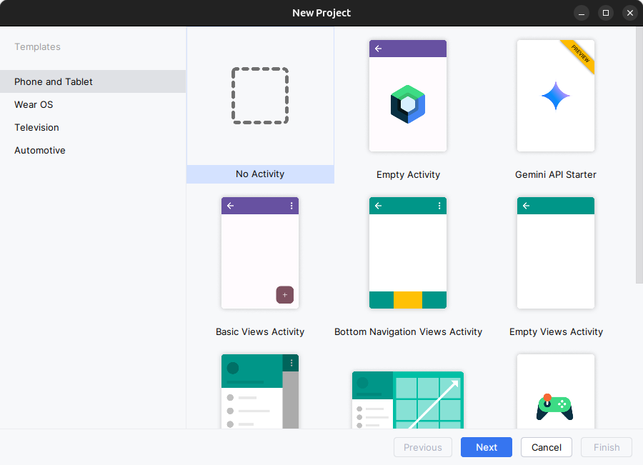
4. Dans la fenêtre **New Project,** entrez **Hello World** pour le nom de l'application.

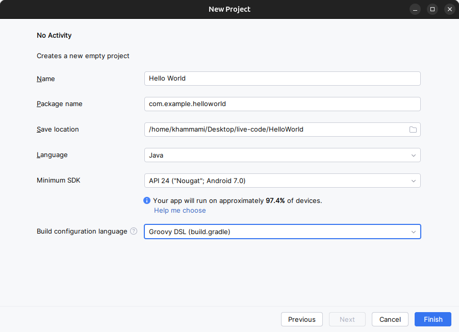

5. Acceptez **com.example.helloworld**  comme nom de paquet **Package Name** ou remplacez le par un domaine de société unique inversé.
6. Vérifiez que **Save location** par défaut est l'emplacement où vous souhaitez stocker votre application Hello World et d'autres projets Android Studio, ou modifiez-le à votre répertoire préféré.
7. Assurez que **Java** est défini comme langage de développement du projet.

Si vous ne prévoyez pas de publier votre application, vous pouvez accepter la valeur par défaut. Sachez que la modification ultérieure du nom du package de votre application représente un travail supplémentaire.

8. Assurez que l'**API 24: Android 7.0 (Nougat)** est défini comme SDK minimal; Si ce n'est pas le cas, utilisez le menu contextuel pour le définir.

Au moment d'écrire ces lignes, ces paramètres rendent votre application Hello World compatible avec 97.4% des appareils Android actifs sur le Google Play Store.

9. Cliquez sur **Finish**.

Android Studio crée un dossier pour votre projet et le construit avec  [Gradle](https://gradle.org/) (cela peut prendre quelques instants).

10. Par la suite, on va ajouter une activité ( [`Activity`](https://developer.android.com/reference/android/app/Activity.html)). Une  [`Activity`](https://developer.android.com/reference/android/app/Activity.html) est une tâche unique et ciblée que l'utilisateur peut faire. C'est un élément crucial de toute application Android. Une **Activity** est généralement associée à une présentation qui définit la manière dont les éléments de l'interface utilisateur apparaissent sur un écran. Android Studio fournit des modèles d'`Activity` pour vous aider à démarrer. Pour le projet Hello World, choisis le modèle **Empty Activity** comme indiqué ci-dessous: sélectionner le module **app** par le clique droit du souris puis **New &gt; Activity &gt; Empty Views Activity**.

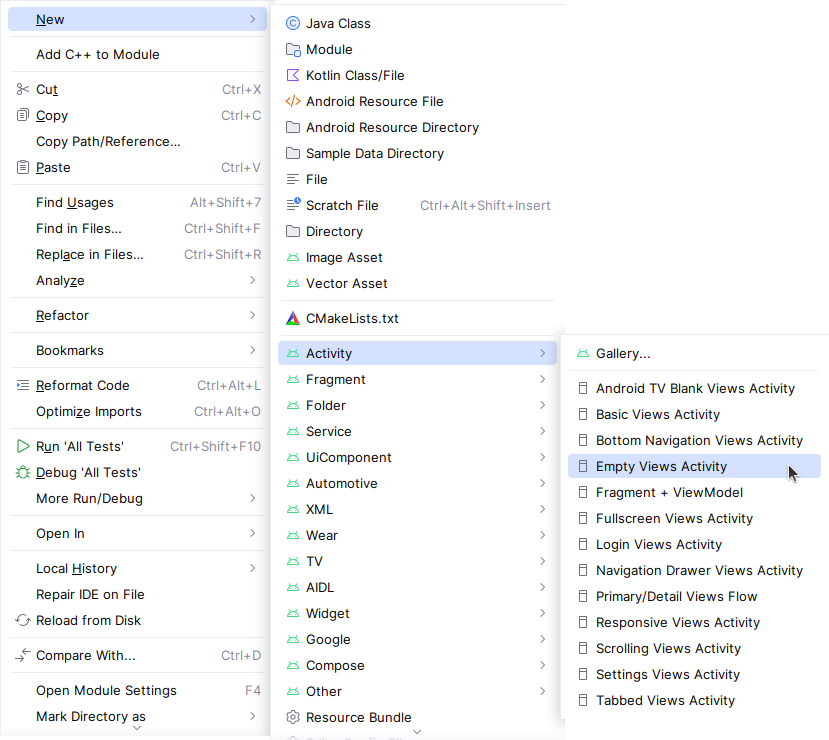

11. La fenêtre **New Android Activity** apparaît (selon le modèle que vous avez choisi à l'étape précédente). Par défaut, l'activité vide fournie par le modèle s'appelle `MainActivity`. Vous pouvez changer cela si vous voulez, mais cette leçon utilise `MainActivity`.
12. Assurez-vous que **Launcher Activity** est coché. Cette activité sera l'activité principale de notre application android qui se lancera lors de l'ouverture de l'application.

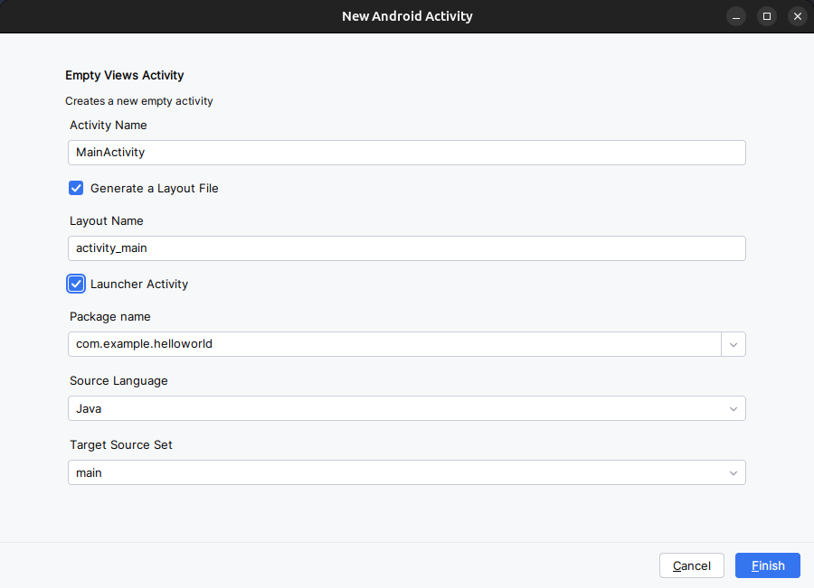

11. Assurez que **Generate a Layout File** est coché. Le nom de la présentation par défaut est `activity_main`. Vous pouvez changer cela si vous voulez, mais cette leçon utilise `activity_main`.
12. Assurez que **Source Language** est défini sur **Java** et **Target Source Set** est sur **main**.
13. Cliquer sur **Finish**.

> aside positive
> 
> **Conseil**: Voir la page  [Configure your build](https://developer.android.com/studio/build/index.html) pour des informations détaillées.

Vous pouvez également voir un message "Tip of the day" avec des raccourcis clavier et d'autres astuces utiles. Cliquez sur **Close** pour fermer le message.

L'éditeur Android Studio apparaît. Suivez ces étapes:

1. Cliquez sur l'onglet **activity_main.xml** pour afficher l'éditeur de "layout"..
2. Sélectionnez le mode de vue **Design** de l'éditeur de présentation dans la barre d'outils en haut à droite pres de l'icone de notifications  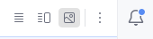, s'il n'est pas déjà sélectionné, pour afficher un rendu graphique de la présentation, comme indiqué ci-dessous.

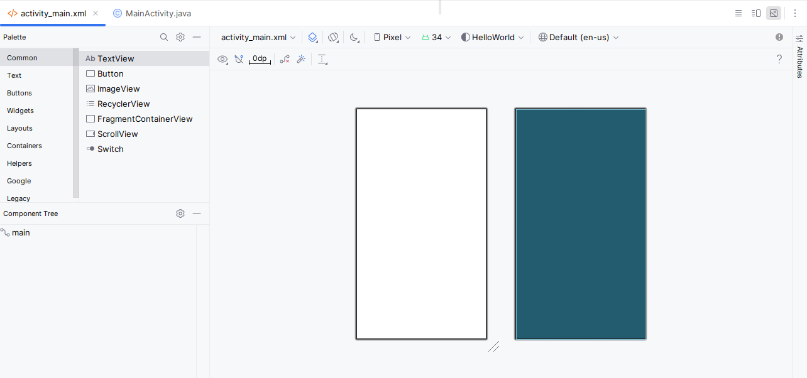

3. Cliquez sur l'onglet **MainActivity.java** pour afficher l'éditeur de code, comme indiqué ci-dessous.

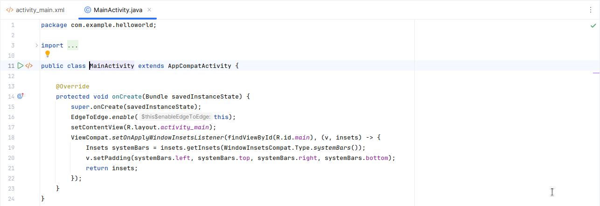

### 2.2 Explorer le volet "Project" &gt; "Android"

Dans cette pratique, vous explorerez comment le projet est organisé dans Android Studio.

1. Si ce n'est déjà fait, cliquez sur l'onglet **Project** dans la colonne d'onglets verticale du côté gauche de la fenêtre d'Android Studio. La fenêtre **Project** apparaît.
2. Pour afficher le projet dans la hiérarchie de projets Android standard, choisissez **Android** dans le menu contextuel en haut de la sous-fenêtre **Project**, comme indiqué ci-dessous.

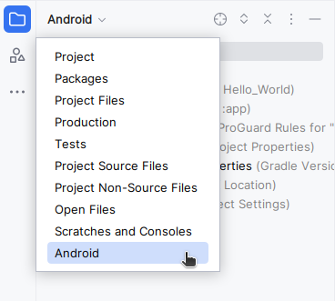

### 2.3 Explorer le dossier Gradle Scripts

Le système de génération **Gradle** dans Android Studio facilite l'inclusion de binaires externes ou d'autres modules de bibliothèque dans votre génération en tant que dépendances.

Lorsque vous créez un projet pour la première fois, le volet **Projet&gt; Android** apparaît avec le dossier **Gradle Scripts** développé comme indiqué ci-dessous.

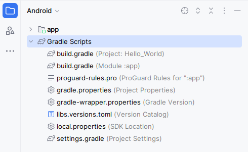

Suivez ces étapes pour explorer le système Gradle:

1. Si le dossier **Gradle Scripts** n'est pas développé, cliquez sur le triangle pour le développer.

Ce dossier contient tous les fichiers nécessaires au système de construction.

2. Recherchez le fichier **build.gradle (Project: HelloWorld)**.

Vous y trouverez les options de configuration communes à tous les modules composant votre projet. Chaque projet Android Studio contient un seul fichier de construction Gradle de niveau supérieur. La plupart du temps, vous n'avez pas besoin de modifier ce fichier, mais il est toujours utile de comprendre son contenu.

```
// Top-level build file where you can add configuration options common to all sub-projects/modules.
plugins {
alias(libs.plugins.android.application) apply false
}
```

3. Recherchez le fichier **build.gradle (Module: app)**.

En plus du fichier `build.gradle` au niveau du projet, chaque module possède son propre fichier `build.gradle`, qui vous permet de configurer les paramètres de construction de chaque module spécifique (l'application HelloWorld ne comporte qu'un seul module). La configuration de ces paramètres de génération vous permet de fournir des options de packaging personnalisées, telles que des types de construction et des variantes de produit supplémentaires. Vous pouvez également remplacer les paramètres du fichier `AndroidManifest.xml` ou du fichier `build.gradle` de niveau supérieur.

Ce fichier est le plus souvent le fichier à modifier lors de la modification de configurations au niveau de l'application, telles que la déclaration de dépendances dans la section `dependencies`. Vous pouvez déclarer une dépendance de bibliothèque à l'aide de l'une des différentes configurations de dépendance. Chaque configuration de dépendance fournit à Gradle différentes instructions sur l'utilisation de la bibliothèque.

Voici le fichier **build.gradle (Module: app)** de l'application HelloWorld:

```
plugins {
   alias(libs.plugins.android.application)
}

android {
   namespace 'com.example.helloworld'
   compileSdk 34

   defaultConfig {
       applicationId "com.example.helloworld"
       minSdk 24
       targetSdk 34
       versionCode 1
       versionName "1.0"

       testInstrumentationRunner "androidx.test.runner.AndroidJUnitRunner"
   }

   buildTypes {
       release {
           minifyEnabled false
           proguardFiles getDefaultProguardFile('proguard-android-optimize.txt'), 'proguard-rules.pro'
       }
   }
   compileOptions {
       sourceCompatibility JavaVersion.VERSION_1_8
       targetCompatibility JavaVersion.VERSION_1_8
   }
}

dependencies {

   implementation libs.appcompat
   implementation libs.material
   implementation libs.activity
   implementation libs.constraintlayout
   testImplementation libs.junit
   androidTestImplementation libs.ext.junit
   androidTestImplementation libs.espresso.core
}
```

4. Afin de gérer les dépendances et leurs versions de manière centralisée et lisible, il est recommandé de les définir séparément dans un fichier **`libs.versions.toml`** sous forme d'alias. Ces alias pourront ensuite être appelés dans la section dependencies du script Gradle du module app, simplifiant ainsi la configuration du projet.

```
[versions]
agp = "8.6.1"
junit = "4.13.2"
junitVersion = "1.2.1"
espressoCore = "3.6.1"
appcompat = "1.7.0"
material = "1.12.0"
activity = "1.9.2"
constraintlayout = "2.1.4"

[libraries]
junit = { group = "junit", name = "junit", version.ref = "junit" }
ext-junit = { group = "androidx.test.ext", name = "junit", version.ref = "junitVersion" }
espresso-core = { group = "androidx.test.espresso", name = "espresso-core", version.ref = "espressoCore" }
appcompat = { group = "androidx.appcompat", name = "appcompat", version.ref = "appcompat" }
material = { group = "com.google.android.material", name = "material", version.ref = "material" }
activity = { group = "androidx.activity", name = "activity", version.ref = "activity" }
constraintlayout = { group = "androidx.constraintlayout", name = "constraintlayout", version.ref = "constraintlayout" }

[plugins]
android-application = { id = "com.android.application", version.ref = "agp" }
```

5. Cliquez sur le triangle pour fermer **Gradle Scripts**.

### 2.4 Explorer les dossiers "app" et "res"

Tout le code et toutes les ressources de l'application se trouvent dans les dossiers `app` et `res`.

1. Développez le dossier **app**, le dossier **java** et le dossier **com.example.android.helloworld** pour afficher le fichier java **MainActivity**. Double-cliquez sur le fichier pour l'ouvrir dans l'éditeur de code.

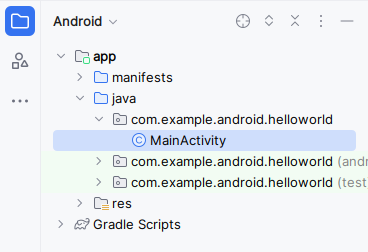

Le dossier **java** comprend des fichiers de classe Java dans trois sous-dossiers, comme indiqué dans la figure ci-dessus. Le dossier **com.example.android.helloworld** (ou le nom de domaine que vous avez spécifié) contient tous les fichiers d'un package d'application. Les deux autres dossiers sont utilisés pour les tests et décrits dans un autre codelab. Pour l'application Hello World, il n'y a qu'un seul package et il contient `MainActivity.java`. Le nom de la première `Activity` (écran) visible par l'utilisateur, qui initialise également les ressources de l'application, est généralement appelé **MainActivity** (l'extension de fichier est omise dans le volet **Project &gt; Android**).

2. Développez les dossiers **res** et **layout**, puis double-cliquez sur le fichier **activity_main.xml** pour l'ouvrir dans l'éditeur de "layout".

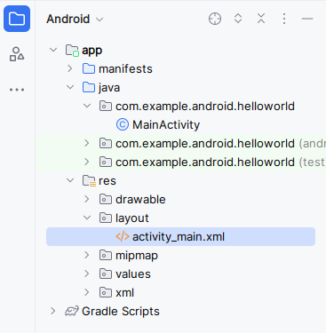

Le dossier "**res"** contient des ressources, telles que des dispositions, des chaînes et des images. Une activité est généralement associée à une disposition de vues d'interface utilisateur définies sous la forme d'un fichier XML. Ce fichier porte généralement le nom de son activité.

### 2.5 Explorer le dossier "manifests"

Le dossier `manifests` contient des fichiers qui fournissent des informations essentielles sur votre application au système Android, que le système doit posséder avant de pouvoir exécuter le code de l'application.

1. Développez le dossier **manifests**.
2. Ouvrez le fichier **AndroidManifest.xml**.

Le fichier `AndroidManifest.xml` décrit tous les composants de votre application Android. Tous les composants d'une application, tels que chaque activité, doivent être déclarés dans ce fichier XML. Dans d'autres codelabs, vous modifierez ce fichier pour ajouter des fonctionnalités et des autorisations de fonctionnalités. Pour une introduction, voir  [App Manifest Overview](https://developer.android.com/guide/topics/manifest/manifest-intro.html).

```
<?xml version="1.0" encoding="utf-8"?>
<manifest xmlns:android="http://schemas.android.com/apk/res/android"
   xmlns:tools="http://schemas.android.com/tools">

   <application
       android:allowBackup="true"
       android:dataExtractionRules="@xml/data_extraction_rules"
       android:fullBackupContent="@xml/backup_rules"
       android:icon="@mipmap/ic_launcher"
       android:label="@string/app_name"
       android:roundIcon="@mipmap/ic_launcher_round"
       android:supportsRtl="true"
       android:theme="@style/Theme.HelloWorld"
       tools:targetApi="31">
       <activity
           android:name=".MainActivity"
           android:exported="true">
           <intent-filter>
               <action android:name="android.intent.action.MAIN" />

               <category android:name="android.intent.category.LAUNCHER" />
           </intent-filter>
       </activity>
   </application>

</manifest>
```


## Utiliser un périphérique virtuel (émulateur)
Duration: 08:00


Dans cette tâche, vous utiliserez le  [Android Virtual Device (AVD) manager](http://developer.android.com/tools/devices/managing-avds.html) pour créer un périphérique virtuel (également appelé émulateur) simulant la configuration d'un type particulier de périphérique Android, puis utiliser ce périphérique virtuel pour exécuter l'application. Notez que Android Emulator a  [des exigences supplémentaires](https://developer.android.com/studio/run/emulator.html#Requirements) allant au-delà des exigences système de base pour Android Studio.

À l'aide du AVD Manager, vous définissez les caractéristiques matérielles d'un périphérique, son niveau d'API, son stockage, son apparence et d'autres propriétés, puis enregistrez-le en tant que périphérique virtuel. Avec les périphériques virtuels, vous pouvez tester des applications sur différentes configurations de périphériques (telles que des tablettes et des téléphones) avec différents niveaux d'API, sans avoir à utiliser de périphériques physiques.

### 3.1 Créer un périphérique virtuel Android

Pour exécuter un émulateur sur votre ordinateur, vous devez créer une configuration décrivant le périphérique virtuel.

1. Dans Android Studio, sélectionnez **Tools &gt; Android &gt; Device Manager** ou cliquez sur l'icône Device Manager  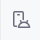dans la barre d'outils. Le volet **Device Manager** apparaît. Si vous avez déjà créé des périphériques virtuels, le volet les affiche (comme illustré dans la figure ci-dessous). sinon, vous voyez une liste vide.

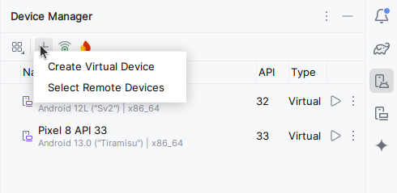

2. Cliquez sur le bouton **Create Virtual Device**. La fenêtre **Select Hardware** apparaît avec une liste de périphériques matériels pré-configurés. Pour chaque périphérique, le tableau fournit une colonne pour sa taille d'affichage diagonale (**Size**), sa résolution d'écran en pixels (**Resolution**) et sa densité de pixels (**Density**).

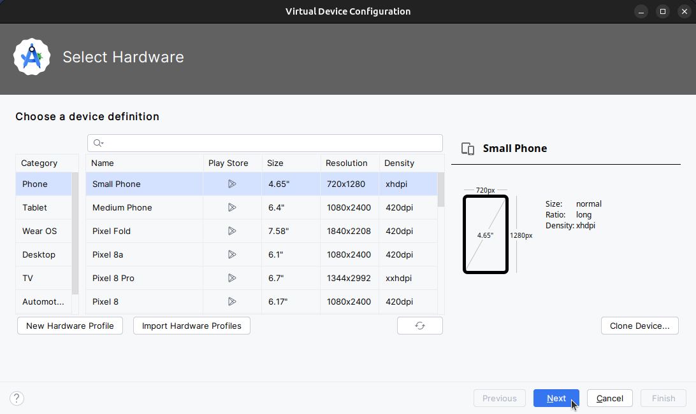

3. Choisissez un appareil tel que **Nexus one** puis cliquez sur **Next**. L'écran Image système apparaît.
4. Cliquez sur l'onglet **Recommended** s'il n'est pas déjà sélectionné et choisissez la version du système Android à exécuter sur le périphérique virtuel (telle que **Oreo**).

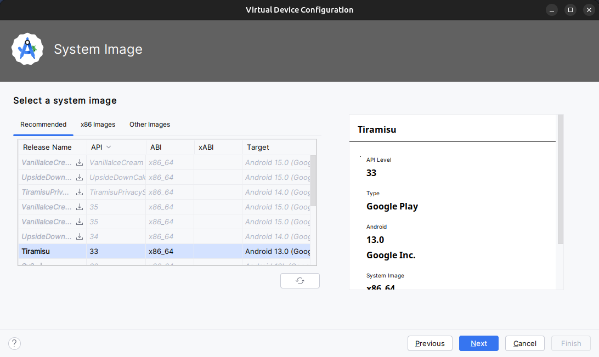

Il existe beaucoup plus de versions disponibles que celles indiquées dans l'onglet **Recommended**. Regardez les onglets **x86 images** et **Other Images** pour les voir.

Si un lien **Download** est visible à côté de l'image système que vous souhaitez utiliser, celle-ci n'est pas encore installée. Cliquez sur le lien pour lancer le téléchargement, puis cliquez sur **Finish** lorsque vous avez terminé.

5. Après avoir choisi une image système, cliquez sur **Next**. La fenêtre **Android Virtual Device (AVD)** apparaît. Vous pouvez également changer le nom de l'AVD. Vérifiez votre configuration , décochez "**enable device frame**" et cliquez sur **Finish**.

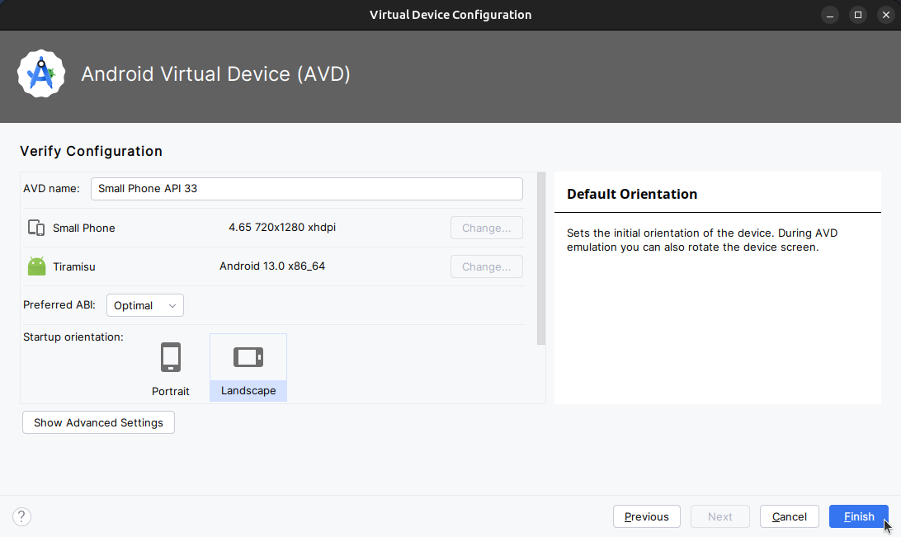

### 3.2 Exécuter l'application sur le périphérique virtuel

Dans cette tâche, vous allez enfin lancer votre application Hello World.

1. Dans le menu déroulant **Available Devices** (périphériques disponibles), sélectionnez le périphérique virtuel que vous venez de créer.
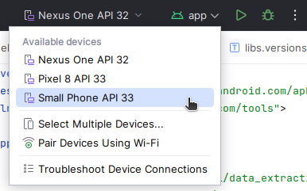
2. Dans Android Studio, choisissez "Run" &gt; "Run app" ou cliquez sur l'icône Run  dans la barre d'outils.

L'émulateur démarre et démarre comme un périphérique physique. Selon la vitesse de votre ordinateur, cela peut prendre un certain temps. Votre application est créée et une fois que l'émulateur est prêt, Android Studio la télécharge sur l'émulateur et l'exécute.

Vous devriez voir l'application Hello World comme indiqué dans la figure suivante.

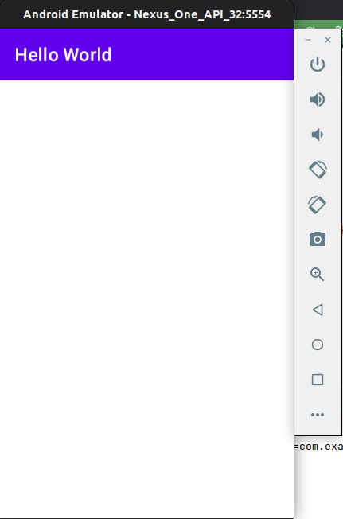

**Conseil**: lors des tests sur un périphérique virtuel, il est recommandé de le démarrer une fois, au tout début de votre session. Vous ne devez pas la fermer avant d'avoir terminé de tester votre application, afin que celle-ci ne subisse plus le processus de démarrage de l'appareil. Pour fermer le périphérique virtuel, cliquez sur le bouton **X** en haut de l'émulateur, choisissez **Quit** dans le menu ou appuyez sur **Control-Q** sous Windows ou **Command-Q** sous macOS.

> aside positive
> 
> Pour exécuter l'émulateur Android dans une fenêtre séparée : Accédez aux paramètres d'Android Studio (**File &gt; Settings &gt; Tools &gt; Emulator**), puis décochez l'option "**Launch in the Running Devices tool window**". Appliquez les modifications et redémarrez Android Studio.
> 
> 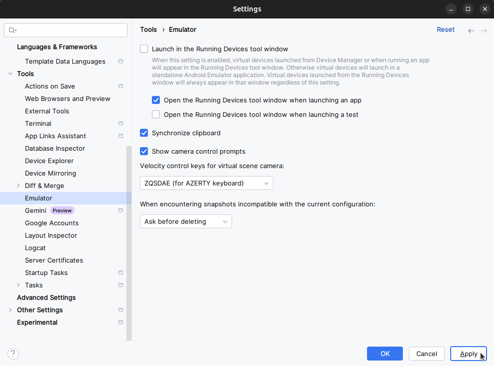


## (facultatif) utilisez un périphérique physique
Duration: 08:00


Dans cette dernière tâche, vous exécuterez votre application sur un périphérique mobile physique tel qu'un téléphone ou une tablette. Vous devez toujours tester vos applications sur des périphériques virtuels et physiques.

Qu'est-ce que vous avez besoin:

* Un appareil Android tel qu'un téléphone ou une tablette.
* Un câble de données pour connecter votre appareil Android à votre ordinateur via le port USB.
* Si vous utilisez un système Linux ou Windows, vous devrez peut-être exécuter des étapes supplémentaires pour pouvoir s'exécuter sur un périphérique matériel. Consultez  [la documentation Utilisation de périphériques matériels](http://developer.android.com/tools/device.html). Vous devrez peut-être également installer le pilote USB approprié pour votre appareil. Pour les pilotes USB Windows, voir   [OEM USB Drivers](http://developer.android.com/tools/extras/oem-usb.html).

### 4.1 Activer le débogage USB

Pour permettre à Android Studio de communiquer avec votre appareil, vous devez activer le débogage USB sur votre appareil Android. Ceci est activé dans les paramètres **Developer options** de votre appareil.

Sur Android 4.2 et supérieur, l'écran **Developer options** est masqué par défaut. Pour afficher les options du développeur et activer le **USB Debugging**:

1. Sur votre appareil, ouvrez **Settings**, recherchez **About phone**, cliquez sur **About phone**, puis appuyez sur **Build number** sept fois.
2. Retournez à l'écran précédent (**Settings / System**). **Developer options** apparaît dans la liste. Appuyez sur **Developer options**.
3. Choisissez **USB Debugging**.

### 4.2 Exécuter votre application sur un appareil

Vous pouvez maintenant connecter votre appareil et exécuter l'application à partir d'Android Studio.

1. Connectez votre appareil à votre ordinateur de développement avec un câble USB.
2. Cliquez sur le bouton **Run**  dans la barre d'outils.

Android Studio installe et exécute l'application sur votre appareil.

### Dépannage

Si votre Android Studio ne reconnaît pas votre appareil, essayez les solutions suivantes:

1. Débranchez et rebranchez votre appareil.
2. Redémarrez Android Studio.

Si votre ordinateur ne trouve toujours pas le périphérique ou le déclare "unauthorized", procédez comme suit:

1. Débrancher l'appareil.
2. Sur l'appareil, ouvrez **Developer Options** dans l'application **Settings**.
3. Appuyez sur **Revoke USB Debugging authorizations**.
4. Reconnectez le périphérique à votre ordinateur.
5. Lorsque vous y êtes invité, accordez des autorisations.

Vous devrez peut-être installer le pilote USB approprié pour votre périphérique. Consultez  [la documentation Utilisation de périphériques matériels](http://developer.android.com/tools/device.html).


## Modifier la configuration Gradle de l'application
Duration: 08:00


Dans cette tâche, vous allez modifier quelque chose à propos de la configuration de l'application dans le fichier `build.gradle(Module:app)` afin d'apprendre à modifier et à les synchroniser avec votre projet Android Studio.

### 5.1 Changer la version minimale du SDK pour l'application

Suivez ces étapes:

1. Développez le dossier **Gradle Scripts** s'il n'est pas déjà ouvert et double-cliquez sur le fichier **build.gradle (Module:app)**.

Le contenu du fichier apparaît dans l'éditeur de code.

2. Au sein du bloc `DefaultConfig`, modifiez la valeur de `minSdkVersion` à **`26`** comme indiqué ci-dessous (il a été initialement fixé à `24`).

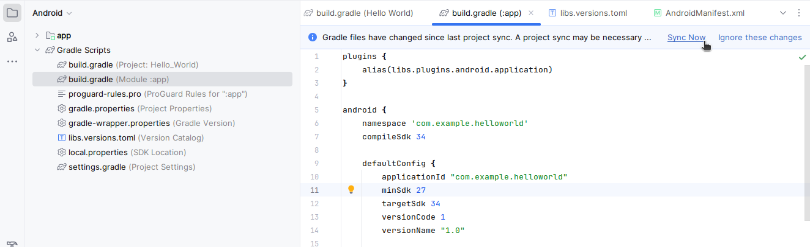

L'éditeur de code affiche une barre de notification en haut avec le lien **Sync Now**.

### 5.2 Synchroniser la nouvelle configuration Gradle

Lorsque vous apportez des modifications aux fichiers de configuration de la construction dans un projet, Android Studio exige que vous synchronisez les fichiers du projet afin qu'il puisse importer les modifications et effectuer des vérifications pour vous assurer que la configuration ne créera pas d'erreurs de construction.

Pour synchroniser les fichiers du projet, cliquez sur **Sync Now** dans la barre de notification qui apparaît lorsque vous effectuez une modification (comme illustré dans la figure précédente) ou cliquez sur l'icône **Sync Project with Gradle Files**  dans la barre d'outils ou sous le menu **File**.

Lorsque la synchronisation de Gradle est terminée, le message `Gradle build finished` apparaît dans le coin inférieur gauche de la fenêtre d'Android Studio.

Pour en savoir plus sur Gradle, consultez la documentation sur  [Build System Overview](http://developer.android.com/sdk/installing/studio-build.html) et  [Configuring Gradle Builds](http://developer.android.com/tools/building/configuring-gradle.html).


## Ajouter des instructions de journal (log) à votre application
Duration: 08:00


Dans cette tâche, vous allez ajouter des instructions de journal ( [`Log`](https://developer.android.com/reference/android/util/Log.html))  à votre application, qui affichent des messages dans le volet Logcat. Les messages du journal (`Log`)sont un puissant outil de débogage que vous pouvez utiliser pour vérifier les valeurs, les chemins d'exécution et signaler les exceptions.

### 6.1 Afficher le volet Logcat

Pour afficher le volet **Logcat**, cliquez sur l'onglet **Logcat** au bas de la fenêtre d'Android Studio, comme indiqué dans la figure ci-dessous ou bien sélectionnez **View &gt; Tool Windows &gt; Logcat**.

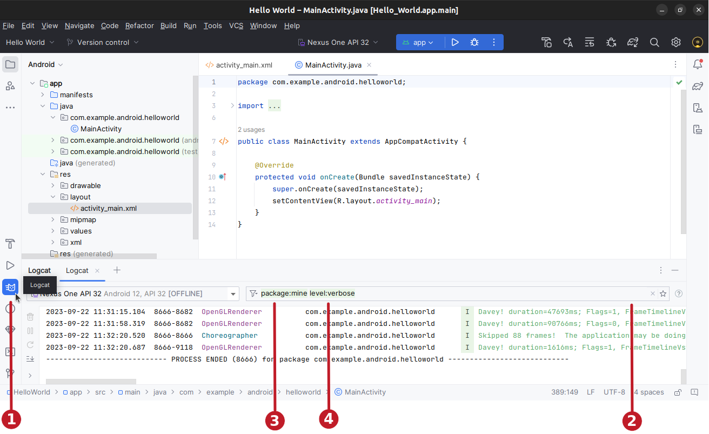

Dans la figure ci-dessus:

1. L'onglet **Logcat** pour ouvrir et fermer le volet **Logcat**, qui affiche des informations sur votre application en cours d'exécution. Si vous ajoutez des instructions de journal (`Log`) à votre application, les messages de journal (`Log`) apparaissent ici.
2. Vous pouvez générer des recherches par clé-valeur directement depuis le champ de requête principal. Ce système de requête vous permet de faire des recherches précises et exclut également les journaux en fonction de clés-valeurs. Vous pouvez utiliser des expressions régulières, vous n'en avez pas besoin pour les requêtes. Pour afficher des suggestions, appuyez sur **Ctrl+Space** dans le champ de requête.
Voici quelques exemples de clés que vous pouvez utiliser dans votre requête : `tag`, `package`, `process`, message, `level`, `age` ...
3. `package:mine` : La clé du package accepte une valeur spéciale `mine`. Cette valeur spéciale établit une La requête level établit une correspondance avec le niveau de journalisation du message Logcat, où le niveau d'entrée de journal est supérieur ou égal au niveau de requête.
Par exemple, `level:INFO` établit une correspondance avec toute entrée de journal dont le niveau de journalisation est **INFO**, **WARN**, **ERROR** ou **ASSERT**. Le niveau n'est pas sensible à la casse. Les niveaux validés sont les suivants : **VERBOSE**, **DEBUG**, **INFO**, **WARN**, **ERROR** et **ASSERT**.

### 6.2 Ajoutez les instructions du journal (log) à votre application

Les instructions de journal (`Log`) dans votre code d'application affichent des messages dans le volet **Logcat**. Par exemple:

```
Log.d("MainActivity", "Hello World");
```

Les parties du message sont:

* `Log`: Classe de journalisation ( [`Log`](http://developer.android.com/reference/android/util/Log.html)) pour l'envoi de messages de journalisation au volet Logcat.
* `d`: le paramètre de niveau du journal de débogage (**Debug**) permettant de filtrer les messages du journal s'affiche dans le volet Logcat. Les autres niveaux de journalisation sont `e` pour **Error**, `w` pour **Warn** et `i` pour **Info**.
* `"MainActivity"`: Le premier argument est une balise qui peut être utilisée pour filtrer les messages dans le volet Logcat. C'est généralement le nom de l'activité (`Activity`) à l'origine du message. Cependant, vous pouvez faire tout ce qui vous est utile pour le débogage.

Par convention, les balises de journal sont définies en tant que constantes pour l'activité (`Activity`):

```
private static final String LOG_TAG = MainActivity.class.getSimpleName();
```

* `"Hello world"`: Le deuxième argument est le message réel.

Suivez ces étapes:

1. Ouvrez votre application Hello World dans Android Studio et ouvrez `MainActivity`.
2. Pour ajouter automatiquement des importations non ambiguës à votre projet (par exemple, `android.util.Log` requis pour utiliser `Log`), choisissez **File &gt; Settings**
3. Choisissez **Editor &gt; General &gt;Auto Import**. Cochez toutes les cases et définissez **Insert imports on paste** sur **All**.
4. Cliquez sur **Apply**, puis sur **OK**.
5. Dans la méthode `onCreate()` de `MainActivity`, ajoutez l'instruction suivante:

```
Log.d("MainActivity", "Hello World");
```

La méthode `onCreate()` devrait maintenant ressembler au code suivant:

```
@Override
protected void onCreate(Bundle savedInstanceState) {
    super.onCreate(savedInstanceState);
    setContentView(R.layout.activity_main);
    Log.d("MainActivity", "Hello World");
}
```

6. Si le volet Logcat n'est pas déjà ouvert, cliquez sur l'onglet **Logcat** au bas d'Android Studio pour l'ouvrir.
7. Vérifiez que le nom de la cible et le nom du package de l'application sont corrects.
8. Changez le niveau `Log` dans le volet **Logcat** sur **Debug** (ou laissez-le sur **Verbose** car il y a si peu de messages de journal).
9. Exécutez votre application.

Le message suivant devrait apparaître dans le volet Logcat:

```
11-24 14:06:59.001 4696-4696/? D/MainActivity: Hello World
```


## Apprendre encore plus


Documentation d'Android Studio:

*  [Android Studio download page](http://developer.android.com/sdk/index.html)
*  [Android Studio release notes](https://developer.android.com/studio/releases/index.html)
*  [Meet Android Studio](http://developer.android.com/tools/studio/index.html)
*  [Logcat command-line tool](http://developer.android.com/tools/debugging/debugging-log.html)
*  [Android Virtual Device (AVD) manager](http://developer.android.com/tools/devices/managing-avds.html)
*  [App Manifest Overview](http://developer.android.com/guide/topics/manifest/manifest-intro.html)
*  [Configure your build](https://developer.android.com/studio/build/index.html)
*  [`Log`](https://developer.android.com/reference/android/util/Log.html) class
*  [Create and Manage Virtual Devices](https://developer.android.com/studio/run/managing-avds.html)

Autre:

*  [Gradle site](https://gradle.org/)
*  [Apache Groovy syntax](http://groovy-lang.org/syntax.html)
*  [Gradle Wikipedia page](https://en.wikipedia.org/wiki/Gradle)


## Travail à faire (Compte Rendu)


> aside negative
> 
> Pour soumettre votre compte rendu, veuillez suivre le guide détaillé de ce codelab intitulé ' [Comment soumettre votre compte rendu](https://codelabs-enetcom.khammami.tn/codelabs/soumettre-compte-rendu/)'. Vous y trouverez toutes les étapes à suivre.

### Créer et exécuter une application

* Créer un nouveau projet Android à partir du modèle vide (**Empty Views Activity**).
* Ajouter des instructions de journalisation pour différents niveaux dans `onCreate()` dans l'activité principale.
* Créer un émulateur pour un appareil, en ciblant la version d'Android de votre choix, puis exécuter l'application.
* Utiliser le filtrage dans Logcat pour rechercher vos instructions de journal et ajuster les niveaux pour afficher uniquement les instructions de débogage ou d'erreurs.

### Répondre à ces questions

#### Question 1

Quel est le nom du fichier de mise en page de l'activité principale?

* `MainActivity.java`
* `AndroidManifest.xml`
* `activity_main.xml`
* `build.gradle`

#### Question 2

Quel est le nom de la ressource chaîne qui spécifie le nom de l'application?

* `app_name`
* `xmlns:app`
* `android:name`
* `applicationId`

#### Question 3

Quel outil utilisez-vous pour créer un nouvel émulateur?

* Android Device Monitor
* Device (AVD) Manager
* SDK Manager
* Theme Editor

#### Question 4

Supposons que votre application inclut cette instruction de journalisation:

```
Log.i("MainActivity", "MainActivity layout is complete");
```

Vous voyez la mention "MainActivity layout is complete" dans le volet **Logcat** si le menu de niveau Log est réglé sur lequel des éléments suivants? 

* Verbose
* Debug
* Info
* Warn
* Error
* Assert

### Soumettez votre application pour la notation

Vérifiez que l'application dispose des éléments suivants:

* Une activité qui affiche "Hello World" à l'écran.
* Des instructions de `Log` dans `onCreate()` dans l'activité principale.
* Le niveau de `Log` dans le volet Logcat n'affiche que les instructions de débogage ou d'erreurs.


