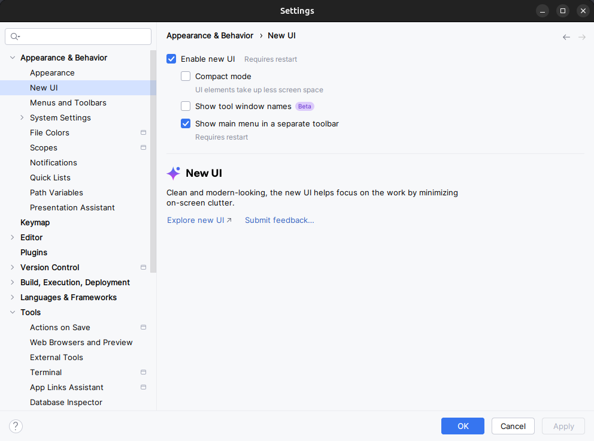
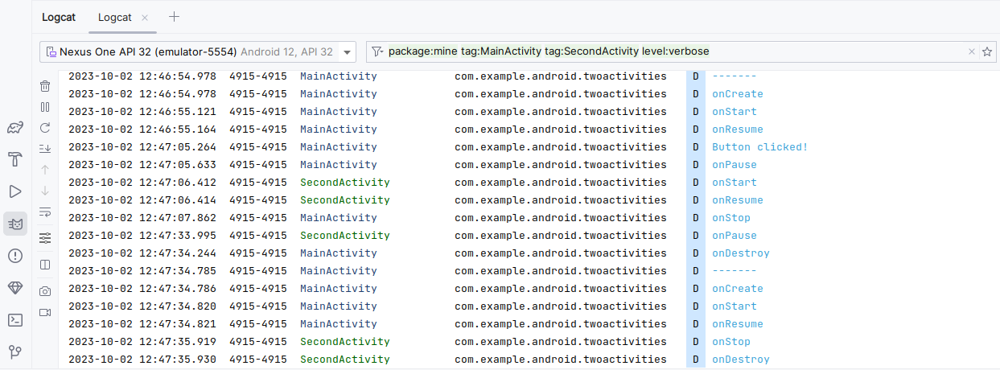
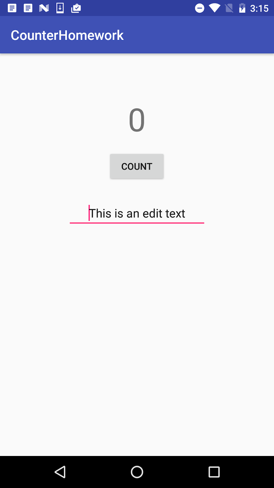

# TP 02.2: Cycle de vie et état de l'activité

[Codelab Feedback](https://github.com/khammami/codelabs-enetcom/issues)


## Bienvenue


Ces travaux pratiques sont basés sur le cours de base pour les développeurs Android fourni par Google, qui prépare les participants au test de certification  [Associate Android Developer](https://developers.google.com/training/certification/associate-android-developer/). Pour tirer le meilleur parti de ce TP, il est recommandé de travailler successivement dans les codelabs.

### Introduction

Dans cette pratique, vous en apprendrez plus sur le cycle de vie d'une activité (*activity lifecycle*). Le cycle de vie correspond à l'ensemble des états qu'une activité peut être pendant toute sa durée de vie, de sa création à sa destruction et à la récupération de ses ressources par le système. Lorsqu'un utilisateur navigue entre les activités de votre application (ainsi que dans et hors de celle-ci), les activités passent d'un état à un autre au cours de leur cycle de vie.


Chaque étape du cycle de vie d'une activité à une méthode de rappel (callback) correspondante: `onCreate()`, `onStart()`, `onPause()`, etc. Lorsqu'une activité change d'état, la méthode de rappel associée est appelée. Vous avez déjà vu l'une de ces méthodes: `onCreate()`. En définissant l'une des méthodes de rappel du cycle de vie dans vos classes d'activité (`Activity`), vous pouvez modifier le comportement par défaut de l'activité en réponse à des actions de l'utilisateur ou du système.

L'état d'activité peut également changer en réponse aux changements de configuration du périphérique, par exemple lorsque l'utilisateur fait pivoter le périphérique de portrait en paysage. Lorsque ces modifications de configuration se produisent, l'activité est détruite et recréée dans son état par défaut et l'utilisateur peut perdre les informations qu'il a entrées dans l'activité. Pour éviter toute confusion chez vos utilisateurs, il est important de développer votre application afin d'éviter toute perte de données inattendue. Plus loin dans cette pratique, vous expérimentez des modifications de configuration et apprendrez à préserver l'état d'une activité en réponse aux modifications de configuration de l'appareil et à d'autres événements de cycle de vie d'activité.

Dans cette pratique, vous ajoutez des instructions de journalisation à l'application TwoActivities et observez les modifications du cycle de vie des activités lorsque vous utilisez l'application. Vous commencez ensuite à travailler avec ces modifications et à explorer la manière de gérer les entrées utilisateur dans ces conditions.

### What you should already know

Vous devriez être familier avec:

* Créer et exécuter un projet d'application dans Android Studio.
* Ajoutez des instructions de journal à votre application et affichez ces journaux dans le volet Logcat.
* Comprenez et travaillez avec une activité (`Activity`) et une intention (`Intent`), et soyez à l'aise pour interagir avec elles.

### What you'll learn

* Comment fonctionne le cycle de vie de l'activité.
* Quand une activité commence, se met en pause, s'arrête et est détruite.
* A propos des méthodes de rappel de cycle de vie associées aux modifications d'activité.
* Effet des actions (telles que les modifications de configuration) pouvant entraîner des événements du cycle de vie de l'activité.
* Comment conserver l'état d'activité à travers les événements du cycle de vie.

### What you'll do

* Ajoutez du code à l'application TwoActivities de la pratique précédente pour implémenter les différents rappels du cycle de vie d'activité pour inclure des instructions de journalisation.
* Observez les changements d'état lorsque votre application s'exécute et que vous interagissez avec chaque activité de votre application.
* Modifiez votre application pour conserver l'état d'instance d'une activité recréée de manière inattendue en réponse au comportement de l'utilisateur ou à une modification de la configuration sur le périphérique.


## Aperçu de l'application


Dans cette pratique, vous ajoutez à l'application  [TwoActivities](https://github.com/khammami/android-fundamentals-apps-v2/tree/master/TwoActivities). L'application ressemble et se comporte approximativement de la même manière que dans le dernier code. Il contient deux implémentations d'activité et donne à l'utilisateur la possibilité d'envoyer des messages entre elles. Les modifications que vous apportez à l'application de cette manière n'affectent pas le comportement visible de l'utilisateur.


## Ajouter des rappels (callbacks) de cycle de vie à TwoActivities


Dans cette tâche, vous allez implémenter toutes les méthodes de rappel du cycle de vie d'Activité pour imprimer des messages dans logcat lorsque ces méthodes sont appelées. Ces messages de journal vous permettent de savoir quand le cycle de vie de l'activité change d'état et comment ces changements affectent votre application lors de son exécution.

> aside negative
> 
> Pour suivre ce codelab, vous devez activer la nouvelle interface utilisateur dans Android Studio Giraffe:
> 
> * à partir de la fenêtre "Welcome to Android Studio":
> **Customize &gt; All settings**
> * à partir de la fenêtre du projet ouvert:
> **File &gt; Settings**
> 
> 
> 
> Pour activer la nouvelle interface utilisateur et afficher le menu principal dans une barre d'outils séparée, cochez les deux paramètres suivants :
> 
> * **Enable new UI**
> * **Show main menu in separate toolbar**
> 
> Une fois ces paramètres cochés, vous devez redémarrer Android Studio pour que les changements soient appliqués.

### 1.1 (Facultatif) Copiez le projet TwoActivities

Pour les tâches de cette pratique, vous modifierez le projet  [TwoActivities](https://github.com/khammami/android-fundamentals-apps-v2/tree/master/TwoActivities) existant que vous avez construit dans la dernière pratique. Si vous préférez conserver le projet TwoActivities précédent, suivez les étapes de l' [Appendix: Utilities](https://google-developer-training.github.io/android-developer-fundamentals-course-concepts-v2/appendix/appendix-utilities/appendix-utilities.html) pour en créer une copie.

### 1.2 Implémenter des rappels (callbacks) dans MainActivity

1. Ouvrez le projet TwoActivities dans Android Studio et ouvrez **MainActivity** dans le volet **Project &gt; Android**.
2. Dans la méthode `onCreate()`, ajoutez les instructions de journal suivantes:

```
Log.d(LOG_TAG, "-------");
Log.d(LOG_TAG, "onCreate");
```

3. Ajoutez un remplacement pour le rappel `onStart()`, avec une instruction dans le journal pour cet événement:

```
@Override
public void onStart(){
    super.onStart();
    Log.d(LOG_TAG, "onStart");
}
```

Pour un raccourci, sélectionnez **Code &gt; Override Methods** dans Android Studio. Une boîte de dialogue apparaît avec toutes les méthodes possibles que vous pouvez remplacer dans votre classe. Le choix d'une ou de plusieurs méthodes de rappel dans la liste insère un modèle complet pour ces méthodes, y compris l'appel requis de la superclasse.

4. Utilisez la méthode `onStart()` comme modèle pour implémenter les rappels du cycle de vie `onPause()`, `onRestart()`, `onResume()`, `onStop()` et `onDestroy()`.

Toutes les méthodes de rappel ont les mêmes signatures (à l'exception du nom). Si vous **copiez** et **collez** `onStart()` pour créer ces autres méthodes de rappel, n'oubliez pas de mettre à jour le contenu pour appeler la bonne méthode dans la superclasse et pour enregistrer la bonne méthode.

5. Exécutez votre application.
6. Cliquez sur l'onglet **Logcat** au bas d'Android Studio pour afficher le volet **Logcat**. Vous devriez voir trois messages de journal indiquant les trois états de cycle de vie dans lesquels l'activité a été transférée au démarrage:

```
D/MainActivity: -------
D/MainActivity: onCreate
D/MainActivity: onStart
D/MainActivity: onResume
```

### 1.3 Implémentation de rappels (callbacks) de cycle de vie dans SecondActivity

Maintenant que vous avez implémenté les méthodes de rappel du cycle de vie pour `MainActivity`, procédez de la même manière pour `SecondActivity`.

1. Ouvrez **SecondActivity**.
2. En haut de la classe, ajoutez une constante pour la variable `LOG_TAG`:

```
private static final String LOG_TAG = SecondActivity.class.getSimpleName();
```

3. Ajoutez les rappels de cycle de vie et les instructions de journal à la deuxième activité. (Vous pouvez **copier** et **coller** les méthodes de rappel de `MainActivity`.)
4. Ajoutez une instruction de journal à la méthode `returnReply()` juste avant la méthode `finish()`:

```
Log.d(LOG_TAG, "End SecondActivity");
```

### 1.4 Observez le journal pendant l'exécution de l'application

1. Exécutez votre application.
2. Cliquez sur l'onglet **Logcat** au bas d'Android Studio pour afficher le volet **Logcat**.
3. Entrez **Activity** dans le champ de recherche.
4. Le **Logcat** Android peut être très long et encombré. La variable `LOG_TAG` de chaque classe contient les mots `MainActivity` ou `SecondActivity`. Ce mot-clé permet de filtrer le journal uniquement pour les éléments qui vous intéressent.



Faites des essais avec votre application et notez que les événements du cycle de vie se produisent en réponse à différentes actions. En particulier, essayez ces choses:

* Utilisez l'application normalement (envoyez un message, répondez avec un autre message).
* Utilisez le bouton Back (Précédent) pour revenir de la deuxième activité à l'activité principale.
* Utilisez la flèche vers le haut de la barre d'applications pour revenir de la deuxième activité à l'activité principale.
* Faites pivoter l'appareil à la fois dans l'activité principale et dans la deuxième activité à différents moments de votre application et observez ce qui se passe dans le journal et à l'écran.
* Appuyez sur le bouton de vue d'ensemble (le bouton carré à droite de Accueil) et fermez l'application (appuyez sur le **X**).
* Retournez à l'écran d'accueil et redémarrez votre application.

> aside positive
> 
> **Conseil**: si vous exécutez votre application dans un émulateur, vous pouvez simuler la rotation avec `Ctrl + F11` ou `Ctrl + Fonction + F11`.

### Code de solution de la tâche 1

Les extraits de code suivants montrent le code de la solution pour la première tâche.

#### MainActivity

Les extraits de code suivants montrent le code ajouté dans `MainActivity`, mais pas la classe entière.

La méthode `onCreate()`:

```
@Override
protected void onCreate(Bundle savedInstanceState) {
        super.onCreate(savedInstanceState);
        setContentView(R.layout.activity_main);

        // Journaliser le début de la méthode onCreate().
        Log.d(LOG_TAG, "-------");
        Log.d(LOG_TAG, "onCreate");

        // Initialiser toutes les variables de vue.
        mMessageEditText = findViewById(R.id.editText_main);
        mReplyHeadTextView = findViewById(R.id.text_header_reply);
        mReplyTextView = findViewById(R.id.text_message_reply);
}
```

Les autres méthodes de cycle de vie:

```
@Override
protected void onStart() {
        super.onStart();
        Log.d(LOG_TAG, "onStart");
}

@Override
protected void onPause() {
        super.onPause();
        Log.d(LOG_TAG, "onPause");
}

@Override
protected void onRestart() {
        super.onRestart();
        Log.d(LOG_TAG, "onRestart");
}

@Override
protected void onResume() {
        super.onResume();
        Log.d(LOG_TAG, "onResume");
}

@Override
protected void onStop() {
        super.onStop();
        Log.d(LOG_TAG, "onStop");
}

@Override
protected void onDestroy() {
        super.onDestroy();
        Log.d(LOG_TAG, "onDestroy");
}
```

#### SecondActivity

Les extraits de code suivants montrent le code ajouté dans `SecondActivity`, mais pas la classe entière.

Au sommet de la classe `SecondActivity`:

```
private static final String LOG_TAG = SecondActivity.class.getSimpleName();
```

*La méthode* 


*`returnReply()`*


*:*

```
public void returnReply(View view) {
        String reply = mReply.getText().toString();
        Intent replyIntent = new Intent();
        replyIntent.putExtra(EXTRA_REPLY, reply);
        setResult(RESULT_OK, replyIntent);
        Log.d(LOG_TAG, "End SecondActivity");
        finish();
}
```

Les autres méthodes de cycle de vie:

Identique à `MainActivity` ci-dessus.


## Enregistrer et restaurer l'état de l'instance d'activité


En fonction des ressources système et du comportement des utilisateurs, chaque activité de votre application peut être détruite et reconstruite bien plus souvent que vous ne le pensez.

Vous avez peut-être remarqué ce comportement dans la dernière section lorsque vous avez fait pivoter le périphérique ou l'émulateur. La rotation du périphérique est un exemple de changement de configuration de périphérique. Bien que la rotation soit la plus courante, toutes les modifications de configuration entraînent la destruction et la recréation de l'activité en cours comme si elle était nouvelle. Si vous ne tenez pas compte de ce problème dans votre code, en cas de modification de la configuration, votre structure Activité peut revenir à son apparence et à ses valeurs initiales par défaut et vos utilisateurs risquent de perdre leur place, leurs données ou l'état de leur progression dans votre application.

L'état de chaque activité est stocké sous la forme d'un ensemble de paires clé / valeur dans un objet  [`Bundle`](https://developer.android.com/reference/android/os/Bundle.html) appelé état d'instance d'activité. Le système enregistre les informations d'état par défaut dans Bundle d'état d'instance juste avant l'arrêt de l'activité et le transmet à la nouvelle instance d'activité à restaurer.

Pour ne pas perdre de données dans une activité lorsque celle-ci est détruite et recréée de manière inattendue, vous devez implémenter la méthode `onSaveInstanceState()`. Le système appelle cette méthode sur votre activité (entre `onPause()` et `onStop()`) lorsqu'il est possible que l'activité soit détruite et recréée.

Les données que vous enregistrez dans l'état d'instance sont spécifiques à cette instance de cette activité spécifique au cours de la session d'application en cours. Lorsque vous arrêtez et redémarrez une nouvelle session d'application, l'état de l'instance d'activité est perdu et l'activité reprend son apparence par défaut. Si vous devez enregistrer les données utilisateur entre les sessions d'application, utilisez les préférences partagées ou une base de données. Vous en apprendrez plus sur ces deux choses plus tard.

### 2.1 Enregistrez l'état de l'instance d'activité avec onSaveInstanceState()

Vous avez peut-être remarqué que la rotation de l'appareil n'affecte en rien l'état de la deuxième activité. Cela est dû au fait que la deuxième présentation (layout) et l'état de l'activité sont générés à partir de la présentation (layout) et de l'intention (`Intent`) qui l'a activée. Même si l'activité est recréée, l'intention (`Intent`) est toujours présente et les données de cette intention sont toujours utilisées chaque fois que la méthode `onCreate()` de la deuxième activité est appelée.

En outre, vous remarquerez peut-être que dans chaque activité, le texte que vous avez saisi dans les éléments message ou réponse `EditText` est conservé, même lorsque le périphérique est pivoté. Cela est dû au fait que les informations d'état de certains des éléments `View` de votre présentation (layout) sont automatiquement enregistrées lors des modifications de configuration et que la valeur actuelle d'un `EditText` est l'un de ces cas.

Ainsi, les seuls états d'activité qui vous intéressent sont les éléments `TextView` pour l'en-tête de réponse et le texte de réponse dans l'activité principale. Les deux éléments `TextView` sont invisibles par défaut. Ils n'apparaissent que lorsque vous envoyez un message à l'activité principale à partir de la deuxième activité.

Dans cette tâche, vous ajoutez du code pour préserver l'état d'instance de ces deux éléments `TextView` à l'aide de `onSaveInstanceState()`.

1. Ouvrez **MainActivity**.
2. Ajoutez cette implémentation squelette de `onSaveInstanceState()` à l'activité ou utilisez  **Code &gt; Override Methods** pour insérer une substitution de squelette.

```
@Override
public void onSaveInstanceState(Bundle outState) {
          super.onSaveInstanceState(outState);
}
```

3. Vérifiez si l'en-tête est actuellement visible, et si c'est le cas, placez cet état de visibilité dans le `Bundle` avec la méthode `putBoolean()` et la clé `"reply_visible"`.

```
   if (mReplyHeadTextView.getVisibility() == View.VISIBLE) {
        outState.putBoolean("reply_visible", true);
    }
```

Rappelez-vous que l'en-tête de réponse et le texte sont marqués comme étant invisibles jusqu'à ce qu'il y ait une réponse de la deuxième activité. Si l'en-tête est visible, des données de réponse doivent être enregistrées. Notez que nous ne sommes intéressés que par cet état de visibilité: le texte réel de l'en-tête n'a pas besoin d'être enregistré, car ce texte ne change jamais.

4. À l'intérieur de cette même vérification, ajoutez le texte de réponse dans le `Bundle`.

```
outState.putString("reply_text",mReplyTextView.getText().toString());
```

Si l'en-tête est visible, vous pouvez supposer que le message de réponse lui-même est également visible. Vous n'avez pas besoin de tester ni d'enregistrer l'état de visibilité actuel du message de réponse. Seul le texte du message passe dans le `Bundle` d'état avec la clé `"reply_text"`.

Vous ne sauvegardez que l'état des éléments de vue susceptibles de changer après la création de l'activité. Les autres éléments `View` de votre application (`EditText`, `Button`) peuvent être recréés à tout moment à partir de la présentation par défaut.

Notez que le système enregistrera l'état de certains éléments de la vue, tels que le contenu de la propriété `EditText`.

### 2.2 Restaurer l'état d'instance d'activité dans `onCreate()`

Une fois que vous avez enregistré l'état de l'instance d'activité, vous devez également le restaurer lorsque l'activité est recréée. Vous pouvez le faire dans `onCreate()` ou en implémentant le rappel `onRestoreInstanceState()`, appelé après `onStart()` après la création de l'activité.

La plupart du temps, le meilleur endroit pour restaurer l'état d'activité est dans `onCreate()`, afin de s'assurer que l'interface utilisateur (UI), y compris l'état, est disponible dès que possible. Il est parfois pratique de le faire dans `onRestoreInstanceState()` une fois l'initialisation terminée ou de permettre aux sous-classes de décider d'utiliser ou non votre implémentation par défaut.

1. Dans la méthode `onCreate()`, une fois les variables `View` initialisées avec `findViewById()`, ajoutez un test pour vous assurer que `savedInstanceState` n'est pas null.

```
// Initialiser toutes les variables de vue.
mMessageEditText = findViewById(R.id.editText_main);
mReplyHeadTextView = findViewById(R.id.text_header_reply);
mReplyTextView = findViewById(R.id.text_message_reply);

// Restaurer l'état.
if (savedInstanceState != null) {
}
```

Lorsque votre activité est créée, le système passe le `Bundle` d'état à `onCreate()` comme seul argument. La première fois que `onCreate()` est appelé et que votre application démarre, le `Bundle` est `nul`. Il n'y a pas d'état existant au premier démarrage de votre application. Les appels suivants dans `onCreate()` ont un `Bundle` rempli avec les données que vous avez stockées dans `onSaveInstanceState()`.

2. Dans cette vérification, obtenez la visibilité actuelle (true ou false) du `Bundle` avec la clé `"reply_visible"`.

```
if (savedInstanceState != null) {
    boolean isVisible = 
                     savedInstanceState.getBoolean("reply_visible");
}
```

3. Ajoutez un test sous la ligne précédente pour la variable isVisible.

```
if (isVisible) {
}
```

S'il existe une clé `reply_visible` dans le Bundle d'état (et que isVisible est donc vrai), vous devrez restaurer l'état.

4. Dans le test `isVisible`, rendez l'en-tête visible.

```
mReplyHeadTextView.setVisibility(View.VISIBLE);
```

5. Obtenez le message texte de réponse du `Bundle` avec la clé `"reply_text"` et configurez la réponse `TextView` pour afficher cette chaîne.

```
mReplyTextView.setText(savedInstanceState.getString("reply_text"));
```

6. Rendez le `TextView`  de la réponse visible également:

```
mReplyTextView.setVisibility(View.VISIBLE);
```

7. Exécutez l'application. Essayez de faire pivoter le périphérique ou l'émulateur pour vous assurer que le message de réponse (s'il en existe un) reste affiché à l'écran une fois l'activité recréée.

### Code de solution tâche 2

Les extraits de code suivants montrent le code de la solution pour cette tâche.

### MainActivity

Les extraits de code suivants montrent le code ajouté dans `MainActivity`, mais pas la classe entière.

La méthode `onSaveInstanceState()`:

```
@Override
public void onSaveInstanceState(Bundle outState) {
   super.onSaveInstanceState(outState);

   // Si le titre est visible, le message doit être sauvegardé.
   // Sinon, nous utilisons toujours la mise en page par défaut.

   if (mReplyHeadTextView.getVisibility() == View.VISIBLE) {
       outState.putBoolean("reply_visible", true);
       outState.putString("reply_text", 
                      mReplyTextView.getText().toString());
   }
}
```

La méthode `onCreate()`:

```
@Override
protected void onCreate(Bundle savedInstanceState) {
   super.onCreate(savedInstanceState);
   setContentView(R.layout.activity_main);

   Log.d(LOG_TAG, "-------");
   Log.d(LOG_TAG, "onCreate");

   // Initialiser toutes les variables de vue.
   mMessageEditText = findViewById(R.id.editText_main);
   mReplyHeadTextView = findViewById(R.id.text_header_reply);
   mReplyTextView = findViewById(R.id.text_message_reply);

  // Restaurer l'état enregistré. 
  // Voir onSaveInstanceState() pour ce qui est enregistré.

   if (savedInstanceState != null) {
       boolean isVisible = 
                     savedInstanceState.getBoolean("reply_visible");
       // Affichez à la fois les vues d'en-tête et de message. Si
       // isVisible est faux ou manquant dans le bundle, utilisez la
       // disposition par défaut.
       if (isVisible) {
           mReplyHeadTextView.setVisibility(View.VISIBLE);
           mReplyTextView.setText(savedInstanceState
                                  .getString("reply_text"));
           mReplyTextView.setVisibility(View.VISIBLE);
       }
   }
}
```


## Résumé


* Le cycle de vie de l'activité est un ensemble d'états par lesquels une activité est migrée, à partir du moment de sa création et se terminant lorsque le système Android récupère les ressources de cette activité.
* Lorsque l'utilisateur navigue d'une activité à une autre, et à l'intérieur et à l'extérieur de votre application, chaque activité passe d'un état à l'autre du cycle de vie de l'activité.
* Chaque état du cycle de vie d'activité a une méthode de rappel correspondante que vous pouvez remplacer dans votre classe d'activité.
* Les méthodes de cycle de vie sont `onCreate()`, `onStart()`, `onPause()`, `onRestart()`, `onResume()`, `onStop()`, `onDestroy()`.
* Le remplacement d'une méthode de rappel de cycle de vie vous permet d'ajouter un comportement qui se produit lorsque votre activité passe dans cet état.
* Vous pouvez ajouter des méthodes de substitution de squelette à vos classes dans Android Studio avec **Code &gt; Override**.
* Les changements de configuration de l'appareil tels que la rotation entraînent la destruction de l'activité et sa recréation comme si elle était nouvelle.
* Une partie de l'état d'activité est conservée lors d'un changement de configuration, y compris les valeurs actuelles des éléments `EditText`. Pour toutes les autres données, vous devez explicitement enregistrer ces données vous-même.
* Enregistrer l'état d'instance d'activité dans la méthode `onSaveInstanceState()`.
* Les données d'état d'instance sont stockées sous forme de simples paires clé / valeur dans un `Bundle`. Utilisez les méthodes `Bundle` pour insérer et récupérer des données dans `Bundle`.
* Restaurez l'état de l'instance dans `onCreate()`, qui est la méthode préférée, ou `onRestoreInstanceState()`.


## Apprendre encore plus


Documentation d'Android Studio:

*  [Meet Android Studio](https://developer.android.com/studio/intro/index.html)

Documentation développeur Android:

*  [Application Fundamentals](http://developer.android.com/guide/components/fundamentals.html)
*  [Activities](http://developer.android.com/guide/components/activities.html)
*  [Understand the Activity Lifecycle](https://developer.android.com/guide/components/activities/activity-lifecycle)
*  [Intents and Intent Filters](http://developer.android.com/guide/components/intents-filters.html)
*  [Handle configuration changes](http://developer.android.com/guide/topics/resources/runtime-changes.html)
*  [Activity](http://developer.android.com/reference/android/app/Activity.html)
*  [Intent](http://developer.android.com/reference/android/content/Intent.html)


## Travail à faire (Compte Rendu)


> aside negative
> 
> Pour soumettre votre compte rendu, veuillez suivre ce codelab : 
> 
> [Comment soumettre votre compte rendu](https://codelabs-enetcom.khammami.tn/codelabs/soumettre-compte-rendu/)

### Créer et exécuter une application

1. Créez une application avec une mise en page (layout) qui contient un compteur `TextView`, un bouton pour incrémenter le compteur et un `EditText`. Voir la capture d'écran ci-dessous à titre d'exemple. Vous n'avez pas à dupliquer précisément la mise en page (layout).
2. Ajoutez un gestionnaire de clic pour le bouton qui incrémente le compteur.
3. Exécutez l'application et incrémentez le compteur. Entrez du texte dans `EditText`.
4. Faites pivoter l'appareil. Notez que le compteur est réinitialisé, mais pas `EditText`.
5. Implémentez `onSaveInstanceState()` pour enregistrer l'état actuel de l'application.
6. Mettez à jour `onCreate()` pour restaurer l'état de l'application.
7. Assurez-vous que lorsque vous faites pivoter le périphérique, l'état de l'application est préservé.



### Répondre à ces questions

#### Question 1

Si vous exécutez l'application de travail à faire avant d'implémenter `onSaveInstanceState()`, que se passe-t-il si vous faites pivoter le périphérique? Choisissez-en un:

* L'`EditText` ne contient plus le texte que vous avez entré, mais le compteur est conservé.
* Le compteur est réinitialisé à 0 et l' `EditText` ne contient plus le texte que vous avez entré.
* Le compteur est réinitialisé à 0, mais le contenu de l'`EditText` est préservé.
* Le compteur et le contenu de `EditText` sont préservés.

#### Question 2

Quelles méthodes de cycle de vie d'activité sont appelées lorsqu'un changement de configuration de périphérique (tel qu'une rotation) se produit? Choisissez-en un:

* Android ferme immédiatement votre activité en appelant `onStop()`. Votre code doit redémarrer l'activité.
* Android arrête votre activité en appelant `onPause()`, `onStop()` et `onDestroy()`. Votre code doit redémarrer l'activité.
* Android arrête votre activité en appelant `onPause()`, `onStop()` et `onDestroy()`, puis redémarre l'opération en appelant `onCreate()`, `onStart()` et `onResume()`.
* Android appelle immédiatement `onResume()`.

#### Question 3

Lorsque dans le cycle de vie de l'activité, `onSaveInstanceState()` est appelé? Choisissez-en un:

* `onSaveInstanceState()` est appelée avant la méthode `onStop()`.
* `onSaveInstanceState()` est appelée avant la méthode `onResume()`.
* `onSaveInstanceState()` est appelée avant la méthode `onCreate()`.
* `onSaveInstanceState()` est appelée avant la méthode `onDestroy()`.

#### Question 4

Quelles méthodes de cycle de vie d'Activité sont les meilleures à utiliser pour enregistrer des données avant la fin ou la destruction de l'activité? Choisissez-en un:

* `onPause()` ou `onStop()`
* `onResume()` ou `onCreate()`
* `onDestroy()`
* `onStart()` ou `onRestart()`

### Soumettez votre application pour la notation

Vérifiez que l'application dispose des éléments suivants:

* Il affiche un compteur, un bouton pour incrémenter ce compteur et un `EditText`.
* Un clic sur le bouton incrémente le compteur de 1.
* Lors de la rotation du périphérique, les états counter et `EditText` sont conservés.
* L'implémentation de `MainActivity.java` utilise la méthode `onSaveInstanceState()` pour stocker la valeur du compteur.
* L'implémentation de `onCreate()` teste l'existence du `bundle` `outState`. Si ce `Bundle` existe, la valeur du compteur est restaurée et enregistrée dans `TextView`.


