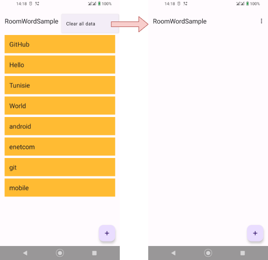
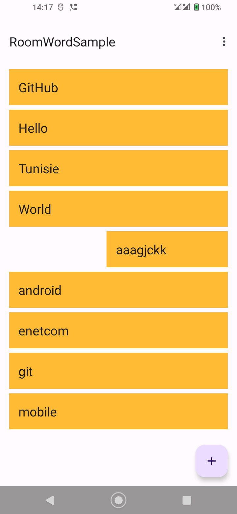

# TP 04.2B: Suppression de données d'une base de données Room

[Codelab Feedback](https://github.com/khammami/codelabs-enetcom/issues)


## Bienvenue


Ces travaux pratiques se base sur le cours de base pour les développeurs Android fourni par Google afin de  les préparer pour le test de certification  [Associate Android Developer](https://developers.google.com/training/certification/associate-android-developer/). Vous obtiendrez le plus de valeur de ce TP si vous travaillez successivement dans les codelabs.

### Introduction

Ce codelab pratique fait suite au **`4.2A : Room, LiveData et ViewModel`**. Ce codelab vous permet de vous entraîner davantage à utiliser l'API fournie par la bibliothèque Room pour implémenter des fonctionnalités de base de données. Vous ajouterez la possibilité de supprimer des éléments spécifiques de la base de données. Ce codelab comprend également un défi de codage, dans lequel vous mettez à jour l'application pour que l'utilisateur puisse modifier les données existantes.

### What you should already know

Vous devriez être capable de créer et d'exécuter des applications dans  [Android Studio Ladybug (2024.2.1) ou une version supérieure](https://developer.android.com/studio/index.html). En particulier, vous devez être familiarisé avec les éléments suivants :

* Utilisation de `RecyclerView` et des adaptateurs
* Utilisation de classes d'entités, d'objets d'accès aux données (DAO) et de `RoomDatabase` pour stocker et récupérer des données dans la base de données SQLite intégrée d'Android. Vous avez appris ces sujets dans `4.2A : Room, LiveData et ViewModel`.

### What you'll learn

* Comment peupler la base de données avec des données uniquement si la base de données est vide (afin que les utilisateurs ne perdent pas les modifications qu'ils ont apportées aux données).
* Comment supprimer des données d'une base de données Room.
* Comment mettre à jour des données existantes (si vous construisez l'application de défi).

### What you'll do

* Mise à jour de l'application `RoomWordsSample` pour conserver les données lorsque l'application se ferme.
* Permettre aux utilisateurs de supprimer tous les mots en sélectionnant un élément du menu d'options.
* Permettre aux utilisateurs de supprimer un mot spécifique en balayant un élément de la liste.
* En option, dans un défi de codage, étendre l'application pour permettre à l'utilisateur de mettre à jour les mots existants.


## Aperçu de l'application


Vous allez étendre l'application RoomWordsSample que vous avez créée dans le codelab précédent. Jusqu'à présent, cette application affiche une liste de mots et les utilisateurs peuvent ajouter des mots. Lorsque l'application est fermée et rouverte, elle réinitialise la base de données. Les mots que l'utilisateur a ajoutés sont perdus.

Dans ce TP, vous étendez l'application afin qu'elle initialise les données de la base de données uniquement s'il n'y a pas de données existantes.

Ensuite, vous ajoutez un élément de menu qui permet à l'utilisateur de supprimer toutes les données.



Vous permettez également à l'utilisateur de balayer un mot pour le supprimer de la base de données.




## Initialiser les données uniquement si la base de données est vide


L'application `RoomWordsSample` que vous avez créée dans le précédent exercice pratique supprime et recrée les données chaque fois que l'utilisateur ouvre l'application. Ce comportement n'est pas idéal, car les utilisateurs souhaitent que leurs mots ajoutés restent dans la base de données lorsque l'application est fermée. (Le code de la solution de l'exercice précédent se trouve sur GitHub.)

Dans cette tâche, vous devez mettre à jour l'application afin que, lorsqu'elle s'ouvre, le jeu de données initial ne soit ajouté que si la base de données ne contient pas de données.

Pour détecter si la base de données contient déjà des données, vous pouvez exécuter une requête pour obtenir un élément de données. Si la requête ne renvoie rien, alors la base de données est vide.

<button>[Télécharger .zip](https://github.com/khammami/android-fundamentals-exycodelabs/archive/refs/heads/room-words-sample-2024.zip)</button>  <button>[Dépot GitHub du Projet](https://github.com/khammami/android-fundamentals-exycodelabs/tree/room-words-sample-2024)</button>

> aside positive
> 
> **Remarque** : Dans une application de production, vous souhaiterez peut-être permettre aux utilisateurs de supprimer toutes les données sans réinitialiser les données au redémarrage de l'application. Mais à des fins de test, il est utile de pouvoir supprimer toutes les données, puis de les réinitialiser au démarrage de l'application.

### 1.1 Ajouter une méthode au DAO pour obtenir un seul mot

Actuellement, l'interface **`WordDao`** possède une méthode pour obtenir tous les mots, mais pas pour obtenir un mot spécifique. La méthode pour obtenir un mot spécifique n'a pas besoin de renvoyer `LiveData`, car votre application appellera la méthode explicitement lorsque cela est nécessaire.

Dans l'interface **`WordDao`**, ajoutez une méthode pour obtenir n'importe quel mot.

```
@Query("SELECT * from word_table LIMIT 1")
Word[] getAnyWord();
```

`Room` déclenche la requête de base de données lorsque la méthode `getAnyWord()` est appelée et renvoie un tableau contenant un mot. Vous n'avez pas besoin d'écrire de code supplémentaire pour l'implémenter.

### 1.2 Mettre à jour la méthode d'initialisation pour vérifier si des données existent

Utilisez la méthode **`getAnyWord()`** dans la méthode qui initialise la base de données. S'il y a des données, laissez-les telles quelles. S'il n'y a pas de données, ajoutez l'ensemble de données initial.

1. Dans **`WordRoomDatbase`**, mettez à jour le **`sRoomDatabaseCallback`** pour vérifier si la base de données contient des mots avant d'initialiser les données.

```
databaseWriteExecutor.execute(() -> {
     // Remplir la base de données en arrière-plan
     // Si vous voulez commencer avec plus de mots, il suffit de les ajouter.
     WordDao dao = INSTANCE.wordDao();
     // Si nous n'avons pas de mots, alors créons la liste initiale de mots.
     if (dao.getAnyWord().length < 1) {
          Word word = new Word("Hello");
          dao.insert(word);
          word = new Word("World");
          dao.insert(word);
     }
});
```

2. Exécutez votre application et ajoutez plusieurs nouveaux mots. Fermez l'application et redémarrez-la. Vous devriez voir les nouveaux mots que vous avez ajoutés, car les mots doivent maintenant persister lorsque l'application est fermée et rouverte.


## Effacer tous les mots


Dans le précédent exercice pratique, vous avez utilisé la méthode `deleteAll()` pour effacer toutes les données à l'ouverture de la base de données. La méthode `deleteAll()` n'était appelée que depuis la fonction d'appel `sRoomDatabaseCallback` au démarrage de l'application. Vous allez maintenant rendre la méthode `deleteAll()` disponible via le `ViewModel` afin que votre application puisse appeler la méthode à tout moment.

Voici les étapes générales pour implémenter une méthode d'utilisation de la bibliothèque Room pour interagir avec la base de données :

* Ajoutez la méthode au DAO et annotez-la avec l'opération de base de données correspondante. Pour la méthode `deleteAll()`, vous avez déjà effectué cette étape dans le précédent TP.
* Ajoutez la méthode à la classe `WordRepository`. Écrivez le code pour exécuter la méthode en arrière-plan.
* Pour appeler la méthode dans la classe `WordRepository`, ajoutez la méthode au `WordViewModel`. Le reste de l'application pourra alors accéder à la méthode par l'intermédiaire du `WordViewModel`.

### 2.1 Ajoutez `deleteAll()` à l'interface `WordDao` et annotez-la.

Dans **`WordDao`**, vérifiez que la méthode **`deleteAll()`** est définie et annotée avec le SQL qui s'exécute lorsque la méthode s'exécute.

```
@Query("DELETE FROM word_table")
void deleteAll();
```

### 2.2 Ajouter la méthode `deleteAll``()` à la classe `WordRepository`

Add the `deleteAll()` method to the `WordRepository` and use ExecutorService to delete all words in the background.

```
public void deleteAll(){
        WordRoomDatabase.databaseWriteExecutor.execute(() -> mWordDao.deleteAll());
}
```

### 2.3 Ajouter la méthode `deleteAll``()` à la classe `WordViewModel`

Rendez la méthode **`deleteAll()`** disponible pour l'activité principale en l'ajoutant au **`WordViewModel`**.

Dans la classe WordViewModel, ajoutez la méthode deleteAll():

```
public void deleteAll() {mRepository.deleteAll();}
```


## Ajouter un élément de menu Options pour supprimer toutes les données


Ensuite, vous ajoutez une option au menu pour permettre aux utilisateurs de supprimer toutes les données.

> aside positive
> 
> **Remarque** : La version de production de votre application doit fournir des garanties pour éviter que les utilisateurs n'effacent accidentellement l'intégralité de leur base de données. Cependant, pendant le développement de votre application, il est utile de pouvoir effacer rapidement les données de test. Cela est particulièrement vrai maintenant que votre application n'efface pas les données à son ouverture.

### 3.1 Ajouter l'option de menu "Clear all data"

1. Dans **`menu_main.xml`**, modifiez le titre "**`Clear all data`**" et l'identifiant de l'option de menu, comme suit :

```
<item
   android:id="@+id/clear_data"
   android:orderInCategory="100"
   android:title="@string/clear_all_data"
   app:showAsAction="never" />
```

2. Dans **`MainActivity`**, implémentez la méthode **`onOptionsItemSelected()`** pour appeler la méthode **`deleteAll()`** sur l'objet `WordViewModel`.

```
public boolean onOptionsItemSelected(MenuItem item) {
    // Handle action bar item clicks here. The action bar will
    // automatically handle clicks on the Home/Up button, so long
    // as you specify a parent activity in AndroidManifest.xml.
    int id = item.getItemId();

    //noinspection SimplifiableIfStatement
    if (id == R.id.clear_data) {
        // Ajouter un toast de confirmation
        Toast.makeText(this, "Clearing the data...",
                Toast.LENGTH_SHORT).show();

        // Effacer les données existantes
        mWordViewModel.deleteAll();
        return true;
    }

    return super.onOptionsItemSelected(item);
}
```

3. Exécutez votre application. Dans le menu Options, sélectionnez "**`Clear all data"`**. Tous les mots devraient disparaître.
4. Redémarrez l'application. (Redémarrez-la depuis votre appareil ou l'émulateur ; ne la relancez pas depuis Android Studio). Vous devriez voir l'ensemble initial de mots.


## Supprimer un seul mot


Votre application permet aux utilisateurs d'ajouter des mots et de supprimer tous les mots. Dans les tâches 4 et 5, vous étendrez l'application afin que les utilisateurs puissent supprimer un mot en faisant glisser l'élément dans le `RecyclerView`.

Encore une fois, voici les étapes générales pour implémenter une méthode d'utilisation de la bibliothèque Room pour interagir avec la base de données :

* Ajoutez la méthode au DAO et annotez-la avec l'opération de base de données correspondante.
* Ajoutez la méthode à la classe `WordRepository`. Écrivez le code pour exécuter la méthode en arrière-plan.
* Pour appeler la méthode dans la classe `WordRepository`, ajoutez la méthode à `WordViewModel`. Le reste de l'application peut alors accéder à la méthode via `WordViewModel`.

### 4.1 Ajouter `deleteWord``()` à la DAO et l'annoter.

Dans **`WordDao`**, ajoutez la méthode **`deleteWord()`**.

```
@Delete
void deleteWord(Word word);
```

Comme cette opération supprime une seule ligne, l'annotation `@Delete` est tout ce qui est nécessaire pour supprimer le mot de la base de données.

### 4.2 Ajouter `deleteWord``()` à la classe `WordRepository`

1. Dans **`WordRepository`**, ajoutez la méthode **`deleteWord()`** pour supprimer un mot en appelant **`deleteWord()`** à partir du DAO en utilisant `ExecutorService`.

```
public void deleteWord(Word word)  {
        WordRoomDatabase.databaseWriteExecutor.execute(() -> mWordDao.deleteWord(word));
}
```

### 4.3 Ajouter `deleteWord``()` à la classe `WordViewModel`

Pour rendre la méthode **`deleteWord()`** disponible aux autres classes de l'application, en particulier `MainActivity`, ajoutez-la à **`WordViewModel`**.

```
public void deleteWord(Word word) {mRepository.deleteWord(word);}
```

Vous avez maintenant implémenté la logique pour supprimer un mot. Cependant, il n'existe pas encore de moyen d'appeler l'opération de suppression de mots depuis l'interface utilisateur de l'application. Vous allez résoudre ce problème ensuite.


## Permettre aux utilisateurs de balayer les mots pour les supprimer


Dans cette tâche, vous ajoutez une fonctionnalité pour permettre aux utilisateurs de balayer un élément de la `RecyclerView` pour le supprimer.

Utilisez la classe  [`ItemTouchHelper`](https://developer.android.com/reference/androidx/recyclerview/widget/ItemTouchHelper) fournie par la bibliothèque de support Android (Androidx) pour implémenter la fonctionnalité de glissement dans votre `RecyclerView`. La classe `ItemTouchHelper` possède les méthodes suivantes :

* `onMove()` est appelée lorsque l'utilisateur déplace l'élément. Vous n'implémenterez aucune fonctionnalité de déplacement dans cette application.
* `onSwipe()` est appelée lorsque l'utilisateur glisse l'élément. Vous implémentez cette méthode pour supprimer le mot qui a été glissé.


### 5.1 Activer l'adaptateur pour détecter le mot glissé

1. Dans **`WordListAdapter`**, ajouter une méthode pour obtenir le mot à une position donnée.

```
public Word getWordAtPosition (int position) {
   return mWords.get(position);
}
```

2. Dans **`MainActivity`**, dans **`onCreate()`**, créez le **`ItemTouchHelper`**. Attachez le `ItemTouchHelper` au `RecyclerView`.

```
// Ajouter la fonctionnalité de glisser pour supprimer les éléments de la recyclerview.
ItemTouchHelper helper = new ItemTouchHelper(
        new ItemTouchHelper.SimpleCallback(0,
                ItemTouchHelper.LEFT | ItemTouchHelper.RIGHT) {
            @Override
            public boolean onMove(@NonNull RecyclerView recyclerView,
                                  @NonNull RecyclerView.ViewHolder viewHolder,
                                  @NonNull RecyclerView.ViewHolder target) {
                return false;
            }

            @Override
            public void onSwiped(@NonNull RecyclerView.ViewHolder viewHolder,
                                 int direction) {
                int position = viewHolder.getAdapterPosition();
                Word swipedWord = mAdapter.getWordAtPosition(position);
                Toast.makeText(MainActivity.this, "Deleting " +
                        swipedWord.getWord(), Toast.LENGTH_LONG).show();

                // Supprimer le mot
                mWordViewModel.deleteWord(swipedWord);
            }
        });

helper.attachToRecyclerView(binding.contentMain.recyclerview);
```

Points à noter dans le code:

* **`viewHolder.getAdapterPosition()`**: `onSwiped()` récupère la position du `ViewHolder` qui a été glissé.
* **`mAdapter.getWordAtPosition(position)`**: En fonction de la position, vous pouvez obtenir le mot affiché par le `ViewHolder` en appelant la méthode `getWordAtPosition()` que vous avez définie dans l'adaptateur.
* **`mWordViewModel.deleteWord(swipedWord)`**: Supprime le mot en appelant `deleteWord()` sur le `WordViewModel`.

3. Lancez votre application. Vous devriez pouvoir supprimer des mots en les faisant glisser vers la gauche ou vers la droite.

### Code de solution

<button>[Télécharger .zip](https://github.com/khammami/android-fundamentals-exycodelabs/archive/refs/heads/room-words-with-delete-2024.zip)</button>  <button>[Dépot GitHub du Projet](https://github.com/khammami/android-fundamentals-exycodelabs/tree/room-words-with-delete-2024)</button>  <button>[Voir la différence](https://github.com/khammami/android-fundamentals-exycodelabs/compare/room-words-sample-2024...khammami:android-fundamentals-exycodelabs:room-words-with-delete-2024)</button>


## Défi de codage


> aside positive
> 
> **Remarque** : Tous les défis de codage sont facultatifs et ne sont pas des prérequis pour les leçons ultérieures.

Défi : Mettez à jour votre application pour permettre aux utilisateurs de modifier un mot en appuyant sur le mot, puis en sauvegardant leurs modifications.

### Indices

#### Faire des changements dans `NewWordActivity`

Vous pouvez ajouter des fonctionnalités à `NewWordActivity`, afin qu'elle puisse être utilisée soit pour ajouter un nouveau mot, soit pour modifier un mot existant.

#### Utiliser une clé auto-générée dans `Word`

La classe d'entité `Word` utilise le champ word comme clé de base de données. Cependant, lorsque vous mettez à jour une ligne dans la base de données, l'élément mis à jour ne peut pas être la clé primaire, car la clé primaire est unique à chaque ligne et ne change jamais. Vous devez donc ajouter un identifiant `id` généré automatiquement à utiliser comme clé primaire.

```
@PrimaryKey(autoGenerate = true)
private int id;

@NonNull
@ColumnInfo(name = "word")
private String mWord;
```

#### Ajouter un constructeur pour `Word` qui prend un `id`

Ajoutez un constructeur à la classe d'entité `Word` qui prend id et word comme paramètres. Assurez-vous que ce constructeur supplémentaire est annoté à l'aide de `@Ignore`, car Room attend par défaut un seul constructeur dans une classe d'entité.

```
@Ignore
public Word(int id, @NonNull String word) {
   this.id = id;
   this.mWord = word;
}
```

Pour mettre à jour un mot existant, créez le mot en utilisant ce constructeur. Room utilisera la clé primaire (dans ce cas, l'`id`) pour trouver l'entrée existante dans la base de données afin qu'elle puisse être mise à jour.

Dans `WordDao`, ajoutez la méthode `update()` comme ceci :

```
@Update
void update(Word... word);
```

Dans `WordRoomDatabase`, augmentez le numéro de version de la base de données, car la structure de la table de la base de données a été modifiée.

```
@Database(entities = {Word.class}, version = 2, exportSchema = false)
```

### Code de solution de défi 👀

<button>[Télécharger .zip](https://github.com/khammami/android-fundamentals-exycodelabs/archive/refs/heads/room-words-with-update-2024.zip)</button>  <button>[Dépot GitHub du Projet](https://github.com/khammami/android-fundamentals-exycodelabs/tree/room-words-with-update-2024)</button>  <button>[Voir la différence](https://github.com/khammami/android-fundamentals-exycodelabs/compare/room-words-with-delete-2024...khammami:android-fundamentals-exycodelabs:room-words-with-update-2024)</button>


## Résumé


### Écrire du code de base de données

* `Room` se charge d'ouvrir et de fermer les connexions à la base de données chaque fois qu'une opération de base de données est exécutée.
* Annotez les méthodes de l'objet d'accès aux données (DAO) avec `@insert`, `@delete`, `@update`, `@query`.
* Pour les insertions, mises à jour et suppressions simples, il suffit d'ajouter l'annotation correspondante à la méthode dans le DAO.

Par exemple:

```
@Delete
void deleteWord(Word word);

@Update
void update(Word... word);
```

* Pour les requêtes ou les interactions plus complexes avec la base de données, telles que la suppression de tous les mots, utilisez l'annotation `@query` et fournissez le SQL de l'opération.

Par exemple:

```
@Query("SELECT * from word_table ORDER BY word ASC")
LiveData<List<Word>> getAllWords();

@Query("DELETE FROM word_table")
void deleteAll();
```

### `ItemTouchHelper`

* Pour permettre aux utilisateurs de glisser ou de déplacer des éléments dans un `RecyclerView`, vous pouvez utiliser la classe `ItemTouchHelper`.
* Implémentez les méthodes `onMove()` et `onSwipe()`.
* Pour identifier l'élément que l'utilisateur a déplacé ou balayé, vous pouvez ajouter une méthode à l'adaptateur du `RecyclerView`. La méthode prend une position en entrée et renvoie l'élément correspondant. Appelez la méthode dans `onMove()` ou `onSwipe()`.


## Apprendre encore plus


Entities, data access objects (DAOs), et `ViewModel`:

*  [Defining data using Room entities](https://developer.android.com/training/data-storage/room/defining-data.html)
*  [Accessing data using Room DAOs](https://developer.android.com/training/data-storage/room/accessing-data.html)
*  [`ViewModel` guide](https://developer.android.com/topic/libraries/architecture/viewmodel.html)
*  [`Dao` référence](https://developer.android.com/reference/android/arch/persistence/room/Dao.html)
*  [`ViewModel` référence](https://developer.android.com/reference/android/arch/lifecycle/ViewModel.html)
* Pour voir toutes les annotations possibles pour une entité, rendez-vous sur  [androidx.room](https://developer.android.com/reference/androidx/room/package-summary) dans la documentation Android et développez l'élément de menu Annotations dans le panneau de navigation de gauche.

`ItemTouchHelper`:

*  [`ItemTouchHelper`](https://developer.android.com/reference/androidx/recyclerview/widget/ItemTouchHelper) reference


