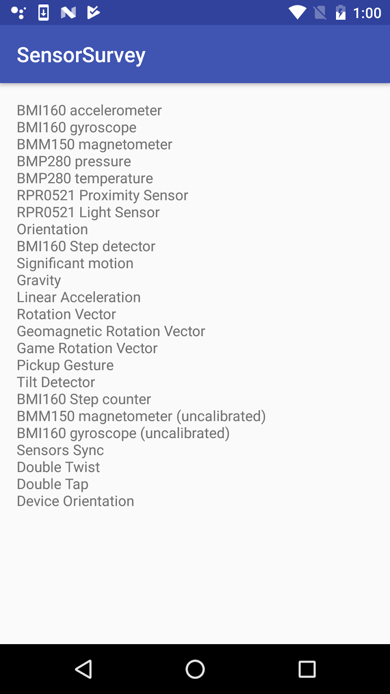
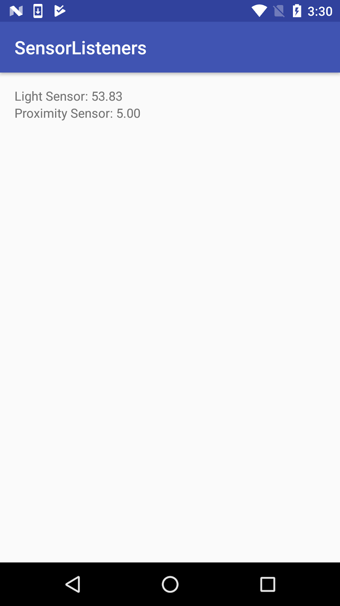
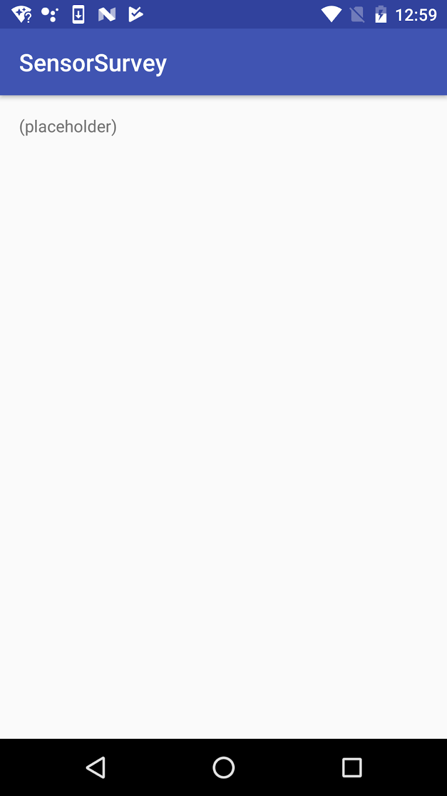
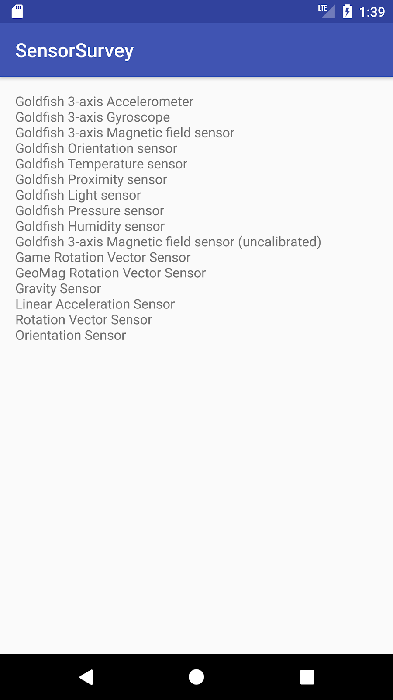
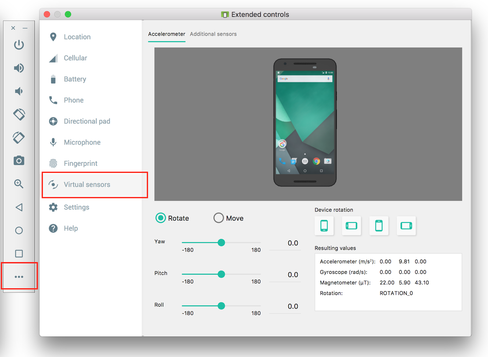
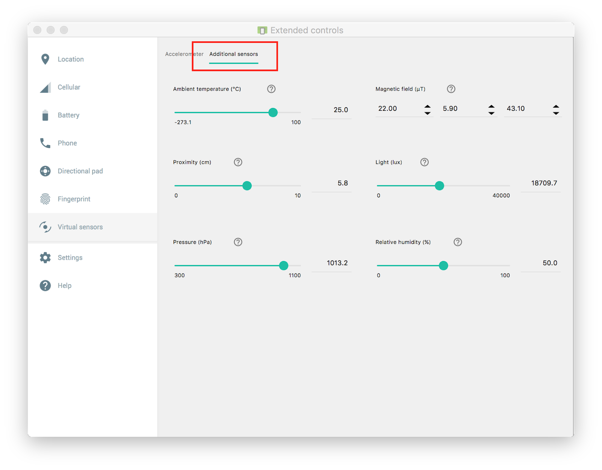
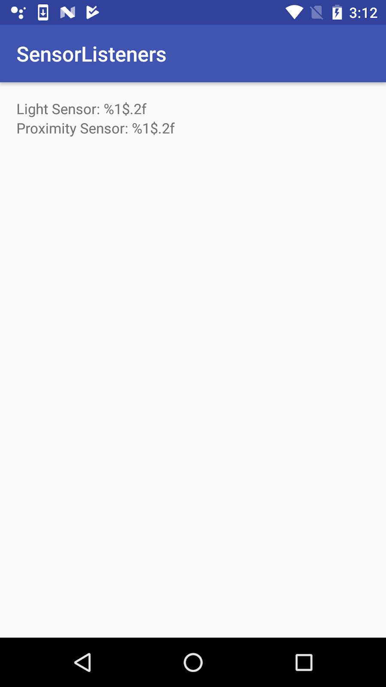

# P 04.1: Getting sensor data


## Welcome


### Introduction

Many Android-powered devices include built-in sensors that measure motion, orientation, and environmental conditions such as ambient light or temperature. These sensors can provide data to your app with high precision and accuracy. Sensors can be used to monitor three-dimensional device movement or positioning, or to monitor changes in the environment near a device, such as changes to temperature or humidity. For example, a game might track readings from a device's accelerometer sensor to infer complex user gestures and motions, such as tilt, shake, or rotation.

In this codelab you learn about the Android sensor framework, which is used to find the available sensors on a device and retrieve data from those sensors.

The device camera, fingerprint sensor, microphone, and GPS (location) sensor all have their own APIs and are not considered part of the Android sensor framework.

### What you should already know

You should be familiar with:

* Creating, building, and running apps in Android Studio.
* Running and testing apps with the Android emulator.

### What you'll learn

* Query the sensor manager for available sensors, and retrieve information about specific sensors.
* Register listeners for sensor data.
* React to incoming sensor data.

### What you'll do

* Create an app that lists the available device sensors.
* Run the app on a device and on the emulator to view sensors.
* Create a second app that gets data from the light and proximity sensors, and displays that data.
* Interact with the device and note the changes in sensor data.
* Run the app in the emulator and learn about the emulator's virtual sensors.


## App overview


You will build two apps in this codelab. The first app lists the available sensors on the device or emulator. The list of sensors is scrollable, if it is too big to fit the screen.



The second app, modified from the first, gets data from the ambient light and proximity sensors, and displays that data. Light and proximity sensors are some of the most common Android device sensors.




## Task 1. List the available sensors


In this task, you build a simple app that queries the sensor manager for the list of sensors available on the device.

### 1.1 Build the app

1. Create a new Android project. Call it SensorSurvey and use the Empty activity template.
2. Open `res/layout/activity_main.xml`.
3. Add a margin of 16 dp to the constraint layout.

```
android:layout_margin="16dp"
```

4. Delete the existing `TextView`.
5. Add a  [`ScrollView`](https://developer.android.com/reference/android/widget/ScrollView.html) element inside the constraint layout. Give it these attributes:

| <strong>Attribute</strong> | <strong>Value</strong> |
| --- | --- |
| android:layout_width | &#34;match_parent&#34; |
| android:layout_height | &#34;match_parent&#34; |
| app:layout_constraintBottom_toBottomOf | &#34;parent&#34; |
| app:layout_constraintTop_toTopOf | &#34;parent&#34; |
| app:layout_constraintLeft_toLeftOf | &#34;parent&#34; |
| app:layout_constraintRight_toRightOf | &#34;parent&#34; |

The `ScrollView` is here to allow the list of sensors to scroll if it is longer than the screen.

6. Add a `TextView` element inside the `ScrollView` and give it these attributes:

| <strong>Attribute</strong> | <strong>Value</strong> |
| --- | --- |
| android:id | &#34;@+id/sensor_list&#34; |
| android:layout_width | &#34;wrap_content&#34; |
| android:layout_height | &#34;wrap_content&#34; |
| android:text | &#34;(placeholder)&#34; |

This `TextView` holds the list of sensors. The placeholder text is replaced at runtime by the actual sensor list. The layout for your app should look like this screenshot:



7. Open `MainActivity` and add a variable at the top of the class to hold an instance of `SensorManager`:

```
private SensorManager mSensorManager;
```

The sensor manager is a system service that lets you access the device sensors.

8. In the `onCreate()` method, below the `setContentView()` method, get an instance of the sensor manager from system services, and assign it to the `mSensorManager` variable:

```
mSensorManager =
   (SensorManager) getSystemService(Context.SENSOR_SERVICE);
```

9. Get the list of all sensors from the sensor manager. Store the list in a  [`List`](https://developer.android.com/reference/java/util/List.html) object whose values are of type  [`Sensor`](https://developer.android.com/reference/android/hardware/Sensor.html):

```
List<Sensor> sensorList  =
    mSensorManager.getSensorList(Sensor.TYPE_ALL);
```

The  [`Sensor`](https://developer.android.com/reference/android/hardware/Sensor.html) class represents an individual sensor and defines constants for the available sensor types. The  [`Sensor.TYPE_ALL`](https://developer.android.com/reference/android/hardware/Sensor.html#TYPE_ALL) constant indicates all the available sensors.

10. Iterate over the list of sensors. For each sensor, get that sensor's official name with the  [`getName()`](https://developer.android.com/reference/android/hardware/Sensor.html#getName()) method, and append that name to the `sensorText` string. Each line of the sensor list is separated by the value of the `line.separator` property, typically a newline character:

```
StringBuilder sensorText = new StringBuilder();

for (Sensor currentSensor : sensorList ) {
         sensorText.append(currentSensor.getName()).append(
            System.getProperty("line.separator"));
}
```

11. Get a reference to the `TextView` for the sensor list, and update the text of that view with the string containing the list of sensors:

```
TextView sensorTextView = (TextView) findViewById(R.id.sensor_list);
sensorTextView.setText(sensorText);
```

### 1.2 Run the app on a device and in the emulator

Different Android devices have different sensors available, which means the SensorSurvey app shows different results for each device. In addition, the Android emulator includes a small set of simulated sensors.

1. Run the app on a physical device. The output of the app looks something like this screenshot:


In this list, lines that begin with a letter/number code represent physical hardware in the device. The letters and numbers indicate sensor manufacturers and model numbers. In most devices the accelerometer, gyroscope, and magnetometer are physical sensors.

Lines without letter/number codes are virtual or composite sensors, that is, sensors that are simulated in software. These sensors use the data from one or more physical sensors. So, for example, the gravity sensor may use data from the accelerometer, gyroscope, and magnetometer to provide the direction and magnitude of gravity in the device's coordinate system.

2. Run the app in an emulator. The output of the app looks something like this screenshot:



Because the Android emulator is a simulated device, all the available sensors are virtual sensors. "Goldfish" is the name of the emulator's Linux kernel.

3. Click the More button (three horizontal dots) on the emulator's control panel. The Extended Controls window appears.
4. Click Virtual Sensors.



This window shows the settings and current values for the emulator's virtual sensors. Drag the image of the device to simulate motion and acceleration with the accelerometer. Dragging the device image may also rotate the main emulator window.

5. Click the Additional Sensors tab.



This tab shows the other available virtual sensors for the emulator, including the light, temperature, and proximity sensors. You use more of these sensors in the next task.


## Task 2. Get sensor data


The Android sensor framework provides the ability for your app to register for and react to changes in sensor data. In this task you modify your existing app to listen to and report values from the proximity and light sensors.

* The light sensor measures ambient light in  [lux](https://en.wikipedia.org/wiki/Lux), a standard unit of illumination. The light sensor typically is used to automatically adjust screen brightness.
* The proximity sensor measures when the device is close to another object. The proximity sensor is often used to turn off touch events on a phone's screen when you answer a phone call, so that touching your phone to your face does not accidentally launch apps or otherwise interfere with the device's operation.

### 2.1 Modify the layout

1. Open `res/layout/activity_main.xml`.
2. Delete the `ScrollView` and `TextView` elements from the previous app.
3. Add a `TextView` and give it the attributes in the following table. Extract the string into a resource called `"label_light"`. This text view will print the current value from the light sensor.

| <strong>Attribute</strong> | <strong>Value</strong> |
| --- | --- |
| android:id | &#34;@+id/label_light&#34; |
| android:layout_width | &#34;wrap_content&#34; |
| android:layout_height | &#34;wrap_content&#34; |
| android:text | &#34;Light Sensor: %1$.2f&#34; |
| app:layout_constraintLeft_toLeftOf | &#34;parent&#34; |
| app:layout_constraintTop_toBottomOf | &#34;parent&#34; |

The `"%1$.2f"` part of the text string is a placeholder code. This code will be replaced in the Java code for your app with the placeholder filled in with an actual numeric value. In this case the placeholder code has three parts:

* `%1`: The first placeholder. You could include multiple placeholders in the same string with `%2`, `%3`, and so on.
* `$.2`: The number format. In this case, `.2` indicates that the value should be formatted with only two digits after the decimal point.
* `f`: Indicates that the value to display is a floating-point number. Use `s` for string values and `d` for decimal values.

The part of the string that is not made up of placeholders (`"Light Sensor: "`) is passed through to the new string. You can find out more about placeholders and formatting codes in the  [Formatter](https://developer.android.com/reference/java/util/Formatter.html#syntax) documentation.

4. Copy and paste the `TextView` element. Change the attributes in the following table. Extract the string into a resource called `"label_proximity"`. This text view will print values from the proximity sensor.

| <strong>Attribute</strong> | <strong>Value</strong> |
| --- | --- |
| android:id | &#34;@+id/label_proximity&#34; |
| android:text | &#34;Proximity Sensor: %1$.2f&#34; |
| app:layout_constraintTop_toBottomOf | &#34;@+id/label_light&#34; |

The layout for your app should look like this screenshot:



5. Open `res/values/strings.xml` and add this line:

```
<string name="error_no_sensor">No sensor</string>
```

You'll use this message in the next task when you test if a sensor is available.

### 2.2 Get the sensors

In this task, you modify the activity's `onCreate()` method to gain access to the light and proximity sensors.

1. Open `MainActivity` and add private member variables at the top of the class to hold  [`Sensor`](https://developer.android.com/reference/android/hardware/Sensor.html) objects for the light and proximity sensors. Also add private member variables to hold the `TextView` objects from the layout:

```
// Individual light and proximity sensors.
private Sensor mSensorProximity;
private Sensor mSensorLight;

// TextViews to display current sensor values  
private TextView mTextSensorLight;
private TextView mTextSensorProximity;
```

2. In the `onCreate()` method, delete all the existing code after the line to get the sensor manager.
3. Add code to `onCreate()` to get the two `TextView` views and assign them to their respective variables:

```
mTextSensorLight = (TextView) findViewById(R.id.label_light);
mTextSensorProximity = (TextView) findViewById(R.id.label_proximity);
```

4. Get instances of the default light and proximity sensors. These will be instances of the `Sensor` class. Assign them to their respective variables:

```
mSensorProximity =
   mSensorManager.getDefaultSensor(Sensor.TYPE_PROXIMITY);
mSensorLight = mSensorManager.getDefaultSensor(Sensor.TYPE_LIGHT);
```

The  [`getDefaultSensor()`](https://developer.android.com/reference/android/hardware/SensorManager.html#getDefaultSensor(int)) method is used to query the sensor manager for sensors of a given type. The sensor types are defined by the `Sensor` class. If there is no sensor available for the given type, the `getDefaultSensor()` method returns `null`.

5. Get the error string you defined earlier from the `strings.xml` resource:

```
String sensor_error = getResources().getString(R.string.error_no_sensor);
```

6. Test that there is an available light sensor. If the sensor is not available (that is, if `getDefaultSensor()` returns `null`), set the display text for the light sensor's `TextView` to the error string.

```
if (mSensorLight == null) {
   mTextSensorLight.setText(sensor_error);
}
```

Different devices have different sensors, so it is important that your app check that a sensor exists before using the sensor. If a sensor is not available, your app should turn off features that use that sensor and provide helpful information to the user. If your app's functionality relies on a sensor that is not available, your app should provide a message and gracefully quit. Do not assume that any device will have any given sensor.

7. Test for the existence of the proximity sensor.

```
if (mSensorProximity == null) {
   mTextSensorProximity.setText(sensor_error);
}
```

### 2.3 Listen for new sensor data

When sensor data changes, the Android sensor framework generates an event (a  [`SensorEvent`](https://developer.android.com/reference/android/hardware/SensorEvent.html)) for that new data. Your app can register listeners for these events, then handle the new sensor data in an  [`onSensorChanged()`](https://developer.android.com/reference/android/hardware/SensorEventListener.html#onSensorChanged(android.hardware.SensorEvent)) callback. All of these tasks are part of the  [`SensorEventListener`](https://developer.android.com/reference/android/hardware/SensorEventListener.html) interface.

In this task, you register listeners for changes to the light and proximity sensors. You process new data from those sensors and display that data in the app layout.

1. At the top of the class, modify the class signature to implement the `SensorEventListener` interface.

```
public class MainActivity
   extends AppCompatActivity implements SensorEventListener {
```

2. Click the red light bulb icon, select "implement methods," and select all methods.

The `SensorEventListener` interface includes two callback methods that enable your app to handle sensor events:

*  [`onSensorChanged()`](https://developer.android.com/reference/android/hardware/SensorEventListener.html#onSensorChanged(android.hardware.SensorEvent)): Called when new sensor data is available. You will use this callback most often to handle new sensor data in your app.
*  [`onAccuracyChanged()`](https://developer.android.com/reference/android/hardware/SensorEventListener.html#onAccuracyChanged(android.hardware.Sensor,%20int)): Called if the sensor's accuracy changes, so your app can react to that change. Most sensors, including the light and proximity sensors, do not report accuracy changes. In this app, you leave `onAccuracyChanged()` empty.

3. Override the `onStart()` activity lifecycle method to register your sensor listeners. Listening to incoming sensor data uses device power and consumes battery life. Don't register your listeners in `onCreate()`, as that would cause the sensors to be on and sending data (using device power) even when your app was not in the foreground. Use the `onStart()` and `onStop()` methods to register and unregister your sensor listeners.

```
@Override
protected void onStart() {
   super.onStart();

   if (mSensorProximity != null) {
      mSensorManager.registerListener(this, mSensorProximity,
         SensorManager.SENSOR_DELAY_NORMAL);
   }
   if (mSensorLight != null) {
      mSensorManager.registerListener(this, mSensorLight,
         SensorManager.SENSOR_DELAY_NORMAL);
   }
}
```

> aside positive
> 
> Note: The `onStart()` and `onStop()` methods are preferred over `onResume()` and `onPause()` to register and unregister listeners. As of Android 7.0 (API 24), apps can run in multi-window mode (split-screen or picture-in-picture mode). Apps running in this mode are paused, but still visible on screen. Use `onStart()` and `onStop()` to ensure that sensors continue running even if the app is in multi-window mode.

Each sensor that your app uses needs its own listener, and you should make sure that those sensors exist before you register a listener for them. Use the  [`registerListener()`](https://developer.android.com/reference/android/hardware/SensorManager.html#registerListener(android.hardware.SensorEventListener,%20android.hardware.Sensor,%20int)) method from the `SensorManager` to register a listener. This method takes three arguments:

* An app or activity  [`Context`](https://developer.android.com/reference/android/content/Context.html). You can use the current activity (`this`) as the context.
* The `Sensor` object to listen to.
* A delay constant from the `SensorManager` class. The delay constant indicates how quickly new data is reported from the sensor. Sensors can report a lot of data very quickly, but more reported data means that the device consumes more power. Make sure that your listener is registered with the minimum amount of new data it needs. In this example you use the slowest value (  [`SensorManager.SENSOR_DELAY_NORMAL`](https://developer.android.com/reference/android/hardware/SensorManager.html#SENSOR_DELAY_NORMAL)). For more data-intensive apps such as games, you may need a faster rate such as  [`SENSOR_DELAY_GAME`](https://developer.android.com/reference/android/hardware/SensorManager.html#SENSOR_DELAY_GAME) or  [`SENSOR_DELAY_FASTEST`](https://developer.android.com/reference/android/hardware/SensorManager.html#SENSOR_DELAY_FASTEST).

4. Implement the `onStop()` lifecycle method to unregister your sensor listeners when the app pauses:

```
@Override
protected void onStop() {
   super.onStop();
   mSensorManager.unregisterListener(this);
}
```

A single call to the `SensorManager.`  [`unregisterListener()`](https://developer.android.com/reference/android/hardware/SensorManager.html#unregisterListener(android.hardware.SensorEventListener)) method unregisters all the registered listeners. Unregistering the sensor listeners in the onStop() method prevents the device from using power when the app is not visible.

5. In the  [`onSensorChanged()`](https://developer.android.com/reference/android/hardware/SensorEventListener.html#onSensorChanged(android.hardware.SensorEvent)) method, get the sensor type.

```
int sensorType = event.sensor.getType();
```

The `onSensorChanged()` method is called with a  [`SensorEvent`](https://developer.android.com/reference/android/hardware/SensorEvent.html) object. The `SensorEvent` object includes important properties of the event, such as which sensor is reporting new data, and the new data values. Use the `sensor` property of the `SensorEvent` to get a `Sensor` object, and then use `getType()` to get the type of that sensor. Sensor types are defined as constants in the `Sensor` class, for example,  [`Sensor.TYPE_LIGHT`](https://developer.android.com/reference/android/hardware/Sensor.html#TYPE_LIGHT).

6. Also in `onSensorChanged()`, get the sensor value.

```
float currentValue = event.values[0];
```

The sensor event stores the new data from the sensor in the `values` array. Depending on the sensor type, this array may contain a single piece of data or a multidimensional array full of data. For example, the accelerometer reports data for the *x*-axis, *y*-axis, and *z*-axis for every change in the `values[0]`, `values[1]`, and `values[2]` positions. Both the light and proximity sensors only report one value, in `values[0]`.

7. Add a `switch` statement for the `sensorType` variable. Add a `case` for `Sensor.TYPE_LIGHT` to indicate that the event was triggered by the light sensor.

```
switch (sensorType) {
   // Event came from the light sensor.
   case Sensor.TYPE_LIGHT:
      // Handle light sensor
      break;
   default:
       // do nothing
}
```

8. Inside the light sensor `case`, get the template string from the resources, and update the value in the light sensor's `TextView`.

```
mTextSensorLight.setText(getResources().getString(
   R.string.label_light, currentValue));
```

When you defined this `TextView` in the layout, the original string resource included a placeholder code, like this:

```
Light Sensor: %1$.2f
```

When you call `getString()` to get the string from the resources, you include values to substitute into the string where the placeholder codes are. The part of the string that is not made up of placeholders (`"Light Sensor: "`) is passed through to the new string.

9. Add a second `case` for the proximity sensor (  [`Sensor.TYPE_PROXIMITY`](https://developer.android.com/reference/android/hardware/Sensor.html#TYPE_PROXIMITY)).

```
case Sensor.TYPE_PROXIMITY:
   mTextSensorProximity.setText(getResources().getString(
       R.string.label_proximity, currentValue));
   break;
```

### 2.4 Run the app on a device and in the emulator

1. Run the app on a physical device. The output of the app looks something like this screenshot:


2. Move the device towards a light source, or shine a flashlight on it. Move the device away from the light or cover the device with your hand. Note how the light sensor reports changes in the light level.

TIP: The light sensor is often placed on the top right of the device's screen.

The light sensor's value is generally measured in lux, a standard unit of illumination. However, the lux value that a sensor reports may differ across different devices, and the maximum may vary as well. If your app requires a specific range of values for the light sensor, you must translate the raw sensor data into something your app can use.

3. Move your hand toward the device, and then move it away again. Note how the proximity sensor reports values indicating "near" and "far." Depending on how the proximity sensor is implemented, you may get a range of values, or you may get just two values (for example, 0 and 5) to represent near and far.

**TIP:** The proximity sensor is often a virtual sensor that gets its data from the light sensor. For that reason, covering the light sensor may produce changes to the proximity value.

As with the light sensor, the sensor data for the proximity sensor can vary from device to device. Proximity values may be a range between a minimum and a maximum. More often there are only two proximity values, one to indicate "near," and one to indicate "far." All these values may vary across devices.

4. Run the app in an emulator, and click the More button (three horizontal dots) on the emulator's control panel to bring up the Extended controls window.
5. Click Virtual sensors, and then click the Additional sensors tab.


The sliders in this window enable you to simulate changes to sensor data that would normally come from the hardware sensors. Changes in this window generate sensor events in the emulator that your app can respond to.

6. Move the sliders for the light and proximity sensors and observe that the values in the app change as well.


## Coding challenge


> aside positive
> 
> **Note:** All coding challenges are optional and are not prerequisites for later lessons.

### Challenge

Modify the SensorListeners app such that:

* The background color of the app changes in response to the light level.

TIP: You can use `getWindow().getDecorView().setBackgroundColor()` to set the app's background color.

* Place an `ImageView` or `Drawable` in the layout. Make the image larger or smaller based on the value that the app receives from the proximity sensor.


## Summary


* The Android sensor framework provides access to data coming from a set of device sensors. These sensors include accelerometers, gyroscopes, magnetometers, barometers, humidity sensors, light sensors, proximity sensors, and so on.
* The `SensorManager` service lets your app access and list sensors and listen for sensor events (`SensorEvent`). The sensor manager is a system service you can request with `getSystemService()`.
* The `Sensor` class represents a specific sensor and contains methods to indicate the properties and capabilities of a given sensor. It also provides constants for sensor types, which define how the sensors behave and what data they provide.
* Use `getSensorList(Sensor.TYPE_ALL)` to get a list of all the available sensors.
* Use `getDefaultSensor()` with a sensor type to gain access to a particular sensor as a `Sensor` object.
* Sensors provide data through a series of sensor events. A `SensorEvent` object includes information about the sensor that generated it, the time, and new data. The data a sensor provides depends on the sensor type. Simple sensors such as light and proximity sensors report only one data value, whereas motion sensors such as the accelerometer provide multidimensional arrays of data for each event.
* Your app uses sensor listeners to receive sensor data. Implement the `SensorEventListener` interface to listen for sensor events.
* Use the `onSensorChanged()` method to handle individual sensor events. From the `SensorEvent` object passed into that method, you can get the sensor that generated the event and the new data.
* Register the sensor listeners in the `onResume()` lifecycle method, and unregister them in `onPause()`. Doing this prevents your app from drawing system resources when your app is not in the foreground.
* Use the `registerListener()` method to listen to sensor events. Listener registration includes both the type of sensor your app is interested in, and the rate at which your app prefers to receive data. A higher data rate provides more data events, but uses more system resources.
* Use the `unregisterListener()` method to stop listening to sensor events.


## Learn more


Android developer documentation:

*  [Sensors Overview](https://developer.android.com/guide/topics/sensors/sensors_overview.html)

Android API reference:

*  [`Sensor`](https://developer.android.com/reference/android/hardware/Sensor.html)
*  [`SensorEvent`](https://developer.android.com/reference/android/hardware/SensorEvent.html)
*  [`SensorManager`](https://developer.android.com/reference/android/hardware/SensorManager.html)
*  [`SensorEventListener`](https://developer.android.com/reference/android/hardware/SensorEventListener.html)


