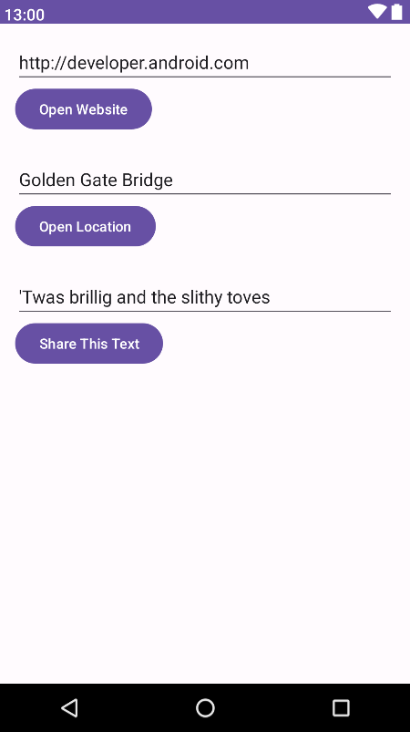
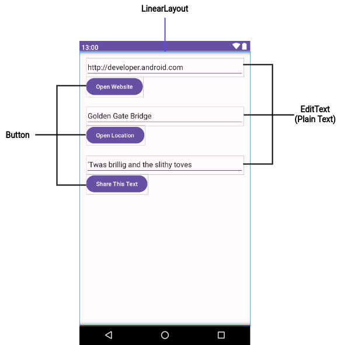
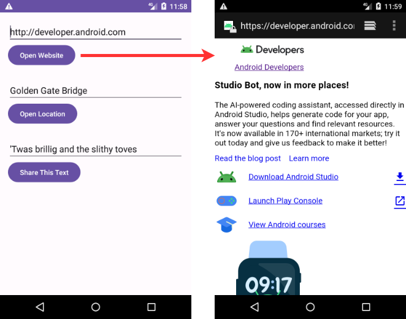
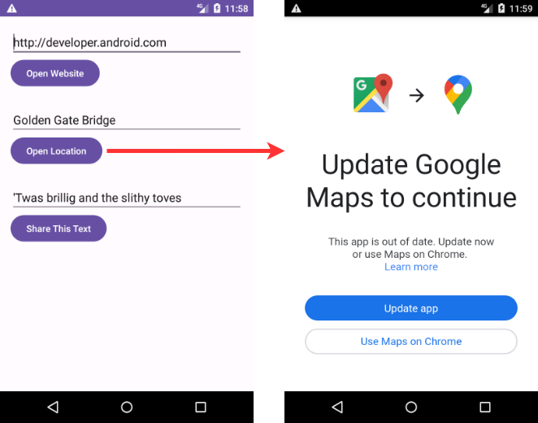
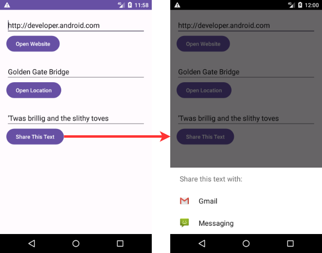
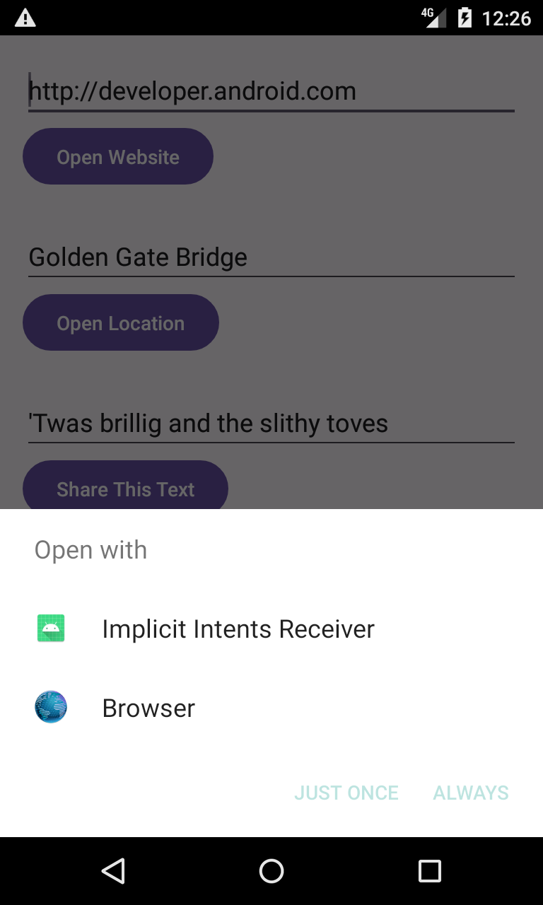
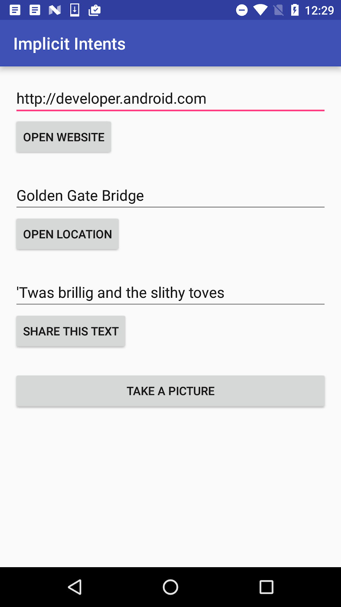

# TP 02.3: Les "Intents" implicites

[Codelab Feedback](https://github.com/khammami/codelabs-enetcom/issues)


## Bienvenue


Ces travaux pratiques sont basés sur le cours de base pour les développeurs Android fourni par Google, qui prépare les participants au test de certification  [Associate Android Developer](https://developers.google.com/training/certification/associate-android-developer/). Pour tirer le meilleur parti de ce TP, il est recommandé de travailler successivement dans les codelabs.

### Introduction

Dans une section précédente, vous avez découvert les intentions explicites. Dans une intention explicite, vous effectuez une activité dans votre application, ou dans une application différente, en envoyant une intention avec le nom de classe complet de l'activité. Dans cette section, vous en apprendrez plus sur les intentions implicites et sur la façon de les utiliser pour mener à bien des activités.

Avec une intention implicite, vous démarrez une activité sans savoir quelle application ou activité gérera la tâche. Par exemple, si vous souhaitez que votre application prenne une photo, envoie un courrier électronique ou affiche un emplacement sur une carte, vous ne vous souciez généralement pas de l'application ou de l'activité qui effectue la tâche.

Inversement, votre activité peut déclarer un ou plusieurs filtres d'intention dans le fichier `AndroidManifest.xml` pour annoncer qu'elle peut accepter des intentions implicites et définir les types d'intentions acceptées par l'activité.

Pour faire correspondre votre demande à une application installée sur le périphérique, le système Android associe votre intention implicite à une activité dont les filtres d'intention indiquent qu'ils peuvent effectuer l'action. Si plusieurs applications correspondent, un sélecteur d'applications est présenté à l'utilisateur qui lui permet de sélectionner l'application qu'il souhaite utiliser pour gérer l'intention.

Dans cette pratique, vous construisez une application qui envoie une intention implicite d'exécuter chacune des tâches suivantes:

* Ouvrez une URL dans un navigateur Web.
* Ouvrir un emplacement sur une carte.
* Partager du texte.

Le partage - envoi d'une information à d'autres personnes par courrier électronique ou via les médias sociaux - est une fonctionnalité répandue dans de nombreuses applications. Pour l'action de partage, vous utilisez la classe `ShareCompat.IntentBuilder`, ce qui facilite la création d'une intention implicite pour le partage de données.

Enfin, vous créez un simple récepteur qui accepte une intention implicite pour une action spécifique.

### What you should already know

Vous devriez être familier avec:

* Utilisez l'éditeur de disposition (layout) pour modifier une disposition (layout).
* Éditez le code XML d'une mise en page (layout).
* Ajoutez un bouton et un gestionnaire de clics.
* Créez et utilisez une activité.
* Créez et envoyez une intention (`Intent`) entre une activité et une autre.

### What you'll learn

* Comment créer une intention (`Intent`) implicite et utiliser ses actions et ses catégories.
* Comment utiliser la classe d'assistance `ShareCompat.IntentBuilder` pour créer une intention (`Intent`) implicite de partage de données.
* Comment annoncer que votre application peut accepter une intention (`Intent`) implicite en déclarant des filtres d'intention dans le fichier `AndroidManifest.xml`.

### What you'll do

* Créez une nouvelle application pour expérimenter une intention (`Intent`) implicite.
* Implémentez une intention (`Intent`) implicite qui ouvre une page Web et une autre qui ouvre un emplacement sur une carte.
* Implémentez une action pour partager un extrait de texte.
* Créez une nouvelle application pouvant accepter une intention (`Intent`) implicite d'ouvrir une page Web.


## Aperçu de l'application


Dans cette section, vous créez une nouvelle application avec une activité et trois options pour les actions: ouvrir un site Web, ouvrir un emplacement sur une carte et partager un extrait de texte. Tous les champs de texte sont modifiables (`EditText`), mais contiennent des valeurs par défaut.




## Créer le projet et la mise en page (layout)


Pour cet exercice, vous créez un nouveau projet et une application appelés Intentions implicites, avec une nouvelle présentation (layout).

> aside negative
> 
> Pour suivre ce codelab, vous devez activer la nouvelle interface utilisateur dans Android Studio Giraffe:
> 
> * à partir de la fenêtre "Welcome to Android Studio":
> **Customize &gt; All settings**
> * à partir de la fenêtre du projet ouvert:
> **File &gt; Settings**
> 
> 
> 
> Pour activer la nouvelle interface utilisateur et afficher le menu principal dans une barre d'outils séparée, cochez les deux paramètres suivants :
> 
> * **Enable new UI**
> * **Show main menu in separate toolbar**
> 
> Une fois ces paramètres cochés, vous devez redémarrer Android Studio pour que les changements soient appliqués.

### 1.1 Créer le projet

1. Démarrez Android Studio et créez un nouveau projet Android Studio. Nommez l'application sous **Implicit Intents**.
2. Choisissez **Empty Views Activity** pour le modèle de projet. Cliquez sur **Next**.
3. Assurez-vous que la langue du projet est Java. Cliquez sur **Finish**.

### 1.2 Créer la mise en page (layout)

Dans cette tâche, créez la mise en page (layout) de l'application. Utilisez un `LinearLayout`, trois éléments `Button` et trois éléments `EditText`, comme ceci:



1. Ouvrez **app &gt; res &gt; values &gt; strings.xml** dans le volet **Project &gt; Android**, puis ajoutez les ressources de chaîne suivantes:

```
<string name="edittext_uri">http://developer.android.com</string>
<string name="button_uri">Open Website</string>

<string name="edittext_loc">Golden Gate Bridge</string>
<string name="button_loc">Open Location</string>

<string name="edittext_share">\'Twas brillig and the slithy toves</string>
<string name="button_share">Share This Text</string>
```

2. Ouvrez **res &gt; layout &gt; activity_main.xml** dans le volet **Project &gt; Android**. Sélectionnez le mode de vue **Code** pour passer au code XML.
3. Changez `androidx.constraintlayout.widget.ConstraintLayout` en `LinearLayout`.
4. Ajoutez l'attribut `android:orientation` avec la valeur `"vertical"`. Ajoutez l'attribut `android:padding` avec la valeur `"16dp"`.

```
<LinearLayout xmlns:android="http://schemas.android.com/apk/res/android"
    xmlns:app="http://schemas.android.com/apk/res-auto"
    xmlns:tools="http://schemas.android.com/tools"
    android:layout_width="match_parent"
    android:layout_height="match_parent"
    android:orientation="vertical"
    android:padding="16dp"
    tools:context="com.example.android.implicitintents.MainActivity">
```

5. Supprimez le `TextView` qui affiche "Hello World".
6. Ajoutez un ensemble d'éléments d'interface utilisateur (UI) à la présentation (layout) pour le bouton **Open Website**. Vous avez besoin d'un élément `EditText` et d'un élément `Button`. Utilisez ces valeurs d'attribut:

| <strong>attributs d&#39;EditText </strong> | <strong>Valeur</strong> |
| --- | --- |
| android:id | &#34;@+id/website_edittext&#34; |
| android:layout_width | &#34;match_parent&#34; |
| android:layout_height | &#34;wrap_content&#34; |
| android:text | &#34;@string/edittext_uri&#34; |
| <strong>Attributs de Button</strong> | <strong>Valeur</strong> |
| android:id | &#34;@+id/open_website_button&#34; |
| android:layout_width | &#34;wrap_content&#34; |
| android:layout_height | &#34;wrap_content&#34; |
| android:layout_marginBottom | &#34;24dp&#34; |
| android:text | &#34;@string/button_uri&#34; |
| android:onClick | &#34;openWebsite&#34; |

La valeur de l'attribut `android:onClick` reste soulignée en rouge jusqu'à ce que vous définissiez la méthode de rappel dans une tâche ultérieure.

7. Ajoutez un ensemble d'éléments d'interface utilisateur (`EditText` et `Button`) à la présentation (layout) pour le bouton **Open Location**. Utilisez les mêmes attributs que dans l'étape précédente, mais modifiez-les comme indiqué ci-dessous. (Vous pouvez copier les valeurs à partir du bouton **Open Website** et les modifier.)

| <strong>Attributs d&#39; EditText</strong> | <strong>Valeur</strong> |
| --- | --- |
| android:id | &#34;@+id/location_edittext&#34; |
| android:text | &#34;@string/edittext_loc&#34; |
| <strong>Attributs de Button</strong> | <strong>Valeur</strong> |
| android:id | &#34;@+id/open_location_button&#34; |
| android:text | &#34;@string/button_loc&#34; |
| android:onClick | &#34;openLocation&#34; |

La valeur de l'attribut `android:onClick` reste soulignée en rouge jusqu'à ce que vous définissiez la méthode de rappel dans une tâche ultérieure.

8. Ajoutez un ensemble d'éléments d'interface utilisateur (`EditText` et `Button`) à la présentation (layout) pour le bouton **Share This**. Utilisez les attributs indiqués ci-dessous. (Vous pouvez copier les valeurs à partir du bouton **Open Website** et les modifier.)

| <strong>Attributs d&#39; EditText</strong> | <strong>Valeur</strong> |
| --- | --- |
| android:id | &#34;@+id/share_edittext&#34; |
| android:text | &#34;@string/edittext_share&#34; |
| <strong>Attributs de Button</strong> | <strong>Valeur</strong> |
| android:id | &#34;@+id/share_text_button&#34; |
| android:text | &#34;@string/button_share&#34; |
| android:onClick | &#34;shareText&#34; |

En fonction de votre version d'Android Studio, votre code `activity_main.xml` devrait ressembler à ce qui suit. Les valeurs des attributs `android:onClick` resteront soulignées en rouge jusqu'à ce que vous définissiez les méthodes de rappel dans une tâche ultérieure.

```
<LinearLayout xmlns:android="http://schemas.android.com/apk/res/android"
    xmlns:app="http://schemas.android.com/apk/res-auto"
    xmlns:tools="http://schemas.android.com/tools"
    android:layout_width="match_parent"
    android:layout_height="match_parent"
    android:orientation="vertical"
    android:padding="16dp"
    tools:context="com.example.android.implicitintents.MainActivity">

    <EditText
        android:id="@+id/website_edittext"
        android:layout_width="match_parent"
        android:layout_height="wrap_content"
         android:text="@string/edittext_uri"/>

    <Button
        android:id="@+id/open_website_button"
        android:layout_width="wrap_content"
        android:layout_height="wrap_content"
         android:layout_marginBottom="24dp"
        android:text="@string/button_uri"
        android:onClick="openWebsite"/>

    <EditText
        android:id="@+id/location_edittext"
        android:layout_width="match_parent"
        android:layout_height="wrap_content"
        android:text="@string/edittext_uri"/>

    <Button
        android:id="@+id/open_location_button"
        android:layout_width="wrap_content"
        android:layout_height="wrap_content"
        android:layout_marginBottom="24dp"
        android:text="@string/button_loc"
        android:onClick="openLocation"/>

    <EditText
        android:id="@+id/share_edittext"
        android:layout_width="match_parent"
        android:layout_height="wrap_content"
        android:text="@string/edittext_share"/>

    <Button
        android:id="@+id/share_text_button"
        android:layout_width="wrap_content"
        android:layout_height="wrap_content"
        android:layout_marginBottom="24dp"
        android:text="@string/button_share"
        android:onClick="shareText"/>

</LinearLayout>
```


## Implémenter le bouton Open Website


Dans cette tâche, vous implémentez la méthode du gestionnaire sur clic pour le premier bouton de la présentation (layout), Open Website. Cette action utilise une intention (`Intent`) implicite pour envoyer l'URI donné à une activité pouvant gérer cette intention implicite (telle qu'un navigateur Web).

### 2.1 Définir openWebsite()

1. Cliquez sur `"openWebsite"` dans le code XML `activity_main.xml`.
2. Appuyez sur **Alt + Entrée** et sélectionnez **Create 'openWebsite(View)' in 'MainActivity'**.

Le fichier `MainActivity` s'ouvre et Android Studio génère une méthode squelette pour le gestionnaire `openWebsite()`.

```
public void openWebsite(View view) {
}
```

3. Dans MainActivity, ajoutez une variable privée en haut de la classe pour contenir l'objet `EditText` de l'URI du site Web.

```
private EditText mWebsiteEditText;
```

4. Dans la méthode `onCreate()` pour `MainActivity`, utilisez `findViewById()` pour obtenir une référence à l'instance `EditText` et l'affecter à cette variable privée:

```
mWebsiteEditText = findViewById(R.id.website_edittext);
```

### 2.2 Ajouter du code à openWebsite()

1. Ajoutez une instruction à la nouvelle méthode `openWebsite()` qui obtient la valeur de chaîne de `EditText`:

```
String url = mWebsiteEditText.getText().toString();
```

2. Encoder et analyser (parse) cette chaîne dans un objet Uri:

```
Uri webpage = Uri.parse(url);
```

3. Créez une nouvelle intention avec `Intent.ACTION_VIEW` en tant qu'action et l'URI en tant que données:

```
Intent intent = new Intent(Intent.ACTION_VIEW, webpage);
```

Ce constructeur d'intention (`Intent`) est différent de celui que vous avez utilisé pour créer une intention explicite. Dans le constructeur précédent, vous avez spécifié le contexte actuel et un composant spécifique (classe d'activité) auquel envoyer l'intention. Dans ce constructeur, vous spécifiez une action et les données pour cette action. Les actions sont définies par la classe d'intention et peuvent inclure `ACTION_VIEW` (pour afficher les données fournies), `ACTION_EDIT` (pour modifier les données fournies) ou `ACTION_DIAL` (pour composer un numéro de téléphone). Dans ce cas, l'action est `ACTION_VIEW` car vous souhaitez afficher la page Web spécifiée par l'URI dans la variable de page Web.

4. Utilisez la méthode `resolveActivity()` et le gestionnaire de package Android pour trouver une activité qui peut gérer votre intention implicite. Assurez-vous que la demande a été résolue avec succès.

```
if (intent.resolveActivity(getPackageManager()) != null) {
}
```

Cette demande correspond à votre action et à vos données d'intention (`Intent`) avec les filtres d'intention pour les applications installées sur le périphérique. Vous l'utilisez pour vous assurer qu'il existe au moins une activité capable de traiter vos demandes.

5. Dans l'instruction `if`, appelez `startActivity()` pour envoyer l'intention (`Intent`).

```
startActivity(intent);
```

6. Ajoutez un bloc `else` pour imprimer un message du journal si l'intention n'a pas pu être résolue.

```
} else {
   Log.d("ImplicitIntents", "Can't handle this!");
}
```

La méthode `openWebsite()` devrait maintenant ressembler à ceci. (Commentaires ajoutés pour plus de clarté.)

```
public void openWebsite(View view) {
   // Get the URL text.
   String url = mWebsiteEditText.getText().toString();

   // Parse the URI and create the intent.
   Uri webpage = Uri.parse(url);
   Intent intent = new Intent(Intent.ACTION_VIEW, webpage);

   // Find an activity to handle the intent and start that activity.
   if (intent.resolveActivity(getPackageManager()) != null) {
       startActivity(intent);
   } else {
       Log.d("ImplicitIntents", "Can't handle this intent!");
   }
}
```

Pour Android 11 (API niveau 30) et les versions supérieures d'Android, cette démarche ne suffit pas. En effet, Android 11 introduit des modifications liées à  [la visibilité des packages](https://developer.android.com/about/versions/11/privacy/package-visibility). Ces modifications n'affectent les applications que si elles sont conçues pour Android 11.

Sur les appareils Android 11 (API niveau 30) ou supérieurs, le système filtre par défaut les informations sur les autres applications installées. Cela signifie que votre application ne peut pas détecter toutes les applications installées sur un appareil, ce qui permet de minimiser l'accès aux informations potentiellement sensibles dont votre application n'a pas besoin pour fonctionner.

Pour les scénarios les plus courants, y compris les intents implicites démarrés avec `startActivity()`, vous n'aurez rien à changer. Pour d'autres scénarios, comme l'ouverture d'une application tierce spécifique directement à partir de votre interface utilisateur, les développeurs devront explicitement répertorier les noms de package d'application ou  [les signatures de filtre d'intention](https://developer.android.com/training/package-visibility/use-cases#open-urls) comme suit :

```
<manifest xmlns:android="http://schemas.android.com/apk/res/android"
    package="com.example.android.implicitintents">

    <queries>
        <intent>
            <action android:name="android.intent.action.VIEW" />
            <category android:name="android.intent.category.BROWSABLE" />
            <data android:scheme="https" />
        </intent>
    </queries>
```


## Implémenter le bouton Open Location


Dans cette tâche, vous implémentez la méthode du gestionnaire de clic pour le deuxième bouton de l'interface utilisateur, **Open Location**. Cette méthode est presque identique à la méthode `openWebsite()`. La différence est l'utilisation d'un URI géographique pour indiquer un emplacement sur la carte. Vous pouvez utiliser un URI géographique avec la latitude et la longitude, ou utiliser une chaîne de requête pour un emplacement général. Dans cet exemple, nous avons utilisé ce dernier.

### 3.1 Définir openLocation()

1. Cliquez sur `"openLocation"` dans le code XML `activity_main.xml`.
2. Appuyez sur **Alt + Entrée** et sélectionnez **Create 'openLocation(View)' in MainActivity'**.

Android Studio génère une méthode squelette dans `MainActivity` pour le gestionnaire `openLocation()`.

```
public void openLocation(View view) {
}
```

3. Ajoutez une variable privée en haut de `MainActivity` pour contenir l'objet `EditText` de l'URI d'emplacement.

```
private EditText mLocationEditText;
```

4. Dans la méthode `onCreate()`, utilisez `findViewByID()` pour obtenir une référence à l'instance `EditText` et l'affecter à cette variable privée:

```
mLocationEditText = findViewById(R.id.location_edittext);
```

### 3.2 Ajouter du code à openLocation()

1. Dans la nouvelle méthode `openLocation()`, ajoutez une instruction pour obtenir la valeur de chaîne de `mLocationEditText` de `EditText`.

```
String loc = mLocationEditText.getText().toString();
```

2. Analyser (parse) cette chaîne dans un objet Uri avec une requête de recherche géographique:

```
Uri addressUri = Uri.parse("geo:0,0?q=" + loc);
```

3. Créez une nouvelle intention (`Intent`) avec `Intent.ACTION_VIEW` en tant qu'action et loc en tant que données.

```
Intent intent = new Intent(Intent.ACTION_VIEW, addressUri);
```

4. Résolvez l'intention (`Intent`) et vérifiez que l'intention est résolue avec succès. Si oui, `startActivity()`, connectez-vous sinon un message d'erreur.

```
if (intent.resolveActivity(getPackageManager()) != null) {
   startActivity(intent);
} else {
   Log.d("ImplicitIntents", "Can't handle this intent!");
}
```

La méthode `openLocation()` devrait maintenant ressembler à ceci (des commentaires ont été ajoutés pour plus de clarté):

```
public void openLocation(View view) {
   // Get the string indicating a location. Input is not validated; it is
   // passed to the location handler intact.
   String loc = mLocationEditText.getText().toString();

   // Parse the location and create the intent.
   Uri addressUri = Uri.parse("geo:0,0?q=" + loc);
   Intent intent = new Intent(Intent.ACTION_VIEW, addressUri);

   // Find an activity to handle the intent, and start that activity.
   if (intent.resolveActivity(getPackageManager()) != null) {
       startActivity(intent);
   } else {
       Log.d("ImplicitIntents", "Can't handle this intent!");
   }
}
```


## Implémenter le bouton "Share This Text"


Une action de partage est un moyen simple pour les utilisateurs de partager des éléments de votre application avec des réseaux sociaux et d'autres applications. Bien que vous puissiez créer une action de partage dans votre propre application à l'aide d'une intention implicite, Android fournit la classe d'assistance `ShareCompat.IntentBuilder` pour faciliter la mise en œuvre du partage. Vous pouvez utiliser `ShareCompat.IntentBuilder` pour créer une intention et lancer un sélecteur pour permettre à l'utilisateur de choisir l'application de destination à partager.

Dans cette tâche, vous implémentez le partage d'un peu de texte dans une édition de texte, à l'aide de la classe `ShareCompat.IntentBuilder`.

### 4.1 Définir shareText()

1. Cliquez sur `"shareText"` dans le code XML `activity_main.xml`.
2. Appuyez sur **Alt + Entrée** et sélectionnez **Create 'shareText(View)' dans MainActivity**.

Android Studio génère une méthode squelette dans `MainActivity` pour le gestionnaire `shareText()`.

```
public void shareText(View view) {
}
```

3. Ajoutez une variable privée en haut de `MainActivity` pour contenir le `EditText`.

```
private EditText mShareTextEditText;
```

4. Dans `onCreate()`, utilisez `findViewById()` pour obtenir une référence à l'instance `EditText` et l'affecter à cette variable privée:

```
mShareTextEditText = findViewById(R.id.share_edittext);
```

### 4.2 Ajouter du code à shareText()

1. Dans la nouvelle méthode `shareText()`, ajoutez une instruction pour obtenir la valeur de chaîne de `mShareTextEditText` d' `EditText`.

```
String txt = mShareTextEditText.getText().toString();
```

2. Définissez le type mime du texte à partager:

```
String mimeType = "text/plain";
```

3. Appelez `ShareCompat.IntentBuilder` avec ces méthodes:

```
ShareCompat.IntentBuilder shareIntent = new ShareCompat.IntentBuilder(this);
shareIntent.setType(mimeType)
           .setChooserTitle("Share this text with: ")
           .setText(txt)
           .startChooser();
```

4. Extrayez la valeur de `.setChoosterTitle` dans une ressource de chaîne.

L'appel à `ShareCompat.IntentBuilder` utilise ces méthodes:

| <strong>Méthode</strong> | <strong>Description</strong> |
| --- | --- |
| from() | L&#39;activité qui lance cette intention de partage (this). |
| setType() | Le type MIME de l&#39;élément à partager. |
| setChooserTitle() | Le titre apparaît dans le sélecteur d&#39;applications du système. |
| setText() | Le texte à partager |
| startChooser() | Afficher le sélecteur d&#39;applications système et envoyer l&#39;intention. |

Ce format, avec toutes les méthodes de définition du générateur réunies dans une seule instruction, constitue un moyen simple de créer et de lancer l'intention (`Intent`). Vous pouvez ajouter n'importe quelle méthode supplémentaire à cette liste.

La méthode `shareText()` devrait maintenant ressembler à ceci:

```
public void shareText(View view) {
        String txt = mShareTextEditText.getText().toString();
        String mimeType = "text/plain";
        ShareCompat.IntentBuilder
                        .from(this)
                        .setType(mimeType)
                        .setChooserTitle(R.string.share_text_with)
                        .setText(txt)
                        .startChooser();
}
```

### 4.3 Exécutez l'application

1. Exécutez l'application.
2. Cliquez sur le bouton **Open Website** pour lancer un navigateur avec l'URL du site Web dans l' `EditText` situé au-dessus du bouton. Le navigateur et le site Web doivent apparaître comme indiqué ci-dessous.



3. Cliquez sur le bouton **Open Location** pour lancer la carte avec l'emplacement dans l' `EditText` situé au-dessus du bouton. La carte avec l'emplacement devrait apparaître comme indiqué ci-dessous.



4. Cliquez sur le bouton **Share This Text** pour lancer une boîte de dialogue avec des choix de partage du texte. Le dialogue avec les choix devrait apparaître comme indiqué ci-dessous.




## Recevoir une intention implicite


Jusqu'à présent, vous avez créé une application qui utilise une intention implicite afin de lancer l'activité d'une autre application. Dans cette tâche, vous examinez le problème sous un autre angle: permettre à une activité de votre application de répondre à une intention implicite envoyée par une autre application.

Une activité dans votre application peut toujours être activée de l'intérieur ou de l'extérieur de votre application avec une intention explicite. Pour permettre à une activité de recevoir une intention implicite, définissez un filtre d'intention dans le fichier `AndroidManifest.xml` de votre application pour indiquer les types d'intention implicite que votre activité souhaite gérer.

Pour correspondre à votre demande avec une application spécifique installée sur l'appareil, le système Android associe votre intention implicite à une activité dont les filtres d'intention indiquent qu'ils peuvent effectuer cette action. Si plusieurs applications installées correspondent, l'utilisateur dispose d'un sélecteur d'applications qui lui permet de sélectionner l'application qu'il souhaite utiliser pour gérer cette intention.

Lorsqu'une application de l'appareil envoie une intention implicite, le système Android fait correspondre l'action et les données de cette intention à toute activité disponible incluant les filtres d'intention appropriés. Lorsque les filtres d'intention pour une activité correspondent à l'intention:

* S'il existe une seule activité correspondante, Android permet à l'activité de gérer l'intention elle-même.
* S'il existe plusieurs correspondances, Android affiche un sélecteur d'application permettant à l'utilisateur de choisir quelle application il souhaite exécuter.

Dans cette tâche, vous créez une application très simple qui reçoit une intention implicite d'ouvrir l'URI d'une page Web. Lorsqu'elle est activée par une intention implicite, cette application affiche l'URI demandé sous forme de chaîne dans un `TextView`.

### 5.1 Créer le projet et la mise en page (layout)

1. Créez un nouveau projet Android Studio avec le nom de l'application **Implicit Intents Receiver** et choisissez **Empty Views Activity** pour le modèle de projet.
2. Ouvrez **`activity_main.xml`**.
3. Dans le `TextView` existant ("Hello World"), supprimez l'attribut `android:text`. Il n'y a pas de texte dans cette `TextView` par défaut, mais vous allez ajouter l'URI de l'intention dans `onCreate()`.
4. Laissez les attributs `layout_constraint` seuls, mais ajoutez les attributs suivants:

| <strong>Attribut</strong> | <strong>Valeur</strong> |
| --- | --- |
| android:id | &#34;@+id/text_uri_message&#34; |
| android:textSize | &#34;18sp&#34; |
| android:textStyle | &#34;bold&#34; |

### 5.2 Modifier le fichier AndroidManifest.xml pour ajouter un filtre d'intention (Intent)

1. Ouvrez le fichier `AndroidManifest.xml`.
2. Notez que `MainActivity` a déjà ce filtre d'intention:

```
<intent-filter>
   <action android:name="android.intent.action.MAIN" />
   <category android:name="android.intent.category.LAUNCHER" />
</intent-filter>
```

Ce filtre d'intention, qui fait partie du manifeste de projet par défaut, indique que cette activité est le point d'entrée principal de votre application (elle comporte une action d'intention `"android.intent.action.MAIN"`) et que cette activité doit apparaître sous la forme suivante: un élément de niveau supérieur dans le lanceur (sa catégorie est `"android.intent.category.LAUNCHER"`).

3. Ajoutez une deuxième balise `&lt;intent-filter&gt;` dans `&lt;activity&gt;` et incluez ces éléments:

```
<action android:name="android.intent.action.VIEW" />
<category android:name="android.intent.category.DEFAULT" />
<category android:name="android.intent.category.BROWSABLE" />
<data android:scheme="http" android:host="developer.android.com" />
```

Ces lignes définissent un filtre d'intention pour l'activité, c'est-à-dire le type d'intention que l'activité peut gérer. Ce filtre d'intention déclare ces éléments:

| <strong>Type de filtre</strong> | <strong>Valeur</strong> | <strong>Correspond à</strong> |
| --- | --- | --- |
| action | &#34;android.intent.action.VIEW&#34; | Toute intention avec des actions de vue. |
| category | &#34;android.intent.category.DEFAULT&#34; | <strong>Toute</strong> intention implicite. Cette catégorie doit être incluse pour que votre activité reçoive une intention implicite. |
| category | &#34;android.intent.category.BROWSABLE&#34; | Demande de liens de navigation sur des pages Web, des courriels ou d&#39;autres sources. |
| data | android:scheme=&#34;http&#34;android:host=&#34;developer.android.com&#34; | Les URI contenant un schéma http et un nom d&#39;hôte developer.android.com. |

Notez que le filtre de données ( [data](https://developer.android.com/guide/topics/manifest/data-element.html)) a une restriction à la fois sur le type de liens qu'il acceptera et sur le nom d'hôte de ces URI. Si vous préférez que votre récepteur puisse accepter n'importe quel lien, vous pouvez omettre l'élément `&lt;data&gt;`.

La section d'`application` de `AndroidManifest.xml` devrait maintenant ressembler à ceci:

```
<application
    android:allowBackup="true"
    android:icon="@mipmap/ic_launcher"
    android:label="@string/app_name"
    android:roundIcon="@mipmap/ic_launcher_round"
    android:supportsRtl="true"
    android:theme="@style/AppTheme">
    <activity android:name=".MainActivity">
        <intent-filter>
            <action android:name="android.intent.action.MAIN" />
            <category android:name="android.intent.category.LAUNCHER" />
        </intent-filter>

        <intent-filter>
            <action android:name="android.intent.action.VIEW" />
            <category android:name="android.intent.category.DEFAULT" />
            <category android:name="android.intent.category.BROWSABLE" />
            <data android:scheme="http" 
                                android:host="developer.android.com" />
        </intent-filter>
    </activity>
</application>
```

### 5.3 Traiter l'intention (Intent)

Dans la méthode `onCreate()` de votre activité, traitez l'intention entrante pour toutes les données ou extras qu'elle inclut. Dans ce cas, l'intention implicite entrant à l'URI stocké dans les données d'intention.

1. Ouvrez **MainActivity**.
2. Dans la méthode `onCreate()`, obtenez l'intention entrante utilisée pour activer l'activité:

```
Intent intent = getIntent();
```

3. Obtenez les données d'intention (`Intent`). Les données d'intention sont toujours un objet URI:

```
Uri uri = intent.getData();
```

4. Vérifiez que la variable `uri` n'est pas nulle. Si cette vérification est réussie, créez une chaîne à partir de cet objet URI:

```
if (uri != null) {
   String uri_string = "URI: " + uri.toString();
}
```

5. Extrayez la partie `"URI:"` ci-dessus dans une ressource chaîne (`uri_label`).
6. Dans ce même `if` bloc, obtenez le `TextView` pour le message:

```
TextView textView = findViewById(R.id.text_uri_message);
```

7. Également à l'intérieur du bloc `if`, définissez le texte de cette `TextView` sur l'URI:

```
textView.setText(uri_string);
```

La méthode `onCreate()` pour `MainActivity` devrait maintenant ressembler à ceci:

```
@Override
protected void onCreate(Bundle savedInstanceState) {
        super.onCreate(savedInstanceState);
        setContentView(R.layout.activity_main);

        Intent intent = getIntent();
        Uri uri = intent.getData();
        if (uri != null) {
            String uri_string = getString(R.string.uri_label)
                   + uri.toString();
            TextView textView = findViewById(R.id.text_uri_message);
            textView.setText(uri_string);
        }
}
```

### 5.4 Exécuter les deux applications

Pour afficher le résultat de la réception d'une intention implicite, vous allez exécuter à la fois les applications **Implicit Intents Receiver** et **Implicit Intents** sur l'émulateur ou votre appareil.

1. Exécutez l'application **Implicit Intents Receiver**.

L'exécution de l'application seule montre une activité vide sans texte. En effet, l'activité a été activée à partir du lanceur du système et non avec une intention d'une autre application.

2. Exécutez l'application **Implicit Intents**, puis cliquez sur **Open Website** avec l'URI par défaut..

Un sélecteur d'application apparaît vous demandant si vous souhaitez utiliser le navigateur par défaut (Chrome dans la figure ci-dessous) ou l'application **Implicit Intents Receiver**. Sélectionnez **Implicit Intents Receiver**, puis cliquez sur Une seule fois. L'application **Implicit Intents Receiver** est lancée et le message indique l'URI de la demande d'origine.

An app chooser appears asking if you want to use the default browser (Chrome in the figure below) or the Implicit Intents Receiver app. Select Implicit Intents Receiver, and click **Just Once**. The Implicit Intents Receiver app launches and the message shows the URI from the original request.



3. Appuyez sur le bouton Retour (Back) et entrez un autre URI. Cliquez sur **Open Website**.

L'application du destinataire dispose d'un filtre d'intention très restrictif qui correspond uniquement au protocole URI exact (`http`) et à l'hôte (`developer.android.com`). Tout autre URI s'ouvre dans le navigateur Web par défaut.


## Résumé


* Une intention implicite vous permet d'activer une activité si vous connaissez l'action, mais pas l'application ou l'activité spécifique qui gérera cette action.
* Une activité pouvant recevoir une intention implicite doit définir des filtres d'intention dans le fichier `AndroidManifest.xml` qui correspondent à une ou plusieurs actions et catégories d'intention.
* Le système Android correspond au contenu d'une intention implicite et aux filtres d'intention de toute activité disponible pour déterminer quelle activité activer. S'il y a plus d'une activité disponible, le système fournit un sélecteur afin que l'utilisateur puisse en choisir une.
* La classe `ShareCompat.IntentBuilder` facilite la création d'une intention implicite de partage de données sur un média social ou par courrier électronique.


## Apprendre encore plus


Documentation développeur Android:

*  [Application Fundamentals](http://developer.android.com/guide/components/fundamentals.html)
*  [Activities](http://developer.android.com/guide/components/activities.html)
*  [Understand the Activity Lifecycle](https://developer.android.com/guide/components/activities/activity-lifecycle)
*  [Intents and Intent Filters](http://developer.android.com/guide/components/intents-filters.html)
*  [Allowing Other Apps to Start Your Activity](https://developer.android.com/training/basics/intents/filters.html)
*  [Google Maps Intents for Android](https://developers.google.com/maps/documentation/urls/android-intents)
*  [`Activity`](http://developer.android.com/reference/android/app/Activity.html)
*  [`Intent`](http://developer.android.com/reference/android/content/Intent.html)
*  [`&lt;intent-filter&gt;`](https://developer.android.com/guide/topics/manifest/intent-filter-element.html)
*  [`&lt;activity&gt;`](https://developer.android.com/guide/topics/manifest/activity-element.html)
*  [`Uri`](http://developer.android.com/reference/android/net/Uri.html)
*  [`ShareCompat.IntentBuilder`](http://developer.android.com/reference/android/support/v4/app/ShareCompat.IntentBuilder.html)


## Travail à faire (Compte Rendu)


> aside negative
> 
> Pour soumettre votre compte rendu, veuillez suivre ce codelab : 
> 
> [Comment soumettre votre compte rendu](https://codelabs-enetcom.khammami.tn/codelabs/soumettre-compte-rendu/)

### Créer et exécuter une application

Ouvrez l'application  [ImplicitIntents](https://github.com/khammami/android-fundamentals-apps-v2/tree/master/ImplicitIntents) que vous avez créée.

1. Ajoutez un autre bouton au bas de l'écran.
2. Lorsque le bouton est cliqué, lancez une application appareil photo pour prendre une photo. (Vous n'avez pas besoin de retourner la photo à l'application d'origine.)

> aside positive
> 
> Note:
> 
> Si vous utilisez l'émulateur Android pour tester la caméra, ouvrez la configuration de l'émulateur dans le gestionnaire AVD Android, choisissez **Advanced Settings**, puis choisissez **Emulated** pour les caméras avant et arrière. Redémarrez votre émulateur si nécessaire.



### Répondre à ces questions

#### Question 1

Quelle méthode de constructeur utilisez-vous pour créer une intention implicite de lancer une application de caméra?

* `new Intent()`
* `new Intent(Context context, Class&lt;?&gt; class)`
* `new Intent(String action, Uri uri)`
* `new Intent(String action)`

#### Question 2

Lorsque vous créez un objet Intention implicite, lequel des énoncés suivants est vrai?

* Ne spécifiez pas l'activité ou autre composant spécifique à lancer.
* Ajoutez une action d'intention ou une catégorie d'intention (ou les deux).
* Résolvez l'intention avec le système avant d'appeler `startActivity()` ou `startActivityforResult()`.

#### Question 3

Quelle action Intention utilisez-vous pour prendre une photo avec une application appareil photo?

* `Intent takePicture = new Intent(Intent.ACTION_VIEW);`
* `Intent takePicture = new Intent(Intent.ACTION_MAIN);`
* `Intent takePicture = new Intent(MediaStore.ACTION_IMAGE_CAPTURE);`
* `Intent takePicture = new Intent(Intent.ACTION_GET_CONTENT);`

### Soumettez votre application pour la notation

Vérifiez que l'application dispose des éléments suivants:

* Il affiche un bouton **Take a Picture** en bas de l'application.
* Lorsque vous cliquez dessus, le bouton lance une application de caméra sur le périphérique.
* Avant d'envoyer l'intention, la méthode `onClick()` du bouton **Take a Picture** garantit qu'une application est disponible sur le périphérique, à l'aide des méthodes `resolActivity()` et `getPackageManager()`.


