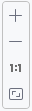
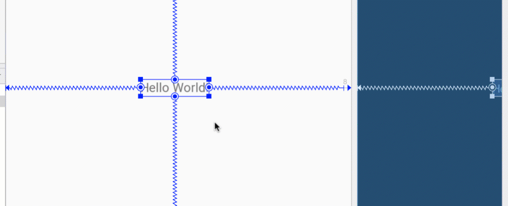
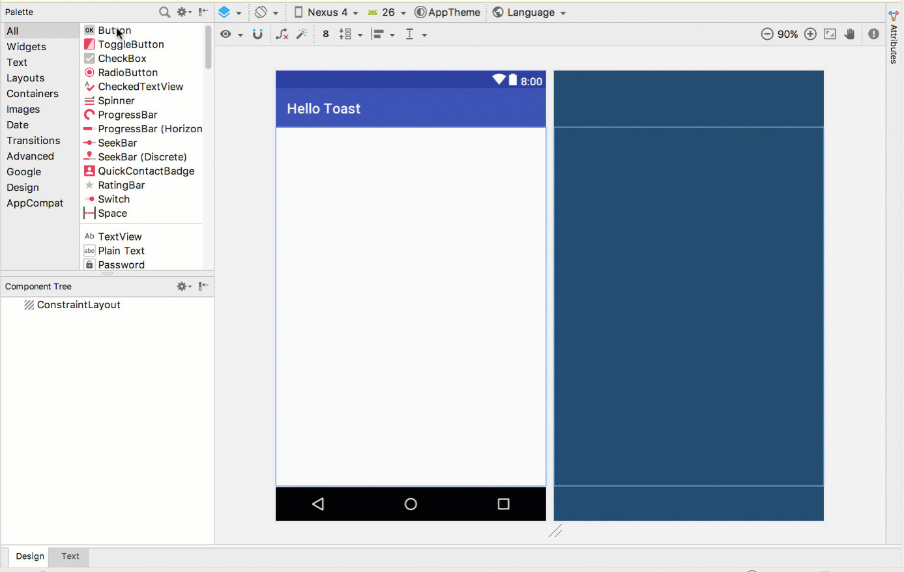
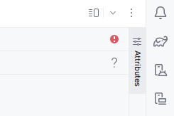
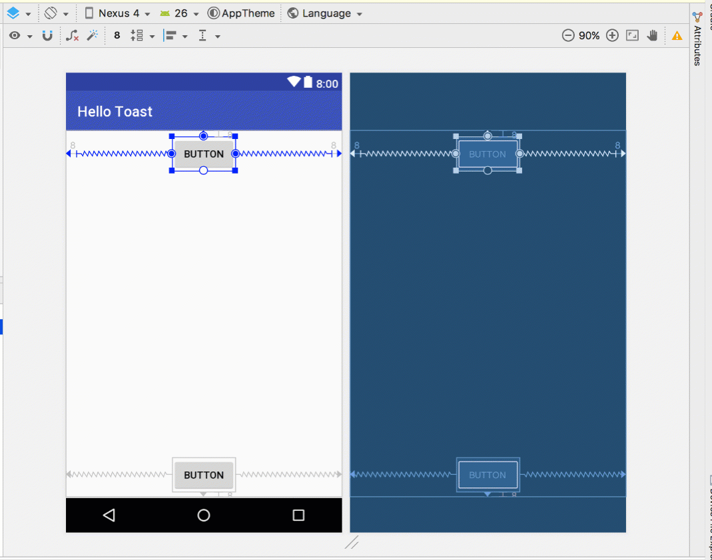
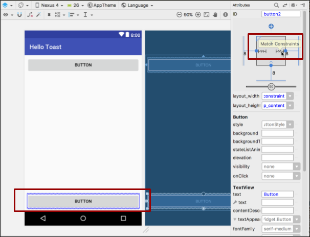
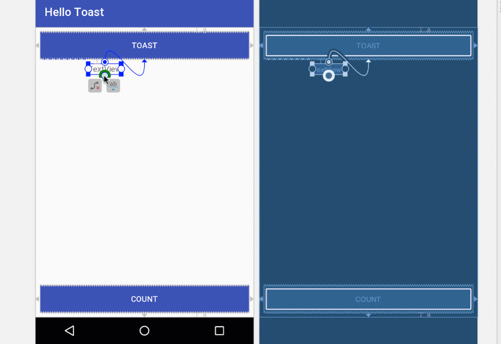
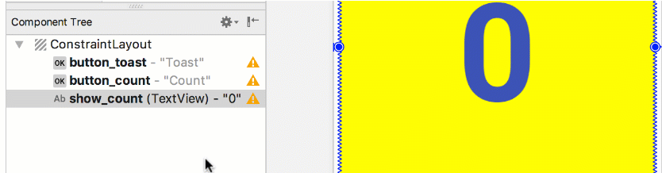
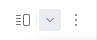

# TP 01.2: Votre première interface utilisateur interactive

[Codelab Feedback](https://github.com/khammami/codelabs-enetcom/issues)


## Bienvenue


Ces travaux pratiques se base sur le cours de base pour les développeurs Android fourni par Google afin de  les préparer pour le test de certification  [Associate Android Developer](https://developers.google.com/training/certification/associate-android-developer/). Vous obtiendrez le plus de valeur de ce TP si vous travaillez successivement dans les codelabs.

### Introduction

L'interface utilisateur (UI) qui apparaît sur l'écran d'un appareil Android consiste en une hiérarchie d'objets appelée vues (views) - chaque élément de l'écran est une vue ( [View](https://developer.android.com/reference/android/view/View.html)). La classe `View` représente le bloc de construction de base pour tous les composants d'interface utilisateur et la classe de base pour les classes qui fournissent des composants d'interface utilisateur interactifs tels que des boutons, des cases à cocher et des champs de saisie de texte. Les sous-classes `View` couramment utilisées décrites dans plusieurs leçons comprennent:

*  [`TextView`](http://developer.android.com/reference/android/widget/TextView.html) pour afficher du texte.
*  [`EditText`](https://developer.android.com/reference/android/widget/EditText.html) pour permettre à l'utilisateur d'entrer et de modifier du texte.
*  [`Bouton`](https://developer.android.com/reference/android/widget/Button.html) et autres éléments cliquables (tels que  [`RadioButton`](https://developer.android.com/reference/android/widget/RadioButton.html),  [`CheckBox`](https://developer.android.com/reference/android/widget/CheckBox.html) et  [`Spinner`](https://developer.android.com/reference/android/widget/Spinner.html)) pour fournir un comportement interactif.
*  [`ScrollView`](https://developer.android.com/reference/android/widget/ScrollView.html) et  [`RecyclerView`](https://developer.android.com/reference/android/support/v7/widget/RecyclerView.html) pour afficher des éléments déroulables.
*  [`ImageView`](https://developer.android.com/reference/android/widget/ImageView.html) pour afficher des images.
*  [`ConstraintLayout`](https://developer.android.com/reference/android/support/constraint/ConstraintLayout.html) et  [`LinearLayout`](https://developer.android.com/reference/android/widget/LinearLayout.html) pour contenir d'autres éléments `View` et les positionner.

Le code Java qui affiche et pilote l'interface utilisateur est contenu dans une classe qui étend  [`Activity`](https://developer.android.com/reference/android/app/Activity.html). Une activité est généralement associée à une disposition de vues d'interface utilisateur définie comme un fichier XML (eXtended Markup Language). Ce fichier XML porte généralement le nom de son activité (`Activity`) et définit la disposition des éléments de vue (`View`) à l'écran.

Par exemple, le code `MainActivity` de l'application Hello World affiche une mise en forme définie dans le fichier de mise en forme `activity_main.xml`, qui inclut un `TextView` avec le texte "Hello World".

Dans des applications plus complexes, une activité (`Activity`) peut implémenter des actions permettant de répondre aux sollicitations de l'utilisateur, de dessiner un contenu graphique ou de demander des données à partir d'une base de données ou d'Internet. Vous en apprendrez davantage sur la classe d'activité (`Activity`) dans un autre TP.

Dans cette pratique, vous apprendrez à créer votre première application interactive, une application qui permet une interaction de l'utilisateur. Vous avez créé une application à l'aide du modèle d'activité vide. Vous apprendrez également à utiliser l'éditeur de mise en page pour concevoir une mise en page et à la modifier en XML. Vous devez développer ces compétences pour pouvoir compléter les autres travaux pratiques de ce cours.

### What you should already know

Vous devriez être familier avec:

* Comment installer et ouvrir Android Studio.
* Comment créer l'application HelloWorld.
* Comment exécuter l'application HelloWorld.

### What you'll learn

* Comment créer une application avec un comportement interactif.
* Comment utiliser l'éditeur de mise en page pour concevoir une mise en page.
* Comment éditer la mise en page en XML.
* Beaucoup de nouvelles terminologies. Consultez  [le glossaire des mots et des concepts du vocabulaire](https://developers.google.com/android/for-all/vocab-words/) pour des définitions conviviales.

### What you'll do

* Créez une application et ajoutez deux éléments `Button` et un `TextView` à la mise en page.
* Manipulez chaque élément de  [`ConstraintLayout`](https://developer.android.com/reference/android/support/constraint/ConstraintLayout.html) pour le contraindre aux marges et aux autres éléments.
* Changer les attributs des éléments de l'interface utilisateur.
* Modifiez la mise en page de l'application en XML.
* Extrayez des chaînes codées en dur dans des ressources de chaîne.
* Implémentez des méthodes de gestion des clics pour afficher des messages à l'écran lorsque l'utilisateur appuie sur chaque bouton (`Button`).


## Aperçu de l'application


L'application "Hello Toast" comprend deux boutons (`Button`) et un champ de texte (`TextView`). Lorsque l'utilisateur appuie sur le premier bouton, un message court (`Toast`) est affiché à l'écran. Appuyer sur le deuxième bouton augmente le compteur de clics affiché dans le champ de texte, qui commence à 0.

Voici à quoi ressemble l'application finie:


## Tâche 1: créer et explorer un nouveau projet


Dans cette pratique, vous concevez et implémentez un projet pour l'application HelloToast.


> aside negative
> 
> Pour suivre ce codelab, vous devez activer la nouvelle interface utilisateur dans Android Studio Giraffe:
> 
> * à partir de la fenêtre "Welcome to Android Studio":
> **Customize &gt; All settings**
> * à partir de la fenêtre du projet ouvert:
> **File &gt; Settings**
> 
> 
> 
> Pour activer la nouvelle interface utilisateur et afficher le menu principal dans une barre d'outils séparée, cochez les deux paramètres suivants :
> 
> * **Enable new UI**
> * **Show main menu in separate toolbar**
> 
> Une fois ces paramètres cochés, vous devez redémarrer Android Studio pour que les changements soient appliqués.

### 1.1 Créer le projet Android Studio

1. Démarrez Android Studio et créez un nouveau projet avec les paramètres suivants:

| Attribut | Valeur |
| --- | --- |
| Application Name | <strong>Hello Toast</strong> |
| Package Name | <strong>com.example.enetcom.hellotoast</strong> |
| Phone and Tablet Minimum SDK | <strong>API 16: Android 4.1 Jelly Bean</strong> |
| Template | <strong>Empty Views Activity</strong> |

2. Sélectionnez **Run &gt; Run app** ou cliquez sur l'icône **Run**  de la barre d'outils pour créer et exécuter l'application sur l'émulateur ou sur votre appareil.

### 1.2 Explorez l'éditeur de mise en page (layout)

Android Studio fournit l'éditeur de disposition (layout) pour construire rapidement la disposition des éléments d'interface utilisateur (UI) d'une application. Il vous permet de faire glisser des éléments vers une conception visuelle et une vue de plan directeur, de les positionner dans la présentation, d'ajouter des contraintes et de définir des attributs. Les contraintes déterminent la position d'un élément d'interface utilisateur dans la présentation. Une contrainte représente une connexion ou un alignement sur une autre vue, la mise en page parent ou un repère invisible.

Explorez l'éditeur de layout et reportez-vous à la figure ci-dessous lorsque vous suivez les étapes numérotées:

1. Dans le dossier **app &gt; res &gt; layout** du volet **Project &gt; Android**, double-cliquez sur le fichier **`activity_main.xml`** pour l'ouvrir, s'il ne l'est pas déjà.
2. Sélectionnez le mode de vue **Design** s'il n'est pas déjà sélectionné. Vous utilisez le mode **Design** pour manipuler les éléments et le layout, et le mode **Code** pour modifier le code XML du layout.
3. Le volet **Palettes** affiche les éléments d'interface utilisateur (UI) que vous pouvez utiliser dans le "layout" de votre application.
4. Le volet de l'arborescence des composants (**Components tree**) affiche la hiérarchie des éléments de l'interface utilisateur (UI). Les éléments de vue sont organisés dans une arborescence de parents et d'enfants, dans laquelle un enfant hérite des attributs de son parent. Dans la figure ci-dessus, `TextView` est un enfant de `ConstraintLayout`. Vous en apprendrez plus sur ces éléments plus tard dans ce TP.
5. Les panneaux de Design et de Blue print de l'éditeur de disposition (layout) affichant les éléments d'interface utilisateur (UI) de la disposition (layout). Dans la figure ci-dessus, le layout ne montre qu'un seul élément: un `TextView` qui affiche "Hello World".
6. L'onglet **Attributes** affiche le volet **Attributes** pour la définition des propriétés d'un élément d'interface utilisateur (UI).

> aside positive
> 
> **Conseil**: voir  [Building a UI with Layout Editor](https://developer.android.com/studio/write/layout-editor.html)  pour plus de détails sur l'utilisation de l'éditeur de mises en page, et  [Meet Android Studio](https://developer.android.com/studio/intro/index.html) pour la documentation complète sur Android Studio.


## Tâche 2: Ajouter des éléments de vue dans l'éditeur de disposition (layout)


Dans cette tâche, vous créez la disposition de l'interface utilisateur pour l'application HelloToast dans l'éditeur de disposition à l'aide des fonctionnalités de  [`ConstraintLayout`](https://developer.android.com/reference/android/support/constraint/ConstraintLayout.html). Vous pouvez créer les contraintes manuellement, comme indiqué ultérieurement, ou automatiquement à l'aide de l'outil de connexion automatique (**Autoconnect**).

### 2.1 Examiner les contraintes d'éléments

Suivez ces étapes:

1. Ouvrez `activity_main.xml` à partir du volet **Project &gt; Android** s'il n'est pas déjà ouvert. Si le mode de vue  **Design** n'est pas déjà sélectionné, cliquez dessus.

S'il n'y a pas de modèle (blueprint), cliquez sur le bouton **Select Design Surface**  dans la barre d'outils et choisissez **Design + Blueprint**.

2. L'outil de connexion automatique (**Autoconnect**)  est également situé dans la barre d'outils. Il est activé par défaut. Pour cette étape, assurez-vous que l'outil n'est pas désactivé.
3. Cliquez sur le bouton de zoom in pour effectuer un zoom avant sur les volets de conception (design) et de plan (blueprint) détaillé.

4. Sélectionnez **`TextView`** dans le volet Component Tree. Le `TextView` "Hello World" est mis en surbrillance dans les volets Design and blueprint et les contraintes pour l'élément sont visibles.
5. Reportez-vous à la figure animée ci-dessous pour cette étape. Cliquez sur la poignée circulaire située à droite de `TextView` pour supprimer la contrainte horizontale qui lie la vue au côté droit de la présentation (layout). `TextView` saute du côté gauche car il n'est plus contraint du côté droit. Pour rajouter la contrainte horizontale, cliquez sur la même poignée et faites glisser une ligne vers le côté droit de la présentation (layout).



Dans les volets "blueprint" ou "design", les poignées suivantes apparaissent sur l'élément TextView:

* Poignée de contrainte (**Constraint handle**): pour créer une contrainte comme illustré dans la figure animée ci-dessus, cliquez sur une poignée de contrainte, représentée par un cercle sur le côté d'un élément. Faites ensuite glisser la poignée vers une autre poignée de contrainte ou vers une limite parent. Une ligne en zigzag représente la contrainte.


* Poignée de redimensionnement (**Resizing handle**): pour redimensionner l'élément, faites glisser les poignées de redimensionnement carrées. La poignée se transforme en coin incliné pendant que vous la faites glisser.


### 2.2 Ajouter un bouton à la mise en page (layout)

Lorsqu'il est activé, l'outil de connexion automatique (**Autoconnect**  ) crée automatiquement deux contraintes ou plus pour un élément d'interface utilisateur (UI) dans la présentation (layout) parent. Une fois que vous avez fait glisser l'élément sur la présentation (layout), des contraintes sont créées en fonction de la position de l'élément.

Suivez ces étapes pour ajouter un bouton (`Button`):

1. Commencez avec une ardoise vierge. L'élément `TextView` n'est pas nécessaire. Ainsi, même s'il est toujours sélectionné, appuyez sur la touche **Suppr** ou choisissez **Edit&gt; Delete**. Vous avez maintenant une mise en page (layout) complètement vide.
2. Faites glisser un bouton (**Button**) du volet **Palette** vers n'importe quelle position de la présentation (layout). Si vous déposez le bouton (`Button`) dans la partie centrale supérieure de la présentation, des contraintes peuvent apparaître automatiquement. Si ce n'est pas le cas, vous pouvez faire glisser des contraintes vers le haut, le côté gauche et le côté droit de la présentation, comme illustré dans la figure animée ci-dessous.



### 2.3 Ajouter un deuxième bouton à la mise en page (layout)

1. Faites glisser un autre bouton (**Button**) du volet **Palette** vers le milieu de la présentation, comme indiqué dans la figure animée ci-dessous. La connexion automatique (Autoconnect) peut vous fournir les contraintes horizontales (sinon, vous pouvez les faire glisser vous-même).
2. Faites glisser une contrainte verticale vers le bas de la présentation (layout) (reportez-vous à la figure ci-dessous).


Vous pouvez supprimer les contraintes d'un élément en le sélectionnant et en plaçant le pointeur de la souris dessus pour afficher le bouton Clear Constraints  . Cliquez sur ce bouton pour supprimer toutes les contraintes sur l'élément sélectionné. Pour effacer une seule contrainte, cliquez sur le descripteur spécifique qui définit la contrainte.

Pour effacer toutes les contraintes de la mise en page (layout) complète, cliquez sur l'outil **Clear All Constraints** dans la barre d'outils. Cet outil est utile si vous souhaitez rétablir toutes les contraintes de votre mise en page (layout).


## Tâche 3: Modifier les attributs de l'élément d'interface utilisateur (UI)


Le volet **Attributes** donne accès à tous les attributs XML que vous pouvez affecter à un élément de l'interface utilisateur. Vous pouvez trouver les attributs (appelés propriétés) communs à toutes les vues dans  [la documentation de la classe View](http://developer.android.com/reference/android/view/View.html).

Dans cette tâche, vous entrez de nouvelles valeurs et modifiez les valeurs d'attributs de bouton (`Button`) importants, applicables à la plupart des types de vues (`View`).

### 3.1 Changer la taille du bouton (Button)

L'éditeur de disposition (layout) propose des poignées de redimensionnement aux quatre coins d'une vue (`View`), ce qui vous permet de redimensionner rapidement la vue (`View`). Vous pouvez faire glisser les poignées situées à chaque coin de la Vue (`View`) pour la redimensionner, mais ce faisant, codez en dur les dimensions width et height. Évitez de coder les tailles en dur pour la plupart des éléments `View`, car les dimensions en codage en dur ne peuvent pas s'adapter à différentes tailles de contenu et d'écran.

Utilisez plutôt le volet **Attributes** situé à droite de l'éditeur de présentation pour sélectionner un mode de dimensionnement qui n'utilise pas de dimensions codées en dur. Le volet **Attributes** comprend un panneau de dimensionnement carré appelé inspecteur de vue (*view inspector)* en haut. Les symboles à l'intérieur du carré représentent les paramètres de hauteur et de largeur comme suit:


Dans la figure ci-dessus:

1. Contrôle de la hauteur (**Height control**). Ce contrôle spécifie l'attribut `layout_height` et apparaît en deux segments sur les côtés supérieur et inférieur du carré. Les angles indiquent que ce contrôle est défini sur `wrap_content`, ce qui signifie que la vue (`View`) se développera verticalement si nécessaire pour s'adapter à son contenu. Le "8" indique une marge standard définie à 8dp.
2. Contrôle de la largeur (**Width control**). Ce contrôle spécifie `layout_width` et apparaît en deux segments à gauche et à droite du carré. Les angles indiquent que ce contrôle est défini sur wrap_content, ce qui signifie que la vue (`View`) s'agrandit horizontalement si nécessaire pour s'ajuster à son contenu, jusqu'à une marge de 8dp.
3. Bouton de fermeture du volet **Attributes**. Cliquez pour fermer le volet.

Suivez ces étapes:

1. Sélectionnez le bouton (`Button`) du haut dans le volet **Component Tree**.
2. Cliquez sur l'onglet **Attributes** sur le côté droit de la fenêtre de l'éditeur de disposition (layout).



3. Cliquez deux fois sur le contrôle de largeur - le premier clic le modifie en Fixé (**Fixed**) avec des lignes droites, et le second clic le modifie en **Match Constraints** avec des bobines de ressort, comme illustré dans la figure animée ci-dessous.



Suite à la modification du contrôle de largeur, l'attribut `layout_width` dans le volet **Attributes** affiche la valeur `match_constraint` et l'élément `Button` s'étire horizontalement pour remplir l'espace entre les côtés gauche et droit de la présentation (layout).

4. Sélectionnez le deuxième bouton (`Button`) et apportez les mêmes modifications à `layout_width` comme à l'étape précédente, comme illustré dans la figure ci-dessous.



Comme indiqué dans les étapes précédentes, les attributs `layout_width` et `layout_height` dans le volet **Attributes** sont modifiés lorsque vous modifiez les contrôles de hauteur et de largeur dans l'inspecteur. Ces attributs peuvent prendre l'une des trois valeurs suivantes pour la présentation, qui est un `ConstraintLayout`:

* Le paramètre `match_constraint` développe l'élément `View` pour qu'il remplisse son parent en largeur ou en hauteur, jusqu'à une marge, le cas échéant. Le parent dans ce cas est le `ConstraintLayout`. Vous en apprendrez plus sur `ConstraintLayout` dans la tâche suivante.
* Le paramètre `wrap_content` réduit les dimensions de l'élément `View` afin qu'il soit assez grand pour en contenir le contenu. S'il n'y a pas de contenu, l'élément View devient invisible.
* Pour spécifier une taille fixe adaptée à la taille de l'écran du périphérique, utilisez un nombre fixe de  [pixels indépendants de la densité](https://developer.android.com/training/multiscreen/screendensities.html) (unités dp). Par exemple, 16dp signifie 16 pixels indépendants de la densité.

> aside positive
> 
> **Conseil**: Si vous modifiez l'attribut `layout_width` à l'aide de son menu contextuel, l'attribut `layout_width` est défini sur zéro car il n'y a pas de dimension définie. Ce paramètre est identique à `match_constraint`: la vue peut être agrandie autant que possible pour répondre aux contraintes et aux paramètres de marge.

### 3.2 Changer les attributs du bouton (Button)

Pour identifier chaque vue (`View`) de manière unique dans une présentation (layout) d'activité (`Activity`), chaque sous-classe `View` (telle que `Button`) ou `View` nécessite un `ID` unique. Et pour être utile, les éléments Button ont besoin de texte. Les éléments de vue peuvent également avoir des arrière-plans qui peuvent être des couleurs ou des images.

Le volet **Attributes** permet d'accéder à tous les attributs que vous pouvez affecter à un élément `View`. Vous pouvez entrer des valeurs pour chaque attribut, telles que les attributs `android:id`, `backgroundTint`, `textColor` et `text`.

La figure animée suivante montre comment effectuer ces étapes:

1. Après avoir sélectionné le premier bouton (`Button`), modifiez le champ `ID` en haut du volet **Attributes** en **`button_toast`** pour l'attribut `android:id`, utilisé pour identifier l'élément dans la présentation (layout).
2. Définissez l'attribut `backgroundTint` sur **@color/colorPrimary**. (vous devez définir **colorPrimary** sous `colors.xml` avec la valeur `#410081`)
3. Définissez l'attribut `textColor` sur **@android:color/white**.
4. Modifiez l'attribut de `text` en **Toast**.


5. Effectuez les mêmes modifications d'attribut pour le deuxième bouton (`Button`), en utilisant **button_count** comme ID, **Count** pour l'attribut `text` et les mêmes couleurs pour l'arrière-plan et le texte lors des étapes précédentes.

`colorPrimary` est la couleur principale du thème, l'une des couleurs de base du thème prédéfinies définies dans le fichier de ressources `colors.xml`. Il est utilisé pour la barre d'applications (app bar). L'utilisation des couleurs de base pour d'autres éléments d'interface utilisateur crée une interface utilisateur (UI) uniforme. Vous en apprendrez plus sur les thèmes d'applications et la conception de matériaux dans une autre TP.


## Tâche 4: Ajouter un TextView et définir ses attributs


L'un des avantages de  [ConstraintLayout](https://developer.android.com/reference/android/support/constraint/ConstraintLayout.html) est la possibilité d'aligner ou de contraindre des éléments par rapport à d'autres éléments. Dans cette tâche, vous allez ajouter un `TextView` au milieu de la mise en page et le contraindre horizontalement aux marges et verticalement aux deux éléments `Button`. Vous modifierez ensuite les attributs du `TextView` dans le volet **Attributes**.

### 4.1 Ajouter un TextView et des contraintes

1. Comme le montre la figure animée ci-dessous, faites glisser un `TextView` du volet **Palette** vers la partie supérieure de la présentation (layout), puis faites glisser une contrainte du haut du `TextView` vers la poignée située au bas du bouton **Toast**. Cela contraint `TextView` à se trouver sous le bouton.


2. Comme le montre la figure animée ci-dessous, faites glisser une contrainte du bas de `TextView` vers la poignée située en haut du bouton **Count** et des côtés de `TextView` vers les côtés de la présentation (layout). Cela oblige `TextView` à se trouver au milieu de la disposition entre les deux éléments `Button`.



### 4.2 Définir les attributs TextView

Lorsque TextView est sélectionné, ouvrez le volet **Attributes**, s'il n'est pas déjà ouvert. Définissez les attributs du `TextView` comme indiqué dans la figure animée ci-dessous. Les attributs que vous n'avez pas encore rencontrés sont expliqués après la figure:

1. Définissez `ID` sur **show_count**.
2. Définissez `text` sur **0**.
3. Réglez le `textSize` à **160sp**.
4. Définissez `textStyle` sur **Bold** (gras) et `textAlignment` sur **`center`** (utilisez le mode de vue Code pour l'ajouter).
5. Modifiez les contrôles de taille de vue horizontale et verticale (`layout_width` et `layout_height`) en **match_constraint**.
6. Définissez `textColor` sur **@color/colorPrimary**.
7. Faites défiler le volet et cliquez sur Afficher tous les attributs, faites défiler la deuxième page d'attributs vers `background`, puis entrez **#FFFF00** pour obtenir une nuance de jaune.
8. Faites défiler jusqu'à `gravity`, développez `gravity` et sélectionnez **center**.


* `textSize`: La taille du texte de `TextView`. Pour ce TP, la taille est définie sur `160sp`. `sp` signifie pixel indépendant de l'échelle, comme `dp`, et est une unité qui s'adapte à la densité de l'écran et aux préférences de taille de police de l'utilisateur. Utilisez les unités dp lorsque vous spécifiez les tailles de police afin que les tailles soient ajustées à la fois pour la densité de l'écran et les préférences de l'utilisateur.
* `textStyle` et `textAlignment`: style de texte défini sur **Bold** (gras) dans ce TP et alignement du texte défini sur `center` (centre du paragraphe).
* `gravity`: l'attribut `gravity` spécifie comment une vue (`View`) est alignée dans sa vue parent ou son groupe de vues (`ViewGroup`). Dans cette étape, vous centrez le `TextView` pour qu'il soit centré verticalement dans le parent `ConstraintLayout`.

Vous remarquerez peut-être que l'attribut d'arrière-plan (`background`) se trouve sur la première page du volet **Attributes** pour un bouton (`Button`), mais sur la deuxième page du volet **Attributes** pour un `TextView`. 


## Tâche 5: Modifier la mise en page (layout) en XML


La mise en page (layout) de l'application Hello Toast est presque terminée! Cependant, un point d'exclamation apparaît en regard de chaque élément d'interface utilisateur (UI) dans l'arborescence des composants (Component Tree). Passez votre pointeur sur ces points d'exclamation pour voir les messages d'avertissement, comme indiqué ci-dessous. Le même avertissement apparaît pour les trois éléments: les chaînes codées en dur doivent utiliser des ressources.



Le moyen le plus simple de résoudre les problèmes de mise en page (layout) consiste à modifier la mise en page (layout) en XML. Bien que l'éditeur de disposition (layout) soit un outil puissant, certaines modifications sont plus faciles à effectuer directement dans le code source XML.

### 5.1 Ouvrez le code XML pour la mise en page (layout)

Pour cette tâche, ouvrez le fichier `activity_main.xml` s'il ne l'est pas déjà, puis sélectionnez le mode **Code**  en haut de l'éditeur de disposition (layout).

L'éditeur XML apparaît, remplaçant les volets de conception et de plan (design and blueprint). Comme vous pouvez le voir dans la figure ci-dessous, qui présente une partie du code XML de la présentation (layout), les avertissements sont mis en surbrillance, à savoir les chaînes codées en dur `"Toast"` et `"Count`". (Le `"0"` codé en dur est également mis en surbrillance mais n'est pas illustré dans la figure.) Passez votre pointeur sur la chaîne codée en dur `"Toast"` pour voir le message d'avertissement.


### 5.2 Extraire les ressources de chaîne de caractères

Au lieu de coder en dur, il est recommandé d'utiliser des ressources de chaîne de caractères, qui représentent les chaînes de caractères. Le fait de disposer les chaînes dans un fichier séparé facilite leur gestion, surtout si vous utilisez ces chaînes plusieurs fois. De plus, les ressources de chaîne de caractères sont obligatoires pour la traduction et la localisation de votre application, car vous devez créer un fichier de ressources de chaîne de caractères pour chaque langue.

1. Cliquez une fois sur le mot `"Toast"` (le premier avertissement en surbrillance).
2. Appuyez sur **Alt-Entrée**, puis choisissez **Extract string resource** dans le menu contextuel.
3. Entrez `button_label_toast` pour le nom de la ressource (**Resource name**).
4. Cliquez sur **OK**. Une ressource de chaîne de caractères est créée dans le fichier `values/res/string.xml` et la chaîne de votre code est remplacée par une référence à la ressource:

`@string/button_label_toast`

5. Extrayez les chaînes restantes: `button_label_count` pour `"Count"` et `count_initial_value` pour `"0"`.
6. Dans le volet **Project &gt; Android**, développez **values** dans **res**, puis double-cliquez sur **strings.xml** pour afficher vos ressources de chaîne de caractères dans le fichier `strings.xml`:

```
<resources>
    <string name="app_name">Hello Toast</string>
    <string name="button_label_toast">Toast</string>
    <string name="button_label_count">Count</string>
    <string name="count_initial_value">0</string>
</resources>
```

7. Vous avez besoin d'une autre chaîne à utiliser dans une tâche ultérieure qui affiche un message. Ajoutez au fichier `strings.xml` une autre ressource chaîne nommée `toast_message` pour la phrase `"Hello Toast!"`:

```
<resources>
    <string name="app_name">Hello Toast</string>
    <string name="button_label_toast">Toast</string>
    <string name="button_label_count">Count</string>
    <string name="count_initial_value">0</string>
    <string name="toast_message">Hello Toast!</string>
</resources>
```

> aside positive
> 
> **Conseil**: Les ressources de chaîne de caractères incluent le nom de l'application, qui apparaît dans la barre d'application en haut de l'écran si vous démarrez votre projet d'application à l'aide du modèle vide. Vous pouvez modifier le nom de l'application en modifiant la ressource `app_name`.


## Tâche 6: Ajouter des gestionnaires onClick pour les boutons


Dans cette tâche, vous ajoutez une méthode Java pour chaque bouton (**Button**) dans `MainActivity` qui s'exécute lorsque l'utilisateur appuie sur le bouton.

### 6.1 Ajouter l'attribut et le gestionnaire onClick à chaque bouton

Un gestionnaire de clics (*click handler)* est une méthode appelée lorsque l'utilisateur clique ou appuie sur un élément d'interface utilisateur (UI) cliquable. Dans Android Studio, vous pouvez spécifier le nom de la méthode dans le champ `onClick` du volet **Attributes** de l'onglet **Design**. Vous pouvez également spécifier le nom de la méthode de gestionnaire dans l'éditeur XML en ajoutant la propriété `android:onClick` au bouton. Vous utiliserez cette dernière méthode car vous n'avez pas encore créé les méthodes, et l'éditeur XML fournit un moyen automatique de créer ces méthodes.

1. Avec l'éditeur XML ouvert (onglet Text), recherchez le bouton avec `android:id` défini sur `button_toast`:

```
<Button
        android:id="@+id/button_toast"
        android:layout_width="0dp"
        ...
        app:layout_constraintStart_toStartOf="parent"
        app:layout_constraintTop_toTopOf="parent" />
```

2. Ajoutez l'attribut `android:onClick` à la fin de l'élément `button_toast` après le dernier attribut et avant l'indicateur de fin  `/&gt;` :

```
android:onClick="showToast" />
```

3. Cliquez sur l'icône en forme d'ampoule rouge qui apparaît à côté de l'attribut. Sélectionnez **Create click handler**, choisissez **MainActivity**, puis cliquez sur **OK**.

Si l'icône en forme d'ampoule rouge n'apparaît pas, cliquez sur le nom de la méthode (`"showToast"`). Appuyez sur **Alt-Entrée**, sélectionnez **Create 'showToast(view)' in MainActivity**, puis cliquez sur **OK**. 

Cette action crée un talon de méthode d'espace réservé pour la méthode `showToast()` dans `MainActivity`, comme indiqué à la fin de ces étapes.
4. Répétez les deux dernières étapes avec le bouton `button_count`: Ajoutez l'attribut `android:onClick` à la fin, puis ajoutez le gestionnaire de clics:

```
android:onClick="countUp" />
```

Le code XML pour les éléments d'interface utilisateur (UI) dans `ConstraintLayout` ressemble maintenant à ceci:

```
<Button
        android:id="@+id/button_toast"
        android:layout_width="0dp"
        android:layout_height="wrap_content"
        android:layout_marginEnd="8dp"
        android:layout_marginStart="8dp"
        android:layout_marginTop="8dp"
        app:backgroundTint="@color/colorPrimary"
        android:text="@string/button_label_toast"
        android:textColor="@android:color/white"
        app:layout_constraintEnd_toEndOf="parent"
        app:layout_constraintStart_toStartOf="parent"
        app:layout_constraintTop_toTopOf="parent"
        android:onClick="showToast"/>
    <Button
        android:id="@+id/button_count"
        android:layout_width="0dp"
        android:layout_height="wrap_content"
        android:layout_marginBottom="8dp"
        android:layout_marginEnd="8dp"
        android:layout_marginStart="8dp"
        app:backgroundTint="@color/colorPrimary"
        android:text="@string/button_label_count"
        android:textColor="@android:color/white"
        app:layout_constraintBottom_toBottomOf="parent"
        app:layout_constraintEnd_toEndOf="parent"
        app:layout_constraintStart_toStartOf="parent"
        android:onClick="countUp" />

    <TextView
        android:id="@+id/show_count"
        android:layout_width="0dp"
        android:layout_height="0dp"
        android:layout_marginBottom="8dp"
        android:layout_marginEnd="8dp"
        android:layout_marginStart="8dp"
        android:layout_marginTop="8dp"
        android:background="#FFFF00"
        android:gravity="center"
        android:text="@string/count_initial_value"
        android:textAlignment="center"
        android:textColor="@color/colorPrimary"
        android:textSize="160sp"
        android:textStyle="bold"
        app:layout_constraintBottom_toTopOf="@+id/button_count"
        app:layout_constraintEnd_toEndOf="parent"
        app:layout_constraintStart_toStartOf="parent"
        app:layout_constraintTop_toBottomOf="@+id/button_toast" />
```

5. Si `MainActivity.java` n'est pas déjà ouvert, développez **java** dans la vue **Project&gt; Android**, développez **com.example.enetcom.hellotoast**, puis double-cliquez sur **MainActivity**. L'éditeur de code apparaît avec le code dans `MainActivity`:

```
public class MainActivity extends AppCompatActivity {

    @Override
    protected void onCreate(Bundle savedInstanceState) {
        super.onCreate(savedInstanceState);
        setContentView(R.layout.activity_main);
    }

    public void showToast(View view) {
    }

    public void countUp(View view) {
    }
}
```

### 6.2 Modifier le gestionnaire de bouton Toast

Vous allez maintenant modifier la méthode `showToast()`, le gestionnaire de clics de **Toast** `Button` dans `MainActivity`, afin qu'il affiche un message. Un  [`Toast`](https://developer.android.com/reference/android/widget/Toast.html) permet d'afficher un message simple dans une petite fenêtre contextuelle. Il ne remplit que la quantité d'espace requise pour le message. L'activité en cours reste visible et interactive. Un `Toast` peut être utile pour tester l'interactivité dans votre application. Ajoutez un message `Toast` pour afficher le résultat de l'activation d'un bouton ou de l'exécution d'une action.

Suivez ces étapes pour éditer le gestionnaire de clic **Toast** `Button`:

1. Localisez la méthode `showToast()` nouvellement créée.

```
public void showToast(View view) {
}
```

2. Pour créer une instance de `Toast`, appelez la méthode de fabrique  [`makeText()`](https://developer.android.com/reference/android/widget/Toast.html#makeText(android.content.Context,%20int,%20int)) sur la classe  [`Toast`](https://developer.android.com/reference/android/widget/Toast.html).

```
public void showToast(View view) {
    Toast toast = Toast.makeText(
}
```

Cette déclaration est incomplète jusqu'à ce que toutes les étapes soient terminées.

3. Indiquez le  [contexte](https://developer.android.com/reference/android/content/Context.html) de l'activité de l'application. Comme un `Toast` s'affiche en haut de l'interface utilisateur (UI) d'activité (`Activity`), le système a besoin d'informations sur l'activité en cours. Lorsque vous vous trouvez déjà dans le contexte de l'activité (`Activity`) dont vous avez besoin, utilisez `this` comme raccourci.

```
Toast toast = Toast.makeText(this,
```

4. Indiquez le message à afficher, par exemple une ressource chaîne (le message `toast_message` que vous avez créé à une étape précédente). La ressource chaîne `toast_message` est identifiée par `R.string`.

```
Toast toast = Toast.makeText(this, R.string.toast_message,
```

5. Indiquez une durée pour l'affichage. Par exemple,  [`Toast.LENGTH_SHORT`](https://developer.android.com/reference/android/widget/Toast.html#LENGTH_SHORT) affiche le Toast pendant un temps relativement court.

```
Toast toast = Toast.makeText(this, R.string.toast_message, 
                                          Toast.LENGTH_SHORT);
```

La durée d'affichage `Toast` peut être soit `Toast.LENGTH_LONG` ou `Toast.LENGTH_SHORT`. Les durées réelles sont d'environ 3,5 secondes pour le `Toast` long et de 2 secondes pour le `Toast` court.

6. Affichez le `Toast` en appelant  [`show()`](https://developer.android.com/reference/android/widget/Toast.html#show()). Voici la méthode `showToast()` complète:

```
public void showToast(View view) {
   Toast toast = Toast.makeText(this, R.string.toast_message, 
                                          Toast.LENGTH_SHORT);
   toast.show();
}
```

Exécutez l'application et vérifiez que le message **Toast** apparaît lorsque vous appuyez sur le bouton Toast.

### 6.3 Modifier le gestionnaire de bouton de comptage (Count)

Vous allez maintenant modifier la méthode `countUp()`, le gestionnaire de clic du bouton **Count** dans `MainActivity`, afin d'afficher le nombre actuel une fois que vous avez appuyé sur **Count**. Chaque clique augmente le nombre d'un.

Le code pour le gestionnaire doit:

* Gardez une trace du nombre de comptage quand il change.
* Envoyez le nombre mis à jour à `TextView` pour l'afficher.

Suivez ces étapes pour modifier le gestionnaire de clic du bouton **Count**:

1. Localisez la méthode `countUp()` nouvellement créée.

```
public void countUp(View view) {
}
```

2. Pour suivre le comptage, vous avez besoin d'une variable membre privée. Chaque appui sur le bouton Count augmente la valeur de cette variable. Entrez ce qui suit, qui sera surligné en rouge et affichera une icône en forme d'ampoule rouge:

```
public void countUp(View view) {
    mCount++;
}
```

Si l'icône en forme d'ampoule rouge n'apparaît pas, sélectionnez l'expression `mCount++`. L'ampoule rouge apparaît finalement.

3. Cliquez sur l'icône de l'ampoule rouge et choisissez **Create field 'mCount'** dans le menu contextuel. Cela crée une variable membre privée en haut de `MainActivity`, et Android Studio suppose que vous voulez que ce soit un entier (`int`):

```
public class MainActivity extends AppCompatActivity {
    private int mCount;
```

4. Modifiez l'instruction de membre privé pour initialiser la variable à zéro:

```
public class MainActivity extends AppCompatActivity {
    private int mCount = 0;
```

5. En plus de la variable ci-dessus, vous avez également besoin d'une variable membre privée pour la référence de la méthode `show_count` pour le TextView, que vous ajouterez au gestionnaire de clics. Appelez cette variable `mShowCount`:

```
public class MainActivity extends AppCompatActivity {
    private int mCount = 0;
    private TextView mShowCount;
```

6. Maintenant que vous avez `mShowCount`, vous pouvez obtenir une référence à `TextView` à l'aide de l'`ID` que vous avez défini dans le fichier de présentation (layout). Pour obtenir cette référence une seule fois, spécifiez-la dans la méthode `onCreate()`. Comme vous le constaterez dans une autre TP, la méthode  [`onCreate()`](https://developer.android.com/reference/android/app/Activity.html#onCreate(android.os.Bundle)) est utilisée pour désérialiser la présentation (layout), ce qui signifie que la vue du contenu de l'écran doit être définie sur la présentation (layout) XML. Vous pouvez également l'utiliser pour obtenir des références à d'autres éléments d'interface utilisateur (UI) de la présentation (layout), tels que `TextView`. Localisez la méthode `onCreate()` dans MainActivity:

```
@Override
protected void onCreate(Bundle savedInstanceState) {
    super.onCreate(savedInstanceState);
    setContentView(R.layout.activity_main);
}
```

7. Ajoutez l'instruction  [`findViewById`](https://developer.android.com/reference/android/view/View.html#findViewById(int)) à la fin de la méthode:

```
@Override
protected void onCreate(Bundle savedInstanceState) {
    super.onCreate(savedInstanceState);
    setContentView(R.layout.activity_main);
    mShowCount = (TextView) findViewById(R.id.show_count);
}
```

Une vue ( [`View`](https://developer.android.com/reference/android/view/View.html)), comme une chaîne de caractères, est une ressource pouvant avoir un identifiant. L'appel  [`findViewById`](https://developer.android.com/reference/android/view/View.html) prend l'ID d'une vue en tant que paramètre et renvoie la vue. Etant donné que la méthode retourne une vue (`View`), vous devez convertir le résultat en type de vue attendu, dans ce cas (`TextView`).

8. Maintenant que vous avez affecté `mShowCount` à `TextView`, vous pouvez utiliser la variable pour définir le texte de `TextView` sur la valeur de la variable `mCount`. Ajoutez les éléments suivants à la méthode `countUp()`:

```
if (mShowCount != null)
            mShowCount.setText(Integer.toString(mCount));
```

La méthode `countUp()` entière ressemble maintenant à ceci:

```
public void countUp(View view) {
    ++mCount;
    if (mShowCount != null)
        mShowCount.setText(Integer.toString(mCount));
}
```

9. Exécutez l'application pour vérifier que le nombre augmente lorsque vous appuyez sur le bouton "**Count**".


> aside positive
> 
> **Conseil**: Pour un didacticiel approfondi sur l'utilisation de `ConstraintLayout`, voir le Codelab  [Using ConstraintLayout to design your views](https://codelabs.developers.google.com/codelabs/constraint-layout/index.html).


## Apprendre encore plus


Documentation développeur Android:

*  [Android Studio](http://developer.android.com/tools/studio/index.html)
*  [Build a UI with Layout Editor](https://developer.android.com/studio/write/layout-editor.html)
*  [Build a Responsive UI with ConstraintLayout](https://developer.android.com/training/constraint-layout/index.html)
*  [Layouts](http://developer.android.com/guide/topics/ui/declaring-layout.html)
*  [View](http://developer.android.com/reference/android/view/View.html)
*  [Button](http://developer.android.com/reference/android/widget/Button.html)
*  [TextView](http://developer.android.com/reference/android/widget/TextView.html)
*  [Android resources](http://developer.android.com/guide/topics/resources/index.html)
*  [Android standard R.color resources](http://developer.android.com/reference/android/R.color.html)
*  [Supporting Different Densities](http://developer.android.com/training/multiscreen/screendensities.html)
*  [Android Input Events](http://developer.android.com/guide/topics/ui/ui-events.html)
*  [Context](http://developer.android.com/reference/android/content/Context.html)

Autre:

* Codelabs:  [Using ConstraintLayout to design your views](https://codelabs.developers.google.com/codelabs/constraint-layout/index.html)
*  [Vocabulary words and concepts glossary](https://developers.google.com/android/for-all/vocab-words/)


