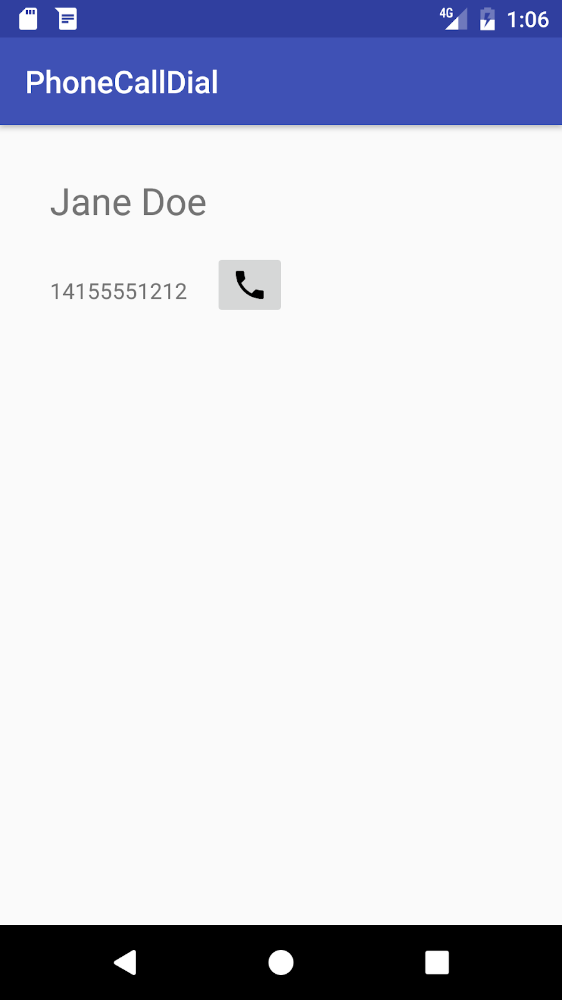
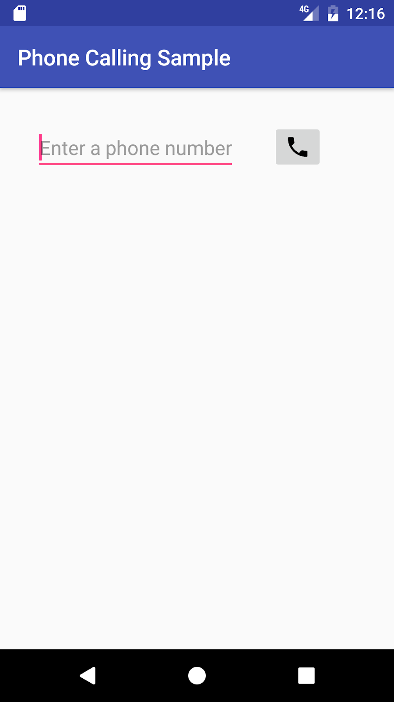
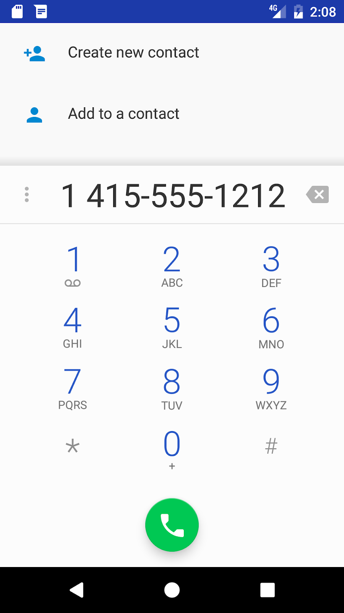
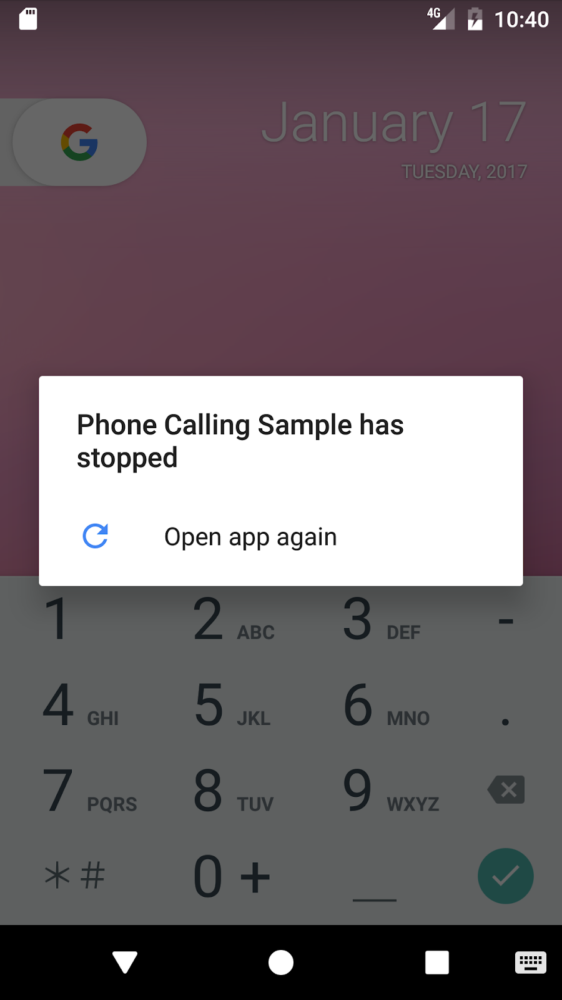
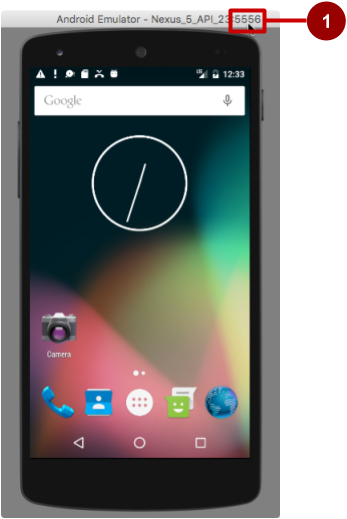
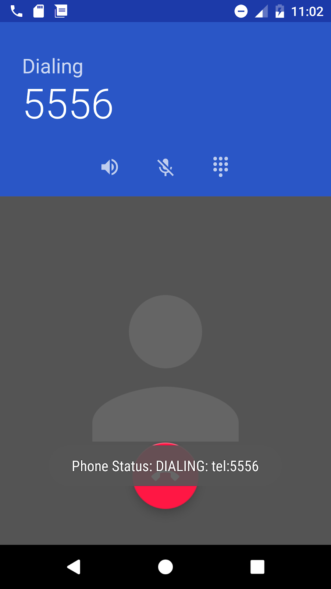
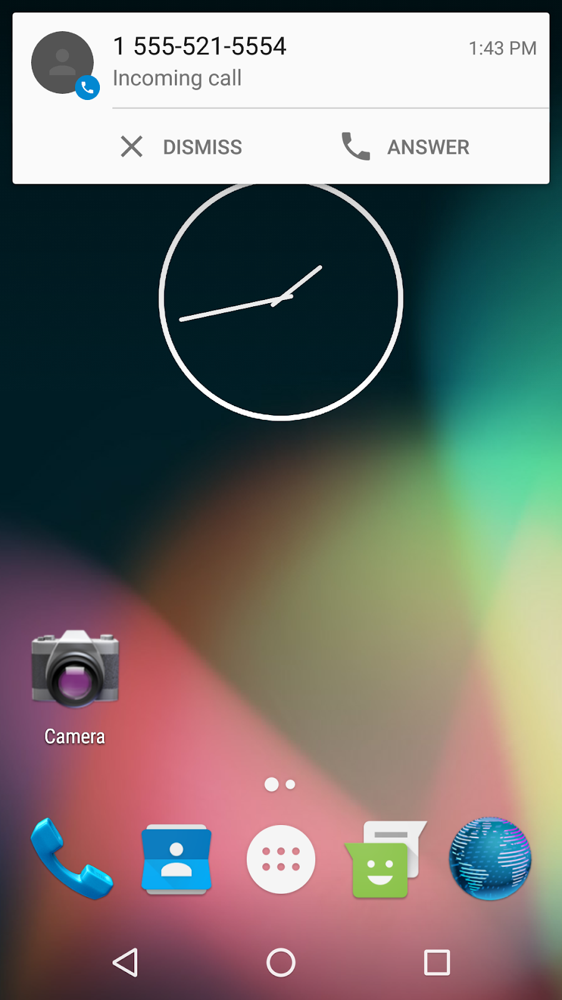
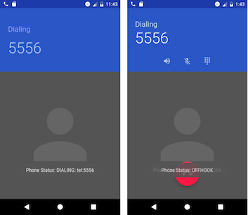
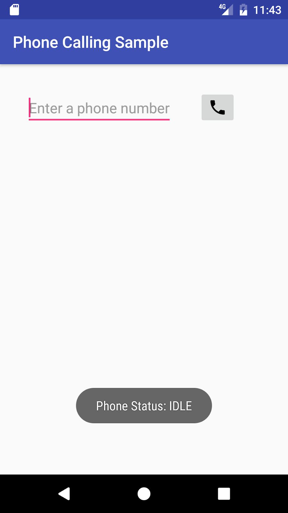

# P 03.1: Making Phone Calls


## Welcome


### Introduction

Android mobile devices with telephone/cellular service are pre-installed with a Phone app for making calls, which includes a dialer for dialing any phone number. You use an implicit  [`Intent`](https://developer.android.com/reference/android/content/Intent.html) to launch the Phone app from your app. You have two choices:

* Use  [`ACTION_DIAL`](https://developer.android.com/reference/android/content/Intent.html#ACTION_DIAL) to launch the Phone app independently from your app with the phone number displayed in the dialer. The user then makes the call in the Phone app. This is the preferred action for apps that don't have to monitor the phone's state.
* Use  [`ACTION_CALL`](https://developer.android.com/reference/android/content/Intent.html#ACTION_CALL) to launch the Phone app in the context of your app, making the call directly from your app, and monitoring the phone state. This action keeps the user within your app, without having to navigate back to the app. Your app must request permission from the user before making the call if the user hasn't already granted permission.

### What you should already know

* Create and run interactive apps in Android Studio.
* Work with XML layouts.
* Create an implicit intent to perform an action using another app.

### What you'll learn

* Pass a phone number to the Phone app's dialer.
* Perform a phone call within your app.
* Test to see if telephony services are enabled.
* Check for calling permission, and request permission if required.

### What you'll do

* Create an app that uses an implicit intent to launch the Phone app.
* Create another app that makes phone calls from within the app.
* Test to see if telephony services are enabled before enabling the app.
* Check for calling permission, which can change at any time.
* Request permission from the user, if necessary, to make the call.


## App overview


You will create two apps:

*  [`PhoneCallDial`](https://github.com/khammami/android-fundamentals-phone-sms/tree/master/PhoneCallDial): A basic app that uses an implicit intent to launch the Phone app with a hard-coded phone number for dialing. The Phone app makes the call. You could use this technique to provide a one-button dialer to custom support. In this lesson you will build a layout, shown in the figure below. It includes a `TextView` with a hard-coded phone number, and an `ImageButton` with an icon to launch the Phone app with that phone number in its dialer.



*  [`Phone Calling Sample`](https://github.com/khammami/android-fundamentals-phone-sms/tree/master/PhoneCallingSample): An app that secures permission, uses an implicit intent to make a phone call from the app, and uses the  [TelephonyManager](https://developer.android.com/reference/android/telephony/TelephonyManager.html) class to monitor the phone's state. You would use this technique if you want to keep the user within your app, without having to navigate back to the app. In this lesson, you modify the above layout to use an `EditText` so that users can enter the phone number. The layout looks like the figure below:




## Task 1: Send an intent with the phone number to dial


In this task you will create an app that uses an implicit intent to launch the Phone app to dial a given phone number. To send that intent, your app needs to prepare a Uniform Resource Identifier (URI) that is prefixed by "tel:" (for example `tel:14155551212`).

### 1.1 Create the app and layout

1. Create a project using the **Empty Activity** template and call it **PhoneCallDial**.
2. Add an icon for the call button by following these steps:

* Select the drawable/ folder in the Project: Android view and choose **File &gt; New &gt; Vector Asset**.
* Click the Android icon next to "Icon:" to choose an icon. To find a handset icon, choose **Communication** in the left column.
* Select the icon, click OK, click Next, and then click Finish.

3. Open the `activity_main.xml` layout file.

* Change the root view to RelativeLayout.
* In the "Hello World" `TextView` element, remove the `layout_constraint` attributes, if they are present.
* Change the `TextView` to show a dummy contact name, as if the app had retrieved the name from a contacts database and assigned it to a `TextView`:

```
<TextView
android:id="@+id/contact_name"
android:layout_width="wrap_content"
android:layout_height="wrap_content"
android:layout_margin="@dimen/activity_horizontal_margin"
android:textSize="24sp"
android:text="Jane Doe" />
```

4. Extract the strings and dimensions into resources:

* `24sp`: `contact_text_size` for the text size.
* `Jane Doe`: `contact_name` for the text.

5. Add another `TextView` for the phone number:

```
<TextView
    android:id="@+id/number_to_call"
    android:layout_width="wrap_content"
    android:layout_height="wrap_content"
    android:layout_margin="@dimen/activity_horizontal_margin"
    android:layout_below="@id/contact_name"
    android:text="14155551212" />
```


You will use the `android:id number_to_call` to retrieve the phone number.

6. After adding a hard-coded phone number string, extract it into the resource `phone_number`.
7. Add an `ImageButton` for initiating the call:

```
<ImageButton
    android:id="@+id/phone_icon"
    android:contentDescription="Make a call"
    android:layout_width="wrap_content"
    android:layout_height="wrap_content"
    android:layout_below="@id/contact"
    android:layout_toRightOf="@id/number_to_call"
    android:layout_toEndOf="@id/number_to_call"
    android:src="@drawable/ic_call_black_24dp"
    android:onClick="dialNumber"/>
```


Use the vector asset you added previously (for example `ic_call_black_24dp` for a phone handset icon) for the `android:src` attribute. You will use the `android:id @phone_icon` to refer to the button for dialing the phone.
The `dialNumber` method referred to in the `android:onClick` attribute remains highlighted until you create this method in the `MainActivity`, which you do in the next step.

8. After adding a hard-coded content description, extract it into the string resource `make_a_call`.
9. Click `dialNumber` in the `android:onClick` attribute, click the red light bulb that appears, and then select **Create dialNumber(View) in 'MainActivity'**. Android Studio automatically creates the `dialNumber()` method in **MainActivity** as `public`, returning `void`, with a `View` parameter. This method is called when the user taps the ImageButton.

```
public void dialNumber(View view) {
}
```

The layout should look something like the figure below.


The following is the complete code for the XML layout in `activity_main.xml`, including comments:

```
<RelativeLayout ...
    <!-- TextView for a dummy contact name from a contacts database -->
    <TextView
        android:id="@+id/contact_name"
        android:layout_width="wrap_content"
        android:layout_height="wrap_content"
        android:layout_margin="@dimen/activity_horizontal_margin"
        android:textSize="@dimen/contact_text_size"
        android:text="@string/contact" />

    <!-- TextView for a hard-coded phone number  -->
    <TextView
        android:id="@+id/number_to_call"
        android:layout_width="wrap_content"
        android:layout_height="wrap_content"
        android:layout_margin="@dimen/activity_horizontal_margin"
        android:layout_below="@id/contact_name"
        android:text="@string/phone_number" />

    <!-- The dialNumber() method will be called by this button.  -->
    <ImageButton
        android:id="@+id/phone_icon"
        android:contentDescription="@string/make_a_call"
        android:layout_width="wrap_content"
        android:layout_height="wrap_content"
        android:layout_below="@id/contact_name"
        android:layout_toRightOf="@id/number_to_call"
        android:layout_toEndOf="@id/number_to_call"
        android:src="@drawable/ic_call_black_24dp"
        android:onClick="dialNumber"/>
</RelativeLayout>
```

### 1.2 Edit the onClick method in MainActivity

1. In **MainActivity**, define a constant for the log tag.

```
public static final String TAG = MainActivity.class.getSimpleName();
```

2. Inside the `dialNumber()`method created in the previous section, create a reference to the `number_to_call` `TextView`:

```
public void dialNumber(View view) {
   TextView textView = (TextView) findViewById(R.id.number_to_call);
...
```

3. To create the phone number URI string `phoneNumber`, get the phone number from `textView` and use it with `String.format` to include the `tel:` prefix:

```
...
// Use format with "tel:" and phone number to create mPhoneNum.
String phoneNumber = String.format("tel: %s",
                                   textView.getText().toString());
...
```

4. Define an implicit intent (`dialIntent`) with the intent action `ACTION_DIAL`, and set the `phoneNumber` as data for the intent:

```
...
// Create the intent.
Intent dialIntent = new Intent(Intent.ACTION_DIAL);
// Set the data for the intent as the phone number.
dialIntent.setData(Uri.parse(phoneNumber));
...
```

5. To verify that an app exists to receive the intent, call  [resolveActivity()](https://developer.android.com/reference/android/content/pm/PackageManager.html#resolveActivity(android.content.Intent,%20int)) on your Intent object with  [getPackageManager()](https://developer.android.com/reference/android/content/Context.html#getPackageManager()) to get a PackageManager instance for finding package information. The `resolveActivity()` method determines the best action to perform for a given intent. If the result is non-null, there is at least one app that can handle the intent and it's safe to call `startActivity()`.

```
...
// If package resolves to an app, send intent.
if (dialIntent.resolveActivity(getPackageManager()) != null) {
     startActivity(dialIntent);
} else {
     Log.e(TAG, "Can't resolve app for ACTION_DIAL Intent.");
}
...
```

The full method should now look like the following:

```
public void dialNumber() {
    TextView textView = (TextView) findViewById(R.id.number_to_call);
    // Use format with "tel:" and phone number to create phoneNumber.
    String phoneNumber = String.format("tel: %s",
                                       textView.getText().toString());
    // Create the intent.
    Intent dialIntent = new Intent(Intent.ACTION_DIAL);
    // Set the data for the intent as the phone number.
    dialIntent.setData(Uri.parse(phoneNumber));
    // If package resolves to an app, send intent.
    if (dialIntent.resolveActivity(getPackageManager()) != null) {
        startActivity(dialIntent);
    } else {
        Log.e(TAG, "Can't resolve app for ACTION_DIAL Intent.");
    }
}
```

### 1.3 Run the app

You can run the app on either an emulator or a device:

1. Click or tap the phone icon. The dialer should appear with the phone number ready to use, as shown in the figure below:



2. The `phone_number` string holds a fixed number (1-415-555-1212). You can change the number in the Phone app's dialer before calling.
3. Use the **Back** button to return to the app. You may need to tap or click it two or three times to navigate backwards from the Phone app's dialer and Favorites list.

##### **Solution code**

Android Studio project:  [PhoneCallDial](https://github.com/khammami/android-fundamentals-phone-sms/tree/master/PhoneCallDial)


## Task 2: Make a phone call from within an app


In this task you will copy the **PhoneCallDial** app from the previous task, refactor and rename it to **PhoneCallingSample**, and modify its layout and code to create an app that enables a user to enter a phone number and perform the phone call from within your app.

In the first step you will add the code to make the call, but the app will work only if telephony is enabled, and if the app's permission for Phone is set manually in Settings on the device or emulator.

In subsequent steps you will do away with setting this permission manually by requesting phone permission from the user if it is not already granted. You will also add a telephony check to display a message if telephony is not enabled and code to monitor the phone state.

### 2.1 Create the app and add permission

1. Copy the **PhoneCallDial** project folder, rename the folder to **PhoneCallingSample**, and refactor the app to populate the new name throughout the app project. 
2. Add the following permission to the `AndroidManifest.xml` file after the first line (with the `package` definition) and before the `&lt;application&gt;` section:
 

```
<uses-permission android:name="android.permission.CALL_PHONE" />
```


Your app can't make a phone call without the `CALL_PHONE` permission line in `AndroidManifest.xml`. This permission line enables a setting for the app in the Settings app that gives the user the choice of allowing or disallowing use of the phone. (In the next task you will add a way for the user to grant that permission from within the app.)

### 2.2 Create the app layout

1. Open `activity_main.xml` to edit the layout.
2. Remove the `contact_name` `TextView`, and replace the `number_to_call` `TextView` with the following `EditText` view:

```
<EditText
    android:id="@+id/editText_main"
    android:layout_width="wrap_content"
    android:layout_height="wrap_content"
    android:layout_margin="@dimen/activity_horizontal_margin"
    android:inputType="phone"
    android:hint="Enter a phone number" />
```

3. After adding a hard-coded string for the `android:hint` attribute, extract it into the string resource `enter_phone`, and note the following:

* You will use the `android:id` for the `EditText` view in your code to retrieve the phone number.
* The `EditText` view uses the `android:inputType` attribute set to `"phone"` for a phone-style numeric keypad.

4. Change the `ImageButton` as follows:

1. Change the `android:layout_below`, `android:layout_toRightOf`, and `android:layout_toEndOf` attributes to refer to `editText_main`.
2. Add the `android:visibility` attribute set to `visible`. You will control the visibility of this `ImageButton` from your code.
3. Change the `android:onClick` method to `callNumber`. This will remain highlighted until you add that method to `MainActivity`.

```
<ImageButton
  android:id="@+id/phone_icon"
  android:contentDescription="@string/make_a_call"
  android:layout_width="wrap_content"
  android:layout_height="wrap_content"
  android:layout_margin="@dimen/activity_horizontal_margin"
  android:layout_toRightOf="@id/editText_main"
  android:layout_toEndOf="@id/editText_main"
  android:src="@drawable/ic_call_black_24dp"
  android:visibility="visible"
  android:onClick="callNumber"/>
```

5. Add the following Button at the end of the layout, before the ending `&lt;/RelativeLayout&gt;` tag:

```
<Button
    android:id="@+id/button_retry"
    android:layout_width="wrap_content"
    android:layout_height="wrap_content"
    android:contentDescription="Retry"
    android:layout_below="@id/editText_main"
    android:text="Retry"
    android:visibility="invisible"/>
</RelativeLayout>
```

6. After adding a hard-coded string `"Retry"` for the `android:contentDescription` attribute, extract it into the string resource retry, and then replace the hard-coded string in the `android:text` attribute to `"@string/retry"`.
7. Note the following:

* You will refer to the `android:id` `button_retry` in your code.
* Make sure you include the `android:visibility` attribute set to `"invisible"`. It should appear only if the app detects that telephony is not enabled, or if the user previously denied phone permission when the app requested it.

Your app's layout should look like the following figure (the `button_retry` Button is invisible):


### 2.3 Change the onClick method in MainActivity

1. In `MainActivity`, refactor and rename the `dialNumber()` method to call it `callNumber()`.
2. Change the first statement, which referred to a `TextView`, to use an `EditText` view:

```
public void callNumber(View view) {
  EditText editText = (EditText) findViewById(R.id.editText_main);
  ...
}
```

3. Change the next statement to get the phone number from the `EditText` view (`editText`) to create the phone number URI string `phoneNumber`:

```
// Use format with "tel:" and phone number to create phoneNumber.
String phoneNumber = String.format("tel: %s",
                                     editText.getText().toString());
```

4. Before the intent, add code to show a log message and a toast message with the phone number:

```
// Log the concatenated phone number for dialing.
Log.d(TAG, "Phone Status: DIALING: " + phoneNumber);
Toast.makeText(this,
              "Phone Status: DIALING: " + phoneNumber,
              Toast.LENGTH_LONG).show();
```

5. Extract `"Phone Status: DIALING: "` to a string resource (`dial_number`). Replace the second use of the string in the `Toast.makeText()` statement to `getString(R.string.dial_number)`.
6. Refactor and rename the `dialIntent` implicit intent to `callIntent`, and replace `ACTION_DIAL` with `ACTION_CALL`. As a result, the statements should now look like this:

```
...
// Create the intent.
Intent callIntent = new Intent(Intent.ACTION_CALL);
// Set the data for the intent as the phone number.
callIntent.setData(Uri.parse(phoneNumber));
// If package resolves to an app, send intent.
if (callIntent.resolveActivity(getPackageManager()) != null) {
   startActivity(callIntent);
} else {
   Log.e(TAG, "Can't resolve app for ACTION_CALL Intent.");
}
...
```

The full method should now look like the following:

```
public void callNumber() {
    EditText editText = (EditText) findViewById(R.id.editText_main);
    // Use format with "tel:" and phone number to create phoneNumber.
    String phoneNumber = String.format("tel: %s",
                                         editText.getText().toString());
    // Log the concatenated phone number for dialing.
    Log.d(TAG, getString(R.string.dial_number) + phoneNumber);
    Toast.makeText(this,
                  getString(R.string.dial_number) + phoneNumber,
                  Toast.LENGTH_LONG).show();
    // Create the intent.
    Intent callIntent = new Intent(Intent.ACTION_CALL);
    // Set the data for the intent as the phone number.
    callIntent.setData(Uri.parse(phoneNumber));
    // If package resolves to an app, send intent.
    if (callIntent.resolveActivity(getPackageManager()) != null) {
        startActivity(callIntent);
    } else {
        Log.e(TAG, "Can't resolve app for ACTION_CALL Intent.");
    }
}
```

### 2.4 Run the app

When you run the app, the app may crash with the following screen depending on whether the device or emulator has been previously set to allow the app to make phone calls:



In some versions of Android, this permission is turned on by default. In others, this permission is turned off by default.

To set the app's permission on a device or emulator instance, perform the function that a user would perform: choose **Settings &gt; Apps &gt; Phone Calling Sample &gt; Permissions** on the device or emulator, and turn on the Phone permission for the app. Since the user can turn on or off Phone permission at any time, you have to add a check in your app for this permission, and request it from the user if required. You will do this in the next task.

If you don't have cellular service on your device, or if telephony is not enabled, you can test the app using two emulator instances—one emulator instance calls the other one. Follow these steps:

1. To launch an emulator directly from the AVD Manager, choose **Tools &gt; Android &gt; AVD Manager**.
2. Double-click a predefined device. Note the number that appears in the emulator's window title on the far right, as shown in the figure below as #1 (5556). This is the port number of the emulator instance.



3. Open the Android Studio project for the app, if it isn't already open.
4. Run the app, but choose another emulator—not the one that is already running. Android Studio launches the other emulator.
5. In the app, enter the port number of the other emulator rather than a real phone number.
6. Click the call button in the app. The emulator shows the phone call starting up, as shown in the figure below.



The other emulator instance should now be receiving the call, as shown in the figure below:



7. Click **Answer** or **Dismiss** on the emulator receiving the call. If you click **Answer**, also click the red **Hang-up** button to end the call.


## Task 3: Check for telephony service and request permission


If telephony features are not enabled for a device, your app should detect that and disable the phone features.

In addition, your app must always get permission to use anything that is not part of the app itself. In the previous task you added the following permission to the `AndroidManifest.xml` file:

```
<uses-permission android:name="android.permission.CALL_PHONE" />
```

This statement enables a permission setting for this app in Settings. The user can allow or disallow this permission at any time in Settings. You can add code to request permission if the user has turned off phone permission.

### 3.1 Check if telephony services are enabled

1. Open the Android Studio project for the **PhoneCallingSample** app, if it isn't already open.
2. At the top of `MainActivity` below the class definition, define a variable for the  [TelephonyManager](https://developer.android.com/reference/android/telephony/TelephonyManager.html) class object:

```
private TelephonyManager mTelephonyManager;
```

3. Add the following statement to `onCreate()` method in `MainActivity` to use the string constant `TELEPHONY_SERVICE` with `getSystemService()` and assign it to `mTelephonyManager`. This gives you access to some of the telephony features of the device.

```
@Override
protected void onCreate(Bundle savedInstanceState) {
   super.onCreate(savedInstanceState);
   setContentView(R.layout.activity_main);
   // Create a telephony manager.
   mTelephonyManager = (TelephonyManager)
                              getSystemService(TELEPHONY_SERVICE);
```

4. Create a method in `MainActivity` to check if telephony is enabled:

```
private boolean isTelephonyEnabled() {
      if (mTelephonyManager != null) {
          if (mTelephonyManager.getSimState() ==
                                TelephonyManager.SIM_STATE_READY) {
              return true;
          }
      }
      return false;
  }
```

5. Call the above method in the `onCreate()` method, right after assigning `mTelephonyManager`, in an if statement to take action if telephony is enabled. The action should be to log a message (to show that telephony is enabled), and include a comment about checking permission, which you will add in the next step. If telephony is not enabled, display a toast message, log a message, and disable the call button:

```
@Override
protected void onCreate(Bundle savedInstanceState) {
  ...    
  mTelephonyManager = (TelephonyManager)
                    getSystemService(TELEPHONY_SERVICE);
  if (isTelephonyEnabled()) {
       Log.d(TAG, "Telephony is enabled");
       // ToDo: Check for phone permission.
       // ToDo: Register the PhoneStateListener.
  } else {
       Toast.makeText(this,
                    "TELEPHONY NOT ENABLED! ",
                    Toast.LENGTH_LONG).show();
       Log.d(TAG, "TELEPHONY NOT ENABLED! ");
       // Disable the call button
       disableCallButton();
  }
}
```

6. Extract the hard-coded strings in the above code to string resources:

* `"Telephony is enabled"`: `telephony_enabled`
* `"TELEPHONY NOT ENABLED! "`: `telephony_not_enabled`

7. Create the `disableCallButton()` method in `MainActivity`, and code to:

* Display a toast to notify the user that the phone feature is disabled.
* Find and then set the call button to be invisible so that the user can't make a call.
* If telephony is enabled (but the phone permission has not been granted), set the **Retry** button to be visible, so that the user can start the activity again and allow permission.

```
private void disableCallButton() {
  Toast.makeText(this,
            "Phone calling disabled", Toast.LENGTH_LONG).show();
  ImageButton callButton = (ImageButton) findViewById(R.id.phone_icon);
  callButton.setVisibility(View.INVISIBLE);
  if (isTelephonyEnabled()) {
      Button retryButton = (Button) findViewById(R.id.button_retry);
      retryButton.setVisibility(View.VISIBLE);
  }
}
```

8. Extract a string resource (`phone_disabled`) for the hard-coded string "Phone calling disabled" in the toast statement.
9. Create an `enableCallButton()` method in `MainActivity` that finds and then sets the call button to be visible:

```
private void enableCallButton() {
  ImageButton callButton = (ImageButton) findViewById(R.id.phone_icon);
  callButton.setVisibility(View.VISIBLE);
}
```

10. Create the `retryApp()` method in MainActivity that will be called when the user clicks the visible **Retry** button. Add code to:

* Call `enableCallButton()` to enable the call button.
* Create an intent to start (in this case, restart) the activity.

```
public void retryApp(View view) {
   enableCallButton();
   Intent intent = getPackageManager()
            .getLaunchIntentForPackage(getPackageName());
   startActivity(intent);
}
```

11. Add the `android:onClick` attribute to the **Retry** button to call retryApp:

```
<Button
   ...
   android:id="@+id/button_retry"
   ...
   android:onClick="retryApp"/>
```

### 3.2 Request permission for phone calling

1. At the top of `MainActivity` below the class definition, define a global constant for the call-phone permission request code, and set it to 1:

```
private static final int MY_PERMISSIONS_REQUEST_CALL_PHONE = 1;
```

Why the integer 1? Each permission request needs three parameters: the context, a string array of permissions, and an integer `requestCode`. The `requestCode` is a code attached to the request, and can be any integer that suits your use case. When a result returns back to the activity, it contains this code and uses it to differentiate multiple permission results from each other.

2. In MainActivity, create a private method called `checkForPhonePermission` to check for `CALL_PHONE` permission, which returns `void`. You put this code in a separate method because you will use it more than once:

```
private void checkForPhonePermission() {
  if (ActivityCompat.checkSelfPermission(this,
                    Manifest.permission.CALL_PHONE) !=
                    PackageManager.PERMISSION_GRANTED) {
  Log.d(TAG, "PERMISSION NOT GRANTED!");
  ActivityCompat.requestPermissions(this,
                    new String[]{Manifest.permission.CALL_PHONE},
                    MY_PERMISSIONS_REQUEST_CALL_PHONE);
  } else {
      // Permission already granted. Enable the call button.
      enableCallButton();
  }
}
```

3. Use  [`checkSelfPermission()`](https://developer.android.com/reference/android/support/v4/content/ContextCompat.html#checkSelfPermission(android.content.Context,%20java.lang.String)) to determine whether your app has been granted a particular permission by the user. If permission has not been granted by the user, use the  [`requestPermissions()`](https://developer.android.com/reference/android/support/v4/app/ActivityCompat.html#requestPermissions(android.app.Activity,%20java.lang.String[],%20int)) method to display a standard dialog for the user to grant permission.
4. When your app calls  [`requestPermissions()`](https://developer.android.com/reference/android/support/v4/app/ActivityCompat.html#requestPermissions(android.app.Activity,%20java.lang.String[],%20int)), the system shows a standard dialog to the user, as shown in the figure below.

5. Extract the hard-coded string `"PERMISSION NOT GRANTED!"` in the above code to the string resource `permission_not_granted`.
6. In the `onCreate()` method after checking to see if telephony is enabled, add a call to `checkForPhonePermission()`:

```
@Override
protected void onCreate(Bundle savedInstanceState) {
...
if (isTelephonyEnabled()) {
    // Check for phone permission.
    checkForPhonePermission();
    // ToDo: Register the PhoneStateListener.
    ...
```

7. When the user responds to the request permission dialog, the system invokes your app's  [`onRequestPermissionsResult()`](https://developer.android.com/reference/android/support/v4/app/ActivityCompat.OnRequestPermissionsResultCallback.html#onRequestPermissionsResult(int,%20java.lang.String[],%20int[])) method, passing it the user response. Override that method to find out whether the permission was granted:

```
@Override
public void onRequestPermissionsResult(int requestCode,
                String permissions[], int[] grantResults) {
   // Check if permission is granted or not for the request.
   ...
}
```

8. For your implementation of `onRequestPermissionsResult()`, use a `switch` statement with each `case` based on the value of `requestCode`. Use one `case` to check if the permission is the one you defined as `MY_PERMISSIONS_REQUEST_CALL_PHONE`:

```
...
// Check if permission is granted or not for the request.
switch (requestCode) {
    case MY_PERMISSIONS_REQUEST_CALL_PHONE: {
        if (permissions[0].equalsIgnoreCase
                    (Manifest.permission.CALL_PHONE)
                    && grantResults[0] ==
                    PackageManager.PERMISSION_GRANTED) {
            // Permission was granted.
        } else {
            // Permission denied.
            Log.d(TAG, "Failure to obtain permission!");
            Toast.makeText(this,
                        "Failure to obtain permission!",
                        Toast.LENGTH_LONG).show();
            // Disable the call button
            disableCallButton();
        }
    }
}
```

9. Extract the hard-coded string `"Failure to obtain permission!"` in the above code to the string resource `failure_permission`, and note the following:

* The user's response to the request dialog is returned in the `permissions` array (index 0 if only one permission is requested in the dialog). The code snippet above compares this to the corresponding grant result, which is either `PERMISSION_GRANTED` or `PERMISSION_DENIED`.
* If the user denies a permission request, your app should take appropriate action. For example, your app might disable the functionality that depends on this permission and show a dialog explaining why it could not perform it. For now, log a debug message, display a toast to show that permission was not granted, and disable the call button with `disableCallButton()`.

### 3.3 Run the app and test permission

1. Run the app once. After running the app, turn off the Phone permission for the app on your device or emulator so that you can test the permission-request function:

* Choose **Settings &gt; Apps &gt; Phone Calling Sample &gt; Permissions** on the device or emulator.
* Turn off the Phone permission for the app.

2. Run the app again. You should see the request dialog in the figure in the previous section.

* Tap **Deny** to deny permission. The app should display a toast message showing the failure to gain permission, and the **Retry** button. The phone icon should disappear.
* Tap **Retry**, and when the request dialog appears, tap **Allow**. The phone icon should reappear. Test the app's ability to make a phone call.

Since the user might turn off Phone permission while the app is still running, add the same permission check method to the `callNumber()` method—after the intent resolves to a package, as shown below—to check for permission right before making a call:

```
// If package resolves to an app, check for phone permission,
// and send intent.
if (callIntent.resolveActivity(getPackageManager()) != null) {
   checkForPhonePermission();
   startActivity(callIntent);
} else {
   Log.e(TAG, "Can't resolve app for ACTION_CALL Intent");
}
```

3. Run the app. If the user changes the Phone permission for the app while the app is running, the request dialog appears again for the user to **Allow** or **Deny** the permission.

* Click **Allow** to test the app's ability to make a phone call. The app should make the call without a problem.
* Jump to the Settings app to turn off Phone permission for the app (the app should still be running):

a) Choose **Settings &gt; Apps &gt; Phone Calling Sample &gt; Permissions** on the device or emulator.

b) Turn off the Phone permission for the app.

* Go back to the app and try to make a call. The request dialog should appear again. This time, Click **Deny** to deny permission to make a phone call. The app should display a toast message showing the failure to gain permission, and the **Retry** button. The phone icon should disappear.


## Task 4: Monitor the phone state


You can monitor the phone state with  [PhoneStateListener](https://developer.android.com/reference/android/telephony/PhoneStateListener.html), which monitors changes in specific telephony states. You can then show the user the state in a toast message, so that the user can see if the phone is idle or off the hook.

When the phone call finishes and the phone switches to the idle state, your app's activity resumes if the app is running on KitKat (version 19) or newer versions. However, if the app is running on a version of Android older than KitKat (version 19), the Phone app remains active. You can check the phone state and restart the activity if the state is idle.

To use PhoneStateListener, you need to register a listener object using the  [TelephonyManager](https://developer.android.com/reference/android/telephony/TelephonyManager.html) class, which provides access to information about the telephony services on the device. Create a new class that extends PhoneStateListener to perform actions depending on the phone state. You can then register the listener object in the `onCreate()` method of the activity, using the TelephonyManager class.

### 4.1 Set the permission and logging tag

1. Open the Android Studio project for the **PhoneCallingSample** app, if it isn't already open.
2. Add the following `READ_PHONE_STATE` permission to the `AndroidManifest.xml` file after after the `CALL_PHONE` permission, and before the `&lt;application&gt;` section:

```
  <uses-permission android:name="android.permission.CALL_PHONE" />
  <uses-permission android:name="android.permission.READ_PHONE_STATE" />
```

3. Monitoring the state of a phone call is permission-protected. This permission is in addition to the `CALL_PHONE` permission.

### 4.2 Create a class that extends PhoneStateListener

1. To create a listener object and listen to the phone state, create a private inner class called `MyPhoneCallListener` in `MainActivity` that extends `PhoneStateListener`.

```
private class MyPhoneCallListener extends PhoneStateListener {
...
}
```

2. Within this class, implement the  [`onCallStateChanged()`](https://developer.android.com/reference/android/telephony/PhoneStateListener.html#onCallStateChanged(int,%20java.lang.String)) method of `PhoneStateListener` to take actions based on the phone state. The code below uses a `switch` statement with constants of the  [TelephonyManager](https://developer.android.com/reference/android/telephony/TelephonyManager.html) class to determine which of three states the phone is in: `CALL_STATE_RINGING`, `CALL_STATE_OFFHOOK`, and `CALL_STATE_IDLE`:

```
@Override
public void onCallStateChanged(int state, String incomingNumber) {
  switch (state) {
      case TelephonyManager.CALL_STATE_RINGING:
          // Incoming call is ringing (not used for outgoing call).
          break;
      case TelephonyManager.CALL_STATE_OFFHOOK:
          // Phone call is active -- off the hook.
          break;
      case TelephonyManager.CALL_STATE_IDLE:
          // Phone is idle before and after phone call.
          break;
      default:
          // Must be an error. Raise an exception or just log it.
          break;
  }
}
```

3. Just above the `switch (state)` line, create a `String` called `message` to use in a toast as a prefix for the phone state:

```
...
// Define a string for the message to use in a toast.
String message = "Phone Status: ";
switch (state) { ...
```

4. Extract the string `"Phone Status: "` to the string resource `phone_status`.
5. For the `CALL_STATE_RINGING` state, assemble a message for logging and displaying a toast with the incoming phone number:

```
...
switch (state) {
  case TelephonyManager.CALL_STATE_RINGING:
       // Incoming call is ringing (not used for outgoing call).
       message = message + "RINGING, number: " + incomingNumber;
       Toast.makeText(MainActivity.this, message,
                         Toast.LENGTH_SHORT).show();
       Log.i(TAG, message);
       break;
  ...
```

6. Extract `"RINGING, number: "` to the string resource `ringing`.
7. Add a boolean `returningFromOffHook`, set to `false`, at the top of the `MyPhoneCallListener` declaration, in order to use it with the the `CALL_STATE_OFFHOOK` state:

```
private class MyPhoneCallListener extends PhoneStateListener {
   private boolean returningFromOffHook = false;
   ...
}
```

**Tip**: An app running on Android versions prior to KitKat (version 19) doesn't resume when the phone state returns to `CALL_STATE_IDLE` from `CALL_STATE_OFFHOOK` at the end of a call. The boolean `returningFromOffHook` is used as a flag, and set to true when the state is `CALL_STATE_OFFHOOK`, so that when the state is back to `CALL_STATE_IDLE`, the flag designates an end-of-call in order to restart the app's activity.

8. For the `CALL_STATE_OFFHOOK` state, assemble a message for logging and displaying a toast, and set the `returningFromOffHook` boolean to `true`.

```
...
switch (state) {
     case TelephonyManager.CALL_STATE_OFFHOOK:
               // Phone call is active -- off the hook.
               message = message + "OFFHOOK";
               Toast.makeText(MainActivity.this, message,
                                    Toast.LENGTH_SHORT).show();
               Log.i(TAG, message);
               returningFromOffHook = true;
               break;
     ...
```

9. Extract `"OFFHOOK"` to the string resource `offhook`.
10. For the `CALL_STATE_IDLE` state, log and display a toast, and check if `returningFromOffHook` is `true`; if so, restart the activity if the version of Android is earlier than KitKat.

```
...
switch (state) {
        case TelephonyManager.CALL_STATE_IDLE:
           // Phone is idle before and after phone call.
           // If running on version older than 19 (KitKat),
           // restart activity when phone call ends.
           message = message + "IDLE";
           Toast.makeText(MainActivity.this, message,
                              Toast.LENGTH_SHORT).show();
           Log.i(TAG, message);
           if (returningFromOffHook) {
               // No need to do anything if >= version KitKat.
               if (Build.VERSION.SDK_INT < Build.VERSION_CODES.KITKAT) {
                   Log.i(TAG, "Restarting app");
                   // Restart the app.
                   Intent intent = getPackageManager()
                       .getLaunchIntentForPackage(
                       .getPackageName());
                    intent.addFlags
                       (Intent.FLAG_ACTIVITY_CLEAR_TOP);
                    startActivity(intent);
               }
            }
            break;
          ...
```

If the app is running on KitKat (version 19) or newer versions, there is no need to restart the activity after the phone call ends. But if the app is running on a version of Android older than KitKat (version 19), the code must restart the current activity so that the user can return to the app after the call ends.
**Tip**: The code also sets  [`FLAG_ACTIVITY_CLEAR_TOP`](https://developer.android.com/reference/android/content/Intent.html#FLAG_ACTIVITY_CLEAR_TOP) so that instead of launching a new instance of the current activity, any other activities on top of the current activity are closed and an intent is delivered to the (now on top) current activity. This flag helps you manage a stack of activities in an app.

11. Extract `"IDLE"` to the string resource `idle`, and extract "Restarting app" to the string resource `restarting_app`.

The code below shows the entire `onCallStateChanged()` method:

```
...
@Override
public void onCallStateChanged(int state, String incomingNumber) {
    // Define a string for the message to use in a toast.
    String message = getString(R.string.phone_status);
    switch (state) {
        case TelephonyManager.CALL_STATE_RINGING:
            // Incoming call is ringing (not used for outgoing call).
            message = message +
                            getString(R.string.ringing) + incomingNumber;
            Toast.makeText(MainActivity.this, message,
                            Toast.LENGTH_SHORT).show();
            Log.i(TAG, message);
            break;
        case TelephonyManager.CALL_STATE_OFFHOOK:
            // Phone call is active -- off the hook.
            message = message + getString(R.string.offhook);
            Toast.makeText(MainActivity.this, message,
                            Toast.LENGTH_SHORT).show();
            Log.i(TAG, message);
            returningFromOffHook = true;
            break;
        case TelephonyManager.CALL_STATE_IDLE:
            // Phone is idle before and after phone call.
            // If running on version older than 19 (KitKat),
            // restart activity when phone call ends.
            message = message + getString(R.string.idle);
            Toast.makeText(MainActivity.this, message,
                            Toast.LENGTH_SHORT).show();
            Log.i(TAG, message);
            if (returningFromOffHook) {
                // No need to do anything if >= version KitKat.
                if (Build.VERSION.SDK_INT < Build.VERSION_CODES.KITKAT) {
                    Log.i(TAG, getString(R.string.restarting_app));
                    // Restart the app.
                    Intent intent = getPackageManager()
                                    .getLaunchIntentForPackage(
                                    .getPackageName());
                    intent.addFlags(Intent.FLAG_ACTIVITY_CLEAR_TOP);
                    startActivity(intent);
                }
            }
            break;
        default:
            message = message + "Phone off";
            Toast.makeText(MainActivity.this, message,
                                    Toast.LENGTH_SHORT).show();
            Log.i(TAG, message);
            break;
    }
}
...
```

### 4.3 Register the PhoneStateListener

1. At the top of MainActivity below the class definition, define a variable for the  [PhoneStateListener](https://developer.android.com/reference/android/telephony/PhoneStateListener.html):

```
private MyPhoneCallListener mListener;
```

2. In the `onCreate()` method, add the following code after checking for telephony and permission:

```
...
if (isTelephonyEnabled()) {
   ...
   checkForPhonePermission();
   // Register the PhoneStateListener to monitor phone activity.
   mListener = new MyPhoneCallListener();
   telephonyManager.listen(mListener,
                PhoneStateListener.LISTEN_CALL_STATE);
} else { ...
```

3. You must also unregister the listener in the activity's  [`onDestroy()`](https://developer.android.com/reference/android/app/Activity.html#onDestroy()) method. Override the `onDestroy()` method by adding the following code:

```
@Override
protected void onDestroy() {
   super.onDestroy();
   if (isTelephonyEnabled()) {
       telephonyManager.listen(mListener,
                            PhoneStateListener.LISTEN_NONE);
   }
}
```

### 4.4 Run the app

1. Run the app. If the user changes the Phone permission for the app while the app is running, the request dialog appears again for the user to **Allow** or **Deny** the permission. Click **Allow** to test the app's ability to make a phone call.
2. After entering a phone number and clicking the call button, the emulator or device shows the phone call starting up, as shown in the figure below. A toast message appears showing the phone number (left side of figure), and the toast message changes to show a new status of `"OFFHOOK"` (right side of figure) after the call has started.



3. The other emulator instance or device should now be receiving the call, as shown in the figure below. Click **Answer** or **Dismiss** on the device or emulator receiving the call.


4. If you click **Answer**, be sure to also click the red **Hang-up** button to finish the call, as shown in the figure below.


After you hang up, the app should reappear with a toast message showing that the phone is now in the idle state, as shown in the figure below.



### Solution code

Android Studio project:  [PhoneCallingSample](https://github.com/khammami/android-fundamentals-phone-sms/tree/master/PhoneCallingSample)


## Coding challenge


Note: All coding challenges are optional and are not prerequisites for later lessons.

### Challenge

1. Use the  [normalizeNumber()](https://developer.android.com/reference/android/telephony/PhoneNumberUtils.html#normalizeNumber(java.lang.String)) method in the  [PhoneNumberUtils](https://developer.android.com/reference/android/telephony/PhoneNumberUtils.html) class to remove characters other than digits from the phone number after the user has entered it. This method was added to API level 21. If you need your app to run on older versions, include a check for the version that uses the  [normalizeNumber()](https://developer.android.com/reference/android/telephony/PhoneNumberUtils.html#normalizeNumber(java.lang.String)) method only if the version is older than Lollipop. Your app already uses a log statement to show the phone number as dialed, so if the user enters "1-415-555-1212" the log message should show that the number was normalized:

```console
D/MainActivity: Phone Status: DIALING: tel: 14155551212
```

2. Add an invisible `TextView` to the **PhoneCallingSample** app. This `TextView` should appear below the invisible **Retry** button, but only when the phone is ringing (indicating an incoming call), and it should show the phone number of the caller.

If you have both emulators open as described previously, install the app on both emulators. You can then test an incoming call by using the app on one emulator to call the other emulator.

**Tip**: You can also emulate receiving a call by clicking the ... (More) icon at the bottom of the emulator's toolbar on the right side. Click **Phone** in the left column to see the extended phone controls, and click **Call Device** to call the emulator.

Android Studio project:  [PhoneCallingSampleChallenge](https://github.com/khammami/android-fundamentals-phone-sms/tree/master/PhoneCallingSampleChallenge)


## Summary


* To send an intent to the Phone app with a phone number, your app needs to prepare a URI for the phone number as a string prefixed by "tel:" (for example tel:14155551212).
* To dial a phone number, create an implicit intent with `ACTION_DIAL`, and set the phone number URI as the data for the intent with `setData()`:

```
Intent callIntent = new Intent(Intent.ACTION_DIAL);
callIntent.setData(Uri.parse(phoneNumber));
```

* For phone permission, add the following to the `AndroidManifest.xml` file:

```
<uses-permission android:name="android.permission.CALL_PHONE" />
```

* To make a phone call, create an implicit intent with `ACTION_CALL`, and set the phone number URI as the data for the intent with `setData()`:

```
Intent callIntent = new Intent(Intent.ACTION_CALL);
callIntent.setData(Uri.parse(phoneNumber));
```

* To check if telephony is enabled, use the string constant  [`TELEPHONY_SERVICE`](https://developer.android.com/reference/android/content/Context.html#TELEPHONY_SERVICE) with  [`getSystemService()`](https://developer.android.com/reference/android/content/Context.html#getSystemService(java.lang.String)) to retrieve a  [TelephonyManager](https://developer.android.com/reference/android/telephony/TelephonyManager.html), which gives you access to telephony features.
* Use  [`checkSelfPermission()`](https://developer.android.com/reference/android/support/v4/content/ContextCompat.html#checkSelfPermission(android.content.Context,%20java.lang.String)) to determine whether your app has been granted a particular permission by the user. If permission has not been granted, use the  [`requestPermissions()`](https://developer.android.com/reference/android/support/v4/app/ActivityCompat.html#requestPermissions(android.app.Activity,%20java.lang.String[],%20int)) method to display a standard dialog for the user to grant permission.
* To monitor the phone state with  [PhoneStateListener](https://developer.android.com/reference/android/telephony/PhoneStateListener.html), register a listener object using the  [TelephonyManager](https://developer.android.com/reference/android/telephony/TelephonyManager.html) class.
* For phone monitoring permission, add the following to the `AndroidManifest.xml` file:

```
<uses-permission android:name="android.permission.READ_PHONE_STATE" />
```

* To monitor phone states, create a private class that extends  [PhoneStateListener](https://developer.android.com/reference/android/telephony/PhoneStateListener.html), and override the  [`onCallStateChanged()`](https://developer.android.com/reference/android/telephony/PhoneStateListener.html#onCallStateChanged(int,%20java.lang.String)) method of PhoneStateListener to take different actions based on the phone state: `CALL_STATE_RINGING`, `CALL_STATE_OFFHOOK`, or `CALL_STATE_IDLE`.


## Learn more


Android developer documentation:

*  [Common Intents](https://developer.android.com/guide/components/intents-common.html)
*  [TelephonyManager](https://developer.android.com/reference/android/telephony/TelephonyManager.html)
*  [PhoneStateListener](https://developer.android.com/reference/android/telephony/PhoneStateListener.html)
*  [Requesting Permissions at Run Time](https://developer.android.com/training/permissions/requesting.html)
*  [checkSelfPermission](https://developer.android.com/reference/android/support/v4/content/ContextCompat.html#checkSelfPermission(android.content.Context,%20java.lang.String))
*  [Run Apps on the Android Emulator](https://developer.android.com/studio/run/emulator.html)
*  [Intents and Intent Filters](http://developer.android.com/guide/components/intents-filters.html)
*  [Intent](http://developer.android.com/reference/android/content/Intent.html)

Stack Overflow:

*  [How to format a phone number using PhoneNumberUtils?](http://stackoverflow.com/questions/6106859/how-to-format-a-phone-number-using-phonenumberutils)
*  [How to make phone call using intent in android?](http://stackoverflow.com/questions/4275678/how-to-make-phone-call-using-intent-in-android)
*  [Ringing myself using android emulator](http://stackoverflow.com/questions/2577785/ringing-myself-using-android-emulator)
*  [Fake Incoming Call Android](http://stackoverflow.com/questions/4964703/fake-incoming-call-android)
*  [Simulating incoming call or sms in Android Studio](http://stackoverflow.com/questions/27638462/simulating-incoming-call-or-sms-in-android-studio)

Other:

* User (beginner) tutorial:  [How to Make Phone Calls with Android](http://www.beginandroid.com/phonecall.shtml)
* Developer Video:  [How to Make a Phone Call](https://youtu.be/3PHDcQOGFtg)


