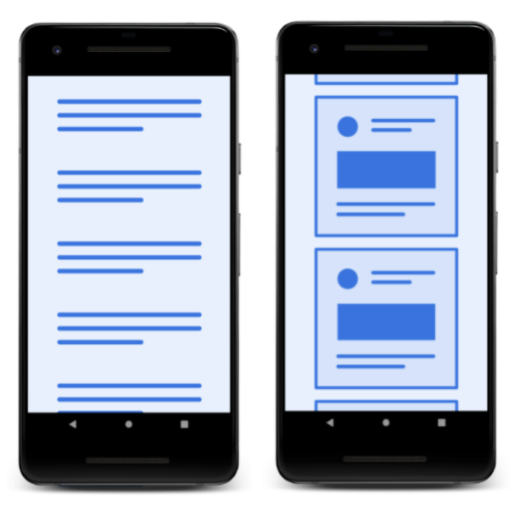
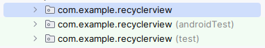
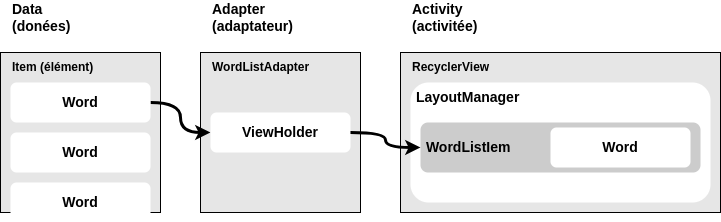
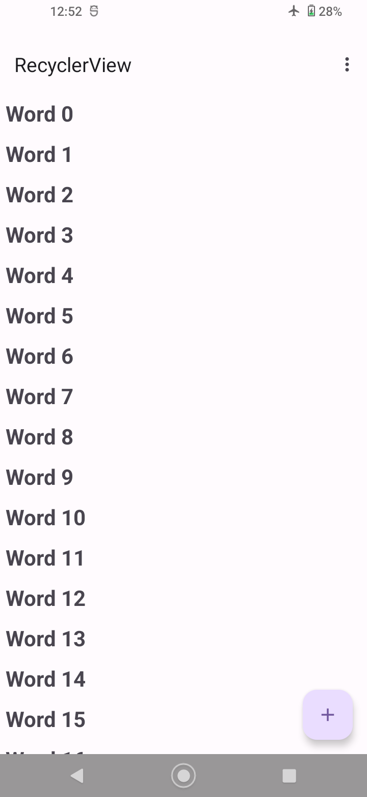

# TP 03.2: RecyclerView

[Codelab Feedback](https://github.com/khammami/codelabs-enetcom/issues)


## Bienvenue


Ces travaux pratiques se base sur le cours de base pour les développeurs Android fourni par Google afin de  les préparer pour le test de certification  [Associate Android Developer](https://developers.google.com/training/certification/associate-android-developer/). Vous obtiendrez le plus de valeur de ce TP si vous travaillez successivement dans les codelabs.

### Introduction

Réfléchissez un instant aux applications que vous utilisez fréquemment sur votre téléphone. Presque toutes disposent d'au moins une liste. L'écran de l'historique des appels, l'application Contacts et votre application de réseaux sociaux préférée affichent tous une liste de données. Comme le montre la capture d'écran ci-dessous, certaines de ces applications affichent une simple liste de mots ou d'expressions, tandis que d'autres affichent des éléments plus complexes, tels que des fiches contenant du texte et des images. Quel que soit le contenu, l'affichage d'une liste de données est l'une des tâches d'UI les plus courantes dans Android.



Android fournit  [`RecyclerView`](https://developer.android.com/reference/androidx/recyclerview/widget/package-summary) pour vous aider à créer des applications avec des listes. RecyclerView garantit une efficacité optimale, même avec de longues listes, grâce à la réutilisation (ou au recyclage) des vues qui ne sont plus affichées à l'écran. Lorsqu'un élément de liste n'est plus affiché à l'écran, `RecyclerView` réutilise cette vue pour l'élément suivant qui est sur le point d'être affiché. Cela signifie que l'élément est rempli avec le nouveau contenu qui défile à l'écran. Ce comportement `RecyclerView` vous fait gagner beaucoup de temps de traitement et garantit un défilement plus fluide des listes.

Dans la séquence ci-dessous, vous pouvez voir que les données `ABC` ont été affichées dans une vue. Une fois que cette vue est sortie de l'écran, `RecyclerView` la réutilise pour les nouvelles données, `XYZ`.


Dans ce cours pratique, vous ferez ce qui suit :

* Utiliser `RecyclerView` pour afficher une liste défilante.
* Ajouter un gestionnaire de clics à chaque élément de la liste.
* Ajouter des éléments à la liste à l'aide d'un bouton d'action flottant ( [FAB](https://m3.material.io/components/floating-action-button/overview)), le bouton rose sur la capture d'écran dans la section Aperçu de l'application. Utilisez un  [FAB](https://m3.material.io/components/floating-action-button/overview) pour l'action principale que vous souhaitez que l'utilisateur effectue.

### What you should already know

Vous devriez être familier avec:

* Créer et exécuter des applications dans Android Studio
* Créez et modifiez des éléments d'interface utilisateur à l'aide de l'éditeur de mise en page, en saisissant directement le code XML et en accédant aux éléments à partir de votre code Java.
* Créez et utilisez des ressources de chaîne.
* Convertissez le texte d'une vue en chaîne à l'aide de la méthode  [getText()](https://developer.android.com/reference/android/widget/EditText.html#getText()).
* Ajoutez un gestionnaire `onClick()` à une vue.
* Affichez un message `Toast`.

### What you'll learn

* Comment utiliser la classe  [`RecyclerView`](https://developer.android.com/reference/androidx/recyclerview/widget/package-summary) pour afficher des éléments dans une liste défilante.
* Comment ajouter dynamiquement des éléments au `RecyclerView` lorsqu'ils deviennent visibles grâce au défilement.
* Comment effectuer une action lorsque l'utilisateur tape sur un élément spécifique.
* Comment afficher un FAB et effectuer une action lorsque l'utilisateur tape dessus.

### What you'll do

* Créez une nouvelle application qui utilise un  [`RecyclerView`](https://developer.android.com/reference/androidx/recyclerview/widget/package-summary) pour afficher une liste d'éléments sous forme de liste déroulante et associer un comportement de clic aux éléments de la liste. 
* Utilisez un FAB (Floating Action Button) pour permettre à l'utilisateur d'ajouter des éléments au `RecyclerView`.


## Aperçu de l'application


L'application  [`RecyclerView`](https://developer.android.com/reference/androidx/recyclerview/widget/package-summary) démontre comment utiliser un RecyclerView pour afficher une longue liste de mots défilent. Vous créez le jeu de données (les mots), le `RecyclerView` lui-même et les actions que l'utilisateur peut effectuer :

* Toucher un mot le marque comme cliqué.
* Toucher le bouton d'action flottant (FAB) ajoute un nouveau mot.


## Tâche 1: Créer un nouveau projet et un nouvel ensemble de données


Avant de pouvoir afficher un `RecyclerView`, vous avez besoin de données à afficher. Dans cette tâche, vous allez créer un nouveau projet pour l'application et un ensemble de données. Dans une application plus sophistiquée, vos données peuvent provenir du stockage interne (un fichier, une base de données SQLite, des préférences enregistrées), d'une autre application (Contacts, Photos) ou d'Internet (stockage en nuage, Google Sheets ou toute source de données avec une API). Le stockage et la récupération de données sont un sujet à part entière qui est abordé dans le chapitre sur le stockage de données. Pour cet exercice, vous allez simuler des données en les créant dans la méthode `onCreate()` de `MainActivity`.


> aside negative
> 
> Pour suivre ce codelab, vous devez activer la nouvelle interface utilisateur dans Android Studio Giraffe:
> 
> * à partir de la fenêtre "Welcome to Android Studio":
> **Customize &gt; All settings**
> * à partir de la fenêtre du projet ouvert:
> **File &gt; Settings**
> 
> 
> 
> Pour activer la nouvelle interface utilisateur et afficher le menu principal dans une barre d'outils séparée, cochez les deux paramètres suivants :
> 
> * **Enable new UI**
> * **Show main menu in separate toolbar**
> 
> Une fois ces paramètres cochés, vous devez redémarrer Android Studio pour que les changements soient appliqués.

### 1.1. Créer le projet et la mise en page

1. Créez un nouveau projet avec le nom **RecyclerView**, sélectionnez le modèle "**Basic Views Activity**".
2. Ouvrez `themes.xml` et changez le parent de du thème de l'application par **Theme.Material3.Light.NoActionBar** et supprimez le fichier themes.xml (night).
C'est juste pour avoir la même interface utilisateur, parce que le mode sombre peut être activé sur vos émulateurs ou téléphones.

```
<style name="Base.Theme.RecyclerView" parent="Theme.Material3.Light.NoActionBar">
```

Le modèle Basic Views Activity fournit un bouton d'action flottant (FAB) et une barre d'application dans la mise en page de l'activité (`activity_main.xml`), ainsi qu'une mise en page pour le contenu de l'activité `(content_main.xml`).

> aside negative
> 
> Dans la dernière version d'Android Studio, le modèle d'activité "Basic Views Activity" utilise  [une bibliothèque de navigation](https://developer.android.com/guide/navigation) dont nous n'avons pas besoin dans ce cours pratique. Veuillez suivre la vidéo ci-dessous pour la supprimer.
> 
> <video id="Svqrc5NLGfU"></video>

3. Supprimez le répertoire "**navigation**" sous les ressources (`res`).
4. Supprimez toutes les mises en page et classes Java des **fragments**.
`FirstFragment.java`, `SecondFragment.java`, `fragment_first.xml` et `fragment_second.xml`.
5. Supprimez la balise `fragment` de "`content_main.xml`" et la remplacez par un `TextView` qui contient "Hello World".
6. Supprimez les dépendances de la bibliothèque de **navigation** et synchronisez le projet.

```
    implementation 'androidx.navigation:navigation-fragment:*'
    implementation 'androidx.navigation:navigation-ui:*'
```

7. Nettoyez "`MainActivity.java`" (les imports, methode de navigation et tous les variables en rouge en relation avec la bibliothèque de navigation...)
8. Exécutez votre application. Vous devriez voir le titre de l'application `RecyclerView` et "Hello World" à l'écran.

### 1.2. Créer des données

L'étape suivante du processus de création de l'application `RecyclerView` consiste à ajouter des ressources. Vous allez ajouter les éléments suivants à votre projet.

* Des mots à afficher dans l'application.
* Une source de données pour fournir une liste des mots à votre application.

> aside positive
> 
> **Remarque** : Dans la plupart des projets de production Android, vous récupérez les données des mots à partir d'une base de données ou d'un serveur. La mise en réseau et les bases de données ne sont pas couvertes dans cet atelier de programmation. Vous utiliserez donc une liste de chaînes de mots définies dans l'application.

Dans l'application RecyclerView, en plus d'importer les classes Android et Java, vous allez organiser votre application dans plusieurs packages. Même si votre application ne contient pas beaucoup de classes, il est recommandé d'utiliser des packages pour les regrouper par fonctionnalité.

> aside positive
> 
> En organisant votre code de manière logique, vous et d'autres développeurs pouvez le comprendre, le gérer et l'étendre. À l'instar des documents, que vous pouvez organiser en fichiers et dossiers, vous pouvez organiser votre code en fichiers et packages.
> 
> **Qu'est-ce qu'un package ?**
> 
> 1. Dans la fenêtre **Project** (Projet) (**Android**) d'Android Studio, examinez les nouveaux fichiers de projet sous **app &gt; java** pour l'application RecyclerView. Ils doivent ressembler à la capture d'écran ci-dessous qui présente trois packages : un pour votre code (**com.example.recyclerview**) et deux pour les fichiers de test (**com.example.recyclerview (androidTest)** et **com.example.recyclerview (test)**).
> 
> 2. Notez que le nom du package comprend plusieurs mots séparés par un point.

#### 1.2.1. Créer un package "model"

1. Dans le volet Projet d'Android Studio, effectuez un clic droit sur **app &gt; java &gt; com.example.recyclerview**, puis sélectionnez **New &gt; Package**.
2. Dans le pop-up **New package**, notez le préfixe du nom de package suggéré. La première partie est le nom du package sur lequel vous avez effectué un clic droit. Bien que les noms de package ne créent pas de hiérarchie de packages, des parties du nom sont réutilisées pour indiquer une relation et une organisation du contenu.
3. Dans le pop-up, ajoutez **model** à la fin du nom de package suggéré. Les développeurs utilisent souvent model comme nom de package pour les classes qui modélisent (ou représentent) les données.
4. Appuyez sur **Entrée**. Un package est créé sous le package **com.example.recyclerview** (racine). Ce nouveau package contiendra toutes les classes liées aux données définies dans votre application.

#### 1.2.2. Créer la classe de données "Word"

Dans cette tâche, vous allez créer une classe appelée **Word**. Une instance d'objet de **Word** représente un mot et contient "**word**"avec le mot en question.

5. Effectuez un clic droit sur le package **com.example.recyclerview.model**, puis sélectionnez **New &gt; Java Class**.

6. Dans le pop-up, sélectionnez **Class**, puis saisissez **Word** comme nom de classe. Cette opération crée un fichier nommé **Word.java** dans le package **model**.
7. Pour créer un mot on a besoin juste d'un constructeur pour initialiser le mot dans la classe `Word` et une méthode qui retourne le mot pour l'affichage (getter) si l'attribut word est privé.

`Word.java`

```
package com.example.recyclerview.model;

public class Word {
    private String mWord;

    public Word(String word){
        this.mWord = word;
    }

    public void setWord(String word) {
        this.mWord = word;
    }

    public String getWord() {
        return mWord;
    }
}
```

#### 1.2.3. Créer une classe en tant que source de données

Les données affichées dans votre application peuvent provenir de différentes sources (par exemple, de votre projet d'application ou d'une source externe qui nécessite une connexion à Internet pour télécharger des données). Par conséquent, il se peut que les données ne soient pas exactement au format dont vous avez besoin. Le reste de l'application ne doit pas se préoccuper de la provenance ni du format d'origine des données. Vous pouvez (et c'est même conseillé) dissimuler cette préparation de données dans une classe Datasource distincte qui prépare les données pour l'application.

La préparation des données étant un problème distinct, placez la classe Datasource dans un package data séparé.

1. Dans la fenêtre Projet d'Android Studio, effectuez un clic droit sur **app &gt; java &gt; com.example.recyclerview**, puis sélectionnez **New &gt; Package**.
2. Saisissez **data** comme dernière partie du nom du package.
3. Effectuez un clic droit sur le package `data`, puis sélectionnez **New &gt; Java Class**.
4. Saisissez **Datasource** comme nom de classe.
5. Initializer un constructeur vide pour Datasource.

```
public Datasource(){}
```

6. Dans la classe **`Datasource`**, créez une fonction appelée `loadWords()`.

La fonction `loadWords()` doit renvoyer une liste de mots. Pour ce faire, créez une liste et insérez-y une instance Word pour chaque mot.

7. Déclarez `LinkedList&lt;Word&gt;` comme type renvoyé de la méthode `loadWords()`.
8. Dans le corps de `loadWords()`, ajoutez ce code pour générer 20 mots.

```
// Mettre les données initiales dans la liste de mots.
LinkedList<Word> wordList = new LinkedList<>();
for (int i = 0; i < 20; i++) {
            wordList.addLast(new Word("Word " + i));
}
return wordList;
```

Le code concatène la chaîne `"Word "` avec la valeur de `i` tout en augmentant sa valeur. C'est tout ce dont vous avez besoin comme ensemble de données pour cet exercice.

`Datasource.java`

```
package com.example.recyclerview.data;

import com.example.recyclerview.model.Word;

import java.util.LinkedList;

public class Datasource {

    public Datasource(){}

    public LinkedList<Word> loadWords(){
        // Mettre les données initiales dans la liste de mots.
        LinkedList<Word> wordList = new LinkedList<>();
        for (int i = 0; i < 20; i++) {
            wordList.addLast(new Word("Word " + i));
        }
        return wordList;
    }
}
```

### 1.3. Modifier l'icône FAB

Pour cette pratique, vous utiliserez un FAB pour générer un nouveau mot à insérer dans la liste. Le modèle d'activité de base fournit un FAB, mais vous pouvez modifier son icône. Comme vous l'avez appris dans une autre leçon, vous pouvez choisir une icône parmi l'ensemble d'icônes d'Android Studio pour le FAB. Suivez ces étapes :

1. Développez **res** dans le volet **Project &gt; Android**, puis cliquez avec le bouton droit (ou Ctrl-clic) sur le dossier **drawable**.
2. Choisissez **New &gt; Image Asset**. La boîte de dialogue Image Asset s'affiche.
3. Choisissez **Action Bar and Tab Items** dans le menu déroulant en haut de la boîte de dialogue.
4. Changez **ic_action_name**  dans le champ **Name** par **ic_add_for_fab**.
5. Cliquez sur l'image clipart (le logo Android à côté de **Clipart**) pour sélectionner une image clipart comme icône. Une page d'icônes apparaît. Cliquez sur l'icône que vous souhaitez utiliser pour le FAB, comme le signe plus (**+**).
6. Choisissez **HOLO_LIGHT** dans le menu déroulant **Theme**. Cela définit l'icône pour qu'elle soit blanche sur un fond de couleur sombre (ou noir). Cliquez sur **Next**.
7. Cliquez sur **Finish** dans la boîte de dialogue Confirmer le chemin de l'icône.
8. Ouvrez `activity_main.xml` et remplacez l'icône du bouton flottant. 

```
app:srcCompat="@drawable/ic_add_for_fab"
```

> aside positive
> 
> **Conseil** : Pour une description complète de l'ajout d'une icône, voir  [Create app icons with Image Asset Studio](http://developer.android.com/tools/help/image-asset-studio.html).


## Tâche 2: Ajouter une RecyclerView à votre application


La création et l'utilisation d'une RecyclerView reposent sur un certain nombre d'éléments. On peut les considérer comme une division du travail. Le schéma ci-dessous vous donne une vue d'ensemble. Vous en apprendrez davantage sur chaque élément au fur et à mesure de l'implémentation.

* item (élément) : élément de données de la liste à afficher. Représente un objet Word de votre application.
* Adapter (Adaptateur) : accepte les données et les prépare pour que `RecyclerView` les affiche.
* ViewHolders : pool de vues que RecyclerView peut utiliser et réutiliser pour afficher des mots.
* RecyclerView : vues affichées à l'écran.


Dans ce TP, vous allez afficher des données dans un `RecyclerView`. Vous avez besoin des éléments suivants :

* Données à afficher : Utilisez le `Datasource`
* Un `RecyclerView` pour la liste défilante qui contient les éléments de la liste.
* Layout for one item of data. All list items look the same.
* Un gestionnaire de mise en page.  [`RecyclerView.LayoutManager`](https://developer.android.com/reference/androidx/recyclerview/widget/RecyclerView.LayoutManager) gère la hiérarchie et la mise en page des éléments View. `RecyclerView` nécessite un gestionnaire de mise en page explicite pour gérer l'organisation des éléments de liste contenus en son sein. Cette mise en page peut être verticale, horizontale ou sous forme de grille. Vous utiliserez un  [`LinearLayoutManager`](https://developer.android.com/reference/androidx/recyclerview/widget/LinearLayoutManager) vertical.
* Un adaptateur.  [`RecyclerView.Adapter`](https://developer.android.com/reference/androidx/recyclerview/widget/RecyclerView.Adapter) connecte vos données au `RecyclerView`. Il prépare les données dans un  [`RecyclerView.ViewHolder`](https://developer.android.com/reference/androidx/recyclerview/widget/RecyclerView.ViewHolder). Vous créerez un adaptateur qui insère et met à jour vos mots générés dans vos vues.
* Un  [`ViewHolder`](https://developer.android.com/reference/androidx/recyclerview/widget/RecyclerView.ViewHolder). Dans votre adaptateur, vous créerez un `ViewHolder` qui contient les informations de vue pour afficher un élément de la disposition de l'élément.

Le diagramme ci-dessous montre la relation entre les données, l'adaptateur, le `ViewHolder` et le gestionnaire de mise en page dans notre application.



Pour mettre en œuvre ces pièces, vous devrez :

* Ajoutez un élément `RecyclerView` à la mise en page du contenu XML de `MainActivity` (`content_main.xml`) pour l'application RecyclerView.
* Créez un fichier de mise en page XML (`wordlist_item.xml`) pour un élément de liste, qui est `WordListItem`.
* Créez un adaptateur (`WordListAdapter`) avec un `ViewHolder` (`WordViewHolder`). 
* Implémentez la méthode qui prend les données, les place dans le `ViewHolder` et indique au gestionnaire de mise en page qu'il doit les afficher.
* Dans la méthode `onCreate()` de MainActivity, créez un RecyclerView et initialisez-le avec l'adaptateur.

Faisons-les une par une ⬇️

### 2.1. Modifiez la mise en page dans content_main.xml

To add a `RecyclerView` element to the XML layout, follow these steps:

1. Ouvrez **`content_main.xml`** dans votre application `RecyclerView`. Il affiche un `TextView` "`Hello World`" que nous avons ajouté précédemment en remplacement du fragment. Supprimez le `TextView` car nous allons le remplacer par un `RecyclerView`.
2. Dans la **Palette**, sélectionnez Conteneurs, puis recherchez `RecyclerView`.
3. Faites glisser une vue `RecyclerView` dans la mise en page.
4. Si le pop-up "Ajouter une dépendance de projet" s'affiche, lisez-le, puis cliquez sur **OK**. (Si le pop-up ne s'affiche pas, aucune action n'est requise.)
5. Si nécessaire, remplacez les attributs layout_width et layout_height de la RecyclerView par `match_constraint` pour que la `RecyclerView` puisse remplir l'intégralité de l'écran.
6. Définissez l'`ID` de ressource de `RecyclerView` sur **`recyclerview`**.
7. Revenez à la vue **Code**. Dans l'élément `RecyclerView` du code XML, ajoutez **`LinearLayoutManager`** en tant qu'attribut de gestionnaire de mise en page de la `RecyclerView`, comme indiqué ci-dessous.

```
app:layoutManager="LinearLayoutManager"
```

Pour qu'il soit possible de faire défiler une liste verticale d'éléments plus longue que l'écran, vous devez ajouter une barre de défilement verticale.

8. Dans `RecyclerView`, ajoutez un attribut **`android:scrollbars`** défini sur vertical.

```
android:scrollbars="vertical"
```

La mise en page XML finale doit ressembler à ceci :

```
<androidx.constraintlayout.widget.ConstraintLayout xmlns:android="http://schemas.android.com/apk/res/android"
    xmlns:app="http://schemas.android.com/apk/res-auto"
    android:layout_width="match_parent"
    android:layout_height="match_parent"
    app:layout_behavior="@string/appbar_scrolling_view_behavior">

    <androidx.recyclerview.widget.RecyclerView
        android:id="@+id/recyclerview"
        android:layout_width="0dp"
        android:layout_height="0dp"
        app:layoutManager="androidx.recyclerview.widget.LinearLayoutManager"
        android:scrollbars="vertical"
        app:layout_constraintBottom_toBottomOf="parent"
        app:layout_constraintEnd_toEndOf="parent"
        app:layout_constraintStart_toStartOf="parent"
        app:layout_constraintTop_toTopOf="parent" />
</androidx.constraintlayout.widget.ConstraintLayout>
```

9. Exécutez votre application.

### 2.2. Créer la mise en page d'un élément de liste

L'adaptateur a besoin de la mise en page d'un élément de la liste. Tous les éléments utilisent la même mise en page. Vous devez spécifier cette mise en page dans un fichier de ressources de mise en page distinct, car elle est utilisée par l'adaptateur, séparément du `RecyclerView`.

Créez une mise en page d'élément de mot simple à l'aide d'une disposition `LinearLayout` verticale avec un `TextView`.

1. Cliquez avec le bouton droit sur le dossier **app &gt; res &gt; layout** et choisissez **New &gt; Layout resource file**.
2. Nommez le fichier **wordlist_item** et mettez LinearLayout comme "Root element".
3. les attributs de `LinearLayout` est comme suit:

| <strong>Attribut (LinearLayout)</strong> | <strong>Valeur</strong> |
| --- | --- |
| android:layout_width | &#34;match_parent&#34; |
| android:layout_height | &#34;wrap_content&#34; |
| android:orientation | &#34;vertical&#34; |
| android:padding | &#34;6dp&#34; |

5. Ajoutez un `TextView` pour l'affichage du mot au `LinearLayout`. Utilisez `word_title` comme identifiant du `TextView`:

| <strong>Attribut</strong> | <strong>Valeur</strong> |
| --- | --- |
| android:id | &#34;@+id/word_title&#34; |
| android:layout_width | &#34;match_parent&#34; |
| android:layout_height | &#34;wrap_content&#34; |
| android:textSize | &#34;24sp&#34; |
| android:textStyle | &#34;bold&#34; |

### 2.3 Créer un style à partir des attributs TextView

Vous pouvez utiliser des styles pour permettre aux éléments de partager des groupes d'attributs d'affichage. Un moyen facile de créer un style est d'extraire le style d'un élément d'interface utilisateur que vous avez déjà créé. Pour extraire les informations de style du `TextView`  de `word` dans `wordlist_item.xml`:

1. Ouvrez le fichier **`wordlist_item.xml`** s'il n'est pas déjà ouvert.
2. Cliquez avec le bouton droit sur le `TextView` que vous venez de créer dans `wordlist_item.xml` et sélectionnez **Refactor &gt; Style**. La boîte de dialogue `Extract Android Style` apparaît.
3. Nommez votre style `word_title` et laissez toutes les autres options sélectionnées. Sélectionnez l'option "**Launch Use Style Where Possible**'" et cliquez sur **OK**.
4. Lorsque vous êtes invité, appliquez le style à l'ensemble du projet "**Whole Project"**.
5. Trouvez et examinez le style `word_title` dans **values &gt; styles.xml**.
6. Réouvrez **`wordlist_item.xml`** s'il n'est pas déjà ouvert. Le `TextView` utilise désormais le style à la place des propriétés de style individuelles, comme indiqué ci-dessous.

```
<?xml version="1.0" encoding="utf-8"?>
<LinearLayout xmlns:android="http://schemas.android.com/apk/res/android"
    android:orientation="vertical"
    android:layout_width="match_parent"
    android:layout_height="wrap_content"
    android:padding="6dp">

    <TextView
        android:id="@+id/word_title"
        style="@style/word_title" />

</LinearLayout>
```

### 2.4. Créer un adaptateur

Android utilise des adaptateurs (à partir de la classe  [`Adapter`](http://developer.android.com/reference/android/widget/Adapter.html)) pour connecter les données aux éléments de vue (View) d'une liste. Il existe de nombreux types d'adaptateurs différents, et vous pouvez également écrire des adaptateurs personnalisés. Dans cette tâche, vous allez créer un adaptateur qui associe votre liste de mots aux éléments de vue (View) de la liste de mots.

Pour connecter les données aux éléments de la vue, l'adaptateur doit connaître les éléments de la vue. L'adaptateur utilise un  [`ViewHolder`](https://developer.android.com/reference/androidx/recyclerview/widget/RecyclerView.ViewHolder) qui décrit un élément de la vue et sa position dans le `RecyclerView`.

Tout d'abord, vous allez créer un adaptateur qui fera le pont entre les données de votre liste de mots et le `RecyclerView` qui l'affiche.

1. Effectuez un clic droit sur **app &gt; java &gt; com.example.recyclerview**, puis sélectionnez **New &gt; Package**.
2. Saisissez **adapter** comme dernière partie du nom du package.
3. Effectuez un clic droit sur le package **adapter**, puis sélectionnez **New &gt; Java Class**.
4. Saisissez **WordListAdapter** comme nom de classe.
5. donner à WordListAdapter la signature suivante (n'oubliez pas d'importer les classes nécessaire):

```
public class WordListAdapter extends
    RecyclerView.Adapter<WordListAdapter.WordViewHolder>  {}
```

`WordListAdapter` hérite d'un adaptateur générique pour `RecyclerView` afin d'utiliser un `ViewHolder` spécifique à votre application et défini à l'intérieur de `WordListAdapter`. `WordViewHolder` affiche une erreur car vous ne l'avez pas encore défini.

4. Cliquez sur la déclaration de classe (**WordListAdapter**), puis cliquez sur l'ampoule rouge sur le côté gauche du volet (ou Alt+Entrée). Choisissez **Implement methods**.
5. Une boîte de dialogue apparaît et vous demande de choisir les méthodes à implémenter. Choisissez les trois méthodes et cliquez sur **OK**.

Android Studio crée des placeholders vides pour toutes les méthodes. Notez comment `onCreateViewHolder` et `onBindViewHolder` font toutes deux référence à `WordViewHolder`, qui n'a pas encore été implémentée.

### 2.5 Créer le ViewHolder pour l'adaptateur

Pour créer le `ViewHolder`, suivez ces étapes 

1. À l'intérieur de la classe `WordListAdapter`, ajoutez une nouvelle sous-classe `WordViewHolder` avec la signature suivante :

```
public class WordViewHolder extends RecyclerView.ViewHolder {
}
```

Vous verrez une erreur concernant un constructeur par défaut manquant. Vous pouvez voir les détails des erreurs en passant votre souris sur le code souligné en rouge ou sur toute ligne horizontale rouge dans la marge droite de la zone d'édition.

2. Ajoutez des variables à la sous-classe `WordViewHolder` pour le `TextView` et l'adaptateur:

```
public final TextView wordItemView;
final WordListAdapter mAdapter;
```

3. Dans la sous-classe `WordViewHolder`, ajoutez un constructeur qui initialise le `ViewHolder`, `TextView` à partir de la ressource XML `word_title` et définit son adaptateur.

```
public WordViewHolder(View itemView, WordListAdapter adapter) {
   super(itemView);
   wordItemView = itemView.findViewById(R.id.word_title);
   this.mAdapter = adapter;
}
```

4. Exécutez votre application pour vous assurer qu'il n'y a pas d'erreurs. Vous ne verrez toujours qu'une vue vide.
5. Cliquez sur l'onglet **`Logcat`** pour afficher le volet **`Logcat`**, et notez l'avertissement `E/RecyclerView: No adapter attached; skipping layout`. Vous attacherez l'adaptateur au `RecyclerView` dans une autre étape.

### 2.6 Stocker vos données dans l'adaptateur

Vous devez stocker vos données dans l'adaptateur, et `WordListAdapter` doit avoir un constructeur qui initialise la liste de mots à partir des données. Suivez ces étapes :

1. Pour stocker vos données dans l'adaptateur, créez une liste chaînée privée de `Word` dans `WordListAdapter` et appelez-la `mWordList`.

```
private final LinkedList<Word> mWordList;
```

2. Implémentez le constructeur pour `WordListAdapter`. Le constructeur doit avoir une liste chaînée de mots avec les données de l'application. La méthode doit définir `mWordList` sur les données passées en entrée.

```
public WordListAdapter(LinkedList<Word> mWordList) {
        this.mWordList = mWordList;
    }
```

3. Vous pouvez maintenant remplir la méthode `getItemCount()` pour renvoyer la taille de `mWordList`.
La méthode getItemCount() doit renvoyer la taille de votre ensemble de données. Les données de votre application se trouvent dans la propriété mWordList que vous transmettez au constructeur WordListAdapter. Vous pouvez obtenir leur taille avec size:

```
@Override
public int getItemCount() {
   return mWordList.size();
}
```

4. La méthode `onCreateViewHolder()` est appelée par le gestionnaire de mises en page afin de créer des conteneurs de vues pour la `RecyclerView` (s'il n'existe aucun conteneur de vues pouvant être réutilisé). N'oubliez pas qu'un conteneur de vues représente une seule vue d'élément de liste.

Dans la méthode `onCreateViewHolder()`, vous devez obtenir une instance de `LayoutInflater` à partir du contexte fourni (`context` du `parent`). Le système de gonflage de mise en page sait comment gonfler une mise en page XML dans une hiérarchie d'objets de vue.

Une fois que vous disposez d'une instance d'objet LayoutInflater, ajoutez un point suivi d'un autre appel de méthode pour gonfler la vue d'élément de liste. Transmettez l'`ID` de ressource de mise en page XML `R.layout.wordlist_item` et le groupe de vues `parent`. Le troisième argument booléen est `attachToRoot`. Cet argument doit être `false`, car `RecyclerView` ajoute automatiquement cet élément à la hiérarchie des vues le moment venu.

Remplissez la méthode `onCreateViewHolder()` avec ce code:

```
    @NonNull
    @Override
    public WordListAdapter.WordViewHolder onCreateViewHolder(@NonNull ViewGroup parent, int viewType) {
        View adapterLayout = LayoutInflater.from(parent.getContext())
                .inflate(R.layout.wordlist_item, parent, false);

        return new WordViewHolder(adapterLayout, this);
    }
```

> aside positive
> 
> La méthode `onCreateViewHolder()` utilise deux paramètres et renvoie un nouveau `ViewHolder`.
> 
> * Un paramètre `parent`, qui est le groupe de vues auquel la nouvelle vue d'élément de liste sera associée en tant qu'enfant. La vue parente est la `RecyclerView`.
> * Un paramètre `viewType`, qui devient important lorsqu'une même `RecyclerView` contient plusieurs types de vue d'élément. Si différentes mises en page d'élément de liste sont affichées dans la RecyclerView, il existe différents types de vue d'élément. Vous ne pouvez recycler que des vues d'éléments ayant le même type. Dans votre cas, il n'existe qu'une seule mise en page d'élément de liste et un seul type de vue d'élément. Vous ne devez donc pas vous soucier de ce paramètre.

6. La dernière méthode que vous devez remplacer est `onBindViewHolder()`. Cette méthode est appelée par le gestionnaire de mise en page afin de remplacer le contenu d'une vue d'élément de liste.

La méthode `onBindViewHolder()` comporte deux paramètres : un `WordViewHolder` créé précédemment par la méthode `onCreateViewHolder()` et un `int` représentant la position actuelle de l'élément dans la liste. Cette méthode vous permet de trouver l'objet Word approprié dans l'ensemble de données en fonction de la position.

Vous devez mettre à jour toutes les vues référencées par le conteneur de vues afin de tenir compte des données correctes pour cet élément. Dans le cas présent, il n'y a qu'une seule vue : `TextView` dans `WordViewHolder`. Définissez le texte de `TextView` pour afficher la chaîne `Word` de cet élément.

Remplissez la méthode `onBindViewHolder()` avec le code suivant :

```
@Override
    public void onBindViewHolder(@NonNull WordListAdapter.WordViewHolder holder, int position) {
        Word mCurrent = mWordList.get(position);
        holder.wordItemView.setText(mCurrent.getWord());
    }
```

Voici le code d'adaptateur terminé.

```
public class WordListAdapter extends RecyclerView.Adapter<WordListAdapter.WordViewHolder>
{
   private final LinkedList<Word> mWordList;

   public WordListAdapter(LinkedList<Word> mWordList) {
       this.mWordList = mWordList;
   }

   /**
    * Créer de nouvelles vues
    * (appelé par le gestionnaire de disposition "LayoutManager")
    */
   @NonNull
   @Override
   public WordListAdapter.WordViewHolder onCreateViewHolder(@NonNull ViewGroup parent, int viewType) {
       // créer une nouvelle vue
       View adapterLayout = LayoutInflater.from(parent.getContext())
               .inflate(R.layout.wordlist_item, parent, false);

       return new WordViewHolder(adapterLayout, this);
   }

   /**
    * Remplacer le contenu d'une vue
    * (appelé par le gestionnaire de disposition "LayoutManager")
    */
   @Override
   public void onBindViewHolder(@NonNull WordListAdapter.WordViewHolder holder, int position) {
       Word mCurrent = mWordList.get(position);
       holder.wordItemView.setText(mCurrent.getWord());
   }

   /**
    * Renvoyer la taille de votre ensemble de données
    * (appelé par le gestionnaire de disposition "LayoutManager")
    */
   @Override
   public int getItemCount() {
       return mWordList.size();
   }

   public class WordViewHolder extends RecyclerView.ViewHolder {
      public final TextView wordItemView;
       final WordListAdapter mAdapter;

       public WordViewHolder(View itemView, WordListAdapter adapter) {
           super(itemView);
           wordItemView = itemView.findViewById(R.id.word_title);
           this.mAdapter = adapter;
       }
   }
}
```

7. Exécutez votre application pour vous assurer qu'il n'y a pas d'erreurs.

### 2.7. Créer RecyclerView dans l'activité principale.

Pour terminer, vous devez utiliser vos classes `Datasource` et `WordListAdapter` pour créer et afficher des éléments dans `RecyclerView`. Cette opération est effectuée dans `MainActivity`.

Maintenant que vous avez un adaptateur avec un `ViewHolder`, vous pouvez enfin créer un `RecyclerView` et connecter toutes les pièces pour afficher vos données.

1. Ouvrez **`MainActivity`**.
2. Dans `MainActivity`, accédez à la méthode `onCreate()`. Insérez le nouveau code décrit dans les étapes suivantes après l'appel vers **`setContentView(binding.getRoot())`**.
3. Créez une instance de `Datasource` sous le nom  **`mDataSource`** 

```
Datasource mDatasource = new Datasource(); 
```

4. Appelez la méthode **`loadWords()`** sur l'instance `mDatasource`. Stockez la liste des mots renvoyée dans un variable local nommé **`mWordList`**.

```
// Charger la liste des mots
LinkedList<Word> mWordList = mDatasource.loadWords();
```

5. Ajouter une variable membre de la classe `MainActivity` pour l'adaptateur. Par contre pour le `RecyclerView`, nous utiliserons la bibliothèque de liaison de vues ( [View Binding](https://developer.android.com/topic/libraries/view-binding#java)), utilisée par le nouveau modèle d'activité de vue de base, au lieu de la méthode `findViewById()`:

```
private WordListAdapter mAdapter;
```

> aside positive
> 
> La liaison de vues est une fonctionnalité qui facilite l'écriture de code qui interagit avec les vues. Une fois la liaison de vues activée dans un module, elle génère une classe de liaison pour chaque fichier de mise en page XML présent dans ce module. Une instance d'une classe de liaison contient des références directes à toutes les vues qui ont un ID dans la mise en page correspondante.
> 
> La liaison de vues est une fonctionnalité très utile pour les développeurs Android, car elle permet de réduire la quantité de code boilerplate nécessaire pour interagir avec les vues. Elle permet également de rendre le code plus sûr et plus maintenable.

Pour vérifier que la liaison de vue ( [View Binding](https://developer.android.com/topic/libraries/view-binding#java)) est activée dans un module, accédez au fichier `build.gradle` au niveau du module et vérifiez que `viewBinding` est défini sur true comme le montre l'exemple suivant :

```
android {
    ...
    buildFeatures {
        viewBinding true
    }
}
```

6. Notre `RecyclerView` est défini dans `content_main.xml` et nous utilisons `include` dans `activity_main.xml` pour l'inclure. Comme il s'agit d'une mise en page imbriquée (une mise en page à l'intérieur d'une autre mise en page), la fonctionnalité `View Binding` ne peut pas voir les vues à l'intérieur de `content_main.xml`. Pour les exposer, il suffit d'ajouter un `ID` à la balise `include` dans `activity_main.xml`

Allez dans `activity_main.xml` et localisez la balise `include`, puis ajoutez-lui `content_main` comme un `ID`:

```
<include layout="@layout/content_main" android:id="@+id/content_main" />
```

7. Revenez à la méthode `onCreate()` de `MainActivity`, ajoutez le code suivant qui connecte le `RecyclerView` avec l'adaptateur et les données. Les commentaires expliquent chaque ligne. Vous devez insérer ce code après l'initialisation de `mWordList`.

```
// Créer une instance de l'adaptateur en passant la liste des mots comme paramètre
mAdapter = new WordListAdapter(mWordList);
// Lier RecyclerView à son adaptateur
// binding.contentMain.recyclerview remplace findViewById(R.id.recyclerview)
binding.contentMain.recyclerview.setAdapter(mAdapter);
```

8. Étant donné que la taille de mise en page de votre `RecyclerView` est fixe dans la mise en page de l'activité, vous pouvez définir le paramètre `setHasFixedSize` de `RecyclerView` sur true. Ce paramètre ne sert qu'à améliorer les performances. Utilisez ce paramètre si vous savez que les modifications apportées au contenu n'ont pas d'incidence sur la taille de mise en page de `RecyclerView`.

```
binding.contentMain.recyclerview.setHasFixedSize(true)
```

9. Exécutez votre application.

Vous devriez voir votre liste de mots affichée, et vous pouvez faire défiler la liste.



Félicitations ! Vous venez de créer une application qui affiche une liste de données avec `RecyclerView` et un adaptateur personnalisé. Prenez le temps d'examiner le code que vous avez créé et de comprendre l'interaction entre les différents éléments.


## Tâche 3: Rendre la liste interactive


Regarder des listes d'éléments est intéressant, mais c'est beaucoup plus amusant et utile si votre utilisateur peut interagir avec elles. Pour voir comment le `RecyclerView` peut répondre à la saisie de l'utilisateur, vous allez attacher un gestionnaire de clic à chaque élément. Lorsque l'élément est tapé, le gestionnaire de clic est exécuté et le texte de cet élément change.

La liste d'éléments qu'un `RecyclerView` affiche peut également être modifiée dynamiquement, elle n'a pas besoin d'être une liste statique. Il existe plusieurs façons d'ajouter des comportements supplémentaires. L'une d'entre elles consiste à utiliser le bouton d'action flottant (FAB). Par exemple, dans Gmail, le FAB est utilisé pour composer un nouvel e-mail. Pour ce pratique, vous allez générer un nouveau mot à insérer dans la liste. Pour une application plus utile, vous obtiendriez des données de vos utilisateurs.

### 3.1. Faire réagir les éléments aux clics

1. Ouvrez **`WordListAdapter`**.
2. Modifiez la signature de la classe **`WordViewHolder`** pour implémenter  [View.onClickListener](https://developer.android.com/reference/android/view/View.OnClickListener.html):

```
class WordViewHolder extends RecyclerView.ViewHolder 
                             implements View.OnClickListener {
```

3. Cliquez sur l'en-tête de la classe et sur l'ampoule rouge pour implémenter des stubs pour les méthodes requises, qui dans ce cas est juste la méthode `onClick()`.
4. Ajoutez le code suivant au corps de la méthode `onClick()`:

```
// Obtenez la position de l'élément cliqué
int mPosition = getLayoutPosition();

// Utilisez cela pour accéder à l'élément affecté dans mWordList.
Word element = mWordList.get(mPosition);

// Modifiez le mot dans la liste mWordList.
element.setWord("Clicked! " + element.getWord());
mWordList.set(mPosition, element);

// Notifier l'adaptateur que les données ont changé afin qu'il
// puisse mettre à jour le RecyclerView pour afficher les données
mAdapter.notifyDataSetChanged();
```

5. Connectez l'`onClickListener` à la vue. Ajoutez ce code au constructeur `WordViewHolder` (sous la ligne `this.mAdapter = adapter`):

```
itemView.setOnClickListener(this);
```

6. Lancez votre application. Cliquez sur les éléments pour voir le texte changer

### 3.2. Ajouter plus de données (un nouveau mot)

Dans cette tâche, vous allez implémenter une action pour le FAB afin de :

* Ajouter un mot à la fin de la liste de mots.
* Notifier l'adaptateur que les données ont changé.
* Faire défiler jusqu'à l'élément inséré..

Suivez ces étapes:

1. Ouvrir **`MainActivity`**. La méthode `onCreate()` définit un `OnClickListener()` sur le `FloatingActionButton` avec une méthode `onClick()` pour effectuer une action. Modifiez la méthode `onClick()` comme suit :

```
@Override
public void onClick(View view) {
    int wordListSize = mWordList.size();

    // Ajoutez un nouveau mot à la liste de mots.
    mWordList.addLast(new Word("+ Word " + wordListSize));

    // Notifiez l'adaptateur qu'une nouvelle donnée a été insérée.
    binding.contentMain.recyclerview.getAdapter().notifyItemInserted(wordListSize);

    // Faites défiler jusqu'en bas
    binding.contentMain.recyclerview.smoothScrollToPosition(wordListSize);
}
```

2. Exécuter l'application.
3. Faites défiler la liste de mots et cliquez sur les éléments.
4. Ajouter des éléments en cliquant sur le FAB.


> aside positive
> 
> Vous pouvez utiliser  [le thème builder pour Material Design version 3](https://m3.material.io/theme-builder#/custom) pour personnaliser les couleurs du thème.


## Résumé


*  [RecyclerView](https://developer.android.com/reference/androidx/recyclerview/widget/RecyclerView) est un moyen efficace d'afficher une liste d'éléments défilante.
* Pour créer une vue pour chaque élément de liste, l'adaptateur gonfle une ressource de mise en page XML pour un élément de liste à l'aide de  [`LayoutInflator`](http://developer.android.com/reference/android/view/LayoutInflater.html).
*  [`LinearLayoutManager`](https://developer.android.com/reference/androidx/recyclerview/widget/LinearLayoutManager) est un gestionnaire de mise en page `RecyclerView` qui affiche les éléments dans une liste à défilement vertical ou horizontal.
*  [`GridLayoutManager`](https://developer.android.com/reference/androidx/recyclerview/widget/GridLayoutManager)  est un gestionnaire de disposition `RecyclerView` qui affiche les éléments dans une grille.
*  [`StaggeredGridLayoutManager`](https://developer.android.com/reference/androidx/recyclerview/widget/StaggeredGridLayoutManager) est un gestionnaire de disposition `RecyclerView` qui affiche les éléments dans une grille décalée.
* Utilisez  [`RecyclerView.Adapter`](https://developer.android.com/reference/androidx/recyclerview/widget/RecyclerView.Adapter) pour connecter vos données au `RecyclerView`. Il prépare les données dans un  [`RecyclerView.ViewHolder`](https://developer.android.com/reference/androidx/recyclerview/widget/RecyclerView.ViewHolder) qui décrit un élément `View` et sa position dans le `RecyclerView`.
* Implémenter  [`View.onClickListener`](https://developer.android.com/reference/android/view/View.OnClickListener.html) pour détecter les clics de souris dans un RecyclerView.


## Apprendre encore plus


Android Studio documentation:

*  [Android Studio User Guide](https://developer.android.com/studio/intro/index.html)
*  [Create app icons with Image Asset Studio](https://developer.android.com/studio/write/image-asset-studio)

Android developer documentation:

*  [`RecyclerView`](https://developer.android.com/reference/androidx/recyclerview/widget/RecyclerView)
*  [`LayoutInflator`](http://developer.android.com/reference/android/view/LayoutInflater.html)
*  [`RecyclerView.LayoutManager`](https://developer.android.com/reference/androidx/recyclerview/widget/RecyclerView.LayoutManager)
*  [`LinearLayoutManager`](https://developer.android.com/reference/androidx/recyclerview/widget/LinearLayoutManager)
*  [`GridLayoutManager`](https://developer.android.com/reference/androidx/recyclerview/widget/GridLayoutManager)
*  [`StaggeredGridLayoutManager`](https://developer.android.com/reference/androidx/recyclerview/widget/StaggeredGridLayoutManager)
*  [`CoordinatorLayout`](https://developer.android.com/reference/androidx/coordinatorlayout/widget/CoordinatorLayout)
*  [`ConstraintLayout`](https://developer.android.com/reference/androidx/constraintlayout/widget/ConstraintLayout)
*  [`RecyclerView.Adapter`](https://developer.android.com/reference/androidx/recyclerview/widget/RecyclerView.Adapter)
*  [`RecyclerView.ViewHolder`](https://developer.android.com/reference/androidx/recyclerview/widget/RecyclerView.ViewHolder)
*  [`View.onClickListener`](https://developer.android.com/reference/android/view/View.OnClickListener.html)
*  [Create a list with `RecyclerView`](https://developer.android.com/guide/topics/ui/layout/recyclerview)

Video:

*  [RecyclerView Animations and Behind the Scenes (Android Dev Summit 2015)](https://www.youtube.com/watch?v=imsr8NrIAMs)


## Travail à faire (Compte Rendu)


> aside negative
> 
> Pour soumettre votre compte rendu, veuillez suivre ce codelab : 
> 
> [Comment soumettre votre compte rendu](https://codelabs-enetcom.khammami.tn/codelabs/soumettre-compte-rendu/)

### Créer et exécuter une application

Créer une application qui utilise un `RecyclerView` pour afficher une liste de recettes. Chaque élément de la liste doit indiquer le nom de la recette avec une courte description. Lorsque l'utilisateur appuie sur une recette (un élément de la liste), démarrer une activité (`Activity`) qui affiche le texte complet de la recette.

* Utiliser des éléments et un style `TextView` distincts pour le nom et la description de la recette.
* Il est possible d'utiliser un texte d'espace réservé (placeholder) pour les recettes complètes.
* En option, ajouter une image du plat fini à chaque recette.
* Cliquer sur le bouton Haut ramène l'utilisateur à la liste des recettes.

La capture d'écran ci-dessous montre un exemple d'implémentation simple. L'application peut avoir un aspect très différent, tant qu'elle dispose des fonctionnalités requises.


### Répondre à ces questions

#### Question 1

Laquelle des affirmations suivantes concernant une `RecyclerView` est fausse ? Choisissez-en un.

* Un `RecyclerView` est un moyen plus économe en ressources pour afficher des listes déroulantes.
*  Il faut fournir une mise en page (layout) pour un seul élément de la liste.
*  Tous les éléments de la liste se ressemblent.
*  on a pas besoin d'un gestionnaire de disposition (layout manager) avec un `RecyclerView` pour gérer la hiérarchie et la disposition des éléments `View`.

#### Question 2

Lequel des éléments suivants est le composant principal dont vous avez besoin pour fournir à un adaptateur un élément de vue et sa position dans un `RecyclerView`?Choisissez-en un.

* `RecyclerView`
* `RecyclerView.Adapter`
* `RecyclerView.ViewHolder`
* `AppCompatActivity`

#### Question 3

Quelle interface doit-on implémenter pour écouter et répondre aux clics des utilisateurs dans une `RecyclerView`? Choisissez-en un.

* `View.onClickListener`
* `RecyclerView.Adapter`
* `RecyclerView.ViewHolder`
* `View.OnKeyListener`

### Soumettez votre application pour la notation

Vérifier que l'application dispose des fonctionnalités suivantes :

* Implémente un `RecyclerView` qui affiche une liste déroulante de titres de recettes et de courtes descriptions.
* Le code étend ou implémente `RecyclerView`, `RecyclerView.Adapter`, `RecyclerView.ViewHolder` et `View.OnClickListener`.
* Cliquer sur un élément de la liste démarre une activité (`Activity`) qui affiche la recette complète.
* Le fichier `AndroidManifest.xml` définit une relation parent de sorte que cliquer sur le bouton Haut dans une vue de recette revient à la liste des recettes.
* ViewHolder contient une mise en page avec deux éléments `TextView`; par exemple, un `LinearLayout` avec deux éléments `TextView`.


