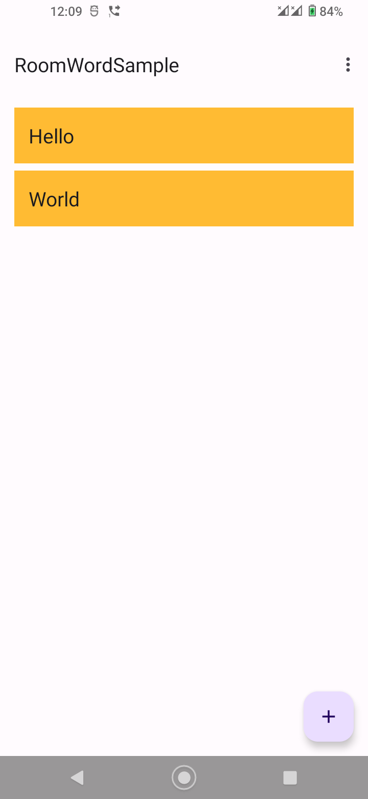
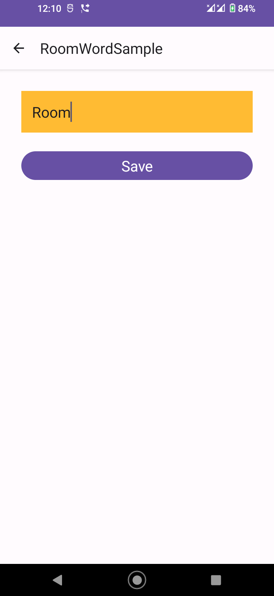
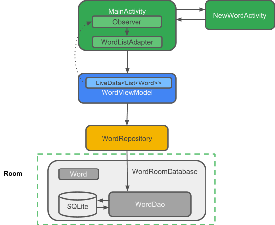
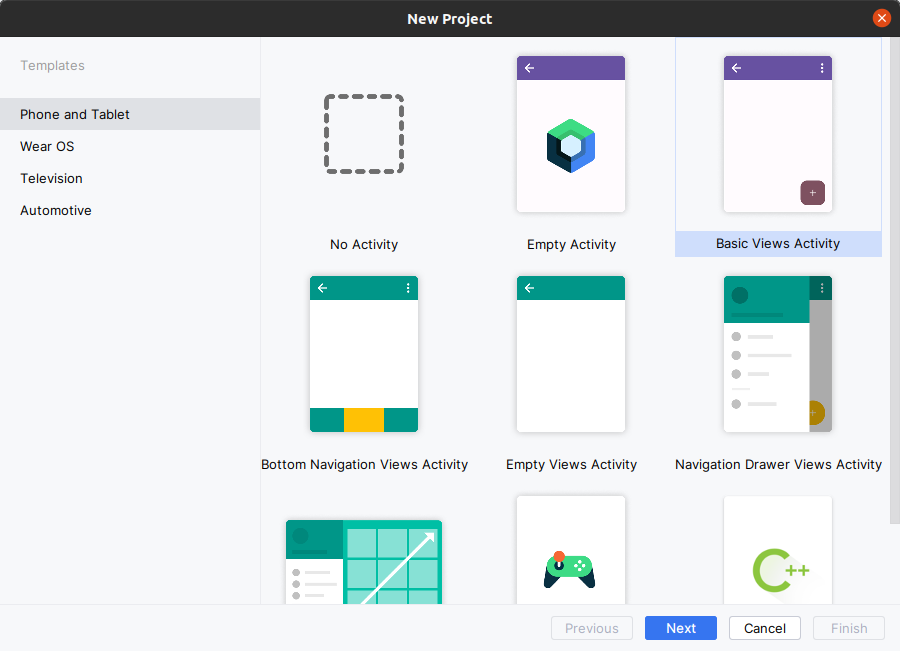
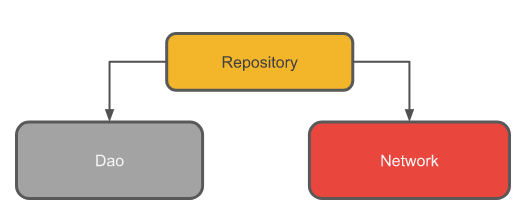
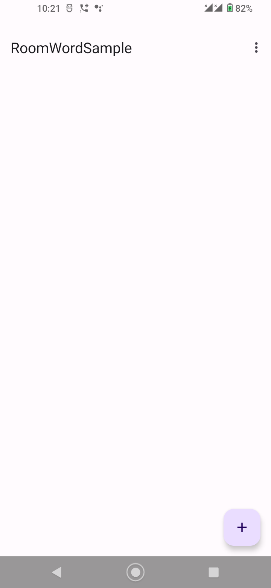

# TP 04.2A: Room, LiveData et ViewModel

[Codelab Feedback](https://github.com/khammami/codelabs-enetcom/issues)


## Bienvenue


Ces travaux pratiques se base sur le cours de base pour les développeurs Android fourni par Google afin de  les préparer pour le test de certification  [Associate Android Developer](https://developers.google.com/training/certification/associate-android-developer/). Vous obtiendrez le plus de valeur de ce TP si vous travaillez successivement dans les codelabs.

### Introduction

Le système d'exploitation Android fournit une base solide pour la création d'applications qui fonctionnent bien sur un large éventail d'appareils et de facteurs de forme. Cependant, des problèmes tels que des cycles de vie complexes et l'absence d'une architecture d'application recommandée rendent difficile l'écriture d'applications robustes.  [Les composants d'architecture Android](https://developer.android.com/topic/libraries/architecture/index.html) fournissent des bibliothèques pour des tâches courantes telles que la gestion du cycle de vie et la persistance des données, afin de faciliter la mise en œuvre de  [l'architecture recommandée](https://developer.android.com/topic/architecture?hl=fr#recommended-app-arch).

Les composants d'architecture vous aident à structurer votre application d'une manière robuste, testable et maintenable avec moins de code boilerplate.

#### Quels sont les composants d'architecture recommandés ?

Lorsqu'il s'agit d'architecture, il est utile de voir d'abord la vue d'ensemble. Pour introduire la terminologie, voici un bref aperçu des composants d'architecture et de la manière dont ils fonctionnent ensemble. Chaque composant est expliqué plus en détail lorsque vous l'utilisez dans ce cours pratique.

Le diagramme ci-dessous montre une forme de base de l'architecture recommandée pour les applications qui utilisent les composants d'architecture. L'architecture se compose d'un contrôleur d'interface utilisateur, d'un `ViewModel` qui fournit `LiveData`, d'un référentiel et d'une base de données Room. La base de données Room est basée sur une base de données `SQLite` et accessible via un objet d'accès aux données (`DAO`). Chaque composant est décrit brièvement ci-dessous. Vous implémentez les composants dans cette pratique.


Parce que tous les composants interagissent, vous rencontrerez des références à ces composants tout au long de ce guide pratique, voici donc une brève explication de chacun d'eux.

[***`Entity`***](https://developer.android.com/reference/androidx/room/Entity) (Entité) : Dans le contexte des composants d'architecture, l'entité est une classe annotée qui décrit une table de base de données.

***Base de données*** 


***`SQLite`*** : Sur l'appareil, les données sont stockées dans une base de données `SQLite`.  [La bibliothèque de persistance Room](https://developer.android.com/training/data-storage/room?hl=fr) crée et maintient cette base de données pour vous.

[***`Base de données Room`***](https://developer.android.com/topic/libraries/architecture/room) : Simplifie le travail de base de données et sert de point d'accès à la base de données `SQLite` sous-jacente (cache `SQLiteOpenHelper`). La base de données `Room` utilise le `DAO` pour émettre des requêtes vers les données `SQLite`.

[***`DAO`***](https://developer.android.com/reference/androidx/room/Dao.html) *: Acronyme de Data Access Object*, qui signifie objet d'accès aux données. Il s'agit d'un mappage de requêtes `SQL` en fonction. Auparavant, vous deviez définir ces requêtes dans une classe d'assistance. Lorsque vous utilisez un `DAO`, votre code appelle les fonctions, et les composants s'occupent du reste.

***`Repository`*** : Une classe que vous créez pour gérer plusieurs sources de données. En plus d'une base de données `Room`, le `Repository` peut gérer des sources de données distantes telles qu'un serveur Web.

[***`ViewModel`***](https://developer.android.com/topic/libraries/architecture/viewmodel): Fournit des données à l'interface utilisateur (UI) et agit comme un centre de communication entre le référentiel (`Repository`) et l'UI. Masque l'arrière-plan à l'UI. Les instances de `ViewModel` survivent aux changements de configuration de l'appareil.

[***`LiveData`***](https://developer.android.com/topic/libraries/architecture/livedata): Une classe de conteneur de données qui suit le  [modèle d'observateur](https://en.wikipedia.org/wiki/Observer_pattern), ce qui signifie qu'elle peut être observée. Contient et met toujours en cache la dernière version des données. Notifie ses observateurs lorsque les données ont changé. En général, les composants de l'interface utilisateur observent les données pertinentes. `LiveData` est sensible au cycle de vie, elle gère donc automatiquement l'arrêt et la reprise de l'observation en fonction de l'état de l'activité ou du fragment qui l'observe.

### What you should already know

Vous devez être familiarisé avec Java, les concepts de conception orientée objet et les fondamentaux du développement Android. En particulier :

* `RecyclerView` et adaptateurs
*  [SQLite databases](https://developer.android.com/reference/android/database/sqlite/SQLiteDatabase.html) and the SQLite query language
* Multithreading et  [`ExecutorService`](https://developer.android.com/reference/java/util/concurrent/ExecutorService)

### What you'll learn

* Comment concevoir et construire une application en utilisant certains des composants Android Architecture Components. Vous utiliserez `Room`, `ViewModel` et `LiveData`.

### What you'll do

* Créer une application avec une activité qui affiche une liste de mots dans un `RecyclerView`.
* Créer une entité (`Entity`) qui représente les objets de mots.
* Définir le mappage des requêtes `SQL` aux méthodes Java dans un `DAO` (data access object).
* Utiliser `LiveData` pour rendre les modifications apportées aux données visibles à l'interface utilisateur, par l'intermédiaire d'observateurs.
* Ajouter une base de données `Room` à l'application pour persister les données localement, et initialiser la base de données.
* Abstraire la couche de données sous la forme d'une classe `Repository` avec une API qui est agnostique quant à la manière dont les données sont stockées ou acquises.
* Utiliser un `ViewModel` pour séparer toutes les opérations de données de l'interface utilisateur.
* Ajouter une deuxième activité qui permet à l'utilisateur d'ajouter de nouveaux mots.


## Aperçu de l'application


Dans ce cours pratique, vous allez créer une application qui utilise les composants d'architecture Android. L'application, appelée `RoomWordsSample`, stocke une liste de mots dans une base de données `Room` et affiche la liste dans un `RecyclerView`. L'application `RoomWordsSample` est basique, mais suffisamment complète pour que vous puissiez l'utiliser comme modèle de départ.

L'application `RoomWordsSample` fait ce qui suit :

* Fonctionne avec une base de données pour obtenir et enregistrer des mots, et pré remplit la base de données avec quelques mots.
* Affiche tous les mots dans une `RecyclerView` dans l'activité principale.
* Ouvre une deuxième activité lorsque l'utilisateur appuie sur le bouton FAB `+`. Lorsque l'utilisateur entre un mot, l'application l'ajoute à la base de données et la liste est automatiquement mise à jour.

  

### Aperçu de l'architecture de RoomWordSample

Le diagramme suivant reprend le diagramme d'ensemble de l'introduction et montre toutes les pièces de l'application `RoomWordsSample`. Chacune des boîtes englobantes (à l'exception de la base de données SQLite) représente un composant de l'application qui peut être réutilisé par d'autres applications




## Tâche 1: Créer l'application RoomWordsSample


> aside positive
> 
> **Remarque :** Dans ce TP, vous êtes censé créer des variables membres, importer des classes et extraire des valeurs selon les besoins. Le code que vous êtes censé connaître est fourni mais pas expliqué.

> aside negative
> 
> Pour suivre ce codelab, vous devez activer la nouvelle interface utilisateur dans Android Studio Giraffe:
> 
> * à partir de la fenêtre "Welcome to Android Studio":
> **Customize &gt; All settings**
> * à partir de la fenêtre du projet ouvert:
> **File &gt; Settings**
> 
> 
> 
> Pour activer la nouvelle interface utilisateur et afficher le menu principal dans une barre d'outils séparée, cochez les deux paramètres suivants :
> 
> * **Enable new UI**
> * **Show main menu in separate toolbar**
> 
> Une fois ces paramètres cochés, vous devez redémarrer Android Studio pour que les changements soient appliqués.

### 1.1 Créer une application avec une seule activité

1. Ouvrez Android Studio et cliquez sur **New Project**.
2. Dans la fenêtre **New Project**, choisissez **Basic Views Activity** et cliquez sur **Next**.



3. Sur l'écran suivant, nommez l'application **RoomWordSample** et cliquez sur **Finish**.
4. Ouvrez **`themes.xml`**, changez le parent de du thème **`Base.Theme.RoomWordSample`** de l'application par **Theme.Material3.Light.NoActionBar** et supprimez le fichier **`themes.xml (night)`**.
C'est juste pour avoir la même interface utilisateur, parce que le mode sombre peut être activé sur vos émulateurs ou téléphones.
5. Supprimez le répertoire "**navigation**" sous les ressources (`res`).
6. Supprimez toutes les mises en page et classes Java des **fragments**.
**`FirstFragment`**`.java`, **`SecondFragment`**`.java`, **`fragment_first`**`.xml` et **`fragment_second`**`.xml`.
7. Supprimez la balise `fragment` de "**`content_main`**`.xml`" .
8. Supprimez les dépendances de la bibliothèque de **navigation** et **synchronisez** le projet après la suppression.

```
    implementation 'androidx.navigation:navigation-fragment:*'
    implementation 'androidx.navigation:navigation-ui:*'
```

9. Nettoyez "**`MainActivity`**`.java`" (les imports, methode de navigation et tous les variables en rouge en relation avec la bibliothèque de navigation...)
10. Exécutez votre application

### 1.2 Mettre à jour les fichiers Gradle

Ensuite, vous devez ajouter les bibliothèques de composants à vos fichiers Gradle.

1. Dans Android Studio, cliquez sur l'onglet Projets et développez le dossier Gradle Scripts.
2. Ouvrir **`build.gradle (Module: app)`**.
3. Ajoutez le code suivant en bas du bloc des dépendances **`dependencies`** (mais toujours à l'intérieur).

```
// Dépendances pour travailler avec les composants d'architecture
// Vous devrez probablement mettre à jour les numéros de version dans build.gradle (Project)

// Composant de base de données Room
implementation "androidx.room:room-runtime:$rootProject.roomVersion"
annotationProcessor "androidx.room:room-compiler:$rootProject.roomVersion"
androidTestImplementation "androidx.room:room-testing:$rootProject.roomVersion"

// Composants de cycle de vie
implementation "androidx.lifecycle:lifecycle-viewmodel:$rootProject.lifecycleVersion"
implementation "androidx.lifecycle:lifecycle-livedata:$rootProject.lifecycleVersion"
implementation "androidx.lifecycle:lifecycle-common-java8:$rootProject.lifecycleVersion"
```

4. Dans votre fichier **`build.gradle (Project: RoomWordsSample)`**, ajoutez les numéros de version à la fin du fichier, comme indiqué dans le code ci-dessous:

```
ext {
   roomVersion = '2.6.0'
   lifecycleVersion = '2.6.2'
}
```

5. Synchronisez votre projet


## Tâche 2: Créer l'entité Word


Les données de cette application sont des mots, et vous aurez besoin d'une table simple pour stocker ces valeurs:


Les composants d'architecture vous permettent d'en créer un via une entité ( [`Entity`](https://developer.android.com/training/data-storage/room/defining-data.html)). Faisons-le maintenant.

### 2.1 Créer la classe Word

1. Effectuez un clic droit sur **app &gt; java &gt; com.example.enetcom.roomwordsample**, puis sélectionnez **New &gt; Package**.
2. Saisissez **`model`** comme dernière partie du nom du package.
3. Effectuez un clic droit sur le package **`model`**, puis sélectionnez **New &gt; Java Class**.
4. Saisissez **`Word`** comme nom de classe. Cette classe décrira l'entité (qui représente la table `SQLite`) pour vos mots. Chaque propriété de la classe représente une colonne de la table. Room utilisera ces propriétés pour créer la table et instancier des objets à partir de lignes de la base de données. Voici le code :

```
public class Word {

   private String mWord;

   public Word(@NonNull String word) {this.mWord = word;}

   public String getWord(){return this.mWord;}
}
```

### 2.2 Annoter la classe Word

Pour que la classe **`Word`** ait un sens pour une base de données Room, vous devez l'annoter. Les annotations identifient la manière dont chaque partie de cette classe se rapporte à une entrée dans la base de données. `Room` utilise ces informations pour générer du code.

Mettez à jour votre classe **`Word`** avec des annotations comme indiqué dans ce code :

```
@Entity(tableName = "word_table")
public class Word {

   @PrimaryKey
   @NonNull
   @ColumnInfo(name = "word")
   private String mWord;

   public Word(@NonNull String word) {this.mWord = word;}

   public String getWord(){return this.mWord;}
}
```

> aside negative
> 
> **Lorsque vous copiez et collez du code, vous devrez peut-être importer les classes d'annotation manuellement**. Vous pouvez placer le curseur sur le code de chaque erreur et utiliser le raccourci clavier " [Project quick fix](https://developer.android.com/studio/intro/keyboard-shortcuts)" (Alt+Entrée sur Windows/Linux, Option+Entrée sur Mac) pour importer les classes rapidement.
> 
> **import androidx.room.ColumnInfo**
> 
> **import androidx.room.Entity**
> 
> **import androidx.room.PrimaryKey**
> 
> Notez que si vous tapez les annotations vous-même (au lieu de les coller), Android Studio les importera automatiquement.

Voyons ce que font ces annotations:

* **`@Entity(tableName = "word_table")`** Chaque classe `@Entity` représente une table SQLite. Annotez la déclaration de votre classe pour indiquer qu'il s'agit d'une entité. Vous pouvez spécifier le nom de la table si vous souhaitez qu'il soit différent du nom de la classe. Cela nomme la table "word_table".
* **`@PrimaryKey`** Chaque entité a besoin d'une clé primaire. Pour simplifier les choses, chaque mot agit comme sa propre clé primaire.
* **`@NonNull`** Indique qu'un paramètre, un champ ou une valeur de retour de méthode ne peut jamais être nul.
* **`@ColumnInfo(name = "word")`** Spécifiez le nom de la colonne dans la table si vous souhaitez qu'il soit différent du nom de la variable membre.
* Chaque champ stocké dans la base de données doit être public ou avoir une méthode "getter". Cet exemple fournit une méthode `getWord()`.

Vous pouvez trouver une liste complète des annotations dans  [la référence du package Room](https://developer.android.com/reference/androidx/room/package-summary.html).

> aside positive
> 
> See  [Defining data using Room entities](https://developer.android.com/training/data-storage/room/defining-data.html).

**Conseil** : Vous pouvez générer automatiquement ( [autogenerate](https://developer.android.com/reference/androidx/room/PrimaryKey.html)) des clés uniques en annotant la clé primaire de la manière suivante :

```
@Entity(tableName = "word_table")
public class Word {

    @PrimaryKey(autoGenerate = true)
    private int id;

    @NonNull
    private String word;
    //..other fields, getters, setters
}
```

Vous utiliserez la génération automatique dans la deuxième partie du codelab.


## Tâche 3: Créer la DAO


### 3.1 Qu'est-ce qu'une DAO ?

Un  [DAO](https://developer.android.com/training/data-storage/room/accessing-data.html) (data access object) valide votre SQL à la compilation et l'associe à une méthode. Dans votre DAO Room, vous utilisez des annotations pratiques, comme **`@Insert`**, pour représenter les opérations de base de données les plus courantes ! Room utilise le DAO pour créer une API propre pour votre code.

Le DAO doit être une interface ou une classe abstraite. Par défaut, toutes les requêtes doivent être exécutées sur un thread distinct.

### 3.2 Créez une classe DAO

Écrivons un DAO qui fournit des requêtes pour :

* Obtenir tous les mots ordonnés par ordre alphabétique
* Insérer un mot
* Supprimer tous les mots

1. Effectuez un clic droit sur **app &gt; java &gt; com.example.enetcom.roomwordsample**, puis sélectionnez **New &gt; Package**.
2. Saisissez **`data.db`** comme dernière partie du nom du package.
3. Effectuez un clic droit sur le package **`data.db`**, puis sélectionnez **New &gt; Java Class**.
4. Saisissez **`WordDao`** comme nom et sélectionnez **interface**. 
5. Copy and paste the following code into **`WordDao`** and fix the imports as necessary to make it compile:

```
@Dao
public interface WordDao {

   // Permettre l'insertion du même mot plusieurs fois en passant
   // une stratégie de résolution de conflits.
   @Insert(onConflict = OnConflictStrategy.IGNORE)
   void insert(Word word);

   @Query("DELETE FROM word_table")
   void deleteAll();

   @Query("SELECT * FROM word_table ORDER BY word ASC")
   List<Word> getAlphabetizedWords();
}
```

Expliquons-le point par point:

* **`WordDao`** est une interface ; les DAO doivent être soit des interfaces, soit des classes abstraites.
* L'annotation **`@Dao`** identifie une classe comme une classe DAO pour Room.
* **`void insert(Word word);`** Déclare une méthode pour insérer un mot:
*  [L'annotation **`@Insert`**](https://developer.android.com/reference/androidx/room/Insert) est une annotation spéciale de méthode DAO qui vous permet d'insérer des données dans la base de données sans avoir à écrire de SQL ! (Il existe également des annotations  [**`@Delete`**](https://developer.android.com/reference/androidx/room/Delete) et  [**`@Update`**](https://developer.android.com/reference/androidx/room/Update) pour supprimer et mettre à jour des lignes, mais vous ne les utilisez pas dans cette application.)
* **`onConflict = OnConflictStrategy.IGNORE`**: La stratégie de conflit sélectionnée ignore un nouveau mot s'il est exactement le même qu'un mot déjà présent dans la liste. Pour en savoir plus sur les stratégies de conflit disponibles, veuillez consulter la  [documentation](https://developer.android.com/reference/androidx/room/OnConflictStrategy.html).
* **`deleteAll()`**: déclare une méthode pour supprimer tous les mots.
* Il n'y a pas d'annotation pratique pour supprimer plusieurs entités, donc elle est annotée avec l'annotation générique **`@Query`**.
* **`@Query("DELETE FROM word_table")`**: `@Query` requiert que vous fournissiez une requête SQL en tant que paramètre de chaîne à l'annotation.
* `List&lt;Word&gt; getAlphabetizedWords()`: Une méthode pour récupérer tous les mots et renvoyer une liste (**`List`**) de mots (**`Word`**)
* **`@Query("SELECT * FROM word_table ORDER BY word ASC")`**: Renvoie une liste de mots triés par ordre croissant.

> aside positive
> 
> En savoir plus sur  [les DAO Room](https://developer.android.com/training/data-storage/room/accessing-data.html)


## Tâche 4: Utiliser la classe LiveData


Lorsque les données changent, vous souhaitez généralement effectuer une action, telle que l'affichage des données mises à jour dans l'interface utilisateur. Cela signifie que vous devez observer les données afin de pouvoir réagir lorsqu'elles changent.

Selon la façon dont les données sont stockées, cela peut être délicat. L'observation des modifications apportées aux données dans plusieurs composants de votre application peut créer des chemins de dépendance explicites et rigides entre les composants. Cela rend les tests et le débogage difficiles, entre autres.

[**`LiveData`**](https://developer.android.com/topic/libraries/architecture/livedata.html), une classe de  [bibliothèque de cycle de vie](https://developer.android.com/topic/libraries/architecture/lifecycle.html) pour l'observation des données, résout ce problème. Utilisez une valeur de retour de type **`LiveData`** dans la description de votre méthode, et Room générera tout le code nécessaire pour mettre à jour **`LiveData`** lorsque la base de données est mise à jour.

> aside positive
> 
> Remarque: Si vous utilisez **`LiveData`** indépendamment de Room, vous devez gérer la mise à jour des données. **`LiveData`** n'a pas de méthodes accessibles au public pour mettre à jour les données stockées.
> 
> Si vous voulez mettre à jour des données stockées dans **`LiveData`**, vous devez utiliser  [**`MutableLiveData`**](https://developer.android.com/reference/androidx/lifecycle/MutableLiveData.html) au lieu de **`LiveData`**. La classe **`MutableLiveData`** possède deux méthodes publiques qui vous permettent de définir la valeur d'un objet **`LiveData`**,  [**`setValue(T)`**](https://developer.android.com/reference/android/arch/lifecycle/MutableLiveData.html#setValue(T)) et  [**`postValue(T)`**](https://developer.android.com/reference/androidx/lifecycle/MutableLiveData.html#postValue(T)). Habituellement, **`MutableLiveData`** est utilisé dans le  [**`ViewModel`**](https://developer.android.com/reference/androidx/lifecycle/ViewModel.html), et le **`ViewModel`** n'expose ensuite que des objets **`LiveData`** immuables aux observateurs.

### 4.1 Retourner LiveData dans WordDao

* Dans **`WordDao`**, modifiez la signature de la méthode **`getAlphabetizedWords()`** afin que la **`List&lt;Word&gt;`** renvoyée soit encapsulée avec **`LiveData`**.

```
  @Query("SELECT * from word_table ORDER BY word ASC")
   LiveData<List<Word>> getAlphabetizedWords();
```

Plus tard dans ce codelab, vous suivez les changements de données via un observateur (**`observer`**) dans **`MainActivity`**.

> aside positive
> 
> Consultez la documentation de  [**`LiveData`**](https://developer.android.com/reference/androidx/lifecycle/LiveData.html) pour en savoir plus sur d'autres façons d'utiliser **`LiveData`**, ou regardez cette vidéo  [Architecture Components: LiveData and Lifecycle](https://www.youtube.com/watch?v=OMcDk2_4LSk&index=8&list=PLWz5rJ2EKKc9mxIBd0DRw9gwXuQshgmn2) .


## Tâche 5: Add a Room database


### 5.1 Qu'est-ce qu'une base de données Room ?

* Room est une couche de base de données au-dessus d'une base de données SQLite.
* Room s'occupe des tâches banales que vous aviez l'habitude de gérer avec un  [`SQLiteOpenHelper`](https://developer.android.com/reference/android/database/sqlite/SQLiteOpenHelper.html).
* Room utilise le DAO pour émettre des requêtes vers sa base de données.
* Par défaut, pour éviter de dégrader les performances de l'interface utilisateur, Room ne vous permet pas d'émettre des requêtes sur le thread principal. Lorsque les requêtes Room renvoient des  [`LiveData`](https://developer.android.com/topic/libraries/architecture/livedata), elles sont automatiquement exécutées de manière asynchrone sur un thread d'arrière-plan.
* Room fournit des vérifications au moment de la compilation des déclarations SQLite.

### 5.2 Implémenter la base de données Room

Votre classe de base de données Room doit être abstraite et hériter de `RoomDatabase`. En général, vous n'avez besoin que d'une seule instance d'une base de données Room pour toute l'application.

Créons-en un maintenant. Créez un fichier de classe appelé **`WordRoomDatabase`** sous le package **`db`** et ajoutez-y le code suivant :

```
@Database(entities = {Word.class}, version = 1, exportSchema = false)
public abstract class WordRoomDatabase extends RoomDatabase {

   public abstract WordDao wordDao();

   private static volatile WordRoomDatabase INSTANCE;
   private static final int NUMBER_OF_THREADS = 4;
   public static final ExecutorService databaseWriteExecutor =
        Executors.newFixedThreadPool(NUMBER_OF_THREADS);

   public static WordRoomDatabase getDatabase(final Context context) {
        if (INSTANCE == null) {
            synchronized (WordRoomDatabase.class) {
                if (INSTANCE == null) {
                    INSTANCE = Room.databaseBuilder(context.getApplicationContext(),
                            WordRoomDatabase.class, "word_database")
                            .fallbackToDestructiveMigration()
                            .build();
                }
            }
        }
        return INSTANCE;
    }
}
```

Parcourons le code ensemble:

* La classe de base de données pour Room doit être abstraite (**`abstract`**) et étendre **`RoomDatabase`**.
* Vous annotez la classe pour qu'elle soit une base de données Room avec **`@Database`** et utilisez les paramètres d'annotation pour déclarer les entités qui appartiennent à la base de données et définir le numéro de version. Chaque entité correspond à une table qui sera créée dans la base de données. Les migrations de base de données sont hors du champ d'application de ce codelab, nous définissons donc **`exportSchema`** à `false` ici pour éviter un avertissement de compilation. Dans une application réelle, vous devriez envisager de définir un répertoire que Room utilisera pour exporter le schéma afin que vous puissiez vérifier le schéma actuel dans votre système de contrôle de version.
* La base de données expose des DAO via une méthode "getter" abstraite pour chaque @Dao.
* Nous avons défini un  [singleton](https://en.wikipedia.org/wiki/Singleton_pattern), **`WordRoomDatabase`**, pour empêcher l'ouverture de plusieurs instances de la base de données en même temps.
* **`getDatabase`** renvoie le singleton. Il créera la base de données la première fois qu'elle sera accédée, en utilisant le générateur de base de données de Room pour créer un objet  [`RoomDatabase`](https://developer.android.com/reference/androidx/room/RoomDatabase.html) dans le contexte de l'application à partir de la classe **`WordRoomDatabase`** et le nommer **`"word_database"`**.
* Nous avons créé un **`ExecutorService`** avec un pool de threads fixe que vous utiliserez pour exécuter les opérations de base de données de manière asynchrone sur un thread d'arrière-plan.

> aside positive
> 
> **Remarque** : Lorsque vous modifiez le schéma de la base de données, vous devez mettre à jour le numéro de version et définir une stratégie de migration.
> 
> Pour un échantillon, une stratégie de destruction et de re-création peut être suffisante. Mais, pour une application réelle, vous devez implémenter une stratégie de migration. Voir  [Understanding migrations with Room](https://medium.com/google-developers/understanding-migrations-with-room-f01e04b07929).

> aside negative
> 
> **Important**: In Android Studio, if you get errors when you paste code or during the build process, make sure you are using the full package name for imports. See  [Adding Components to your Project](https://developer.android.com/topic/libraries/architecture/adding-components.html). Then select **Build &gt; Clean Project**. Then select **Build &gt; Rebuild Project**, and build again.


## Tâche 6: Créer la classe Repository


### 6.1 Qu'est-ce qu'une classe Repository ?

Une classe **`Repository`** est une abstraction qui permet d'accéder à plusieurs sources de données. La classe Repository ne fait pas partie des bibliothèques Architecture Components, mais elle est suggérée comme bonne pratique pour la séparation du code et l'architecture. Une classe **`Repository`** fournit une API propre pour l'accès aux données au reste de l'application.



### 6.2 Pourquoi utiliser une classe Repository ?

Un référentiel (Repository) gère les requêtes et vous permet d'utiliser plusieurs bases de données. Dans l'exemple le plus courant, le référentiel implémente la logique permettant de décider s'il faut récupérer les données d'un réseau ou utiliser les résultats mis en cache dans une base de données locale.

### 6.3 Implémenter la classe Repository

1. Créer une classe publique appelée **`WordRepository`** sous le package **`com.example.enetcom.roomwordsample`**
2. Effectuez un clic droit sur la classe **`WordRepository`**, puis sélectionnez **`Refactor &gt; move class`** pour la déplacer sous le package **`data`**
3. Ajoutez le code suivant

```
public class WordRepository {

    private final WordDao mWordDao;
    private final LiveData<List<Word>> mAllWords;

    public WordRepository(Application application) {
        WordRoomDatabase db = WordRoomDatabase.getDatabase(application);
        mWordDao = db.wordDao();
        mAllWords = mWordDao.getAlphabetizedWords();
    }

    // Room exécute toutes les requêtes sur un thread distinct.
    // Les données LiveData observées avertiront l'observateur lorsque les données auront changé.
    public LiveData<List<Word>> getAllWords() {
        return mAllWords;
    }

    // Vous devez appeler cela sur un thread non-UI ou votre application lancera une exception.
    // Room garantit que vous n'effectuez aucune opération longue sur le thread principal, bloquant l'interface utilisateur.
    public void insert(Word word) {
        WordRoomDatabase.databaseWriteExecutor.execute(() -> mWordDao.insert(word));
    }
}
```

* Le DAO est passé au constructeur du dépôt au lieu de l'ensemble de la base de données. En effet, vous n'avez besoin d'accéder qu'au DAO, car il contient toutes les méthodes de lecture et d'écriture pour la base de données. Il n'est pas nécessaire d'exposer l'ensemble de la base de données au dépôt.
* La méthode **`getAllWords`** renvoie la liste **`LiveData`** de mots de Room. Nous pouvons le faire en raison de la manière dont nous avons défini la méthode **`getAlphabetizedWords`** pour renvoyer **`LiveData`** à l'étape "La classe LiveData". Room exécute toutes les requêtes sur un thread séparé. Ensuite, **`LiveData`** observé avertira l'observateur sur le thread principal lorsque les données auront changé.
* Nous devons éviter d'exécuter l'insertion sur le thread principal, nous utilisons donc l'**`ExecutorService`** que nous avons créé dans **`WordRoomDatabase`** pour effectuer l'insertion sur un thread d'arrière-plan.

> aside positive
> 
> **Remarque**: Les référentiels sont destinés à servir d'intermédiaire entre différentes sources de données. Dans cet exemple simple, vous n'avez qu'une seule source de données, donc le référentiel ne fait pas grand-chose. Voir  [l'exemple de base](https://github.com/android/architecture-components-samples/tree/master/BasicSample) pour une implémentation plus complexe.


## Tâche 7: Créer le ViewModel


### 7.1 Qu'est-ce qu'un ViewModel ?

Le rôle de la **`ViewModel`** est de fournir des données à l'interface utilisateur et de survivre aux changements de configuration. Une **`ViewModel`** agit comme un centre de communication entre le Repository et l'interface utilisateur. Vous pouvez également utiliser une **`ViewModel`** pour partager des données entre des fragments. La **`ViewModel`** est une partie de la bibliothèque  [Lifecycle](https://developer.android.com/topic/libraries/architecture/lifecycle.html).


Pour une introduction à ce sujet, consultez  [ViewModel Overview](https://developer.android.com/topic/libraries/architecture/viewmodel.html) ou le billet de blog  [ViewModels: A Simple Example](https://medium.com/androiddevelopers/viewmodels-a-simple-example-ed5ac416317e).

### 7.2 Pourquoi utiliser un ViewModel ?

Un **`ViewModel`** conserve les données de l'interface utilisateur de votre application de manière consciente du cycle de vie, ce qui leur permet de survivre aux changements de configuration. Séparer les données de l'interface utilisateur de votre application de vos classes **`Activity`** et **`Fragment`** vous permet de mieux suivre le principe de responsabilité unique : vos activités et fragments sont responsables de l'affichage des données à l'écran, tandis que votre **`ViewModel`** peut s'occuper de conserver et de traiter toutes les données nécessaires à l'interface utilisateur.

Dans le **`ViewModel`**, utilisez **`LiveData`** pour les données modifiables que l'interface utilisateur utilisera ou affichera. L'utilisation de **`LiveData`** présente plusieurs avantages :

* Vous pouvez utiliser un observateur sur les données (au lieu de les interroger régulièrement) et mettre à jour l'interface utilisateur uniquement lorsque les données changent réellement.
* Le référentiel (Repository) et l'interface utilisateur sont complètement séparés par le **`ViewModel`**.
* Il n'y a pas d'appels à la base de données depuis le **`ViewModel`** (tout cela est géré dans le référentiel), ce qui rend le code plus testable.

### 7.3 Implémenter le ViewModel

Créez un fichier de classe pour **`WordViewModel`**  sous le package **`com.example.enetcom.roomwordsample`** et ajoutez-y ce code :

```
public class WordViewModel extends AndroidViewModel {

    private final WordRepository mRepository;

    private final LiveData<List<Word>> mAllWords;

    public WordViewModel (Application application) {
        super(application);
        mRepository = new WordRepository(application);
        mAllWords = mRepository.getAllWords();
    }

    LiveData<List<Word>> getAllWords() { return mAllWords; }

    public void insert(Word word) { mRepository.insert(word); }
}
```

Ici, nous avons:

* Créé une classe appelée **`WordViewModel`** qui prend l'application comme paramètre et étend **`AndroidViewModel`**.
* Ajouté une variable membre privée pour conserver une référence au dépôt.
* Ajouté une méthode **`getAllWords()`** pour renvoyer une liste de mots en cache.
* Implémenté un constructeur qui crée le **`WordRepository`**.
* Dans le constructeur, initialisé le LiveData **`allWords`** en utilisant le dépôt.
* Créé une méthode wrapper **`insert()`** qui appelle la méthode **`insert()`** du dépôt. De cette façon, l'implémentation de **`insert()`** est encapsulée de l'interface utilisateur.

> aside negative
> 
> **Attention** : Ne conservez pas de référence à un contexte dont le cycle de vie est plus court que celui de votre ViewModel ! Des exemples sont :
> 
> * Activité
> * Fragment
> * Vue
> 
> Conserver une référence peut provoquer une fuite de mémoire, par exemple si le ViewModel a une référence à une Activity détruite. Tous ces objets peuvent être détruits par le système d'exploitation et recréés lors d'un changement de configuration, ce qui peut se produire plusieurs fois pendant le cycle de vie d'un ViewModel.
Si vous avez besoin du contexte de l'application (qui a un cycle de vie aussi long que celui de l'application), utilisez **`AndroidViewModel`**, comme indiqué dans ce codelab.

> aside negative
> 
> **Important** : Les **`ViewModel`**s ne survivent pas à l'arrêt du processus de l'application en arrière-plan lorsque le système d'exploitation a besoin de plus de ressources. Pour les données de l'interface utilisateur qui doivent survivre à la mort du processus due à un manque de ressources, vous pouvez utiliser  [le module Saved State pour les ViewModels](https://developer.android.com/topic/libraries/architecture/viewmodel-savedstate). En savoir plus  [ici](https://medium.com/google-developers/viewmodels-persistence-onsaveinstancestate-restoring-ui-state-and-loaders-fc7cc4a6c090).

> aside positive
> 
> Pour en savoir plus sur les classes ViewModel, regardez la vidéo  [Architecture Components: ViewModel](https://www.youtube.com/watch?v=c9-057jC1ZA).


## Tâche 8: Ajouter des layouts XML pour l'interface utilisateur


Ensuite, vous devez ajouter la mise en page XML pour la liste et les éléments.

Ce codelab suppose que vous êtes familier avec la création de mises en page en XML, nous vous fournissons donc simplement le code.

### 8.1 Ajouter des styles

Ajouter un style pour les vues de texte dans le fichier **`values/styles.xml`**

```
<style name="word_title">
        <item name="android:layout_width">match_parent</item>
        <item name="android:layout_height">wrap_content</item>
        <item name="android:layout_marginBottom">8dp</item>
        <item name="android:padding">16dp</item>
        <item name="android:layout_gravity">center</item>
        <item name="android:background">@android:color/holo_orange_light</item>
        <item name="android:textAppearance">@android:style/TextAppearance.Large</item>
</style>
```

### 8.2 Ajouter la mise en page (layout) d'un élément

Ajoutez une mise en page **`layout/recyclerview_item.xml`**

```
<?xml version="1.0" encoding="utf-8"?>
<LinearLayout xmlns:android="http://schemas.android.com/apk/res/android"
    android:orientation="vertical"
    android:layout_width="match_parent"
    android:layout_height="wrap_content">

    <TextView
        android:id="@+id/textView"
        style="@style/word_title" />
</LinearLayout>
```

### 8.3 Ajouter le RecyclerView

Ajoutez un élément **`RecyclerView`** au fichier **`layout/content_main.xml`**

```
<?xml version="1.0" encoding="utf-8"?>
<androidx.constraintlayout.widget.ConstraintLayout xmlns:android="http://schemas.android.com/apk/res/android"
    xmlns:app="http://schemas.android.com/apk/res-auto" xmlns:tools="http://schemas.android.com/tools"
    android:layout_width="match_parent"
    android:layout_height="match_parent"
    app:layout_behavior="@string/appbar_scrolling_view_behavior">

    <androidx.recyclerview.widget.RecyclerView
        android:id="@+id/recyclerview"
        android:layout_width="0dp"
        android:layout_height="0dp"
        android:padding="16dp"
        app:layout_constraintBottom_toBottomOf="parent"
        app:layout_constraintLeft_toLeftOf="parent"
        app:layout_constraintRight_toRightOf="parent"
        app:layout_constraintTop_toTopOf="parent"
        tools:listitem="@layout/recyclerview_item"
        app:layoutManager="androidx.recyclerview.widget.LinearLayoutManager"
        android:scrollbars="vertical"/>

</androidx.constraintlayout.widget.ConstraintLayout>
```

### 8.4 Changer l'icône du FAB

L'apparence du bouton d'action flottant (FAB) doit correspondre à l'action disponible, nous allons donc remplacer l'icône par un symbole **`+`**.

Tout d'abord, nous devons ajouter un nouvel asset vectoriel.First, we need to add a new Vector Asset:

1. Selectionnez **File &gt; New &gt; Vector Asset**.
2. Cliquez sur l'icône du robot Android dans **`Icon`**.
3. Recherchez **`"add"`** et sélectionnez l'élément **`"+"`**. Cliquez sur **OK**.
4. Après cela, cliquez sur **Next**.
5. Confirmer le chemin de l'icône comme **main &gt; drawable** et cliquer sur **Finish** pour ajouter l'asset.
6. Toujours dans **`layout/activity_main.xml`**, mettez à jour le FAB pour inclure le nouveau icône :

```
<com.google.android.material.floatingactionbutton.FloatingActionButton
        android:id="@+id/fab"
        android:layout_width="wrap_content"
        android:layout_height="wrap_content"
        android:layout_gravity="bottom|end"
        android:layout_marginEnd="@dimen/fab_margin"
        android:layout_marginBottom="16dp"
        app:srcCompat="@drawable/baseline_add_24"
        android:layout_marginRight="@dimen/fab_margin" />
```


## Tâche 9 Créer un adaptateur et ajouter le RecyclerView


Vous allez afficher les données dans un `RecyclerView`, ce qui est un peu plus agréable que de simplement les jeter dans un `TextView`. Ce codelab suppose que vous savez comment fonctionnent  [`RecyclerView`](https://developer.android.com/reference/kotlin/androidx/recyclerview/widget/RecyclerView),  [`RecyclerView.ViewHolder`](https://developer.android.com/reference/kotlin/androidx/recyclerview/widget/RecyclerView.ViewHolder) et  [`RecyclerView.Adapter`](https://developer.android.com/reference/androidx/recyclerview/widget/RecyclerView.Adapter).

### 9.1 Create the WordListAdapter class

Créez une classe **`WordListAdapter`** qui étend **`RecyclerView.Adapter`** sous le package "**`adapter`**" (`com.example.enetcom.roomwordsample.adapter`). Voici le code :

```
public class WordListAdapter extends RecyclerView.Adapter<WordListAdapter.WordViewHolder> {

    private List<Word> mWords; // Copie en cache des mots

    public WordListAdapter() {}

    @NonNull
    @Override
    public WordViewHolder onCreateViewHolder(ViewGroup parent, int viewType) {
        View itemView = LayoutInflater.from(parent.getContext()).inflate(R.layout.recyclerview_item, parent, false);
        return new WordViewHolder(itemView);
    }

    @Override
    public void onBindViewHolder(@NonNull WordViewHolder holder, int position) {
        if (mWords != null) {
            Word current = mWords.get(position);
            holder.wordItemView.setText(current.getWord());
        } else {
            // Couvre le cas où les données ne sont pas encore prêtes.
            holder.wordItemView.setText("No Word");
        }
    }

    public void setWords(List<Word> words){
        mWords = words;
        notifyDataSetChanged();
    }

    // getItemCount() est appelé plusieurs fois, et lorsqu'il est appelé pour la première fois,
    // mWords n'a pas été mis à jour (cela signifie qu'initialement, il est nul, et nous ne pouvons pas retourner nul).
    @Override
    public int getItemCount() {
        if (mWords != null)
            return mWords.size();
        else return 0;
    }

    class WordViewHolder extends RecyclerView.ViewHolder {
        private final TextView wordItemView;

        private WordViewHolder(View itemView) {
            super(itemView);
            wordItemView = itemView.findViewById(R.id.textView);
        }
    }
}
```

### 9.2 Ajouter RecyclerView à l'activité principale

1. Allez dans **`activity_main.xml`** et localisez la balise **`include`**, puis ajoutez-lui **`content_main`** comme un **`ID`**:

```
<include layout="@layout/content_main" android:id="@+id/content_main" />
```

2. Ajoutez le **`RecyclerView`** dans la méthode **`onCreate()`** de **`MainActivity`**. (après l'appel vers **`setContentView(binding.getRoot());`**)

```
WordListAdapter mAdapter = new WordListAdapter();
binding.contentMain.recyclerview.setAdapter(mAdapter);
binding.contentMain.recyclerview.setHasFixedSize(true);
```

3. Exécutez votre application pour vous assurer que tout fonctionne. Il n'y a pas d'éléments car vous n'avez pas encore connecté les données.




## Tâche 10: Remplir la base de données


Il n'y a pas de données dans la base de données. Vous pouvez ajouter des données de deux manières : en ajoutant des données lors de l'ouverture de la base de données ou en ajoutant une activité pour ajouter des mots.

Pour supprimer tout le contenu et remplir la base de données lors de l'installation de l'application, vous créez un  [`RoomDatabase.Callback`](https://developer.android.com/reference/androidx/room/RoomDatabase.Callback.html) et remplacez la méthode `onCreate()`.

Voici le code pour créer le rappel dans la classe **`WordRoomDatabase`**. Comme vous ne pouvez pas effectuer d'opérations sur la base de données Room sur le thread de l'interface utilisateur, **`onCreate()`** utilise l'executor **`databaseWriteExecutor`** défini précédemment pour exécuter un lambda sur un thread d'arrière-plan. Le lambda supprime le contenu de la base de données, puis la remplit avec les deux mots "Hello" et "World". N'hésitez pas à ajouter d'autres mots !

```
private static RoomDatabase.Callback sRoomDatabaseCallback = new RoomDatabase.Callback() {
        @Override
        public void onCreate(@NonNull SupportSQLiteDatabase db) {
            super.onCreate(db);

            // Si vous souhaitez conserver les données au redémarrage de l'application
            // commentez le bloc suivant
            databaseWriteExecutor.execute(() -> {
                // Remplir la base de données en arrière-plan
                // Si vous voulez commencer avec plus de mots, il suffit de les ajouter.
                WordDao dao = INSTANCE.wordDao();
                dao.deleteAll();

                Word word = new Word("Hello");
                dao.insert(word);
                word = new Word("World");
                dao.insert(word);
            });
        }
    };
```

Ensuite, ajoutez le `callback` à la séquence de construction de la base de données juste avant d'appeler **`.build()`** sur **`Room.databaseBuilder()`**

```
.addCallback(sRoomDatabaseCallback)
```


## Tâche 11: Connecter l'interface utilisateur aux données


Maintenant que vous avez créé la méthode pour remplir la base de données avec l'ensemble initial de mots, l'étape suivante consiste à ajouter le code pour afficher ces mots dans le `RecyclerView`.

Pour afficher le contenu actuel de la base de données, ajoutez un observateur qui observe les `LiveData` dans le `ViewModel`.

Chaque fois que les données changent, la méthode de rappel **`onChanged()`** est invoquée. Cette méthode appelle la méthode **`setWords()`** de l'adaptateur pour mettre à jour les données mises en cache de l'adaptateur et rafraîchir la liste affichée.

1. Dans **`MainActivity`**, créez une variable membre pour le `ViewModel`.

```
private WordViewModel mWordViewModel;
```

Utilisez `ViewModelProvider` pour associer votre `ViewModel` à votre activité.

Lorsque votre activité est lancée pour la première fois, `ViewModelProviders` crée le `ViewModel`. Lorsque l'activité est détruite, par exemple lors d'un changement de configuration, le `ViewModel` persiste. Lorsque l'activité est recréée, `ViewModelProviders` renvoie le `ViewModel` existant. Pour plus d'informations, consultez  [`ViewModel`](https://developer.android.com/topic/libraries/architecture/viewmodel.html).

2. Dans **`onCreate()`**, sous le bloc de code `RecyclerView`, obtenez un `ViewModel` à partir du `ViewModelProvider` :

```
mWordViewModel = new ViewModelProvider(this).get(WordViewModel.class);
```

3. Également dans **`onCreate()`**, ajoutez un observateur pour le `LiveData` retourné par **`getAlphabetizedWords()`**. La méthode **`onChanged()`** est déclenchée lorsque les données observées changent et que l'activité est au premier plan.

```
mWordViewModel = new ViewModelProvider(this).get(WordViewModel.class);
        mWordViewModel.getAllWords().observe(this, words -> {
            // Mettre à jour la copie en cache des mots dans l'adaptateur.
            mAdapter.setWords(words);
        });
```

4. Exécutez l'application. L'ensemble initial de mots "Hello" et " World" apparaît dans le `RecyclerView`.


## Tâche 12: Créer une activité pour ajouter des mots


Vous allez maintenant ajouter une activité qui permet à l'utilisateur d'utiliser le FAB pour saisir de nouveaux mots.

### 12.1 Créer l'activité NewWordActivity

1. Ajoutez ces ressources de chaîne dans **`values/strings.xml`**:

```
<string name="hint_word">Word...</string>
<string name="button_save">Save</string>
<string name="empty_not_saved">Word not saved because it is empty.</string>
```

2. Ajoutez un style aux boutons dans **`values/styles.xml`**:

```
<style name="button_style" parent="Widget.Material3.Button">
        <item name="android:layout_width">match_parent</item>
        <item name="android:layout_height">wrap_content</item>
        <item name="android:textAppearance">@android:style/TextAppearance.Large</item>
        <item name="android:layout_marginTop">16dp</item>
</style>
```

3. Ajoutez un style, pour le thème de la nouvelle activitée que vous allez la créer par la suite,  dans **`values/themes.xml`**:

```
<style name="Theme.RoomWordSample.WithActionBar" parent="Base.Theme.RoomWordSample" >
        <item name="windowActionBar">true</item>
        <item name="windowNoTitle">false</item>
        <item name="toolbarStyle">@style/Widget.Material3.Toolbar.Surface</item>
</style>
```

4. Utilisez le modèle **`Empty Views Activity`** pour créer une nouvelle activité, **`NewWordActivity`**. Vérifiez que l'activité a été ajoutée au manifeste Android.

```
<activity
            android:name=".NewWordActivity"
            android:exported="false" />
```

5. Appliquez le nouveau thème **`Theme.RoomWordSample.WithActionBar`** à la nouvelle activité et spécifiez **`MainActivity`** comme son parent.

```
<activity
            android:name=".NewWordActivity"
            android:theme="@style/Theme.RoomWordSample.WithActionBar"
            android:parentActivityName=".MainActivity"
            android:exported="false" />
```

6. Mettez à jour le fichier **`activity_new_word.xml`** dans le dossier layout avec le code suivant :

```
<LinearLayout xmlns:android="http://schemas.android.com/apk/res/android"
    xmlns:app="http://schemas.android.com/apk/res-auto"
    xmlns:tools="http://schemas.android.com/tools"
    android:layout_width="match_parent"
    android:layout_height="match_parent"
    android:orientation="vertical"
    android:padding="32dp"
    tools:context=".NewWordActivity">

    <EditText
        android:id="@+id/edit_word"
        style="@style/word_title"
        android:hint="@string/hint_word"
        android:inputType="textAutoComplete" />

    <Button
        android:id="@+id/button_save"
        android:text="@string/button_save"
        style="@style/button_style"/>

</LinearLayout>
```

7. Implémentez la classe **`NewWordActivity`** sous le même package que `MainActivity`. L'objectif est que lorsque l'utilisateur appuie sur le bouton `Save`, le nouveau mot soit placé dans un `Intent` pour être renvoyé à l'activité principale. Voici le code de l'activité **`NewWordActivity`** :

```
public class NewWordActivity extends AppCompatActivity {
    public static final String EXTRA_REPLY =
            "com.example.android.roomwordssample.REPLY";

    private EditText mEditWordView;

    @Override
    protected void onCreate(Bundle savedInstanceState) {
        super.onCreate(savedInstanceState);
        setContentView(R.layout.activity_new_word);

        mEditWordView = findViewById(R.id.edit_word);

        final Button button = findViewById(R.id.button_save);
        button.setOnClickListener(new View.OnClickListener() {
            public void onClick(View view) {
                Intent replyIntent = new Intent();
                if (TextUtils.isEmpty(mEditWordView.getText())) {
                    setResult(RESULT_CANCELED, replyIntent);
                } else {
                    String word = mEditWordView.getText().toString();
                    replyIntent.putExtra(EXTRA_REPLY, word);
                    setResult(RESULT_OK, replyIntent);
                }
                finish();
            }
        });
    }
}
```

### 12.2 Ajouter du code pour insérer un mot dans la base de données

1. Définir un code de demande en tant que membre de la **`MainActivity`**.

```
public static final int NEW_WORD_ACTIVITY_REQUEST_CODE = 1;
```

2. Dans **`MainActivity`**, ajoutez le rappel **`onActivityResult()`** pour `NewWordActivity`. Si l'activité retourne avec `RESULT_OK`, insérez le mot retourné dans la base de données en appelant la méthode **`insert()`** de `WordViewModel`.

```
protected void onActivityResult(int requestCode, int resultCode, @Nullable Intent data) {
        super.onActivityResult(requestCode, resultCode, data);

        if (requestCode == NEW_WORD_ACTIVITY_REQUEST_CODE && resultCode == RESULT_OK) {
            Word word = new Word(data.getStringExtra(NewWordActivity.EXTRA_REPLY));
            mWordViewModel.insert(word);
        } else {
            Toast.makeText(
                    getApplicationContext(),
                    R.string.empty_not_saved,
                    Toast.LENGTH_LONG).show();
        }
}
```

3. Dans **`MainActivity`**, démarrez `NewWordActivity` lorsque l'utilisateur appuie sur le FAB. Dans la méthode **`onCreate()`** de **`MainActivity`**, recherchez le FAB et remplacez le code de **`onClick()`** avec le code suivant :

```
binding.fab.setOnClickListener(new View.OnClickListener() {
            @Override
            public void onClick(View view) {
                Intent intent = new Intent(MainActivity.this, NewWordActivity.class);
                startActivityForResult(intent, NEW_WORD_ACTIVITY_REQUEST_CODE);
            }
});
```

4. Maintenant, lancez votre application ! Lorsque vous ajoutez un mot à la base de données dans NewWordActivity, l'interface utilisateur se met automatiquement à jour.


## Résumé


Maintenant que vous avez une application fonctionnelle, résumons ce que vous avez construit. Voici à nouveau la structure de l'application, depuis le début :

* Vous avez une application qui affiche des mots dans une liste (`MainActivity`, `RecyclerView`, `WordListAdapter`).
* Vous pouvez ajouter des mots à la liste (`NewWordActivity`).
* Un mot est une instance de la classe d'entité `Word`.
* Les mots sont mis en cache dans le `WordListAdapter` sous la forme d'une liste de mots (`mWords`). La liste est automatiquement mise à jour et affichée à nouveau lorsque les données changent.
* La mise à jour automatique se produit car dans la `MainActivity`, il y a un `Observer` qui observe les mots et est notifié lorsque les mots changent. Lorsqu'il y a un changement, la méthode `onChange()` de l'observateur est exécutée et met à jour `mWords` dans le `WordListAdapter`.
* Les données peuvent être observées car il s'agit de `LiveData`. Et ce qui est observé est le `LiveData&lt;List&lt;Word&gt;&gt;` qui est retourné par l'objet `WordViewModel`.
* Le WordViewModel masque tout ce qui concerne le backend à l'interface utilisateur. Il fournit des méthodes d'accès aux données de l'interface utilisateur et renvoie `LiveData` afin que `MainActivity` puisse configurer la relation d'observateur. Les vues, les activités et les fragments interagissent uniquement avec les données via le `ViewModel`. En tant que tel, peu importe d'où viennent les données.
* Dans ce cas, les données proviennent d'un `Repository`. Le `ViewModel` n'a pas besoin de savoir avec quel `Repository` interagit. Il a juste besoin de savoir comment interagir avec le `Repository`, ce qui se fait par le biais des méthodes exposées par le `Repository`.
* Le `Repository` gère une ou plusieurs sources de données. Dans l'application `RoomWordsSample`, ce backend est une base de données Room. Room est une couche autour d'une base de données SQLite et l'implémenter. Room fait beaucoup de travail pour vous que vous deviez faire vous-même auparavant. Par exemple, Room fait tout ce que vous deviez faire avec une classe `SQLiteOpenHelper`.
* Le `DAO` mappe les appels de méthode à des requêtes de base de données, de sorte que lorsque le Repository appelle une méthode telle que `getAllWords()`, Room peut exécuter `SELECT * from word_table ORDER BY word ASC`.
* Le résultat renvoyé par la requête est un `LiveData` observé. Par conséquent, chaque fois que les données dans Room changent, la méthode `onChanged()` de l'interface `Observer` est exécutée et l'interface utilisateur est mise à jour.


## Apprendre encore plus


Pour continuer à travailler avec l'application `RoomWordsSample` et apprendre d'autres façons d'utiliser une base de données Room, consultez le codelab **`4.2B : Suppression de données d'une base de données Room`**, qui reprend là où ce codelab s'arrête.

Documentation pour développeurs Android

*  [Guide to App Architecture](https://developer.android.com/topic/libraries/architecture/guide.html)
*  [Adding Components to your Project](https://developer.android.com/topic/libraries/architecture/adding-components.html)
*  [DAO](https://developer.android.com/reference/android/arch/persistence/room/Dao.html)
*  [Room DAOs](https://developer.android.com/training/data-storage/room/accessing-data.html)
*  [Room package summary reference](https://developer.android.com/reference/android/arch/persistence/room/package-summary.html)
*  [Handling Lifecycles with Lifecycle-Aware Components](https://developer.android.com/topic/libraries/architecture/lifecycle.html)
*  [`LiveData`](https://developer.android.com/reference/android/arch/lifecycle/LiveData.html)
*  [`MutableLiveData`](https://developer.android.com/reference/android/arch/lifecycle/MutableLiveData.html)
*  [`ViewModel`](https://developer.android.com/reference/android/arch/lifecycle/ViewModel.html)
*  [`ViewModelProviders`](https://developer.android.com/reference/android/arch/lifecycle/ViewModelProviders.html)
*  [Defining data using Room entities](https://developer.android.com/training/data-storage/room/defining-data.html)

Blogs et articles:

*  [7 Steps To Room](https://medium.com/google-developers/7-steps-to-room-27a5fe5f99b2) (migrer une application existante)
*  [Understanding migrations with Room](https://medium.com/google-developers/understanding-migrations-with-room-f01e04b07929)
*  [Lifecycle Aware Data Loading with Architecture Components](https://medium.com/google-developers/lifecycle-aware-data-loading-with-android-architecture-components-f95484159de4)

Codelabs:

*  [Android Persistence codelab](https://codelabs.developers.google.com/codelabs/android-persistence/#0) (`LiveData`, Room, DAO)
*  [Android lifecycle-aware components codelab](https://codelabs.developers.google.com/codelabs/android-lifecycles/#0) (`ViewModel`, `LiveData`, `LifecycleOwner`, `LifecycleRegistryOwner`)

Vidéos:

*  [Architecture Components](https://www.youtube.com/watch?v=vOJCrbr144o) 
*  [Architecture Components: LiveData and Lifecycle](https://www.youtube.com/watch?v=jCw5ib0r9wg)
*  [Architecture Components: ViewModel](https://www.youtube.com/watch?v=c9-057jC1ZA)

Échantillons de code:

*  [Architecture Components code samples](https://github.com/googlesamples/android-architecture-components)
*  [BasicSample](https://github.com/googlesamples/android-architecture-components/tree/master/BasicSample) (un échantillon pas si basique mais complet)


