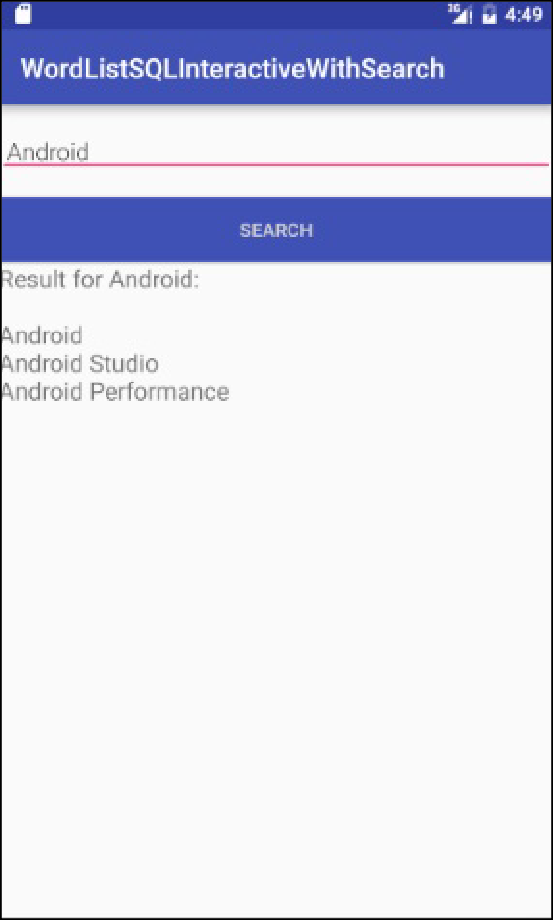

# TP 04.1B: Searching a SQLite Database


## Bienvenue


Ces travaux pratiques se base sur le cours de base pour les développeurs Android fourni par Google afin de  les préparer pour le test de certification  [Associate Android Developer](https://developers.google.com/training/certification/associate-android-developer/). Vous obtiendrez le plus de valeur de ce TP si vous travaillez successivement dans les codelabs.

### What you should already know

Vous devriez être familier avec:

* SQLite databases
* Writing basic SQLite queries

### What you'll learn

* Add search functionality to your app via the options menu
* Build search queries for the SQLite database from user input.

### What you'll do

In this practical you will add an item to the options menu for searching the database, and an activity that allows users to enter a search string and displays the result of the search in a text view.

**Why**: Users should always be able to search the data on their own terms.

**Note**: The focus of this practical is not optimizing the UX of the search request, but showing you how to query the database.


## Aperçu de l'application


You will make a copy of the finished WordListSQLInteractive app (or WordListSqlStarterCode if you didn't rename it; from a previous practical), call it WordListSQLInteractiveWithSearch, and add an activity that lets users search for partial and full words in the database. For example, entering "Android" will return all entries that contain the substring "Android".




## Tâche 0: Download and run the base code


In order to save you some work, this practical will build on an app you have already built. In a production environment, building on existing application code is a common developer task to add features or fix problems.

### 1. Create your project

1. Download the  [WordListSQL finished ](https://github.com/khammami/android-fundamentals-v1/tree/master/WordListSql%20finished)app.

You can use your own app, or download the base app. As long as the app uses a SQLite database, you can use these instructions to extend it.
2. Load a copy of the app into Android Studio. Refer to the  [Appendix ](https://google-developer-training.gitbooks.io/android-developer-fundamentals-course-practicals/content/appendix_utilities.html#copy_project)for information on copying a project.
3. Rename the package using **Refactor &gt; Rename**.
4. Change the package name in your `build.gradle` file.
5. Run the app to ensure it builds and functions correctly.


## Tâche 1: Add Search


### 1.1. Add an Options Menu with Search item

Use the OptionsMenuSample code from your previous practicals if you need an example of how to do this.

1. In your project, create an Android Resource directory and call it menu with "**menu**" as the resource type (**res &gt; menu**).
2. Add a **main_menu.xml** menu resource file to **res &gt; menu**.
3. Create a menu with one item **Search**. Reference the code snippet for values.

```
<menu
   xmlns:android="http://schemas.android.com/apk/res/android"
   xmlns:app = "http://schemas.android.com/apk/res-auto"
   xmlns:tools="http://schemas.android.com/tools"
   tools:context="com.android.example.wordlistsqlsearchable.MainActivity">
   <item
       android:id="@+id/action_search"
       android:title="Search..."
       android:orderInCategory="1"
       app:showAsAction="never" />
</menu>
```

4. In `MainAcvitiy`, inflate the menu by overriding `onCreateOptionsMenu`.

```
@Override
public boolean onCreateOptionsMenu(Menu menu) {
   getMenuInflater().inflate(R.menu.menu_main, menu);
   return true;
}
```

5. Override `onOptionsItemSelected` method. Switch on `action_search`, and just return true.

```
@Override
public boolean onOptionsItemSelected(MenuItem item) {
   switch (item.getItemId()) {
       case R.id.action_search:
       return true;
   }
   return super.onOptionsItemSelected(item);
}
```

6. Run your app. You should see the dots for the options menu. When you click it, you should see one menu item for search that does nothing.

### 1.2. Create the layout for the search activity

This layout is similar to `activity_edit_word`, so you can take advantage of existing code and copy it.

1. Create a copy of `activity_editword` and call it `activity_search.xml`.
2. In `activity_search.xml`, change the id's and strings to be representative of searching.
3. Change the `onClick` method for the button to `showResult`.
4. Add a `TextView` with an id of `search_result`, at least 300dp height, and 18sp font size.
5. Run your app. You should notice no difference.

### 1.3. Add an Activity for searching

1. Create a new activity, `SearchActivity`. If your create it by **New &gt; Android &gt; Activity** then DON'T generate the layout file because we created it in the previous task.
2. Add a private `TextView` class variable `mTextView`.
3. Add a private `EditText` class variable `mEditWordView`.
4. Add a private `WordListOpenHelper` variable `mDB`.
5.  In `onCreate`, initialize `mDB` with a `new WordListOpenHelper(this)`.
6. In `onCreate`, initialize `mTextView` and `mEditWordView` to their respective views.

```
public class SearchActivity extends AppCompatActivity {

   private static final String TAG = EditWordActivity.class.getSimpleName();

   private TextView mTextView;
   private EditText mEditWordView;
   private WordListOpenHelper mDB;

   @Override
   public void onCreate(Bundle savedInstanceState) {
      super.onCreate(savedInstanceState);
      setContentView(R.layout.activity_search);

      mEditWordView = ((EditText) findViewById(R.id.search_word));
      mTextView = ((TextView) findViewById(R.id.search_result));
      mDB = new WordListOpenHelper(this);
   }
}
```

7. Add the activity to the `AndroidManifest`.

```
<activity
    android:name="com.android.example.wordlistsqlsearchable.SearchActivity">
</activity>
```

### 1.4. Trigger SearchActivity from the menu

1. To start `SearchActivity` when the menu item is selected, insert code to start `SearchActivity` into the switch statement in the `onOptionSelected()` method in `MainActivity`.

```
Intent intent = new Intent(getBaseContext(), SearchActivity.class);
startActivity(intent);
```

2. Build and run your app to make sure `SearchActivity` is launched when the "Search" menu item is selected from the `OptionsMenu`.
3. Enter a search string and press "Search". Your app crashes.
4. Find out why the app has crashed, then move to the next task.

### 1.5. Implement the onClick handler for the Search button in the SearchActivity

Your app crashed, because the `onClick` handler set for the **Search** button in the XML code doesn't exist yet. So you will build `showResult` next.

When the **Search** button is pressed, several things need to happen:

* The event handler calls `public void showResult(View view)` in `SearchActivity`.
* Your app has to get the current value from the `mEditWordView`, which is your search string. 
* You print the "Result for" and the word in `mTextView`.
* You call the (not yet written) search function on `mDB` (`mDB.search(word)` and get back a SQlite database cursor. You will implement the search function in the next task.
* You process the cursor and add the result to `mTextView`.

1. In `SearchActivity`, create the `showResult` function. It is public, takes a `View` argument, and returns nothing.
2. Create a `String` variable called word and initialize it with the contents of the input edit text view, `mEditWordView` .
3. Show the search term in the search results `TextView`; something like

```
"Search term: " + word
```

4. Search the database and get the cursor.

```
Cursor cursor = mDB.search(word);
```

5. To process the cursor, you need to do the following:
5.1. Make sure the cursor is not null.
5.2. Move the cursor to the first entry.
5.3. Iterate over the cursor processing the current entry, then advancing the cursor.
5.4. Extract the word.
5.5. Display the word in the text view.
6. Close the cursor.
7. If no results are found, the user sees a blank screen with no results. You would want this to be handled in a production app.
8. Check the annotated code for additional details.

```
public void showResult(View view){
   String word = mEditWordView.getText().toString();
   mTextView.setText("Result for " + word + ":\n\n");

   // Search for the word in the database.
   Cursor cursor = mDB.search(word);

   // Only process a non-null cursor with rows.
   if (cursor != null & cursor.getCount() > 0) {
       // You must move the cursor to the first item.
       cursor.moveToFirst();
       int index;
       String result;
       // Iterate over the cursor, while there are entries.
       do {
           // Don't guess at the column index.
           // Get the index for the named column.
           index = cursor.getColumnIndex(WordListOpenHelper.KEY_WORD);
           // Get the value from the column for the current cursor.
           result = cursor.getString(index);
           // Add result to what's already in the text view.
           mTextView.append(result + "\n");
       } while (cursor.moveToNext()); // Returns true or false
       cursor.close();
   } // You should add some handling of null case. Right now, nothing happens.
}
```

Your app will not run without at least a stub for `search()` implemented. Android Studio will create the stub for you. In the light bulb, choose create method.

9. Open `WordListOpenHelper`.
10. Implement a stub for search, with a `String` parameter, that returns a null cursor.
11. Run your app and fix any errors you may have. Note that most of the code in `showResult()` is not exercised yet.

### 1.6. Implement the search method in WordListOpenHelper

The final step is to implement the actual searching of the database.

Inside the `search()` method, you need to build a query with the search string and send the query to the database. A more secure way to do this is by using parameters for each part of the query.

**WHY**: In the previous practical, for the query in `WordListOpenHelper`, you could build the query string directly and submit it as a `rawQuery()`, because you had full control over the contents of the query. As soon as you are handling user input, you must assume that it could be malicious.

**Important**: For security reasons, you should always validate user input before you build your query! You will learn more about security in the Security chapter and  [Security Tips](https://developer.android.com/training/articles/security-tips.html).

The SQL query for searching for all entries in the wordlist matching a substring has this form:

```
SELECT * FROM WORD_LIST_TABLE WHERE KEY_WORD LIKE %searchString%;
```

The parametrized form of the query method you will call looks like this:

```
Cursor query (String table, // The table to query
             String[] columns, // The columns to return
             String selection, // WHERE statement
             String[] selectionArgs, // Arguments to WHERE
             String groupBy, // Grouping filter. Not used.
             String having, // Additional condition filter. Not used.
             String orderBy) // Ordering. Setting to null uses default.
```

See the  [SQLite Database Android ](https://developer.android.com/reference/android/database/sqlite/SQLiteDatabase.html)and the documentation for various `query()`) methods. For the query in the `search()` method, you need to assign only the first four arguments.

1. The table is already defined as the `WORD_LIST_TABLE` constant.
2. In `search()`, create a variable for the columns. You need only the value from the `KEY_WORD` column.

```
String[] columns = new String[]{KEY_WORD};
```

3. Add the `%` to the `searchString` parameter.

```
searchString = "%" + searchString + "%";
```

4. Create the where clause. Omit "`WHERE`" as it's implied. Use a question mark for the argument to `LIKE`. Make sure you have the correct spacing.

```
String where = KEY_WORD + " LIKE ?";
```

5. Specify the argument to the where clause, which is the `searchString`.

```
String[] whereArgs = new String[]{searchString};
```

6. Add a `Cursor` cursor variable and initialize it to null.
7. In a try/catch block.
7.1. Get a readable database if `mReadable` is not set yet.
7.2. Query the database using the above form of the query. Pass null for the unused parameters.
7.3. Handle the exception. You can just log it.

8. Return the cursor.
9. Run your app and search for some strings.

**Here is the solution for the complete method:**

```
public Cursor search (String searchString) {
   String[] columns = new String[]{KEY_WORD};
   searchString = "%" + searchString + "%";
   String where = KEY_WORD + " LIKE ?";
   String[]whereArgs = new String[]{searchString};

   Cursor cursor = null;

   try {
       if (mReadableDB == null) {mReadableDB = getReadableDatabase();}
       cursor = mReadableDB.query(WORD_LIST_TABLE, columns, where, whereArgs, null, null, null);
   } catch (Exception e) {
       Log.d(TAG, "SEARCH EXCEPTION! " + e);
   }
  
   return cursor;
}
```

**Solution code**

Android Studio project:  [WordListSqlSearchable](https://github.com/khammami/android-fundamentals-v1/tree/master/WordListSqlSearchable)


## Résumé


In this chapter, you learned how to

* Use a  [`SQLiteDatabase`](https://developer.android.com/reference/android/database/sqlite/SQLiteDatabase.html) to store user data persistently. 
* Work with a  [`SQLiteOpenHelper`](https://developer.android.com/reference/android/database/sqlite/SQLiteOpenHelper.html) to manage your database. Retrieve and display data from the database
* Edit data in the user interface and reflect those changes in the database


## Apprendre encore plus


Android developer documentation:

*  [Storage Options](http://developer.android.com/guide/topics/data/data-storage.html)
*  [Saving Data in SQL Databases](http://developer.android.com/training/basics/data-storage/databases.html)


