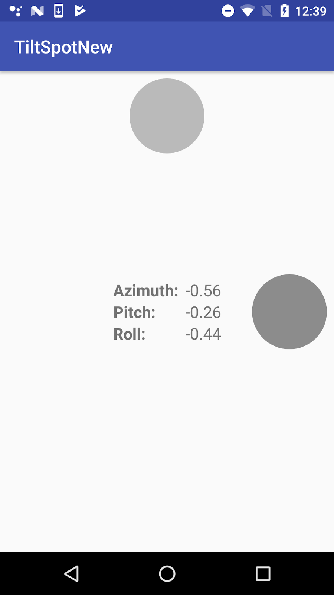
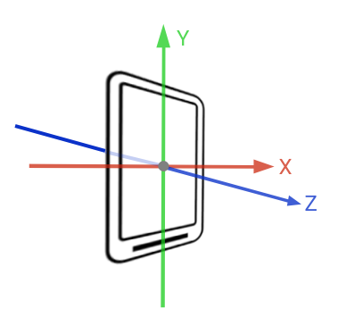
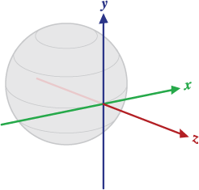
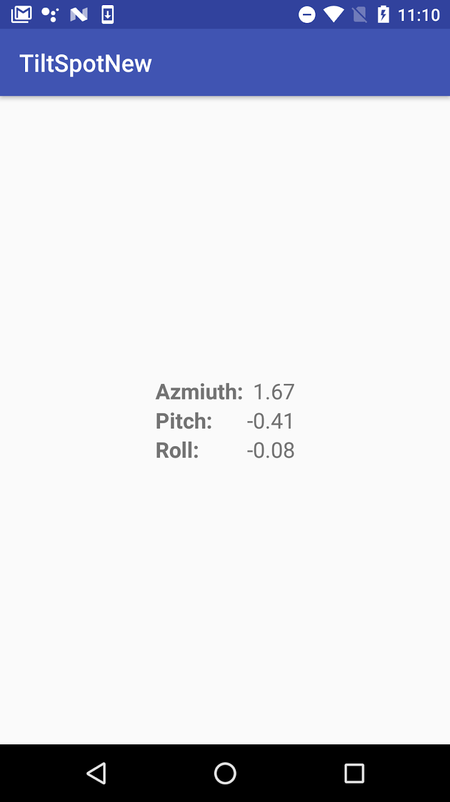
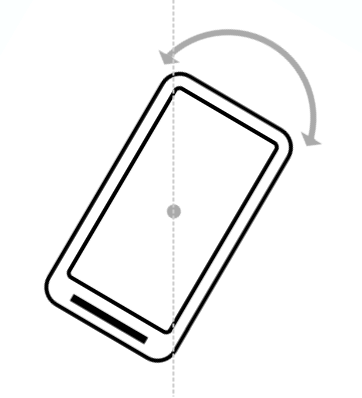
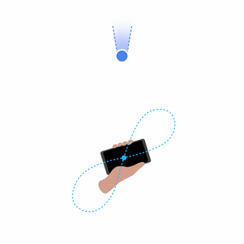
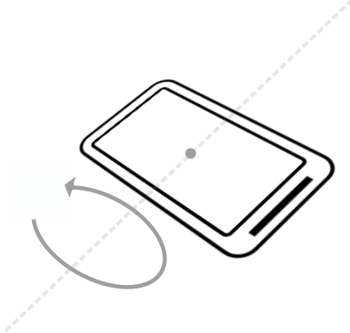
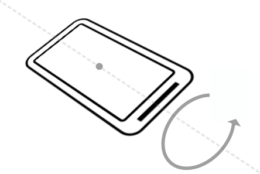
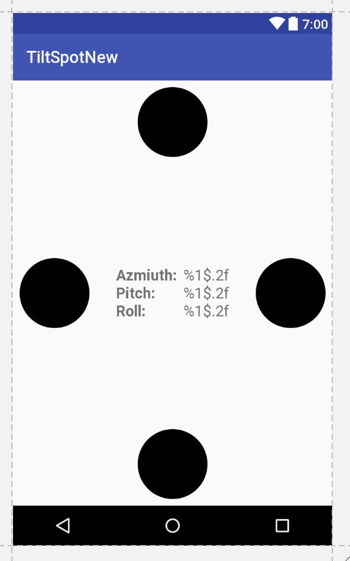

# P 04.2: Sensor-based orientation


## Welcome


### Introduction

The Android platform provides several sensors that enable your app to monitor the motion or position of a device, in addition to other sensors such as the light sensor.

Motion sensors such as the accelerometer or gyroscope are useful for monitoring device movement such as tilt, shake, rotation, or swing. Position sensors are useful for determining a device's physical position in relation to the Earth. For example, you can use a device's geomagnetic field sensor to determine its position relative to the magnetic north pole.

A common use of motion and position sensors, especially for games, is to determine the orientation of the device, that is, the device's bearing (north/south/east/west) and tilt. For example, a driving game could allow the user to control acceleration with a forward tilt or backward tilt, and control steering with a left tilt or right tilt.

Early versions of Android included an explicit sensor type for orientation (  [`Sensor.TYPE_ORIENTATION`](https://developer.android.com/reference/android/hardware/Sensor.html#TYPE_ORIENTATION)). The orientation sensor was software-only, and it combined data from other sensors to determine bearing and tilt for the device. Because of problems with the accuracy of the algorithm, this sensor type was deprecated in API 8 and may be unavailable in current devices. The recommended way to determine device orientation involves using both the accelerometer and geomagnetic field sensor and several methods in the  [`SensorManager`](https://developer.android.com/reference/android/hardware/SensorManager.html) class. These sensors are common, even on older devices. This is the process you learn in this practical.

### What you should already know

You should be familiar with:

* Creating, building, and running apps in Android Studio.
* Using the Android sensor framework to gain access to available sensors on the device, and to register and unregister listeners for those sensors.
* Using the  [`onSensorChanged()`](https://developer.android.com/reference/android/hardware/SensorEventListener.html#onSensorChanged(android.hardware.SensorEvent)) method from the  [`SensorEventListener`](https://developer.android.com/reference/android/hardware/SensorEventListener.html) interface to handle changes to sensor data.

### What you'll learn

* What the accelerometer and magnetometer sensors do.
* The differences between the device-coordinate system and the Earth coordinate system, and which sensors use which systems.
* Orientation angles (azimuth, pitch, roll), and how they relate to other coordinate systems.
* How to use methods from the sensor manager to get the device orientation angles.
* How activity rotation (portrait or landscape) affects sensor input.

### What you'll do

* Download and explore a starter app.
* Get the orientation angles from the accelerometer and magnetometer, and update text views in the activity to display those values.
* Change the color of a shape drawable to indicate which edge of the device is tilted up.
* Handle changes to the sensor data when the device is rotated from portrait to landscape.


## App overview


The TiltSpot app displays the device orientation angles as numbers and as colored spots along the four edges of the device screen. There are three components to device orientation:

* *Azimuth*: The direction (north/south/east/west) the device is pointing. 0 is magnetic north.
* *Pitch*: The top-to-bottom tilt of the device. 0 is flat.
* *Roll*: The left-to-right tilt of the device. 0 is flat.

When you tilt the device, the spots along the edges that are tilted up become darker.




## Task 1. Build the TiltSpot app


In this task you download and open the starter app for the project and explore the layout and activity code. Then you implement the  [`onSensorChanged()`](https://developer.android.com/reference/android/hardware/SensorEventListener.html#onSensorChanged(android.hardware.SensorEvent)) method to get data from the sensors, convert that data into orientation angles, and report updates to sensor data in several text views.

### 1.1 Download and explore the starter app

1. Download the  [TiltSpot_start](https://github.com/khammami/android-advanced-starter-apps/tree/master/TiltSpot_start) app and open it in Android Studio.
2. Open `res/layout/activity_main.xml`.

The initial layout for the TiltSpot app includes several text views to display the device orientation angles (azimuth, pitch, and roll)—you learn more about how these angles work later in the practical. All those textviews are nested inside their own constraint layout to center them both horizontally and vertically within the activity. You need the nested constraint layout because later in the practical you add the spots around the edges of the screen and around this inner text view.

3. Open `MainActivity`.

`MainActivity` in this starter app contains much of the skeleton code for managing sensors and sensor data as you learned about in the last practical.

4. Examine the `onCreate()` method.

This method gets an instance of the  [`SensorManager`](https://developer.android.com/reference/android/hardware/SensorManager.html) service, and then uses the  [`getDefaultSensor()`](https://developer.android.com/reference/android/hardware/SensorManager.html#getDefaultSensor(int)) method to retrieve specific sensors. In this app those sensors are the accelerometer (  [`Sensor.TYPE_ACCELEROMETER`](https://developer.android.com/reference/android/hardware/Sensor.html#TYPE_ACCELEROMETER)) and the magnetometer (  [`Sensor.TYPE_MAGNETIC_FIELD`](https://developer.android.com/reference/android/hardware/Sensor.html#TYPE_MAGNETIC_FIELD)).

The *accelerometer* measures acceleration forces on the device; that is, it measures how fast the device is accelerating, and in which direction. Acceleration force includes the force of gravity. The accelerometer is sensitive, so even when you think you're holding the device still or leaving it motionless on a table, the accelerometer is recording minute forces, either from gravity or from the environment. This makes the data generated by the accelerometer very "noisy."

The *magnetometer*, also known as the *geomagnetic field sensor*, measures the strength of magnetic fields around the device, including Earth's magnetic field. You can use the magnetometer to find the device's position with respect to the external world. However, magnetic fields can also be generated by other devices in the vicinity, by external factors such as your location on Earth (because the magnetic field is weaker toward the equator), or even by solar winds.

Neither the accelerometer nor the magnetometer alone can determine device tilt or orientation. However, the Android sensor framework can combine data from both sensors to get a fairly accurate device orientation—accurate enough for the purposes of this app, at least.

5. At the top of `onCreate()`, note this line:

```
setRequestedOrientation(ActivityInfo.SCREEN_ORIENTATION_PORTRAIT);
```

This line locks the activity in portrait mode, to prevent the app from automatically rotating the activity as you tilt the device. Activity rotation and sensor data can interact in unexpected ways. Later in the practical, you explicitly handle sensor data changes in your app in response to activity rotation, and remove this line.

6. Examine the `onStart()` and `onStop()` methods. The `onStart()` method registers the listeners for the accelerometer and magnetometer, and the `onStop()` method unregisters them.
7. Examine  [`onSensorChanged()`](https://developer.android.com/reference/android/hardware/SensorEventListener.html#onSensorChanged(android.hardware.SensorEvent)) and  [`onAccuracyChanged()`](https://developer.android.com/reference/android/hardware/SensorEventListener.html#onAccuracyChanged(android.hardware.Sensor,%20int)). These are the methods from the  [`SensorEventListener`](https://developer.android.com/reference/android/hardware/SensorEventListener.html) interface that you have to implement. The `onAccuracyChanged()` method is empty because it is unused in this class. You implement `onSensorChanged()` in the next task.

### 1.2 Get sensor data and calculate orientation angles

In this task you implement the `onSensorChanged()` method to get raw sensor data, use methods from the `SensorManager` to convert that data to device orientation angles, and update the text views with those values.

1. Open `MainActivity`.
2. Add member variables to hold copies of the accelerometer and magnetometer data.

```
private float[] mAccelerometerData = new float[3];
private float[] mMagnetometerData = new float[3];
```

When a sensor event occurs, both the accelerometer and the magnetometer produce arrays of floating-point values representing points on the *x*-axis, *y*-axis, and *z*-axis of the device's coordinate system. You will combine the data from both these sensors, and over several calls to `onSensorChanged()`, so you need to retain a copy of this data each time it changes.

3. Scroll down to the `onSensorChanged()` method. Add a line to get the sensor type from the sensor event object:

```
int sensorType = sensorEvent.sensor.getType();
```

4. Add tests for the accelerometer and magnetometer sensor types, and clone the event data into the appropriate member variables:

```
switch (sensorType) {
   case Sensor.TYPE_ACCELEROMETER:
       mAccelerometerData = sensorEvent.values.clone();
       break;
   case Sensor.TYPE_MAGNETIC_FIELD:
       mMagnetometerData = sensorEvent.values.clone();
       break;
   default:
       return;
}
```

You use the  [`clone()`](https://developer.android.com/reference/java/lang/Object.html#clone()) method to explicitly make a copy of the data in the `values` array. The  [`SensorEvent`](https://developer.android.com/reference/android/hardware/SensorEvent.html) object (and the array of values it contains) is reused across calls to `onSensorChanged()`. Cloning those values prevents the data you're currently interested in from being changed by more recent data before you're done with it.

5. After the `switch` statement, use the  [`SensorManager.getRotationMatrix()`](https://developer.android.com/reference/android/hardware/SensorManager.html#getRotationMatrix(float%5B%5D,%20float%5B%5D,%20float%5B%5D,%20float%5B%5D)) method to generate a rotation matrix (explained below) from the raw accelerometer and magnetometer data. The matrix is used in the next step to get the device orientation, which is what you're really interested in.

```
float[] rotationMatrix = new float[9];
boolean rotationOK = SensorManager.getRotationMatrix(rotationMatrix,
   null, mAccelerometerData, mMagnetometerData);
```

A  [rotation matrix](https://en.wikipedia.org/wiki/Rotation_matrix) is a linear algebra term that translates the sensor data from one coordinate system to another—in this case, from the device's coordinate system to the Earth's coordinate system. That matrix is an array of nine `float` values, because each point (on all three axes) is expressed as a 3D vector.

The device-coordinate system is a standard 3-axis (*x*, *y*, *z*) coordinate system relative to the device's screen when it is held in the default or natural orientation. Most sensors use this coordinate system. In this orientation:

* The *x*-axis is horizontal and points to the right edge of the device.
* The *y*-axis is vertical and points to the top edge of the device.
* The *z*-axis extends up from the surface of the screen. Negative *z* values are behind the screen.



The Earth's coordinate system is also a 3-axis system, but relative to the surface of the Earth itself. In the Earth's coordinate system:

* The *y*-axis points to magnetic north along the surface of the Earth.
* The *x*-axis is 90 degrees from *y*, pointing approximately east.
* The *z*-axis extends up into space. Negative *z* extends down into the ground.



A reference to the array for the rotation matrix is passed into the `getRotationMatrix()` method and modified in place. The second argument to `getRotationMatrix()` is an inclination matrix, which you don't need for this app. You can use null for this argument.

The `getRotationMatrix()` method returns a boolean (the `rotationOK` variable), which is `true` if the rotation was successful. The boolean might be `false` if the device is free-falling (meaning that the force of gravity is close to 0), or if the device is pointed very close to magnetic north. The incoming sensor data is unreliable in these cases, and the matrix can't be calculated. Although the boolean value is almost always `true`, it's good practice to check that value anyhow.

6. Call the  [`SensorManager.getOrientation()`](https://developer.android.com/reference/android/hardware/SensorManager.html#getOrientation(float%5B%5D,%20float%5B%5D)) method to get the orientation angles from the rotation matrix. As with `getRotationMatrix()`, the array of `float` values containing those angles is supplied to the `getOrientation()` method and modified in place.

```
float orientationValues[] = new float[3];
if (rotationOK) {
    SensorManager.getOrientation(rotationMatrix, orientationValues);
}
```

The angles returned by the `getOrientation()` method describe how far the device is oriented or tilted with respect to the Earth's coordinate system. There are three components to orientation:

* *Azimuth*: The direction (north/south/east/west) the device is pointing. 0 is magnetic north.
* *Pitch*: The top-to-bottom tilt of the device. 0 is flat.
* *Roll*: The left-to-right tilt of the device. 0 is flat.

All three angles are measured in radians, and range from -π (-3.141) to π.

7. Create variables for azimuth, pitch, and roll, to contain each component of the `orientationValues` array. You adjust this data later in the practical, which is why it is helpful to have these separate variables.

```
float azimuth = orientationValues[0];
float pitch = orientationValues[1];
float roll = orientationValues[2];
```

8. Get the placeholder strings, from the resources, fill the placeholder strings with the orientation angles and update all the text views.

```
mTextSensorAzimuth.setText(getResources().getString(
   R.string.value_format, azimuth));
mTextSensorPitch.setText(getResources().getString(
   R.string.value_format, pitch));
mTextSensorRoll.setText(getResources().getString(
   R.string.value_format, roll));
```

The string (`value_format` in `strings.xml`) contains placeholder code (`"%1$.2f"`) that formats the incoming floating-point value to two decimal places.

```
<string name="value_format">%1$.2f</string>
```

### 1.3 Build and run the app

1. Run the app. Place your device flat on the table. The output of the app looks something like this:



Even a motionless device shows fluctuating values for the azimuth, pitch, and roll. Note also that even though the device is flat, the values for pitch and roll may not be 0. This is because the device sensors are extremely sensitive and pick up even tiny changes to the environment, both changes in motion and changes in ambient magnetic fields.

2. Turn the device on the table from left to right, leaving it flat on the table.  

Note how the value of the azimuth changes. An azimuth value of 0 indicates that the device is pointing (roughly) north.

Note that even if the value of the azimuth is 0, the device may not be pointing exactly north. The device magnetometer measures the strength of any magnetic fields, not just that of the Earth. If you are in the presence of other magnetic fields (most electronics emit magnetic fields, including the device itself), the accuracy of the magnetometer may not be exact.

Note: If the azimuth on your device seems very far off from actual north, you can calibrate the magnetometer by waving the device a few times in the air  [in a figure-eight motion](https://physics.stackexchange.com/questions/17587/what-is-reason-for-electronic-compass-calibration).



3. Lift the bottom edge of the device so the screen is tilted away from you. Note the change to the pitch value. Pitch indicates the top-to-bottom angle of tilt around the device's horizontal axis.  
4. Lift the left side of the device so that it is tilted to the right. Note the change to the roll value. Roll indicates the left-to-right tilt along the device's vertical axis.



5. Pick up the device and tilt it in various directions. Note the changes to the pitch and roll values as the device's tilt changes. What is the maximum value you can find for any tilt direction, and in what device position does that maximum occur?


## Task 2. Add the spots


In this task you update the layout to include spots along each edge of the screen, and change the opaqueness of the spots so that they become darker when a given edge of the screen is tilted up.

The color changes in the spots rely on dynamically changing the alpha value of a shape drawable in response to new sensor data. The alpha determines the opacity of that drawable, so that smaller alpha values produce a lighter shape, and larger values produce a darker shape.

### 2.1 Add the spots and modify the layout

1. Add a new file called `spot.xml` to the project, in the `res/drawable` directory. (Create the directory if needed.)
2. Replace the selector tag in `spot.xml` with an oval shape drawable whose color is solid black (`"@android:color/black"`):

```
<shape
   xmlns:android="http://schemas.android.com/apk/res/android"
   android:shape="oval">
   <solid android:color="@android:color/black"/>
</shape>
```

3. Open `res/values/dimens.xml`. Add a dimension for the spot size:

```
<dimen name="spot_size">84dp</dimen>
```

4. In `activity_layout.xml`, add an `ImageView` after the inner `ConstraintLayout`, and before the outer one. Use these attributes:

| <strong>Attribute</strong> | <strong>Value</strong> |
| --- | --- |
| android:id | &#34;@+id/spot_top&#34; |
| android:layout_width | &#34;@dimen/spot_size&#34; |
| android:layout_height | &#34;@dimen/spot_size&#34; |
| android:layout_margin | &#34;@dimen/base_margin&#34; |
| app:layout_constraintLeft_toLeftOf | &#34;parent&#34; |
| app:layout_constraintRight_toRightOf | &#34;parent&#34; |
| app:layout_constraintTop_toTopOf | &#34;parent&#34; |
| app:srcCompat | &#34;@drawable/spot&#34; |
| tools:ignore | &#34;ContentDescription&#34; |

This view places a spot drawable the size of the `spot_size` dimension at the top edge of the screen. Use the  [`app:srcCompat`](https://developer.android.com/reference/android/support/v7/appcompat/R.attr.html?utm_campaign=android_launch_supportlibrary23.2_022216#srcCompa) attribute for a vector drawable in an `ImageView` (versus `android:src` for an actual image.) The `app:srcCompat` attribute is available in the  [Android Support Library](https://android-developers.googleblog.com/2016/02/android-support-library-232.html) and provides the greatest compatibility for vector drawables.

The  [`tools:ignore`](https://developer.android.com/studio/write/tool-attributes.html) attribute is used to suppress warnings in Android Studio about a missing content description. Generally `ImageView` views need alternate text for sight-impaired users, but this app does not use or require them, so you can suppress the warning here.

5. Add the following code below that first `ImageView`. This code adds the other three spots along the remaining edges of the screen.

```
<ImageView
   android:id="@+id/spot_bottom"
   android:layout_width="@dimen/spot_size"
   android:layout_height="@dimen/spot_size"
   android:layout_marginBottom="@dimen/base_margin"
   app:layout_constraintBottom_toBottomOf="parent"
   app:layout_constraintLeft_toLeftOf="parent"
   app:layout_constraintRight_toRightOf="parent"
   app:srcCompat="@drawable/spot"
   tools:ignore="ContentDescription" />

<ImageView
   android:id="@+id/spot_right"
   android:layout_width="@dimen/spot_size"
   android:layout_height="@dimen/spot_size"
   android:layout_marginEnd="@dimen/base_margin"
   android:layout_marginRight="@dimen/base_margin"
   app:layout_constraintBottom_toBottomOf="parent"
   app:layout_constraintRight_toRightOf="parent"
   app:layout_constraintTop_toTopOf="parent"
   app:srcCompat="@drawable/spot"
   tools:ignore="ContentDescription"/>

<ImageView
   android:id="@+id/spot_left"
   android:layout_width="@dimen/spot_size"
   android:layout_height="@dimen/spot_size"
   android:layout_marginLeft="@dimen/base_margin"
   android:layout_marginStart="@dimen/base_margin"
   app:layout_constraintBottom_toBottomOf="parent"
   app:layout_constraintLeft_toLeftOf="parent"
   app:layout_constraintTop_toTopOf="parent"
   app:srcCompat="@drawable/spot"
   tools:ignore="ContentDescription" />
```

The layout preview should now look like this:



6. Add the  [`android:alpha`](https://developer.android.com/reference/android/support/v7/appcompat/R.attr.html#alpha) attribute to all four `ImageView` elements, and set the value to `"0.05"`. The alpha is the opacity of the shape. Smaller values are less opaque (less visible). Setting the value to 0.05 makes the shape very nearly invisible, but you can still see them in the layout view.

### 2.2 Update the spot color with new sensor data

Next you modify the `onSensorChanged()` method to set the alpha value of the spots in response to the pitch and roll values from the sensor data. A higher sensor value indicates a larger degree of tilt. The higher the sensor value, the more opaque (the darker) you make the spot.

1. In `MainActivity`, add member variables at the top of the class for each of the spot `ImageView` objects:

```
private ImageView mSpotTop;
private ImageView mSpotBottom;
private ImageView mSpotLeft;
private ImageView mSpotRight;
```

2. In `onCreate()`, just after initializing the text views for the sensor data, initialize the spot views:

```
mSpotTop = (ImageView) findViewById(R.id.spot_top);
mSpotBottom = (ImageView) findViewById(R.id.spot_bottom);
mSpotLeft = (ImageView) findViewById(R.id.spot_left);
mSpotRight = (ImageView) findViewById(R.id.spot_right);
```

3. In `onSensorChanged()`, right after the lines that initialize the azimuth, pitch, and roll variables, reset the pitch or roll values that are close to 0 (less than the value of the `VALUE_DRIFT` constant) to be 0:

```
if (Math.abs(pitch) < VALUE_DRIFT) {
    pitch = 0;
}
if (Math.abs(roll) < VALUE_DRIFT) {
    roll = 0;
}
```

When you initially ran the TiltSpot app, the sensors reported very small non-zero values for the pitch and roll even when the device was flat and stationary. Those small values can cause the app to flash very light-colored spots on all the edges of the screen. In this code if the values are close to 0 (in either the positive or negative direction), you reset them to 0.

4. Scroll down to the end of `onSensorChanged()`, and add these lines to set the alpha of all the spots to 0. This resets all the spots to be invisible each time `onSensorChanged()` is called. This is necessary because sometimes if you tilt the device too quickly, the old values for the spots stick around and retain their darker color. Resetting them each time prevents these artifacts.

```
mSpotTop.setAlpha(0f);
mSpotBottom.setAlpha(0f);
mSpotLeft.setAlpha(0f);
mSpotRight.setAlpha(0f);
```

5. Update the alpha value for the appropriate spot with the values for pitch and roll.

```
if (pitch > 0) {
   mSpotBottom.setAlpha(pitch);
} else {
   mSpotTop.setAlpha(Math.abs(pitch));
}
if (roll > 0) {
   mSpotLeft.setAlpha(roll);
} else {
   mSpotRight.setAlpha(Math.abs(roll));
}
```

Note that the pitch and roll values you calculated in the previous task are in radians, and their values range from -π to +π. Alpha values, on the other hand, range only from 0.0 to 1.0. You could do the math to convert radian units to alpha values, but you may have noted earlier that the higher pitch and roll values only occur when the device is tilted vertical or even upside down. For the TiltSpot app you're only interested in displaying dots in response to *some* device tilt, not the full range. This means that you can conveniently use the radian units directly as input to the alpha.

6. Build and run the app.

You should now be able to tilt the device and have the edge facing "up" display a dot which becomes darker the further up you tilt the device.


## Task 3. Handle activity rotation


The Android system itself uses the accelerometer to determine when the user has turned the device sideways (from portrait to landscape mode, for a phone). The system responds to this rotation by ending the current activity and recreating it in the new orientation, redrawing your activity layout with the "top," "bottom," "left," and "right" edges of the screen now reflecting the new device position.

You may assume that with TiltSpot, if you rotate the device from landscape to portrait, the sensors will report the correct data for the new device orientation, and the spots will continue to appear on the correct edges. That's not the case. When the activity rotates, the activity drawing coordinate system rotates with it, but the sensor coordinate system remains the same. The sensor coordinate system *never* changes position, regardless of the orientation of the device.

The second tricky point for handling activity rotation is that the default or natural orientation for your device may not be portrait. The default orientation for many tablet devices is landscape. The sensor's coordinate system is always based on the natural orientation of a device.

The TiltSpot starter app included a line in `onCreate()` to lock the orientation to portrait mode:

```
setRequestedOrientation (ActivityInfo.SCREEN_ORIENTATION_PORTRAIT);
```

Locking the screen to portrait mode in this way solves one problem—it prevents the coordinate systems from getting out of sync on portrait-default devices. But on landscape-default devices, the technique forces an activity rotation, which causes the device and sensor-coordinate systems to get out of sync.

Here's the right way to handle device and activity rotation in sensor-based drawing: First, use the  [`Display.getRotation()`](https://developer.android.com/reference/android/view/Display.html#getRotation()) method to query the current device orientation. Then use the  [`SensorManager.remapCoordinateSystem()`](https://developer.android.com/reference/android/hardware/SensorManager.html#remapCoordinateSystem(float%5B%5D,%20int,%20int,%20float%5B%5D)) method to remap the rotation matrix from the sensor data onto the correct axes. This is the technique you use in the TiltSpot app in this task.

The getRotation() method returns one of four integer constants, defined by the Surface class:

*  [`ROTATION_0`](https://developer.android.com/reference/android/view/Surface.html#ROTATION_0): The default orientation of the device (portrait for phones).
*  [`ROTATION_90`](https://developer.android.com/reference/android/view/Surface.html#ROTATION_90): The "sideways" orientation of the device (landscape for phones). Different devices may report 90 degrees either clockwise or counterclockwise from 0.
*  [`ROTATION_180`](https://developer.android.com/reference/android/view/Surface.html#ROTATION_180): Upside-down orientation, if the device allows it.
*  [`ROTATION_270`](https://developer.android.com/reference/android/view/Surface.html#ROTATION_270): Sideways orientation, in the opposite direction from ROTATION_90.

Note that many devices do not have `ROTATION_180` at all or return `ROTATION_90` or `ROTATION_270` regardless of which direction the device was rotated (clockwise or counterclockwise). It is best to handle all possible rotations rather than to make assumptions for any particular device.

### 3.1 Get the device rotation and remap the coordinate system

1. In `MainActivity`, edit `onCreate()` to remove or comment out the call to `setRequestedOrientation()`.

```
//setRequestedOrientation(ActivityInfo.SCREEN_ORIENTATION_PORTRAIT);
```

2. In `MainActivity`, add a member variable for the  [`Display`](https://developer.android.com/reference/android/view/Display.html) object.

```
private Display mDisplay;
```

3. At the end of `onCreate()`, get a reference to the window manager, and then get the default display. You use the display to get the rotation in `onSensorChanged()`.

```
WindowManager wm = (WindowManager) getSystemService(WINDOW_SERVICE);
mDisplay = wm.getDefaultDisplay();
```

4. In `onSensorChanged()`, just after the call to `getRotationMatrix()`, add a new array of float values to hold the new adjusted rotation matrix.

```
float[] rotationMatrixAdjusted = new float[9];
```

5. Get the current device rotation from the display and add a `switch` statement for that value. Use the rotation constants from the `Surface` class for each case in the switch. For `ROTATION_0`, the default orientation, you don't need to remap the coordinates. You can just clone the data in the existing rotation matrix:

```
switch (mDisplay.getRotation()) {
   case Surface.ROTATION_0:
      rotationMatrixAdjusted = rotationMatrix.clone();
      break;
}
```

6. Add additional cases for the other rotations, and call the `SensorManager.remapCoordinateSystem()` method for each of these cases.

This method takes as arguments the original rotation matrix, the two new axes on which you want to remap the existing *x*-axis and *y*-axis, and an array to populate with the new data. Use the axis constants from the `SensorManager` class to represent the coordinate system axes.

```
case Surface.ROTATION_90:
   SensorManager.remapCoordinateSystem(rotationMatrix,
      SensorManager.AXIS_Y, SensorManager.AXIS_MINUS_X,
      rotationMatrixAdjusted);
   break;
case Surface.ROTATION_180:
   SensorManager.remapCoordinateSystem(rotationMatrix,
      SensorManager.AXIS_MINUS_X, SensorManager.AXIS_MINUS_Y,
      rotationMatrixAdjusted);
   break;
case Surface.ROTATION_270:
   SensorManager.remapCoordinateSystem(rotationMatrix,
      SensorManager.AXIS_MINUS_Y, SensorManager.AXIS_X,
      rotationMatrixAdjusted);
   break;
```

7. Modify the call to `getOrientation()` to use the new adjusted rotation matrix instead of the original matrix.

```
SensorManager.getOrientation(rotationMatrixAdjusted,
   orientationValues);
```

8. Build and run the app again. The colors of the spots should now change on the correct edges of the device, regardless of how the device is rotated.


## Coding challenge


> aside positive
> 
> **Note**: All coding challenges are optional and are not prerequisites for later lessons.

### Challenge

A general rule is to avoid doing a lot of work in the `onSensorChanged()` method, because the method runs on the main thread and may be called many times per second. In particular, the changes to the colors of the spot can look jerky if you're trying to do too much work in `onSensorChanged()`. Rewrite `onSensorChanged()` to use an `AsyncTask` object for all the calculations and updates to views.


## Summary


* Motion sensors such as the accelerometer measure device movement such as tilt, shake, rotation, or swing.
* Position sensors such as the geomagnetic field sensor (magnetometer) can determine the device's position relative to the Earth.
* The accelerometer measures device acceleration, that is, how much the device is accelerating and in which direction. Acceleration forces on the device include the force of gravity.
* The magnetometer measures the strength of magnetic fields around the device. This includes Earth's magnetic field, although other fields nearby may affect sensor readings.
* You can use combined data from motion and position sensors to determine the device's orientation (its position in space) more accurately than with individual sensors.
* The 3-axis device-coordinate system that most sensors use is relative to the device itself in its default orientation. The *y*-axis is vertical and points toward the top edge of the device, the *x*-axis is horizontal and points to the right edge of the device, and the *z*-axis extends up from the surface of the screen.
* The Earth's coordinate system is relative to the surface of the Earth, with the *y*-axis pointing to magnetic north, the *x*-axis 90 degrees from *y* and pointing east, and the *z*-axis extending up into space.
* The alpha value determines the opacity of a drawable or view. Lower alpha values indicate more transparency. Use the `setAlpha()` method to programmatically change the alpha value for a view.
* When Android automatically rotates the activity in response to device orientation, the activity coordinate system also rotates. However, the device-coordinate system that the sensors use remains fixed.
* The default device-coordinate system sensors use is also based on the natural orientation of the device, which may not be "portrait" or "landscape."
* Query the current device orientation with the `Display.getRotation()` method.
* Use the current device orientation to remap the coordinate system in the right orientation with the `SensorManager.remapCoordinateSystem()` method.

Orientation angles describe how far the device is oriented or tilted with respect to the Earth's coordinate system. There are three components to orientation:

* *Azimuth*: The direction (north/south/east/west) the device is pointing. 0 is magnetic north.
* *Pitch*: The top-to-bottom tilt of the device. 0 is flat.
* *Roll*: The left-to-right tilt of the device. 0 is flat.

To determine the orientation of the device:

* Use the `SensorManager.getRotationMatrix()` method. The method combines data from the accelerometer and magnetometer and translates the data into the Earth's coordinate system.
* Use the `SensorManager.getOrientation()` method with a rotation matrix to get the orientation angles of the device.


## Learn more


Android developer documentation:

*  [Sensors Overview](https://developer.android.com/guide/topics/sensors/sensors_overview.html)
*  [Motion Sensors](https://developer.android.com/guide/topics/sensors/sensors_motion.html)
*  [Position Sensors](https://developer.android.com/guide/topics/sensors/sensors_position.html)

Android API reference documentation:

*  [`Sensor`](https://developer.android.com/reference/android/hardware/Sensor.html)
*  [`SensorEvent`](https://developer.android.com/reference/android/hardware/SensorEvent.html)
*  [`SensorManager`](https://developer.android.com/reference/android/hardware/SensorManager.html)
*  [`SensorEventListener`](https://developer.android.com/reference/android/hardware/SensorEventListener.html)
*  [`Surface`](https://developer.android.com/reference/android/view/Surface.html)
*  [`Display`](https://developer.android.com/reference/android/view/Display.html)

Other:

*  [Accelerometer Basics](https://learn.sparkfun.com/tutorials/accelerometer-basics)
*  [Sensor fusion and motion prediction](http://smus.com/sensor-fusion-prediction-webvr/) (written for VR, but many of the basic concepts apply to basic apps as well)
*  [Android phone orientation overview](https://stackoverflow.com/questions/4819626/android-phone-orientation-overview-including-compass)
*  [One Screen Turn Deserves Another](https://android-developers.googleblog.com/2010/09/one-screen-turn-deserves-another.html)


