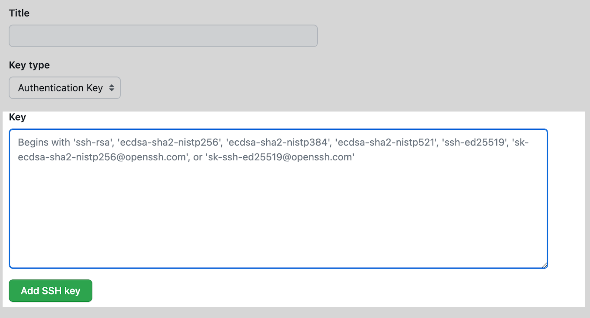
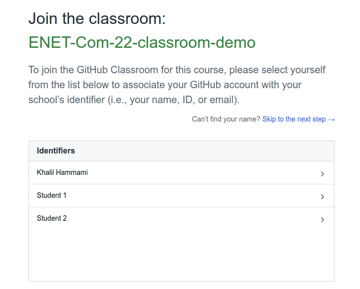
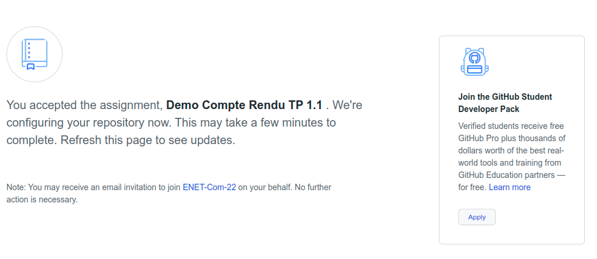
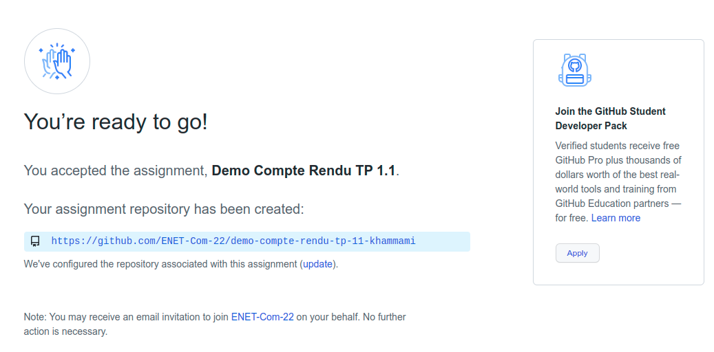
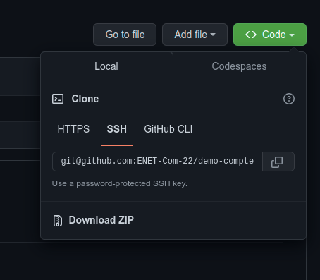
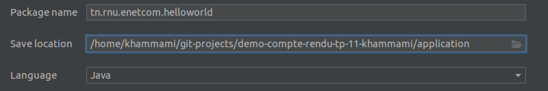
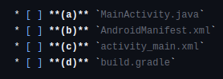
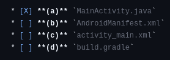

# 🚀 Soumission de compte rendu

[Codelab Feedback](https://github.com/khammami/codelabs-enetcom/issues)


## Bienvenue


Afin de pouvoir gérer les versions de vos projets et de les héberger en ligne, nous utiliserons  [Git](https://git-scm.com/) et  [GitHub](https://github.com/). Pour ce faire, vous devez installer  [git](https://git-scm.com/) sur vos machines et créer un compte  [GitHub](https://github.com/) ( [https://github.com/join](https://github.com/join)).

Je vous invite à profiter de l'opportunité que notre université fait partie du programme d' [éducation de GitHub](https://education.github.com/). Ce programme offre aux étudiants des outils et des ressources gratuites pour développer leurs compétences en développement logiciel.

Je vous encourage à vous inscrire au pack "Student Developer" dès aujourd'hui. C'est une excellente opportunité de développer vos compétences en développement logiciel et de vous préparer à une carrière dans l'industrie informatique.


Pour bénéficier de ces avantages, vous n'avez pas besoin de créer un nouveau compte GitHub. Il vous suffit d'ajouter l'adresse e-mail de votre institut à votre compte personnel. Vous pouvez le faire en vous rendant dans la section "Settings" de votre compte GitHub et en ajoutant l'adresse e-mail de votre institut dans le champ "Emails".

Une fois que vous avez ajouté l'adresse e-mail de votre institut, vous pouvez vous inscrire au pack étudiant GitHub. Pour ce faire, rendez-vous sur  [la page d'inscription du pack étudiant](https://education.github.com/pack) et suivez les instructions.

Pour vérifier que vous êtes étudiant, vous devrez fournir une photo de votre carte d'étudiant. Vous pouvez télécharger la photo de votre carte d'étudiant lors de votre inscription au pack étudiant.


L'outil de contrôle de version git peut être géré par la ligne de commande ( [https://bit.ly/3Sma31d](https://bit.ly/3Sma31d)) ou bien par des clients graphiques (GUI), tels que :

* Gitkraken ( [https://www.gitkraken.com/download](https://www.gitkraken.com/download))
* SmartGit ( [https://www.syntevo.com/smartgit/download/](https://www.syntevo.com/smartgit/download/))
* GitHub Desktop ( [https://desktop.github.com/](https://desktop.github.com/))


## Préparation de votre environnement de développement


Dans cette étape, vous allez préparer vos espaces de travail pour utiliser Git dans vos projets et les publier sur GitHub.

### 1. Installer l'outil Git

#### Installer Git sur Windows

1. Téléchargez le dernier  [installateur Git pour Windows](https://git-scm.com/download/win).
2. Lorsque vous avez démarré le programme d'installation avec succès, vous devriez voir l'écran de l'assistant de configuration de Git. Suivez les invites Suivant et Terminer pour terminer l'installation. Les options par défaut sont assez sensibles pour la plupart des utilisateurs.
3. Ouvrez une invite de commande (ou Git Bash si, lors de l'installation, vous avez choisi de ne pas utiliser Git à partir de l'invite de commande Windows).
4. Exécutez les commandes suivantes pour configurer votre nom d'utilisateur et votre adresse e-mail Gît à l'aide des commandes suivantes, en remplaçant le nom de Khalil par le vôtre. Ces détails seront associés à tous les commits que vous créez :

```
$ git config --global user.name "Khalil Hammami" 
$ git config --global user.email "khalil.hammami@enetcom.usf.tn"
```

#### Installer Git sur Linux

##### Debian / Ubuntu (apt-get)

Les packages Git sont disponibles via  [apt](https://wiki.debian.org/Apt) :

1. Depuis votre shell, installez Git en utilisant `apt-get` :

```
$ sudo apt-get update
$ sudo apt-get install git
```

2. Vérifiez que l'installation a réussi en tapant `git --version` :

```
$ git --version
```

```console
git version 2.47.0
```

3. Configurez votre nom d'utilisateur et votre adresse e-mail Git à l'aide des commandes suivantes, en remplaçant le nom de Khalil par le vôtre. Ces détails seront associés à tous les commits que vous créez :

```
$ git config --global user.name "Khalil Hammami" 
$ git config --global user.email "khalil.hammami@enetcom.usf.tn"
```

### 2. Connecter à/Créer un Compte Github

Pour pouvoir soumettre votre travail via Github Classroom, vous devez avoir un compte GitHub. pour créer un compte veuillez suivre ce lien:  [https://github.com/join](https://github.com/join) 

> aside positive
> 
> Vous pouvez ajouter l'adresse e-mail de votre institut à votre compte personnel GitHub: Icône de profile (en haut à droite) &gt; "**Settings**" &gt; " [**Emails**](https://github.com/settings/emails)" &gt; "**Add email address**"

### 3. Se connecter à GitHub en SSH

#### 3.1. À propos de SSH

En utilisant le protocole SSH, vous pouvez vous connecter et vous authentifier auprès de serveurs et services distants. Avec les clés SSH, vous pouvez vous connecter à GitHub sans fournir votre nom d'utilisateur et votre jeton d'accès personnel à chaque visite. Vous pouvez également utiliser une clé SSH pour signer des commits.

Vous pouvez accéder et écrire des données dans des dépôts sur GitHub.com en utilisant SSH (Secure Shell Protocol). Lorsque vous vous connectez via SSH, vous vous authentifiez à l'aide d'un fichier de clé privée sur votre ordinateur local.

> aside positive
> 
> Pour plus d'informations sur SSH, consultez  [Secure Shell](https://en.wikipedia.org/wiki/Secure_Shell) sur Wikipédia.

Lorsque vous configurez SSH, vous devrez générer une nouvelle clé SSH privée et l'ajouter à l'agent SSH. Vous devez également ajouter la clé SSH publique à votre compte sur GitHub avant d'utiliser la clé pour vous authentifier ou signer des commits.

#### 3.2. Générer une nouvelle clé SSH

Pour activer l'authentification pour les opérations Git via SSH, vous devez générer une nouvelle clé SSH sur votre ordinateur local et l'ajouter à votre compte sur GitHub.

1. Sous Linux: Ouvrez le terminal.
Sous Windows: Ouvrez Git Bash
2. Collez le texte ci-dessous, en le remplaçant par votre adresse e-mail GitHub.

```
$ ssh-keygen -t ed25519 -C "your_email@example.com"
```

> aside negative
> 
> Remarque : Si vous utilisez un ancien système qui ne prend pas en charge l'algorithme Ed25519, utilisez :
> 
> `$ ssh-keygen -t rsa -b 4096 -C "your_email@example.com"`

Cela crée une nouvelle clé SSH, en utilisant l'e-mail fourni comme étiquette.

```console
> Generating public/private ALGORITHM key pair.
```

3. Lorsque vous êtes invité à "Enter a file in which to save the key", appuyez sur Entrée. Ceci accepte l'emplacement de fichier par défaut.

```console
> Enter a file in which to save the key (/home/YOU/.ssh/ALGORITHM):[Press enter]
```

4. À l'invite, saisissez une phrase de passe sécurisée. (une sorte de mot de passe pour sécuriser votre clé, peut être vide)

```console
> Enter passphrase (empty for no passphrase): [Type a passphrase]
> Enter same passphrase again: [Type passphrase again]
```

#### 3.3. Ajouter votre clé SSH à l'agent ssh

Avant d'ajouter une nouvelle clé SSH à l'agent ssh pour gérer vos clés, vous devez avoir vérifié les clés SSH existantes et généré une nouvelle clé SSH.

1. Démarrez l'agent ssh en arrière-plan.

```
$ eval "$(ssh-agent -s)"
```

```console
> Agent pid 59566
```

2. Ajoutez votre clé privée SSH au ssh-agent. Si vous avez créé votre clé avec un nom différent, ou si vous ajoutez une clé existante qui porte un nom différent, remplacez **id_ed25519** dans la commande par le nom de votre fichier de clé privée.

```
$ ssh-add ~/.ssh/id_ed25519
```

3. Ajoutez la clé SSH à votre compte sur GitHub.


#### 3.4. Ajouter la nouvelle clé SSH à votre compte GitHub

1. Copiez la clé publique SSH dans votre presse-papiers.
Si le nom de votre fichier de clé publique SSH est différent de celui de l'exemple de code, modifiez-le pour qu'il corresponde à votre configuration actuelle. Lors de la copie de votre clé, veillez à ne pas ajouter de nouvelles lignes ou d'espaces.

```
$ cat ~/.ssh/id_ed25519.pub
  # Sélectionnez ensuite et copiez le contenu du fichier id_ed25519.pub
  # affiché dans le terminal dans votre presse-papiers
```

> aside positive
> 
> **Conseil** : Pour copier le contenu de votre clé SSH dans votre presse-papiers, vous pouvez également localiser le dossier `.ssh` caché, ouvrir le fichier `id_rsa` dans votre éditeur de texte préféré et le copier.

2. Pour accéder aux paramètres de votre compte GitHub, cliquez sur votre photo de profil dans le coin supérieur droit de n'importe quelle page de GitHub, puis "**Settings**".
3. Dans la section "**Access**" de la barre latérale, cliquez sur  "**SSH and GPG keys**".
4. Cliquez sur **New SSH key** ou sur **Add SSH key**.
5. Dans le champ « **Title** », ajoutez un nom descriptif pour la nouvelle clé. Par exemple, si vous utilisez un ordinateur portable personnel, vous pouvez l'appeler "Mon PC".
6. Sélectionnez "**Authentication key**" comme type de clé.
7. Collez votre clé dans le champ "**Key**".

8. Finalement, Cliquez sur **Add SSH key**.


## Acceptation la tâche demandé


Pour compléter le travail à faire de chaque TP, vous allez recevoir par mail, via la plateforme de l'école, un lien vers la tâche qui vous a été affectée, ressemblant à ceci : 

[https://classroom.github.com/a/wVf4TcEf](https://classroom.github.com/a/wVf4TcEf)

> aside negative
> 
> Ce lien est uniquement à titre d'exemple. Vous recevrez un lien pour chaque compte rendu sur la plateforme de votre institut.

1. Ouvrez le lien que vous avez reçu.
2. Autorisez l'application GitHub Classroom à accéder à votre compte GitHub.


3. Pour continuer, sélectionnez votre nom dans la liste. Si votre nom n'est pas dans la liste, cliquez sur "**Skip to the next step**".



4. Acceptez la tâche.


5. Un dépôt sera créé automatiquement pour vous sous le nom indiqué dans la capture d'écran précédente (surligné en bleu). Le nom du dépôt sera généré de la manière suivante :
`[nom de la tâche]+[votre nom utilisateur de GitHub]`



Si la page n'affiche pas le lien de votre dépôt GitHub, veuillez la recharger (F5).



6. Vous avez maintenant votre dépôt distant, où vous pourrez publier votre travail.

> aside positive
> 
> **Remarque** : les étapes 2 et 3 ne s'afficheront que la première fois que vous utiliserez GitHub Classroom.


## Soumission de votre travail


Pour commencer à faire vos comptes rendus, vous devez cloner votre dépôt GitHub sur votre machine locale. Pour ce faire, vous pouvez utiliser la commande `git clone` en ligne de commande ou un client graphique git.

1. Pour cloner votre dépôt GitHub sur votre machine, utilisez la commande SSH suivante :



```console
$ git clone lien-repo-compte-rendu.git
```

```
// N'oubliez pas de remplacer le lien par le votre.
```

2. Avant de commencer, créez une nouvelle branche git nommée "dev" et basculez vers celle-ci pour travailler sur les modifications de développement.

```console
$ git branch

// si la branche "dev" n'existe pas
$ git checkout -b dev

ou
// si la branche "dev" existe
$ git checkout dev

# Pour vérifier la liste des branches et votre branche actuelle
$ git branch
```

3. Créez un dossier nommé "**application**", s'il nexiste pas déja, dans lequel vous allez placer votre application.

```console
$ mkdir application
```

4. Pour faire votre compte rendu, vous devez suivre l'énoncé du fichier "**README.md**" (travail à faire). L'application demandée doit être sous le dossier "application"



> aside negative
> 
> **NB:** assurez-vous qu'il n'y a pas de dossier ".git" sous le dossier "application"

5. . Vous pouvez utiliser un éditeur de texte pour modifier le fichier "**README.md**" et répondre aux questions en mettant "X" entre crochets.

 

6. Une fois que vous avez terminé de travailler sur votre projet, vous devez ajouter et enregistrer vos modifications dans votre dépôt local avec un commit. Répétez ces instructions après chaque modification ou changement dans votre dépôt Git local.

> aside negative
> 
> * **Travailler sur la branche** **`dev`****:** Toutes les modifications doivent être effectuées sur la branche `dev` avant d'être validées.
> * **Synchroniser avec GitHub:** Avant de valider localement, assurez-vous de récupérer les dernières modifications depuis GitHub pour éviter les conflits.
> * **Éviter les branches principales:** Ne modifiez en aucun cas les branches `main` ou `master`. Ces branches sont réservées et les modifications apportées n'influenceront pas votre évaluation.

```console
$ git add --all
ou
$ git add .

$ git commit -m 'A message to describe the changes'
```

7. Jusqu'à présent, votre travail est uniquement stocké sur votre ordinateur. Pour le partager, vous devez pousser vos commits locaux vers votre dépôt distant. Pour ce faire, utilisez la commande `git push`.

```console
$ git push -u origin dev
```

> aside positive
> 
> #### **Résumé des étapes à suivre :**
> 
> 1. **Vérifier la branche:** Assurez-vous d'être sur la branche `dev` avant d'apporter des modifications.
> 2. **Synchroniser avec GitHub:** Utilisez la commande `git pull` pour récupérer les dernières modifications depuis le dépôt distant.
> 3. **Effectuer les modifications:** Apportez les changements nécessaires à votre code.
> 4. **Valider les modifications localement:** Utilisez la commande `git commit` pour enregistrer les modifications.
> 5. **Pousser les modifications sur GitHub:** Utilisez la commande `git push` pour envoyer les modifications vers le dépôt distant.


## [Vidéo] Résumé des étapes 2 et 3


<video id="LRq4uyYhf7o"></video>


