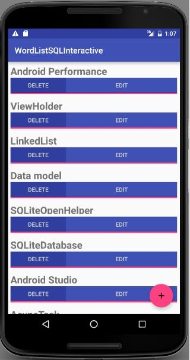

# TP 04.1A: SQLite Database


## Bienvenue


Ces travaux pratiques se base sur le cours de base pour les développeurs Android fourni par Google afin de  les préparer pour le test de certification  [Associate Android Developer](https://developers.google.com/training/certification/associate-android-developer/). Vous obtiendrez le plus de valeur de ce TP si vous travaillez successivement dans les codelabs.

### Introduction

 A SQLite database is a good storage solution when you have structured data that you need to store persistently and access, search, and change frequently.

When you use a SQLite database, all interactions with the database are through an instance of the [`SQLiteOpenHelper`](https://developer.android.com/reference/android/database/sqlite/SQLiteOpenHelper.html) class which executes your requests and manages your database for you.

In this practical, you will create a SQLite database for a set of data, display retrieved data in a RecyclerView, add functionality to add, delete, and edit the data in the `RecyclerView` and store it in the database.

**Note:** A database that persistently stores your data and abstracts your data into a data model is sufficient for small Android apps with minimal complexity. In later chapters, you will learn to architect your app using loaders and content providers to further separate data from the user interface. These classes will help to move work off the UI thread to assist in making the user's experience as smooth and natural as possible. In addition to improving the user experience by removing a potential performance issue, they improve your ability to extend and maintain your app.

**Important:** In this practical, the SQLiteOpenHelper executes database operations in the main thread. In a production app, where database operations might take quite some time, you would perform these operations on a background thread, for example, using a [loader](https://developer.android.com/guide/components/loaders.html) such as AsyncTaskLoader and CursorLoader.

### What you should already know

Vous devriez être familier avec:

* Creating, building, and running apps in Android Studio.
* Displaying data in a RecyclerView.
* Using adapters as intermediaries between data and views.
* Adding onClick event handlers to views and dynamically creating onClick handlers.
* Starting a second activity and returning data from a it.
* Passing data between activities using intent extras.
* Using an EditText view to get data entered by the user.

You also need a basic understanding of SQL databases, how they are organized into tables of rows and columns, and the

SQL language. See the SQLite Primer

### What you'll learn

* Create and manage a SQLite database with an SQLiteOpenHelper.
* Implement insert, delete, update, and query functionality through your open helper.
* Use an adapter and custom click handler to let users interact with the database from the user interface.

### What you'll do

You start with an app that is the same as the RecyclerView word list app you created previously, with additional user

interface elements already added for you, so that you can focus on the database code.

You will extend and modify the base app to:

* Implement a custom class to model your data.
* Create a subclass of SQLiteOpenHelper that creates and manages your app's database.
* Display data from the database in the RecyclerView.
* Implement functionality to add, modify, and delete data in the UI, and store the changes in the database.


## Aperçu de l'application


Starting from a skeleton app, you will add functionality to:

* Display words from a SQLite database in a RecyclerView.
* Each word can be edited or deleted.
* You can add new words and store them in the database.



Minimum SDK Version is API15: Android 4.0.3 IceCreamSandwich and *target* SDK is the current version of Android.


## Tâche 0: Download and run the starter code


In order to save you some work, in particular writing database-unrelated activities and user interface code, you need to get the starter code for this practical.

1. Download the  [WordListSqlStarterCode ](https://github.com/khammami/android-fundamentals-starter-apps/tree/master/WordListSql-Starter)starter code.
2. Open the app in Android Studio.
3. Run the app. You should see the UI as shown in the previous screenshot. All the displayed words should be "placeholder". Clicking the buttons does nothing.


## Tâche 1: Extend SQLiteOpenHelper to create and populate a database


Android apps can use standard SQLite databases to store data. This practical does not teach SQLite, but shows how to use it in an Android app.

[`SQLOpenHelper`](http://developer.android.com/reference/android/database/sqlite/SQLiteOpenHelper.html)  is a utility class in the Android SDK for interacting with a  [SQLite database](https://developer.android.com/reference/android/database/sqlite/SQLiteDatabase.html) object. It includes `onCreate()` and `onUpdate()` methods that you must implement, and insert, delete, update, and query convenience methods for all your database interactions.

The `SQLOpenHelper` class takes care of opening the database if it exists, creating it if it does not, and upgrading it as necessary.

**Note:** You can have more than one database per app, and more than one open helper managing them. However consider creating multiple tables in the same database instead of using multiple databases for performance and architectural simplicity

### 1.1 Create a skeleton WordListOpenHelper class

The first step in adding a database to your code is always to create a subclass of `SQLiteOpenHelper` and implement its methods.

1. Create a new Java class **WordListOpenHelper** with the following signature.

```
public class WordListOpenHelper extends SQLiteOpenHelper {}
```

2. In the code editor, hover over the error, then click the light bulb image and select **Implement methods**. Make sure both methods are highlighted and click **OK**.
3. Add the missing constructor for `WordListOpenHelper`. (You will define the undefined constants next.)

```
public WordListOpenHelper(Context context) { 
    super(context, DATABASE_NAME, null, DATABASE_VERSION);
}
```

### 1.2 Add database constants to WordListOpenHelper

1. At the top of the `WordListOpenHelper` class, define the constants for the tables, rows, and columns as shown in the code below. This should get rid of all the errors.

```
// It's a good idea to always define a log tag like this.
private static final String TAG = WordListOpenHelper.class.getSimpleName();

// has to be 1 first time or app will crash 
private static final int DATABASE_VERSION = 1;
private static final String WORD_LIST_TABLE = "word_entries"; 
private static final String DATABASE_NAME = "wordlist";

// Column names...
public static final String KEY_ID = "_id"; 
public static final String KEY_WORD = "word";

// ... and a string array of columns.
private static final String[] COLUMNS = { KEY_ID, KEY_WORD };
```

2. Run your code to make sure it has no more errors.

### 1.3 Build the SQL query and code to create the database

SQL queries can become quite complex. It is a best practice to construct the queries separately from the code that uses them. This increases code readability and helps with debugging.

Continue adding code to `WordListOpenHelper.java`:

1. Below the constants, add the following code to construct the query. Refer to the SQLite Primer if you need help understanding this query.

```
// Build the SQL query that creates the table.
private static final String WORD_LIST_TABLE_CREATE =
        "CREATE TABLE " + WORD_LIST_TABLE + " (" +
                KEY_ID + " INTEGER PRIMARY KEY, " +
                // id will auto-increment if no value passed
                KEY_WORD + " TEXT );";
```

2. Add instance variables for the references to writable and readable databases. Storing these references saves you to work of getting a database reference every time you need to read or write.

```
private SQLiteDatabase mWritableDB;
private SQLiteDatabase mReadableDB;
```

3. In the `onCreate` method, add code to create a database and the table (The helper class does not create another database, if one already exists.)

```
@Override
public void onCreate(SQLiteDatabase db) {
    db.execSQL(WORD_LIST_TABLE_CREATE);
}
```

4. Fix the error by renaming the method argument from SQLiteDatabase to db.

### 1.4 Create the database in onCreate of the MainActivity

To create the database, create an instance of the `WordListOpenHelper` class you just wrote.

1. Open **MainActivity.java** and add an instance variable for the open helper:

```
private WordListOpenHelper mDB;
```

2. In onCreate, initialize `mDB` with an instance of `WordListOpenHelper`. This calls `onCreate` of the `WordListOpenHelper`, which creates the database.

```
mDB = new WordListOpenHelper(this);
```

3. Add a breakpoint, run the app with the debugger, and check that `mDB` is an instance for `WordListOpenHelper`.

### 1.5 Add data to the database

The list of words for your app could come from many sources. It could be completely user created, or downloaded from the internet, or generated from a file that's part of your APK. For this practical, you will seed your database with a small amount of hard-coded data.

Note that acquiring, creating, and formatting data is a whole separate topic that is not covered in this course.

1. Open **WordListOpenHelper.java**.
2. In `onCreate`, after creating the database, add a function call to

```
fillDatabaseWithData(db);
```

       Next, implement the `fillDatabaseWithData()` method in `WordListOpenHelper`.

3. Implement the method stub.

```
private void fillDatabaseWithData(SQLiteDatabase db){}
```

4. Inside the method, declare a string of words as your mock data.

```
String[] words = {"Android", "Adapter", "ListView", "AsyncTask",
   "Android Studio", "SQLiteDatabase", "SQLOpenHelper",
   "Data model", "ViewHolder","Android Performance",
   "OnClickListener"};
```

5. Create a container for the data. The insert method that you will call next requires the values to fill a row as an instance of  [ContentValues](http://developer.android.com/reference/android/content/ContentValues.html). A ContentValues stores the data for one row as key-value pairs, where the key is the name of the column and the value is the value to set.

```
// Create a container for the data.
ContentValues values = new ContentValues();
```

6. Add key/value for the first row to values, then insert that row into the database. Repeat for all the words in your array of words.

*  [db.insert ](https://developer.android.com/reference/android/database/sqlite/SQLiteDatabase.html#insert)is a  [SQLiteDatabase ](http://developer.android.com/reference/android/database/sqlite/SQLiteDatabase.html)convenience method to insert one row into the database. (It's a convenience method, because you do not have to write the SQL query yourself.)
* The first argument to db.insert is the table name,   `WORD_LIST_TABLE` .
* The second argument is a `String nullColumnHack` . It's a SQL workaround that allows you to insert empty rows. See  [the documentation for insert()](https://developer.android.com/reference/android/database/sqlite/SQLiteDatabase.html). Use null for this argument.
* The third argument must be a  [ContentValues ](http://developer.android.com/reference/android/content/ContentValues.html)container with values to fill the row. This sample only has one column "words" as represented by the constant `KEY_WORD` set earlier; for tables with multiple columns, add the values for each column to this container.

```
for (int i=0; i < words.length; i++) {
    // Put column/value pairs into the container.
    // put() overrides existing values.
    values.put(KEY_WORD, words[i]);
    db.insert(WORD_LIST_TABLE, null, values);
}
```

7.  Before you run and test your app, you should clear the data from your SQLite database and delete the database. Then we can run our app and recreate it so that the database is initialized with the seed data. You can uninstall the app from your device, or you can clear all the data in the app from **Settings &gt; Apps &gt; WordList &gt; Storage &gt; Clear Data** on   your Android emulator or physical device
8.  Run your app. You will not see any changes in the user interface.

* Check the logs and make sure there are no errors before you continue. If you encounter errors, read the logcat messages carefully and use resources, such as Stack Overflow, if you get stuck.
* You can also check in settings, that the app users storage.


## Tâche 2: Create a data model for a single word


A data model is a class that encapsulates a complex data structure and provides an API for accessing and manipulating the data in that structure. You need a data model to pass data retrieved from the database to the UI.

For this practical, the data model only contains the word and its id. While the unique id will be generated by the database, you need a way of passing the id to the user interface. This will identify the word the user is changing.

### 2.1 Create a data model for your word data

1. Create a new class and call it `WordItem` .
2. Add the following class variables.

```
private int mId;
private String mWord;
```

3. Add an empty constructor.
4. Add getters and setters for the id and word.
5. Run your app. You will not see any visible UI changes, but there should be no errors.

**Solution:**

```
public class WordItem {

   private int mId;
   private String mWord;

   public WordItem() {}

   public int getId() {return this.mId;}

   public String getWord() {return this.mWord;}

   public void setId(int id) {this.mId = id;}

   public void setWord(String word) {this.mWord = word;}
}
```


## Tâche 3: Implement the query() method in WordListOpenHelper


The `query()` method retrieves rows from the database as selected by a SQL query.

For this sample, in order to display words in the RecyclerView, we need to get them from the database, one at a time, as needed. The word needed is identified by its position in the view.

As such, the query method has a parameter for the requested position and returns a WordItem.

### 3.1. Implement the query() method

1. Create a query method that takes an integer position argument and returns a WordItem.

```
public WordItem query(int position) {
}
```

2. Construct a query that returns only the nth row of the result. Use `LIMIT` with position as the row, and 1 as the number of rows.

```
String query = "SELECT * FROM " + WORD_LIST_TABLE +
               " ORDER BY " + KEY_WORD + " ASC " +
               "LIMIT " + position + ",1";
```

3. Instantiate a `Cursor` variable to `null` to hold the result from the database.

```
Cursor cursor = null;
```

The `SQLiteDatabase` always presents the results as a  [`Cursor`](https://developer.android.com/reference/android/database/Cursor.html)in a table format that resembles of a SQL database.

A cursor is a pointer into a row of structured data. You can think of it as an array of rows. The `Cursor` class provides methods for moving the cursor through that structure, and methods to get the data from the columns of each row.

4. Instantiate a `WordItem` entry.

```
WordItem entry = new WordItem();
```

5. Add a try/catch/finally block.

```
try {} catch (Exception e) {} finally {}
```

6. Inside the try block,

1. get a readable database if it doesn't exist.

```
if (mReadableDB == null) {
    mReadableDB = getReadableDatabase();
}
```

2. send a raw query to the database and store the result in a cursor.

```
cursor = mReadableDB.rawQuery(query, null);
```

The open helper query method can construct a SQL query string and send it as a rawQuery to the database which returns a cursor. If your data is supplied by your app, and under your full control, you can use raw query().

1. Move the cursor to the first item.

```
cursor.moveToFirst();
```

2. Set the the id and word of the `WordItem` entry to the values returned by the cursor.

```
entry.setId(cursor.getInt(cursor.getColumnIndex(KEY_ID)));
entry.setWord(cursor.getString(cursor.getColumnIndex(KEY_WORD)));
```

7. In the catch block, log the exception.

```
Log.d(TAG, "EXCEPTION! " + e);
```

8. In the finally block, close the cursor and return the WordItem entry.

```
cursor.close();
return entry;
```

**Solution:**

```
public WordItem query(int position) {
   String query = "SELECT * FROM " + WORD_LIST_TABLE +
           " ORDER BY " + KEY_WORD + " ASC " +
           "LIMIT " + position + ",1";

   Cursor cursor = null;
   WordItem entry = new WordItem();

   try {
       if (mReadableDB == null) {
           mReadableDB = getReadableDatabase();
       }
       cursor = mReadableDB.rawQuery(query, null);
       cursor.moveToFirst();
       entry.setId(cursor.getInt(cursor.getColumnIndex(KEY_ID)));
       entry.setWord(cursor.getString(cursor.getColumnIndex(KEY_WORD)));
   } catch (Exception e) {
       Log.d(TAG, "QUERY EXCEPTION! " + e.getMessage());
   } finally {
       cursor.close();
       return entry;
   }
}
```

### 3.2. The onUpgrade method

Every `SQLiteOpenHelper` must implement the `onUpgrade()` method, which determines what happens if the database version number changes. This may happen if you have existing users of your app that use an older version of the database. This method is triggered when a database is first opened. The customary default action is to delete the current database and recreate it.

Important: While it's OK to drop the table in a sample app, In a production app you need to carefully migrate the user's valuable data.

You can use the code below to implement the `onUpgrade()` method for this sample.

**Boilerplate code for onUpgrade():**

```
@Override
public void onUpgrade(SQLiteDatabase db, int oldVersion, int newVersion) {
   Log.w(WordListOpenHelper.class.getName(),
           "Upgrading database from version " + oldVersion + " to "
            + newVersion + ", which will destroy all old data");

   db.execSQL("DROP TABLE IF EXISTS " + WORD_LIST_TABLE);
   onCreate(db);
}
```


## Tâche 4: Display data in the RecyclerView


You now have a database, with data. Next, you will update the WordListAdapter and MainActivity to fetch and display this data.

### 4.1. Update WordListAdapter to display WordItems

1. Open **WordListAdapter**.
2. In `onBindViewHolder` replace the code that displays mock data with code to get an item from the database and display it. You will notice an error on `mDB`.

```
WordItem current = mDB.query(position);
holder.wordItemView.setText(current.getWord());
```

3. Declare `mDB` as an instance variable.

```
WordListOpenHelper mDB;
```

4. To get the value for `mDB`, change the constructor for `WordListAdapter` and add a second parameter for the `WordListOpenHelper`.
5. Assign the value of the parameter to `mDB`. Your constructor should look like this:

```
public WordListAdapter(Context context, WordListOpenHelper db) {
        mInflater = LayoutInflater.from(context);
        mContext = context;
        mDB = db;
}
```

This generates an error in `MainActivity`, because you added an argument to the `WordListAdapter` constructor.

6. Open **MainActivity** and add the missing `mDB` argument.

```
mAdapter = new WordListAdapter (this, mDB);
```

7. Run your app. You should see all the words from the database.


## Tâche 5: Add new words to the database


When the user clicks the FAB, an activity opens that lets them enter a word that gets added to the database when they click save.

The starter code provides you with the click listener and the `EditWordActivity` started by clicking the FAB. You will add the database specific code and tie the pieces together, from the bottom up, like you just did with the query method.

### 5.1. Write the insert() method

In `WordListOpenHelper`:

1. Create the `insert()` method with the following signature. The user supplies a word, and the method returns the id for the new entry. Generated id's can be big, so insert returns a number of type long.

```
public long insert(String word){}
```

2. Declare a variable for the id. If the insert operation fails, the method returns 0.

```
long newId = 0;
```

3. As before, create a `ContentValues` value for the row data.

```
ContentValues values = new ContentValues();
values.put(KEY_WORD, word);
```

4. Put your database operation into a try/catch block.

```
try {} catch (Exception e) {}
```

5. Get a writable database if one doesn't already exist.

```
if (mWritableDB == null) {
    mWritableDB = getWritableDatabase();
}
```

6. Insert the row.

```
newId = mWritableDB.insert(WORD_LIST_TABLE, null, values);
```

7. Log the exception.

```
Log.d(TAG, "INSERT EXCEPTION! " + e.getMessage());
```

8. Return the id.

```
return newId;
```

**Solution:**

```
public long insert(String word){
    long newId = 0;
    ContentValues values = new ContentValues();
    values.put(KEY_WORD, word);
    try {
        if (mWritableDB == null) {
            mWritableDB = getWritableDatabase();
        }
        newId = mWritableDB.insert(WORD_LIST_TABLE, null, values);
    } catch (Exception e) {
        Log.d(TAG, "INSERT EXCEPTION! " + e.getMessage());
    }
    return newId;
}
```

### 5.2. Get the word to insert from the user and update the database

The starter code comes with an `EditWordActivity` that gets a word from the user and returns it to the main activity. In `MainActivity`, you just have to fill in the `onActivityResult()` method.

1. Check to ensure the result is from the correct activity and get the word that the user entered from the extras.

```
if (requestCode == WORD_EDIT) {
   if (resultCode == RESULT_OK) {
        String word = data.getStringExtra(EditWordActivity.EXTRA_REPLY);
```

2. If the word is not empty, check whether we have been passed an id with the extras. If there is no id, insert a new word. In the next task, you will update the existing word if an id is passed.

```
if (!TextUtils.isEmpty(word)) {
    int id = data.getIntExtra(WordListAdapter.EXTRA_ID, -99);
    if (id == WORD_ADD) {
        mDB.insert(word);
}
```

3. To update the UI, notify the adapter that the underlying data has changed.

```
mAdapter.notifyDataSetChanged();
```

4. If the word is empty because the user didn't enter anything, show a toast letting them know. And don't forget to close all the parentheses.

```
} else {
    Toast.makeText(
        getApplicationContext(),
        R.string.empty_not_saved,
        Toast.LENGTH_LONG).show();
        }
    }
}
```

**Solution:**

```
if (requestCode == WORD_EDIT) {
    if (resultCode == RESULT_OK) {
        String word = data.getStringExtra(EditWordActivity.EXTRA_REPLY);
        // Update the database
        if (!TextUtils.isEmpty(word)) {
            int id = data.getIntExtra(WordListAdapter.EXTRA_ID, -99);
            if (id == WORD_ADD) {
                mDB.insert(word);
             }
             // Update the UI
             mAdapter.notifyDataSetChanged();
        } else {
             Toast.makeText(
                     getApplicationContext(),
                     R.string.empty_not_saved,
                     Toast.LENGTH_LONG).show();
        }
    }
}
```

### 5.3. Implement getItemCount()

In order for the new items to be displayed properly, `getItemCount` in `WordListAdapter` has to return the actual number of entries in the database instead of the number of words in the starter list of words.

1. Change `getItemCount` to the code below, which will trigger an error.

```
return (int) mDB.count();
```

2. Open `WordListOpenHelper` and implement `count()` to return the number of entries in the database.

```
public long count(){
    if (mReadableDB == null) {
        mReadableDB = getReadableDatabase();
    }
    return DatabaseUtils.queryNumEntries(mReadableDB, WORD_LIST_TABLE);
}
```

3. Run your app and add some words.


## Tâche 6: Delete words from the database


To implement the delete functionality you need to:

* Implement the `delete()` method in `WordListOpenHelper`
* Add a click handler to the `DELETE` button in `WordListAdapter`

### 6.1. Write the delete() method

You use the `delete()` method on `SQLiteDatabase` to delete an entry in the database. Add a method delete to the `WordListOpenHelper` that:

1. Create the method stub for `delete()`, which takes an int argument for the id of the item to delete, and returns the number of rows deleted.

```
public int delete(int id) {}
```

2. Declare a variable to hold the result.

```
int deleted = 0;
```

3. As for insert, add a try block.

```
try {} catch (Exception e) {}
```

4. Get a writable database, if necessary.

```
if (mWritableDB == null) {
    mWritableDB = getWritableDatabase();
}
```

5. Call delete on the `WORD_LIST_TABLE`, selecting by `KEY_ID` and passing the value of the id as the argument. The "`?`" is a placeholder that gets filled with the string. This is a more secure way of building queries.

```
deleted = mWritableDB.delete(WORD_LIST_TABLE,
    KEY_ID + " = ? ", new String[]{String.valueOf(id)});
```

6. Print a log message for exceptions.

```
Log.d (TAG, "DELETE EXCEPTION! " + e.getMessage());
```

7. Return the number of rows deleted.

```
return deleted;
```

**Solution:**

```
public int delete(int id) {
    int deleted = 0;
    try {
        if (mWritableDB == null) {
            mWritableDB = getWritableDatabase();
        }
        deleted = mWritableDB.delete(WORD_LIST_TABLE, //table name
                KEY_ID + " =? ", new String[]{String.valueOf(id)});
    } catch (Exception e) {
        Log.d (TAG, "DELETE EXCEPTION! " + e.getMessage());
    }
    return deleted;
}
```

### 6.2. Add a click handler to DELETE button

You can now add a click handler to the `DELETE` button that calls the `delete()` method you just wrote.

Take a look at the `MyButtonOnClickListener` class in your starter code. The `MyButtonOnClickListener` class implements a click listener that stores the id, and the word that you need to make changes to the database.

Each view holder, when attached (bound) to the `RecyclerView` in the `onBindViewHolder` method of `WordListAdapter`, needs to also attach a click listener to the `DELETE` button, passing the id, and word to the `MyButtonOnClickListener` constructor. These values are then used by the `onClick` handler to delete the correct item and notify the adapter, which item has been removed.

Note that you cannot use the position argument passed into `onBindViewHolder`, because it may be stale by the time the click handler is called. You have to keep a reference to the view holder and get the position with  [`getAdapterPosition()`](https://developer.android.com/reference/android/support/v7/widget/RecyclerView.ViewHolder.html#getAdapterPosition()).

**Solution:**

```
// Keep a reference to the view holder for the click listener
final WordViewHolder h = holder; // needs to be final for use in callback

   // Attach a click listener to the DELETE button.
   holder.delete_button.setOnClickListener(
       new MyButtonOnClickListener(current.getId(), null) {

           @Override
           public void onClick(View v ) {
               int deleted = mDB.delete(id);
               if (deleted >= 0)
                   notifyItemRemoved(h.getAdapterPosition());
           }
        });
```


## Tâche 7: Update words in the database


To update existing words you have to:

* Add an `update()` method to `WordListOpenHelper`. 
* Add a click handler to the `EDIT` button of your view.

### 7.1. Write the update() method

You use the `update()` method on SQLiteDatabase to update an existing entry in the database.

1. Add a method to the `WordListOpenHelper` that:

* Takes an integer id and a `String` word for its arguments and returns an integer.

```
public int update(int id, String word)
```

* Initializes int `mNumberOfRowsUpdated` to -1.

```
int mNumberOfRowsUpdated = -1;
```

2. Inside a try block, do the following steps:
3. Get a writable SQLiteDatabase db if there isn't one already.

```
if (mWritableDB == null) {
    mWritableDB = getWritableDatabase();
}
```

4. Create a new instance of `ContentValues` and at the `KEY_WORD` word to it.

```
ContentValues values = new ContentValues();
values.put(KEY_WORD, word);
```

5. Call `db.update` using the following arguments:

```
mNumberOfRowsUpdated = db.update(WORD_LIST_TABLE,
       values, // new values to insert
       // selection criteria for row (the _id column)
       KEY_ID + " = ?",
       //selection args; value of id
       new String[]{String.valueOf(id)});
```

6. In the catch block, print a log message if any exceptions are encountered.

```
Log.d (TAG, "UPDATE EXCEPTION: " + e.getMessage());
```

7. Return the number of rows updated, which should be -1 (fail), 0 (nothing updated), or 1 (success).

```
return mNumberOfRowsUpdated;
```

**Solution:**

```
public int update(int id, String word) {
    int mNumberOfRowsUpdated = -1;
    try {
        if (mWritableDB == null) {
            mWritableDB = getWritableDatabase();
        }
        ContentValues values = new ContentValues();
        values.put(KEY_WORD, word);
        mNumberOfRowsUpdated = mWritableDB.update(WORD_LIST_TABLE,
                values,
                KEY_ID + " = ?",
                new String[]{String.valueOf(id)});
    } catch (Exception e) {
        Log.d (TAG, "UPDATE EXCEPTION! " + e.getMessage());
    }
    return mNumberOfRowsUpdated;
}
```

### 7.2. Add a click listener to the EDIT button

And here is the code for the Edit click listener when we bind the `View` in the `onBindViewHolder` method of `WordListAdapter`. This listener has nothing database specific. It starts the `EditWordActivity` Activity using an `Intent` and passes it the current   id, position, and word in the Extras.

If you get an error on the `EXTRA_POSITION` constant, add it with a value of `"POSITION"`,

**Solution:**

```
// Attach a click listener to the EDIT button.
holder.edit_button.setOnClickListener(new MyButtonOnClickListener(
        current.getId(), current.getWord()) {

    @Override
    public void onClick(View v) {
        Intent intent = new Intent(mContext, EditWordActivity.class);

        intent.putExtra(EXTRA_ID, id);
        intent.putExtra(EXTRA_POSITION, h.getAdapterPosition());
        intent.putExtra(EXTRA_WORD, word);

        // Start an empty edit activity.
        ((Activity) mContext).startActivityForResult(
                intent, MainActivity.WORD_EDIT);
   }
});
```

### 7.3. Add updating to onActivityResult

As implemented, clicking edit starts an activity that shows the user the current word, and they can edit it. To make the update happen,

1. Add one line of code to the `onActivityResult` method in your `MainActivity`.

```
else if (id >= 0) {
    mDB.update(id, word);
}
```

2. Run your app and play with it

### 7.4. Design and error considerations

* The methods you wrote to add, update and delete entries in the database all assume that their input is valid. This is acceptable for sample code because the purpose of this sample code is to teach you the basic functionality of a SQLite database, and so not every edge case is considered, not every value is tested, and everybody is assumed to be well behaved. If this were a production app, you would have greater security considerations, and content would need to be tested for validity until you know it is not malicious.
* In a production app, you must catch specific exceptions and handle them appropriately.
* You tested the correct functioning of the app by running it. For a production app with real data, you will need more thorough testing, for example, using unit and interface testing.
* For this practical, you created the database schema/tables from the `SQLiteOpenHelper` class. This is sufficient for   a simple example, like this one. For a more complex app, it is a better practice to separate schema definitions from the rest of the code in a helper class that cannot be instantiated. You will learn how to do that in the chapter on content providers.
* As mentioned above, some database operations can be lengthy and should be done on a background thread. Use `AsyncTask` for operations that take a long time. Use loaders to load large amounts of data.

### Solution code

Android Studio project:  [WordListSql finished](https://github.com/khammami/android-fundamentals-v1/tree/master/WordListSql%20finished)


## Résumé


In this chapter, you learned how to

* Use a  [`SQLiteDatabase`](https://developer.android.com/reference/android/database/sqlite/SQLiteDatabase.html) to store user data persistently. 
* Work with a  [`SQLiteOpenHelper`](https://developer.android.com/reference/android/database/sqlite/SQLiteOpenHelper.html) to manage your database. Retrieve and display data from the database
* Edit data in the user interface and reflect those changes in the database


## Apprendre encore plus


Android developer documentation:

*  [Storage Options](http://developer.android.com/guide/topics/data/data-storage.html)
*  [Saving Data in SQL Databases](http://developer.android.com/training/basics/data-storage/databases.html)


