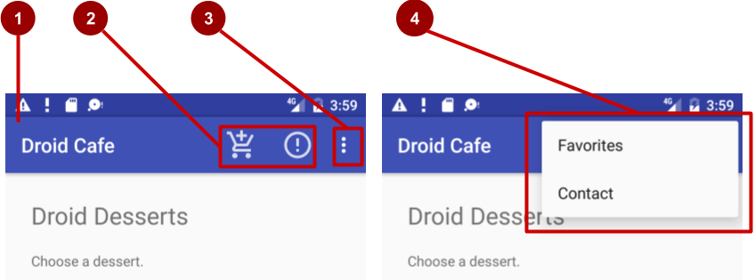
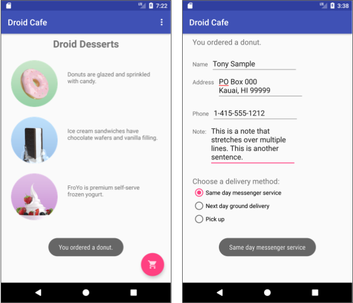
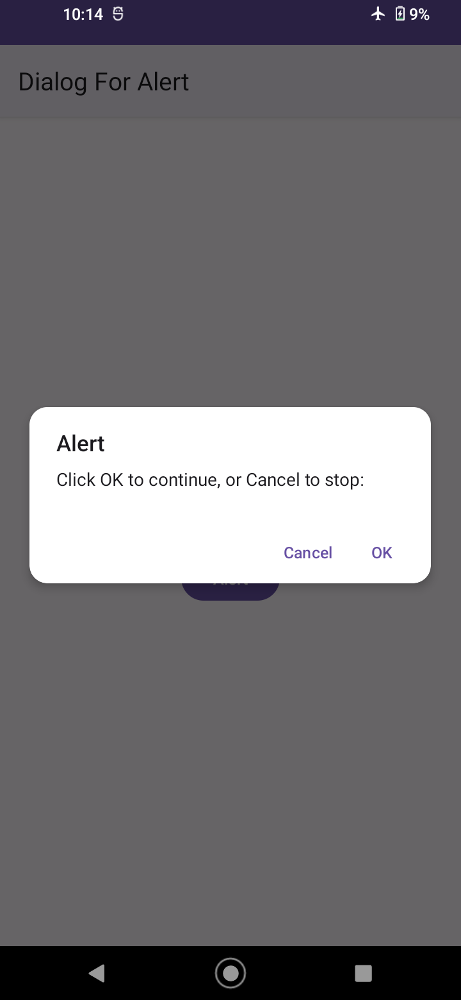
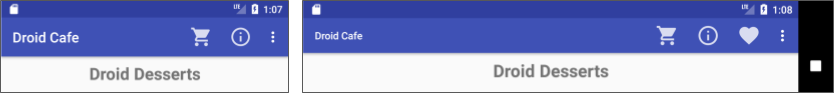
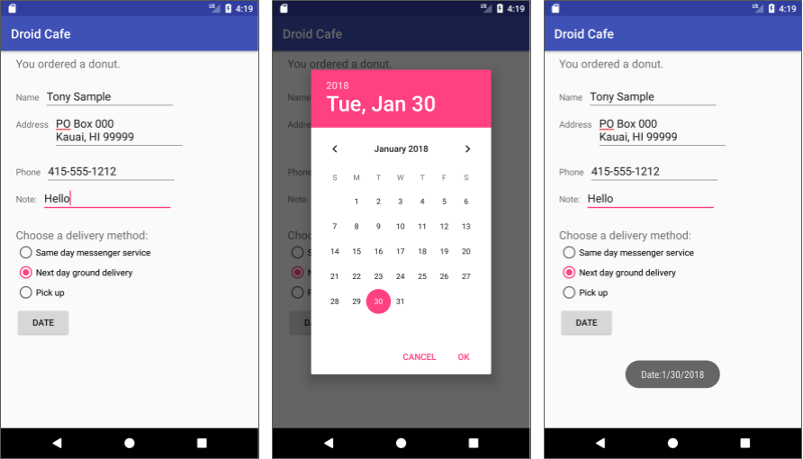

# TP 03.1: Les Menus et "pickers"

[Codelab Feedback](https://github.com/khammami/codelabs-enetcom/issues)


## Bienvenue


Ces travaux pratiques se base sur le cours de base pour les développeurs Android fourni par Google afin de  les préparer pour le test de certification  [Associate Android Developer](https://developers.google.com/training/certification/associate-android-developer/). Vous obtiendrez le plus de valeur de ce TP si vous travaillez successivement dans les codelabs.

### Introduction

La barre d'application (également appelée barre d'action) est un espace dédié situé en haut de chaque écran d'activité. Lorsque vous créez une activité à partir du modèle d'activité de base, Android Studio comprend une barre d'application.

Le menu des options de la barre d'applications propose généralement des options de navigation, telles que la navigation vers une autre activité de l'application. Il peut également fournir des choix qui affectent l'utilisation de l'application elle-même, par exemple des façons de modifier les paramètres ou les informations de profil, ce qui se produit généralement dans le cadre d'une activité distincte.

Dans cette pratique, vous apprendrez à configurer la barre d'applications et le menu d'options de votre application. La figure ci-dessous illustre les éléments que vous pouvez configurer.



Dans la figure ci-dessus:

1. Barre d'application (**App bar)**. La barre d'applications comprend le titre de l'application, le menu d'options et le bouton de débordement.
2. Icônes d'action du menu Options (**Options menu action icons)**. Les deux premières options du menu d'options apparaissent sous forme d'icônes dans la barre des applications.
3. Bouton de débordement (**Overflow button)**. Le bouton de débordement (trois points verticaux) ouvre un menu contenant davantage d'éléments du menu d'options.
4. Menu de débordement des options (**Options overflow menu)**. Après avoir cliqué sur le bouton de débordement, d'autres éléments du menu d'options apparaissent dans le menu de débordement.

Les éléments du menu Options apparaissent dans le menu déroulant des options (voir la figure ci-dessus). Cependant, vous pouvez placer certains éléments sous forme d'icônes - autant que peuvent tenir - dans la barre d'application. L'utilisation de la barre d'applications pour le menu des options rend votre application cohérente avec les autres applications Android, permettant aux utilisateurs de comprendre rapidement comment utiliser votre application et de vivre une expérience inoubliable.

> aside positive
> 
> **Conseil**: pour fournir une expérience utilisateur familière et cohérente, utilisez les API de menu pour présenter les actions pour l'utilisateur et les autres options de vos activités. Voir  [Menus](http://developer.android.com/guide/topics/ui/menus.html) pour plus de détails.

Vous pouvez également créer une application qui affiche une boîte de dialogue pour demander le choix d'un utilisateur, comme une alerte qui oblige les utilisateurs à appuyer sur **OK** ou **Cancel**. Une boîte de dialogue est une fenêtre qui apparaît en haut de l'écran ou la remplit, interrompant le flux d'activité. Android fournit des boîtes de dialogue prêtes à l'emploi, appelées "*pickers*", permettant de choisir une heure ou une date. Vous pouvez les utiliser pour vous assurer que vos utilisateurs choisissent une heure ou une date valide, formatée correctement et ajustée à l'heure et à la date locales de l'utilisateur. Dans cette pratique, vous allez également créer une application avec le sélecteur de date "date picker".

### What you should already know

Vous devriez être familier avec:

* Créez et exécutez des applications dans Android Studio.
* Créez et éditez des éléments d'interface utilisateur à l'aide de l'éditeur de disposition (layout).
* Modifiez le code de présentation XML et accédez aux éléments de votre code Java.
* Ajouter un gestionnaire de clics à un bouton.

### What you'll learn

* Comment ajouter des éléments de menu au menu d'options.
* Comment ajouter des icônes pour les éléments dans le menu des options.
* Comment définir les éléments de menu à afficher dans la barre d'applications.
* Comment ajouter des gestionnaires de clic pour les éléments de menu.
* Comment ajouter une boîte de dialogue pour une alerte.
* Comment ajouter le sélecteur de date "*date picker*".

### What you'll do

* Continuez à ajouter des fonctionnalités au projet Droid Cafe.
* Ajouter des éléments de menu au menu d'options.
* Ajoutez des icônes pour que les éléments de menu apparaissent dans la barre des applications.
* Connectez les clics d'élément de menu aux gestionnaires d'événements qui traitent les événements de clic.
* Utilisez une boîte de dialogue d'alerte pour demander le choix d'un utilisateur.
* Utilisez un sélecteur de date pour la saisie de la date.


## Aperçu de l'application


Une application appelée `Droid Cafe`, illustrée dans la figure ci-dessous, créée à l'aide du modèle d'activité de base "Basic Activity" (dans la dernière version d'Android Studio, le nom a changé, Basic Views Activity). Ce modèle fournit également un menu d'options squelettiques dans la barre d'applications en haut de l'écran.



Pour cet exercice, vous utilisez la barre d'outils  [`Toolbar`](https://developer.android.com/reference/android/widget/Toolbar) de la bibliothèque *Androidx appcompat* en tant que barre d'applications, qui fonctionne sur la plus large gamme de périphériques et vous donne également la possibilité de personnaliser votre barre d'applications ultérieurement, au fur et à mesure du développement de votre application. Pour en savoir plus sur les considérations de conception relatives à l'utilisation de la barre d'application, voir  [Responsive layout grid](https://material.io/design/layout/responsive-layout-grid.html#) dans la spécification de conception "Material Design".

Vous créez une nouvelle application qui affiche une boîte de dialogue d'alerte. La boîte de dialogue interrompt le flux de travail de l'utilisateur et oblige celui-ci à faire un choix.

  

Vous créez également une application qui fournit un bouton pour afficher le sélecteur de date et convertit la date choisie en une chaîne à afficher dans un message `Toast`.

 


## Tâche 1: Ajouter des éléments au menu des options


Dans cette tâche, ouvrez le projet  [DroidCafeInput](https://github.com/khammami/android-fundamentals-exycodelabs/tree/master/DroidCafeInput) et ajoutez des éléments de menu au menu d'options dans la barre des applications en haut de l'écran.

Pour cloner la branche `droid-cafe-input` du projet  [DroidCafeInput](https://github.com/khammami/android-fundamentals-exycodelabs/tree/master/DroidCafeInput), vous pouvez utiliser la commande suivante :

```
git clone --branch droid-cafe-input [lien-repo.git]
```

Cette commande copiera le dépôt Git du projet dans un répertoire local de la branche spécifiée. Le répertoire local aura le même nom que le dépôt Git.

### 1.1 Examiner le code

Ouvrez l'application  [DroidCafeInput](https://github.com/khammami/android-fundamentals-exycodelabs/tree/droid-cafe-input) et examinez les fichiers de mise en page suivants dans le dossier **res &gt; layout**:

* **activity_main.xml**: La disposition d'accueil de `MainActivity`, le premier écran visible par l'utilisateur.
* **content_main.xml**: La disposition (layout) du contenu de l'écran `MainActivity` est incluse dans le fichier `activity_main.xml`, comme vous le verrez bientôt.
* **activity_order.xml**: la mise en page (layout) de `OrderActivity`.

Suivez ces étapes:

1. Ouvrez **content_main.xml** et basculez vers le mode de vue **Code** pour afficher le code XML. Le paramètre `app:layout_behavior` de `ConstraintLayout` est défini sur `@string/appbar_scrolling_view_behavior`, qui contrôle le défilement de l'écran par rapport à la barre d'applications en haut. (Cette ressource de chaîne est définie dans un fichier généré appelé `values.xml`, que vous ne devez pas modifier.)
2. Ouvrez **activity_main.xml** et sélectionnez le mode vue **Code** pour afficher le code XML de la présentation (layout) principale, qui utilise une présentation  [`CoordinatorLayout`](https://developer.android.com/jetpack/androidx/releases/coordinatorlayout?hl=fr) avec une présentation  [`AppBarLayout`](https://developer.android.com/reference/android/support/design/widget/AppBarLayout.html) intégrée. Les balises `CoordinatorLayout` et `AppBarLayout` nécessitent des noms complets spécifiant `android.support.design`, qui est la bibliothèque de prise en charge de la conception Android "Android Design Support Library".

`AppBarLayout` est comme un `LinearLayout` vertical. Il utilise la classe  [`Toolbar`](https://developer.android.com/reference/androidx/appcompat/widget/Toolbar) de la bibliothèque de support, au lieu du `ActionBar` natif, pour implémenter une barre d'application. La barre d'outils "`Toolbar`" de cette présentation a l'id "`toolbar`", et est également spécifiée, comme pour  `AppBarLayout`, avec un nom complet (`androidx.appcompat.widget.Toolbar`).

La barre d'applications est une section en haut de l'écran permettant d'afficher le titre de l'activité, la navigation et d'autres éléments interactifs. Le `ActionBar` natif se comporte différemment selon la version d'Android exécutée sur le périphérique. Pour cette raison, si vous ajoutez un menu d'options, vous devez utiliser la barre d'outils " [`Toolbar`](https://developer.android.com/reference/androidx/appcompat/widget/Toolbar)" de la bibliothèque de support  [Android Jetpack (androidx)](https://developer.android.com/reference/androidx/appcompat/widget/Toolbar) en tant que barre d'applications. L'utilisation de la barre d'outils " [`Toolbar`](https://developer.android.com/reference/androidx/appcompat/widget/Toolbar)" facilite la configuration d'une barre d'applications qui fonctionne sur la plus large gamme de périphériques et vous permet également de personnaliser votre barre d'applications ultérieurement, au fur et à mesure du développement de votre application. La barre d'outils "`Toolbar`" inclut les fonctionnalités les plus récentes et fonctionne pour tout périphérique pouvant utiliser la bibliothèque de support.

La présentation (layout) **activity_main.xml** utilise également une instruction `include layout` pour inclure la présentation (layout) entière définie dans **content_main.xml**. Cette séparation des définitions de présentation (layout) facilite la modification du contenu de la présentation (layout) en dehors de la définition de la barre d'outils de la présentation (layout) et de la présentation (layout) du coordinateur. Il est recommandé de séparer votre contenu (qui doit éventuellement être traduit) du format de votre mise en page (layout).

3. Lancer l'application. Notez que la barre en haut de l'écran indique le nom de l'application (`Droid Cafe`). Il montre également le bouton de débordement d'action (trois points verticaux) sur le côté droit. Appuyez sur le bouton de débordement pour afficher le menu des options qui, à ce stade, n'a qu'une option, **Settings**.


4. Examinez le fichier **AndroidManifest.xml**. L'activité `MainActivity` est définie pour utiliser le thème `NoActionBar`. Ce thème est défini dans le fichier `styles.xml` (ouvrez **app &gt; res &gt; values &gt; styles.xml** pour le voir). Vous pouvez constater que le thème `NoActionBar` définit l'attribut `windowActionBar` sur `false` (pas de barre d'application Window) et l'attribut `windowNoTitle` sur `true` (pas de titre). Ces valeurs sont définies car vous définissez la barre d'applications avec `AppBarLayout`, plutôt que d'utiliser un `ActionBar`. L'utilisation de l'un des thèmes `NoActionBar` empêche l'application d'utiliser la classe `ActionBar` native pour fournir la barre d'applications.
5. Examinez **MainActivity**, qui étend `AppCompatActivity` et commence par la méthode `onCreate()`, qui définit la vue du contenu sur la présentation (layout) `activity_main.xml` et définit la barre d'outils sur la barre d'outils (`Toolbar`) définie dans la présentation (layout). Il appelle ensuite  [`setSupportActionBar()`](https://developer.android.com/reference/android/support/v7/app/AppCompatActivity.html#setSupportActionBar(android.support.v7.widget.Toolbar)) et lui transmet la barre d'outils(`Toolbar`), en définissant la barre d'outils (`Toolbar`) comme barre d'application de l'activité.

Pour connaître les meilleures pratiques concernant l'ajout de la barre d'applications à votre application, voir  [Add the app bar](https://developer.android.com/training/appbar/index.html).

### 1.2 Ajouter plus d'éléments de menu au menu d'options

Vous allez ajouter les éléments de menu suivants au menu des options:

* **Order**: Accédez à `OrderActivity` pour voir la commande de desserts.
* **Status**: Vérifiez le statut d'une commande.
* **Favorites**: Afficher les desserts préférés.
* **Contact**: Contacter le café. Comme vous n'avez pas besoin de l'élément **Settings** existant, vous allez modifier **Settings** en **Contact**.

Android fournit un format XML standard pour définir les éléments de menu. Au lieu de créer un menu dans votre code d'activité, vous pouvez définir un menu et tous ses éléments de menu dans une ressource de menu XML. Vous pouvez ensuite gonfler (inflate) la ressource de menu (la charger en tant qu'objet de `Menu`) dans votre activité:

1. Développez **res &gt; menu** dans le volet **Project &gt; Android** et ouvrez **menu_main.xml**. Le seul élément de menu fourni à partir du modèle est `action_settings` (le choix **Settings**), défini comme suit:

```
<item
    android:id="@+id/action_settings"
    android:orderInCategory="100"
    android:title="@string/action_settings"
    app:showAsAction="never" />
```

2. Modifiez les attributs suivants de l'élément `action_settings` pour en faire l'élément `action_contact` (ne modifiez pas l'attribut `android:orderInCategory` existant):

| <strong>Attribut</strong> | <strong>Valeur</strong> |
| --- | --- |
| android:id | &#34;@+id/action_contact&#34; |
| android:title | &#34;Contact&#34; |
| app:showAsAction | &#34;never&#34; |

3. Extrayez la chaîne `"Contact"` codée en dur dans la ressource chaîne `action_contact`.
4. Ajoutez un nouvel élément de menu à l'aide de la balise `item` dans le bloc `menu` et attribuez-lui les attributs suivants:

| <strong>Attribut</strong> | <strong>Valeur</strong> |
| --- | --- |
| android:id | &#34;@+id/action_order&#34; |
| android:orderInCategory | &#34;10&#34; |
| android:title | &#34;Order&#34; |
| app:showAsAction | &#34;never&#34; |

L'attribut `android:orderInCategory` spécifie l'ordre dans lequel les éléments de menu apparaissent dans le menu, le nombre le plus bas apparaissant plus haut dans le menu. L'élément **Contact** est défini sur 100, ce qui est un grand nombre afin de spécifier qu'il apparaît en bas et non en haut. Vous définissez le poste de **Order** sur 10, ce qui le place au-dessus de **Contact** et laisse beaucoup de place dans le menu pour d'autres articles.

5. Extrayez la chaîne `"Order"` codée en dur dans la ressource chaîne `action_order`.
6. Ajoutez deux autres éléments de menu de la même manière avec les attributs suivants:

| <strong>Attribut d&#39;élément Status</strong> | <strong>Valeur</strong> |
| --- | --- |
| android:id | &#34;@+id/action_status&#34; |
| android:orderInCategory | &#34;20&#34; |
| android:title | &#34;Status&#34; |
| app:showAsAction | &#34;never&#34; |

| <strong>Attribut d&#39;élément Favorites</strong> | <strong>Valeur</strong> |
| --- | --- |
| android:id | &#34;@+id/action_favorites&#34; |
| android:orderInCategory | &#34;30&#34; |
| android:title | &#34;Favorites&#34; |
| app:showAsAction | &#34;never&#34; |

7. Extrayez `"Status"` dans la ressource `statut_action`, et `"Favoris"` dans la ressource `action_favorites`.
8. Vous allez afficher un message `Toast` avec un message d'action en fonction de l'élément de menu sélectionné par l'utilisateur. Ouvrez **strings.xml** et ajoutez les noms de chaîne et les valeurs suivants pour ces messages:

```
<string name="action_order_message">You selected Order.</string>
<string name="action_status_message">You selected Status.</string>
<string name="action_favorites_message">You selected Favorites.</string>
<string name="action_contact_message">You selected Contact.</string>
```

9. Ouvrez **MainActivity** et modifiez l'instruction `if` dans la méthode `onOptionsItemSelected()` en remplaçant l'id `action_settings` par le nouvel id `action_order`:

```
if (id == R.id.action_order)
```

Exécutez l'application et appuyez sur l'icône de débordement d'action, illustrée à gauche de la figure ci-dessous, pour afficher le menu d'options affiché à droite de la figure ci-dessous. Vous allez bientôt ajouter des rappels (callbacks) pour répondre aux éléments sélectionnés dans ce menu.


Dans la figure ci-dessus:

1. Appuyez sur l'icône de débordement dans la barre d'applications pour afficher le menu d'options.
2. Le menu des options s'affiche de la barre d'application.

Notez l'ordre des éléments dans le menu des options. Vous avez utilisé l'attribut `android:orderInCategory` pour spécifier la priorité des éléments de menu du menu: Lélément **Order** est 10, suivi de **Status** (20) et **Favorites** (30), et **Contact** est le dernier (100). Le tableau suivant indique la priorité des éléments du menu:

| <strong>Élément du menu</strong> | <strong>attribut orderInCategory</strong> |
| --- | --- |
| Order | 10 |
| Status | 20 |
| Favorites | 30 |
| Contact | 100 |


## Tâche 2: Ajouter des icônes pour les éléments de menu


Autant que possible, vous voulez montrer les actions les plus fréquemment utilisées en utilisant des icônes dans la barre d'application afin que l'utilisateur puisse cliquer dessus sans avoir à cliquer sur l'icône de débordement. Dans cette tâche, vous ajoutez des icônes pour certains éléments de menu et affichez certains de ces éléments dans la barre d'applications en haut de l'écran sous forme d'icônes.

Dans cet exemple, supposons que les actions **Order** et **Status** sont les plus fréquemment utilisées. L'action **Favorites** est parfois utilisée et **Contact** est le moins fréquemment utilisé. Vous pouvez définir des icônes pour ces actions et spécifier les éléments suivants:

* **Order** et **Status** doivent toujours être affichés dans la barre d'applications.
* **Favorites** devrait être affiché dans la barre d'applications si cela vous convient; sinon, il devrait apparaître dans le menu de débordement.
* **Contact** ne doit pas apparaître dans la barre d'applications. il ne devrait apparaître que dans le menu débordement.

### 2.1 Ajouter des icônes pour les éléments de menu

Pour spécifier des icônes pour des actions, vous devez d'abord les ajouter en tant qu'images dans le dossier "**drawable**". Utilisez les icônes suivantes (ou similaires):

*   **Order**: Utilisez la même icône que le bouton d'action flottante (ic_shopping_cart.png)..
*   **Status**:
*   **Favorites**:
* **Contact**: Pas besoin d'icône car elle n'apparaîtra que dans le menu débordement.

Pour les icônes **Status** et **Favorites**, procédez comme suit:

1. Développez **res** dans le volet **Project &gt; Android**, puis cliquez avec le bouton droit de la souris sur le dossier **drawable** (ou maintenez la touche Ctrl enfoncée).
2. Choisissez **New &gt; Image Asset**. La boîte de dialogue Configurer les ressources d'image apparaît.
3. Choisissez **Action Bar and Tab Icons** dans le menu déroulant.
4. Remplacez **ic_action_name** par un autre nom (tel que **ic_status_info** pour l'icône **Status**).
5. Cliquez sur l'image clipart (le logo Android à côté de **Clipart** :) pour sélectionner une image clipart en tant qu'icône. Une page d'icônes apparaît. Cliquez sur l'icône que vous souhaitez utiliser.
6. Choisissez **HOLO_DARK** dans le menu déroulant **Theme**. Ceci définit l'icône en blanc sur un arrière-plan sombre (ou noir). Cliquez sur **Next**, puis sur **Finish**.

> aside positive
> 
> **Conseil**: voir  [Create app icons with Image Asset Studio](http://developer.android.com/tools/help/image-asset-studio.html) pour une description complète.

### 2.2 Afficher les éléments de menu sous forme d'icônes dans la barre d'applications

Pour afficher les éléments de menu sous forme d'icônes dans la barre des applications, utilisez l'attribut `app:showAsAction` dans `menu_main.xml`. Les valeurs suivantes pour l'attribut spécifient si l'action doit ou non apparaître sous la forme d'une icône dans la barre d'applications:

* `"always"`: Apparaît toujours dans la barre d'applications. (S'il n'y a pas assez de place, il est possible que d'autres icônes de menu se chevauchent.)
* `"ifRoom"`: Apparaît dans la barre d'applications s'il y a de la place.
* `"never"`: N'apparaît jamais dans la barre d'applications; son texte apparaît dans le menu débordement.

Suivez ces étapes pour afficher certains éléments de menu sous forme d'icônes:

1. Ouvrez à nouveau **menu_main.xml** et ajoutez les attributs suivants aux éléments **Order**, **Status** et **Favorites** afin que les deux premiers (**Order** et **Status**) apparaissent toujours et que l'élément **Favorites** n'apparaisse que s'il y a de la place pour cela:

| <strong>Attribut d&#39;élément &#34;Order&#34;</strong> | <strong>Ancienne valeur</strong> | <strong>Nouvelle valeur</strong> |
| --- | --- | --- |
| android:icon | <em>none</em> | &#34;@drawable/ic_shopping_cart&#34; |
| app:showAsAction | &#34;never&#34; | &#34;always&#34; |

| <strong>Attribut d&#39;élément &#34;Status&#34;</strong> | <strong>Ancienne valeur</strong> | <strong>Nouvelle valeur</strong> |
| --- | --- | --- |
| android:icon | <em>none</em> | &#34;@drawable/ic_status_info&#34; |
| app:showAsAction | &#34;never&#34; | &#34;always&#34; |

| <strong>Attribut d&#39;élément &#34;Favorites&#34;</strong> | <strong>Ancienne valeur</strong> | <strong>Nouvelle valeur</strong> |
| --- | --- | --- |
| android:icon | <em>none</em> | &#34;@drawable/ic_favorite&#34; |
| app:showAsAction | &#34;never&#34; | &#34;ifRoom&#34; |

2. Lancer l'application. Vous devriez maintenant voir au moins deux icônes dans la barre des applications: l'icône **Order** et l'icône **Status**, comme indiqué à gauche de la figure ci-dessous. (Les options **Favorites** et **Contact** apparaissent dans le menu de dépassement.)
3. Faites pivoter votre appareil vers l'orientation horizontale ou, si vous utilisez l'émulateur, cliquez sur les icônes **Rotate Left** ou **Rotate Right** pour faire pivoter l'affichage dans l'orientation horizontale. Vous devriez alors voir les trois icônes dans la barre d'applications pour **Order**, **Status** et **Favorites**, comme indiqué à droite de la figure ci-dessous.



Combien de boutons d'action vont tenir dans la barre d'application? Cela dépend de l'orientation et de la taille de l'écran de l'appareil. Moins de boutons apparaissent dans une orientation verticale, comme indiqué à gauche de la figure ci-dessus, par rapport à une orientation horizontale comme indiqué à droite de la figure. Les boutons d'action ne peuvent occuper plus de la moitié de la largeur de la barre d'application principale.


## Tâche 3: Gérer l'élément de menu sélectionné


Dans cette tâche, vous ajoutez une méthode pour afficher un message sur l'élément de menu sélectionné et utilisez la méthode  [`onOptionsItemSelected()`](https://developer.android.com/reference/android/app/Activity.html#onOptionsItemSelected(android.view.MenuItem)) pour déterminer l'élément de menu sélectionné.

### 3.1 Créer une méthode pour afficher le choix de menu

1. Ouvrez **MainActivity**.
2. Si vous n'avez pas encore ajouté la méthode suivante pour afficher un message `Toast`, ajoutez-le maintenant. Vous l'utilisez comme action à entreprendre pour chaque choix de menu. (Normalement, vous devez implémenter une action pour chaque élément de menu, telle que le démarrage d'une autre activité, comme indiqué plus loin dans cette pratique.)

```
public void displayToast(String message) {
   Toast.makeText(getApplicationContext(), message,
                          Toast.LENGTH_SHORT).show();
}
```

### 3.2 Utiliser le gestionnaire d'événement onOptionsItemSelected

La méthode `onOptionsItemSelected()` gère les sélections dans le menu d'options. Vous allez ajouter un bloc "`switch case`" pour déterminer quel élément de menu a été sélectionné et quelle action entreprendre.

1. Recherchez la méthode `onOptionsItemSelected()` fournie par le modèle. La méthode détermine si un certain élément de menu a été cliqué, en utilisant l'identifiant de l'élément de menu. Dans l'exemple ci-dessous, l'`id` est `action_order`:

```
@Override
public boolean onOptionsItemSelected(MenuItem item) {
        int id = item.getItemId();
        if (id == R.id.action_order) {
            return true;
        }
        return super.onOptionsItemSelected(item);
}
```

2. Remplacez l'instruction d'affectation `int id` et l'instruction `if` par le bloc `switch case` suivant, qui définit le `message` approprié en fonction de `id` de l'élément de menu:

```
@Override
public boolean onOptionsItemSelected(MenuItem item) {
        switch (item.getItemId()) {
            case R.id.action_order:
                displayToast(getString(R.string.action_order_message));
                return true;
            case R.id.action_status:
                displayToast(getString(R.string.action_status_message));
                return true;
            case R.id.action_favorites:
                displayToast(getString(R.string.action_favorites_message));
                return true;
            case R.id.action_contact:
                displayToast(getString(R.string.action_contact_message));
                return true;
            default:
                // Ne fais rien
        }
        return super.onOptionsItemSelected(item);
}
```

3. Exécutez l'application. Vous devriez maintenant voir un message `Toast` différent à l'écran, comme indiqué à droite de la figure ci-dessous, en fonction de l'élément de menu que vous choisissez.


Dans la figure ci-dessus:

1. Sélection de l'élément **Contact** dans le menu d'options.
2. Le message `Toast` qui apparaît.

### 3.3 Démarrer une activité à partir d'un élément de menu

Normalement, vous devez implémenter une action pour chaque élément de menu, par exemple démarrer une autre activité. En référant l'extrait de la tâche précédente, modifiez le code de la `action_order` par le suivant, qui lance `OrderActivity` (à l'aide du même code que celui utilisé pour le bouton d'action flottante):

```
switch (item.getItemId()) {
    case R.id.action_order:
        Intent intent = new Intent(MainActivity.this, OrderActivity.class);
        intent.putExtra(EXTRA_MESSAGE, mOrderMessage);
        startActivity(intent);
        return true;
    // ... code des autres cas
}
```

Lancer l'application. En cliquant sur l'icône du panier dans la barre d'applications (l'élément **Order**), vous accédez directement à l'écran `OrderActivity`.


## Tâche 4: Utiliser une boîte de dialogue pour demander le choix d'un utilisateur


> aside negative
> 
> Pour suivre ce codelab, vous devez activer la nouvelle interface utilisateur dans Android Studio Giraffe:
> 
> * à partir de la fenêtre "Welcome to Android Studio":
> **Customize &gt; All settings**
> * à partir de la fenêtre du projet ouvert:
> **File &gt; Settings**
> 
> 
> 
> Pour activer la nouvelle interface utilisateur et afficher le menu principal dans une barre d'outils séparée, cochez les deux paramètres suivants :
> 
> * **Enable new UI**
> * **Show main menu in separate toolbar**
> 
> Une fois ces paramètres cochés, vous devez redémarrer Android Studio pour que les changements soient appliqués.

Vous pouvez créer une boîte de dialogue pour demander le choix d'un utilisateur, telle qu'une alerte demandant aux utilisateurs d'appuyer sur **OK** ou **Cancel**. Un "*dialog"* est une fenêtre qui apparaît au-dessus de l'écran ou qui remplit celui-ci, interrompant le flux d'activité.

Par exemple, une boîte de dialogue d'alerte peut obliger l'utilisateur à cliquer sur **Continue** après l'avoir lue ou à lui donner le choix d'accepter une action en cliquant sur un bouton positif (tel que **OK** ou **Accept**) ou de ne pas être d'accord en cliquant sur un bouton négatif ( comme **Cancel**). Utilisez la sous-classe  [`AlertDialog`](https://developer.android.com/reference/android/app/AlertDialog.html) de la classe `Dialog` pour afficher une boîte de dialogue standard pour une alerte.

Dans cette pratique, vous utilisez un bouton pour déclencher une boîte de dialogue d'alerte standard. Dans une application réelle, vous pouvez déclencher une boîte de dialogue d'alerte basée sur une condition ou sur le fait que l'utilisateur tape quelque chose.

### 4.1 Créer une nouvelle application pour afficher une boîte de dialogue d'alerte

Dans cet exercice, vous créez une alerte avec les boutons **OK** et **Cancel**. L'alerte est déclenchée lorsque l'utilisateur appuie sur un bouton.

1. Créez un nouveau projet appelé **Dialog For Alert** basé sur le modèle d'activité vide (`Empty Views Activity`).
2. Ouvrez **themes.xml** et changez le parent de du thème de l'application par `Theme.Material3.Light` et supprimez le fichier `themes.xml (night)`. C'est juste pour avoir la même interface utilisateur, parce que le mode sombre peut être activé sur vos émulateurs ou téléphones.

```
<style name="Base.Theme.DialogForAlert" parent="Theme.Material3.Light">
```

3. Ouvrez le fichier de mise en page (layout) **activity_main.xml** pour afficher l'éditeur de mise en page (layout).
4. Éditez l'élément `TextView` pour dire **Hello World! Tap to test the alert:** au lieu de "Hello World!"
5. Ajoutez un bouton sous le `TextView`. (Facultatif: limitez le bouton au bas de `TextView` et aux côtés de la présentation, avec des marges définies à 8dp.)
6. Définissez le texte du bouton sur **Alert**.
7. Basculez vers l'onglet **Text** et extrayez les chaînes de texte pour les ressources `TextView` et `Button` dans `strings.xml`.
8. Ajoutez l'attribut `android:onClick` au bouton pour appeler le gestionnaire de clics `onClickShowAlert()`. Une fois que vous l'avez entré, le gestionnaire de clics est souligné en rouge car il n'a pas encore été créé.

```
android:onClick="onClickShowAlert"
```

Vous avez maintenant une disposition (layout) semblable à la suivante:


### 4.2 Ajouter une boîte de dialogue d'alerte à l'activité principale

Le modèle de conception du générateur (*builder)* facilite la création d'un objet à partir d'une classe comportant de nombreux attributs obligatoires et facultatifs et nécessitant par conséquent de nombreux paramètres. Sans ce modèle, vous devrez créer des constructeurs pour les combinaisons d'attributs obligatoires et facultatifs. Avec ce modèle, le code est plus facile à lire et à maintenir. Pour plus d'informations sur le modèle de conception de générateur, voir  [Builder pattern](https://en.wikipedia.org/wiki/Builder_pattern).

La classe de générateur est généralement une classe de membre statique de la classe qu'elle génère. Utilisez  [`AlertDialog.Builder`](https://developer.android.com/reference/android/app/AlertDialog.Builder.html) pour créer une boîte de dialogue d'alerte standard, avec  [`setTitle()`](https://developer.android.com/reference/android/app/AlertDialog.Builder.html#setTitle(int)) pour définir son titre,  [`setMessage()`](https://developer.android.com/reference/android/app/AlertDialog.Builder.html#setMessage(int)) pour définir son message, ainsi que  [`setPositiveButton()`](https://developer.android.com/reference/android/app/AlertDialog.Builder.html#setPositiveButton(int,%20android.content.DialogInterface.OnClickListener)) et  [`setNegativeButton()`](https://developer.android.com/reference/android/app/AlertDialog.Builder.html#setNegativeButton(int,%20android.content.DialogInterface.OnClickListener)) pour définir ses boutons..

Pour faire l'alerte, vous devez créer un objet de `AlertDialog.Builder`. Vous allez ajouter le gestionnaire de clics `onClickShowAlert()` pour le bouton **Alert**, qui fait de cet objet son premier ordre de travail. Cela signifie que la boîte de dialogue ne sera créée que lorsque l'utilisateur cliquera sur le bouton d'alerte. Bien que ce modèle de codage soit logique pour l'utilisation d'un bouton pour tester une alerte, vous pouvez créer la boîte de dialogue dans la méthode `onCreate()` afin qu'elle soit toujours disponible pour que le code le déclenche.

1. Ouvrez **MainActivity** et ajoutez le début de la méthode onClic`kShowAlert()`:

```
public void onClickShowAlert(View view) {
    AlertDialog.Builder myAlertBuilder = new
                               AlertDialog.Builder(MainActivity.this);
    // Définir le titre et le message de la boîte de dialogue.
}
```

Si `AlertDialog.Builder` n'est pas reconnu au moment de la saisie, cliquez sur l'icône de l'ampoule rouge, puis choisissez la version de la bibliothèque AndroidX (        **androidx.appcompat.app.AlertDialog**) à importer dans votre activité.

2. Ajoutez le code pour définir le titre et le message de la boîte de dialogue d'alerte sur `onClickShowAlert()` après le commentaire::

```
// Définir le titre et le message de la boîte de dialogue.
myAlertBuilder.setTitle("Alert");
myAlertBuilder.setMessage("Click OK to continue, or Cancel to stop:");
// Ajouter les boutons de dialogue.
```

3. Extrayez les chaînes ci-dessus dans des ressources de chaîne comme `alert_title` et `alert_message`.
4. Ajoutez les boutons **OK** et **Cancel** à l'alerte avec les méthodes `setPositiveButton()` et `setNegativeButton()`:

```
// Ajouter les boutons de dialogue.
myAlertBuilder.setPositiveButton("OK", new 
                                 DialogInterface.OnClickListener() {
    public void onClick(DialogInterface dialog, int which) {
        // L'utilisateur a cliqué sur le bouton OK.
        Toast.makeText(getApplicationContext(), "Pressed OK",
                        Toast.LENGTH_SHORT).show();
    }
});
myAlertBuilder.setNegativeButton("Cancel", new 
                                DialogInterface.OnClickListener() {
    public void onClick(DialogInterface dialog, int which) {
        // L'utilisateur a annulé la boîte de dialogue.
        Toast.makeText(getApplicationContext(), "Pressed Cancel",
                        Toast.LENGTH_SHORT).show();
    }
});
// Créer et afficher l'AlertDialog.
```

Une fois que l'utilisateur a cliqué sur le bouton **OK** ou **Cancel** dans l'alerte, vous pouvez saisir la sélection de l'utilisateur et l'utiliser dans votre code. Dans cet exemple, vous affichez un message `Toast`.

5. Extrayez les chaînes pour **OK** et **Cancel** sur les ressources de chaîne comme `ok_button` et `cancel_button`, puis extrayez les chaînes pour les messages `Toast`.
6. À la fin de la méthode `onClickShowAlert()`, ajoutez `show()`, qui crée et affiche ensuite la boîte de dialogue d'alerte:

```
// Créer et afficher l'AlertDialog.
myAlertBuilder.show();
```

7. Exécutez l'application.

Vous devriez pouvoir appuyer sur le bouton **Alert**, illustré à gauche de la figure ci-dessous, pour afficher la boîte de dialogue d'alerte, présentée au centre de la figure ci-dessous. La boîte de dialogue affiche les boutons **OK** et **Cancel**, et un message `Toast` apparaît, indiquant celui sur lequel vous avez appuyé, comme indiqué à droite de la figure ci-dessous.

  


## Tâche 5: Utiliser un sélecteur pour la saisie de l'utilisateur


Android fournit des boîtes de dialogue prêtes à l'emploi, appelées sélecteurs (*pickers)*, permettant de choisir une heure ou une date. Vous pouvez les utiliser pour vous assurer que vos utilisateurs choisissent une heure ou une date valide, formatée correctement et ajustée à l'heure et à la date locales de l'utilisateur. Chaque sélecteur fournit des commandes permettant de sélectionner chaque partie de l'heure (heure, minute, AM / PM) ou la date (mois, jour, année). Vous pouvez tout lire sur la configuration des sélecteurs dans  [Pickers](http://developer.android.com/guide/topics/ui/controls/pickers.html).

Dans cette tâche, vous allez créer un nouveau projet et ajouter le sélecteur de date. Vous apprendrez également à utiliser un  [`Fragment`](https://developer.android.com/reference/androidx/fragment/app/Fragment.html), qui est un comportement ou une partie d'une interface utilisateur dans une activité. C'est comme une mini-activité au sein de l'activité principale, avec son propre cycle de vie, et elle est utilisée pour créer un sélecteur. Tout le travail est fait pour vous. Pour en savoir plus sur la classe `Fragment`, voir  [Fragments](http://developer.android.com/guide/components/fragments.html) dans le Guide de l'API.

L'un des avantages de l'utilisation d'un fragment pour un sélecteur est que vous pouvez isoler les sections de code permettant de gérer la date et l'heure pour divers paramètres régionaux affichant la date et l'heure de différentes manières. La meilleure pratique pour afficher un sélecteur consiste à utiliser une instance de  [`DialogFragment`](https://developer.android.com/reference/androidx/fragment/app/DialogFragment.html), qui est une sous-classe de `Fragment`. Un `DialogFragment` affiche une fenêtre de dialogue flottante au-dessus de la fenêtre d'activité. Dans cet exercice, vous allez ajouter un fragment pour la boîte de dialogue du sélecteur et utiliser `DialogFragment` pour gérer le cycle de vie de la boîte de dialogue.

> aside positive
> 
> **Remarque :** pour une meilleure expérience utilisateur, consultez la documentation du sélecteur de  [date](https://m3.material.io/components/date-pickers/overview) et d' [heure](https://m3.material.io/components/time-pickers/overview) Material Design.

### 5.1 Créer une nouvelle application pour afficher un sélecteur de date

> aside negative
> 
> Pour suivre ce codelab, vous devez activer la nouvelle interface utilisateur dans Android Studio Giraffe:
> 
> * à partir de la fenêtre "Welcome to Android Studio":
> **Customize &gt; All settings**
> * à partir de la fenêtre du projet ouvert:
> **File &gt; Settings**
> 
> 
> 
> Pour activer la nouvelle interface utilisateur et afficher le menu principal dans une barre d'outils séparée, cochez les deux paramètres suivants :
> 
> * **Enable new UI**
> * **Show main menu in separate toolbar**
> 
> Une fois ces paramètres cochés, vous devez redémarrer Android Studio pour que les changements soient appliqués.


Pour démarrer cette tâche, créez une application dotée d'un bouton permettant d'afficher le sélecteur de date.

1. Créez un nouveau projet appelé **Picker For Date** basé sur le modèle **Empty Views Activity**.
2. Ouvrez **themes.xml** et changez le parent de du thème de l'application par `Theme.Material3.Light` et supprimez le fichier `themes.xml (night)`. C'est juste pour avoir la même interface utilisateur, parce que le mode sombre peut être activé sur vos émulateurs ou téléphones.

```
<style name="Base.Theme.PickerForDate" parent="Theme.Material3.Light">
```

3. Ouvrez le fichier de mise en page  **activity_main.xml** pour afficher l'éditeur de layout.
4. Modifiez l'élément "Hello World!"  de l'élément `TextView`  à **Hello World! Choose a date:**.
5. Ajoutez un bouton sous le `TextView`. (Facultatif: limitez le bouton au bas de TextView et aux côtés de la présentation (layout), avec des marges définies à 8dp.)
6. Définissez le texte du bouton sur **Date**.
7. Basculez vers le mode de vue **Code** et extrayez les chaînes pour les ressources `TextView` et `Button` dans `strings.xml`.
8. Ajoutez l'attribut `android:onClick` au bouton pour appeler le gestionnaire de clics `showDatePicker()`. Une fois entré, le gestionnaire de clics est souligné en rouge car il n'a pas encore été créé.

```
android:onClick="showDatePicker"
```

Vous devriez maintenant avoir une mise en page (layout) semblable à la suivante:


### 5.2 Créer un nouveau fragment pour le sélecteur de date

Dans cette étape, vous ajoutez un `Fragment` pour le sélecteur de date.

1. Développez **app &gt; java &gt; com.example.android.pickerfordate** et sélectionnez **MainActivity**.
2. Choisissez **File &gt; New &gt; Java Class**, puis nommez la classe **DatePickerFragment**. Cliquez sur **Entrée**.
3. Modifiez la définition de classe **DatePickerFragment** pour étendre `DialogFragment` et implémentez  [`DatePickerDialog.OnDateSetListener`](https://developer.android.com/reference/android/app/DatePickerDialog.OnDateSetListener.html) pour créer un sélecteur de date standard avec un écouteur. Voir  [Pickers](http://developer.android.com/guide/topics/ui/controls/pickers.html) pour plus d'informations sur l'extension du `DialogFragment` pour un sélecteur de date:

```
public class DatePickerFragment extends DialogFragment
                     implements DatePickerDialog.OnDateSetListener {
```

Lorsque vous entrez **DialogFragment** et **DatePickerDialog.OnDateSetListener**, Android Studio ajoute automatiquement plusieurs instructions d'importation `import` au bloc d'importation situé en haut, notamment:

```
import androidx.fragment.app.DialogFragment
import android.app.DatePickerDialog;
```

De plus, une icône ampoule rouge apparaît dans la marge gauche après quelques secondes.

4. Cliquez sur l'icône en forme d'ampoule rouge et choisissez **Implement methods** dans le menu contextuel. Une boîte de dialogue apparaît avec  [`onDateSet()`](https://developer.android.com/reference/android/app/DatePickerDialog.OnDateSetListener.html#onDateSet(android.widget.DatePicker,%20int,%20int,%20int)) déjà sélectionné et l'option **Insert @Override** sélectionnée. Cliquez sur **OK** pour créer la méthode `onDateSet()` vide. Cette méthode sera appelée lorsque l'utilisateur définit la date.

Après avoir ajouté la méthode `onDateSet()` vide, Android Studio ajoute automatiquement les éléments suivants dans le bloc d'importation `import` en haut:

```
import android.widget.DatePicker;
```

Les paramètres `onDateSet()` doivent être `int i`, `int i1` et `int i2`. Remplacez les noms de ces paramètres par des noms plus lisibles:

```
public void onDateSet(DatePicker datePicker, 
                                 int year, int month, int day)
```

5. Modifiez la méthode  [`onCreateDialog()`](https://developer.android.com/reference/androidx/fragment/app/DialogFragment#onCreateDialog(android.os.Bundle))  (**Code &gt; Override Methods**) qui renvoie `Dialog` et supprimez par la suite la ligne de retour `return`, Android Studio affiche une ampoule rouge à côté de la méthode car elle ne renvoie (`return`) rien pour le moment.

```
@NonNull
    @Override
    public Dialog onCreateDialog(@Nullable Bundle savedInstanceState) {
        
}
```

7. Ajoutez le code suivant à `onCreateDialog()` pour initialiser l'année (`year`), le mois (`month`) et le jour (`day`) à partir de  [`Calendar`](https://developer.android.com/reference/java/util/Calendar.html), puis renvoyez la boîte de dialogue et ces valeurs à l'activité. Lorsque vous entrez **Calendar.getInstance()**, indiquez que l'importation doit être **java.util.Calendar**.

```
// Utiliser la date actuelle comme date par défaut dans le sélecteur.
final Calendar c = Calendar.getInstance();
int year = c.get(Calendar.YEAR);
int month = c.get(Calendar.MONTH);
int day = c.get(Calendar.DAY_OF_MONTH);

// Créer une nouvelle instance de DatePickerDialog et la retourner.
return new DatePickerDialog(getActivity(), this, year, month, day);
```

### 5.4 Modifier l'activité principale

Bien qu'une grande partie du code de `MainActivity.java` reste identique, vous devez ajouter une méthode qui crée une instance de  [`FragmentManager`](https://developer.android.com/reference/android/app/FragmentManager.html) pour gérer le `Fragment` et afficher le sélecteur de date.

1. Ouvrez **MainActivity**.
2. Modifiez le gestionnaire `showDatePicker()` pour le bouton **Date**. Il crée une instance de `FragmentManager` à l'aide de  [getSupportFragmentManager()](https://developer.android.com/reference/android/support/v4/app/FragmentActivity.html#getSupportFragmentManager()) pour gérer le `Fragment` automatiquement et afficher le sélecteur. Pour plus d'informations sur la classe `Fragment`, voir  [Fragments](http://developer.android.com/guide/components/fragments.html).

```
public void showDatePicker(View view) {
        DialogFragment newFragment = new DatePickerFragment();
        newFragment.show(getSupportFragmentManager(),"datePicker");
}
```

3. Extrayez la chaîne `"datePicker"` dans la ressource de chaîne (`strings.xml`) en tant que `datepicker`.
4. Lancer l'application. Vous devriez voir le sélecteur de date après avoir appuyé sur le bouton **Date**.

 

### 5.5 Utilisez la date choisie

Dans cette étape, vous renvoyez la date à `MainActivity.java` et convertissez la date en une chaîne que vous pouvez afficher dans un message `Toast`.

1. Ouvrez **MainActivity** et ajoutez une méthode `processDatePickerResult()` vide qui prend l'année (`year`), le mois (`month`) et le jour (`day`) comme arguments:

```
public void processDatePickerResult(int year, int month, int day) {
}
```

2. Ajoutez le code suivant à la méthode `processDatePickerResult()` pour convertir le mois (`month`), le jour (`day`) et l'année (`year`) en chaînes séparées et pour concaténer les trois chaînes avec des marques de barre oblique pour le format de date américain:

```
String month_string = Integer.toString(month+1);
String day_string = Integer.toString(day);
String year_string = Integer.toString(year);
String dateMessage = (month_string + 
                      "/" + day_string + "/" + year_string);
```

Le nombre entier renvoyé par le sélecteur de date commence à compter à 0 pour janvier. Vous devez donc ajouter 1 pour afficher les mois à partir de 1.

3. Ajoutez ce qui suit après le code ci-dessus pour afficher un message `Toast`:

```
Toast.makeText(this, "Date: " + dateMessage, 
                                Toast.LENGTH_SHORT).show();
```

4. Extrayez la chaîne `"Date:"` codée en dur dans une ressource chaîne nommée `date`.
5. Ouvrez **DatePickerFragment** et ajoutez ce qui suit à la méthode `onDateSet()` pour appeler `processDatePickerResult()` dans `MainActivity` et transmettez-le l'année (`year`), le mois (`month`) et le jour (`day`):

```
@Override
public void onDateSet(DatePicker datePicker, 
                                 int year, int month, int day) {
    MainActivity activity = (MainActivity) getActivity();
    activity.processDatePickerResult(year, month, day);
}
```

Vous utilisez `getActivity()` qui, lorsqu'il est utilisé dans un `Fragment`, renvoie l'activité à laquelle le `Fragment` est actuellement associé. Vous en avez besoin car vous ne pouvez pas appeler une méthode dans `MainActivity` sans le contexte de `MainActivity` (vous devrez plutôt utiliser une intention (`Intent`), comme vous l'avez appris dans une autre leçon). L'activité hérite du contexte, vous pouvez donc l'utiliser comme contexte pour appeler la méthode (comme dans `activity.processDatePickerResult`).

6. Exécutez l'application. Après avoir sélectionné la date, la date apparaît dans un message `Toast`, comme indiqué à droite de la figure suivante.

 


## Résumé


Fournissez un menu d'options et une barre d'applications:

* Démarrez votre application ou votre activité avec le modèle d'activité de base pour configurer automatiquement la barre d'applications, le menu d'options et un bouton d'action flottant.
* Le modèle configure une disposition (layout)  [`CoordinatorLayout`](https://developer.android.com/reference/androidx/coordinatorlayout/widget/CoordinatorLayout) avec une disposition (layout) intégrée  [`AppBarLayout`](https://developer.android.com/reference/com/google/android/material/appbar/AppBarLayout). `AppBarLayout` est comme un `LinearLayout` vertical. Il utilise la classe  [`Toolbar`](https://developer.android.com/reference/android/widget/Toolbar) de la bibliothèque de support, au lieu du `ActionBar` natif, pour implémenter une barre d'application.
* Le modèle modifie le fichier `AndroidManifest.xml` afin que l'activité `.MainActivity` soit définie pour utiliser le thème `NoActionBar`. Ce thème est défini dans le fichier `styles.xml`.
* Le modèle définit `MainActivity` pour étendre `AppCompatActivity` et commence par la méthode `onCreate()`, qui définit la vue de contenu et la barre d'outils (`Toolbar`). Il appelle ensuite  [`setSupportActionBar()`](https://developer.android.com/reference/androidx/appcompat/app/AppCompatActivity#setSupportActionBar(androidx.appcompat.widget.Toolbar)) et lui transmet la barre d'outils (`Toolbar`), en définissant la barre d'outils (`Toolbar`) comme barre d'application de l'activité.
* Définissez les éléments de menu dans le fichier `menu_main.xml`. L'attribut `android:orderInCategory` spécifie l'ordre dans lequel les éléments de menu apparaissent dans le menu, le nombre le plus bas apparaissant plus haut dans le menu.
* Utilisez la méthode  [`onOptionsItemSelected()`](https://developer.android.com/reference/android/app/Activity.html#onOptionsItemSelected(android.view.MenuItem)) pour déterminer l'élément de menu utilisé.

Ajouter une icône pour un élément de menu d'options:

* Développez **res** dans le volet **Project &gt; Android**, puis cliquez avec le bouton droit de la souris sur le dossier **drawable** (ou maintenez la touche Ctrl enfoncée). Choisissez **New &gt; Image Asset**.
* Choisissez **Action Bar and Tab Items** dans le menu déroulant, puis modifiez le nom du fichier image.
* Cliquez sur l'image clipart pour sélectionner une image clipart en tant qu'icône. Choisissez un icône.
* Choisissez **HOLO_DARK** dans le menu déroulant **Theme**.

Afficher les éléments de menu sous forme d'icônes dans la barre d'applications:

* Utilisez l'attribut `app:showAsAction` dans `menu_main.xml` avec les valeurs suivantes.
* `"always"`: apparaît toujours dans la barre d'applications. (S'il n'y a pas assez de place, il est possible que d'autres icônes de menu se chevauchent.)
* `"ifRoom"`: Apparaît dans la barre d'applications s'il y a de la place.
* `"never"`: n'apparaît jamais dans la barre d'applications; son texte apparaît dans le menu débordement.

Utiliser un dialogue d'alerte:

* Utilisez une boîte de dialogue pour demander le choix d'un utilisateur, telle qu'une alerte demandant aux utilisateurs d'appuyer sur OK ou sur Cancel. Utilisez les boîtes de dialogue avec modération en interrompant le flux de travail de l'utilisateur.
* Utilisez la sous-classe  [`AlertDialog`](https://developer.android.com/reference/android/app/AlertDialog.html) de la classe `Dialog` pour afficher une boîte de dialogue standard pour une alerte.
* Utilisez  [`AlertDialog.Builder`](https://developer.android.com/reference/android/app/AlertDialog.Builder.html) pour créer une boîte de dialogue d'alerte standard, avec  [`setTitle()`](https://developer.android.com/reference/android/app/AlertDialog.Builder.html#setTitle(int)) pour définir son titre,  [`setMessage()`](https://developer.android.com/reference/android/app/AlertDialog.Builder.html#setMessage(int)) pour définir son message, ainsi que  [`setPositiveButton()`](https://developer.android.com/reference/android/app/AlertDialog.Builder.html#setPositiveButton(int,%20android.content.DialogInterface.OnClickListener)) et  [`setNegativeButton()`](https://developer.android.com/reference/android/app/AlertDialog.Builder.html#setNegativeButton(int,%20android.content.DialogInterface.OnClickListener)) pour définir ses boutons.

Utilisez un sélecteur pour la saisie de l'utilisateur:

* Utilisez  [`DialogFragment`](https://developer.android.com/reference/android/support/v4/app/DialogFragment.html), une sous-classe de `Fragment`, pour créer un sélecteur tel que le sélecteur de date ou le sélecteur d'heure.
* Créez un `DialogFragment` et implémentez [ `DatePickerDialog.OnDateSetListener`](https://developer.android.com/reference/android/app/DatePickerDialog.OnDateSetListener.html) pour créer un sélecteur de date standard avec un écouteur. Inclure  [`onDateSet()`](https://developer.android.com/reference/android/app/DatePickerDialog.OnDateSetListener.html#onDateSet(android.widget.DatePicker,%20int,%20int,%20int)) dans ce `Fragment`.
* Remplacez la méthode `onCreateView()` par `onCreateDialog()` qui renvoie `Dialog`. Initialisez la date du sélecteur de date à partir de l'agenda  [`Calendar`](https://developer.android.com/reference/java/util/Calendar.html) et renvoyez la boîte de dialogue et ces valeurs à l'activité.
* Créez une instance de  [`FragmentManager`](https://developer.android.com/reference/android/app/FragmentManager.html) à l'aide de  [`getSupportFragmentManager()`](https://developer.android.com/reference/android/support/v4/app/FragmentActivity.html#getSupportFragmentManager()) pour gérer le `Fragment` et afficher le sélecteur de date.


## Apprendre encore plus


Documentation d'Android Studio:

*  [Android Studio User Guide](https://developer.android.com/studio/intro/index.html)
*  [Create App Icons with Image Asset Studio](http://developer.android.com/tools/help/image-asset-studio.html)

Documentation développeur Android:

*  [Add the app bar](https://developer.android.com/training/appbar/index.html)
*  [Menus](http://developer.android.com/guide/topics/ui/menus.html)
*  [`Toolbar`](https://developer.android.com/reference/android/support/v7/widget/Toolbar.html)
*  [AndroidX](https://developer.android.com/jetpack/androidx?hl=fr) support library
*  [`AppBarLayout`](https://developer.android.com/reference/android/support/design/widget/AppBarLayout.html)
*  [`onOptionsItemSelected()`](https://developer.android.com/reference/android/app/Activity.html#onOptionsItemSelected(android.view.MenuItem))
*  [`View`](http://developer.android.com/reference/android/view/View.html)
*  [`MenuInflater`](https://developer.android.com/reference/android/view/MenuInflater.html)
*  [`registerForContextMenu()`](https://developer.android.com/reference/android/app/Activity.html#registerForContextMenu(android.view.View))
*  [`onCreateContextMenu()`](https://developer.android.com/reference/android/view/View.OnCreateContextMenuListener.html#onCreateContextMenu(android.view.ContextMenu,%20android.view.View,%20android.view.ContextMenu.ContextMenuInfo))
*  [`onContextItemSelected()`](https://developer.android.com/reference/android/app/Activity.html#onContextItemSelected(android.view.MenuItem))
*  [Dialogs](https://developer.android.com/guide/topics/ui/dialogs.html)
*  [`AlertDialog`](https://developer.android.com/reference/android/app/AlertDialog.html)
*  [Pickers](http://developer.android.com/guide/topics/ui/controls/pickers.html)
*  [Fragments](http://developer.android.com/guide/components/fragments.html)
*  [`DialogFragment`](https://developer.android.com/reference/android/support/v4/app/DialogFragment.html)
*  [`FragmentManager`](https://developer.android.com/reference/android/app/FragmentManager.html)
*  [`Calendar`](https://developer.android.com/reference/java/util/Calendar.html)

Spécifications de conception Material Design:

*  [Responsive layout grid](https://material.io/design/layout/responsive-layout-grid.html#)
*  [Dialogs](https://www.google.com/design/spec/components/dialogs.html#)

Autre:

* Android Developers Blog:  [Android Design Support Library](http://android-developers.blogspot.com/2015/05/android-design-support-library.html)
*  [Builder pattern](https://en.wikipedia.org/wiki/Builder_pattern) in Wikipedia


## Travail à faire (Compte Rendu)


> aside negative
> 
> Pour soumettre votre compte rendu, veuillez suivre ce codelab : 
> 
> [Comment soumettre votre compte rendu](https://codelabs-enetcom.khammami.tn/codelabs/soumettre-compte-rendu/)

### Créer et exécuter une application

Ouvrez l'application  [DroidCafeOptions](https://github.com/khammami/android-fundamentals-exycodelabs/tree/droid-cafe-options) que vous avez créée dans cette leçon.

> aside positive
> 
> Pour cloner la branche `droid-cafe-options` du projet  [DroidCafeOptions](https://github.com/khammami/android-fundamentals-exycodelabs/tree/droid-cafe-options), vous pouvez utiliser la commande suivante :
> 
> `git clone --branch droid-cafe-options [lien-repo.git]`

1. Ajoutez un bouton **Date** sous les options de diffusion pour afficher le sélecteur de date.
2. Afficher la date choisie par l'utilisateur dans un message `Toast`.

### Répondre à ces questions

#### Question 1

Quel est le nom du fichier dans lequel vous créez des éléments de menu d'options? Choisissez-en un:

* menu.java
* menu_main.xml
* activity_main.xml
* content_main.xml

#### Question 2

Quelle méthode est appelée quand un élément du menu d'options est cliqué? Choisissez-en un:

* `onOptionsItemSelected(MenuItem item)`
* `onClick(View view)`
* `onContextItemSelected()`
* `onClickShowAlert()`

#### Question 3

Lequel des énoncés suivants définit le titre d'un dialogue d'alerte? Choisissez-en un:

* `myAlertBuilder.setMessage("Alert");`
* `myAlertBuilder.setPositiveButton("Alert");`
* `myAlertBuilder.setTitle("Alert");`
* `AlertDialog.Builder myAlertBuilder = new AlertDialog.Builder("Alert");`

#### Question 4

Où créez-vous un `DialogFragment` pour un sélecteur de date? Choisissez-en un:

* Dans la méthode `onCreate()` de l'activité d'hébergement.
* Dans la méthode `onCreateContextMenu()` dans `Fragment`.
* Dans la méthode `onCreateView()` de l'extension `DialogFragment`.
* Dans la méthode `onCreateDialog()` dans l'extension de `DialogFragment`.

### Soumettez votre application pour la notation

Vérifiez que l'application présente les fonctionnalités suivantes:

* Le sélecteur de date est ajouté en tant que `DialogFragment`.
* Cliquez sur le bouton **Date** (reportez-vous à la gauche de la figure ci-dessous) dans `OrderActivity` pour afficher le sélecteur de date (reportez-vous au centre de la figure).
* Cliquez sur le bouton **OK** dans le sélecteur de date pour afficher un message `Toast` dans `OrderActivity` avec la date choisie (reportez-vous au côté droit de la figure).




