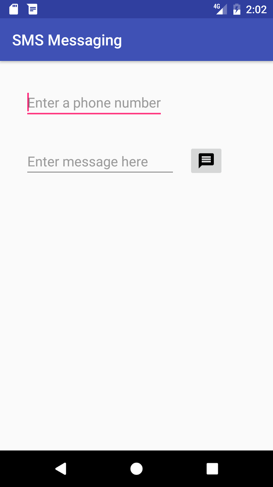
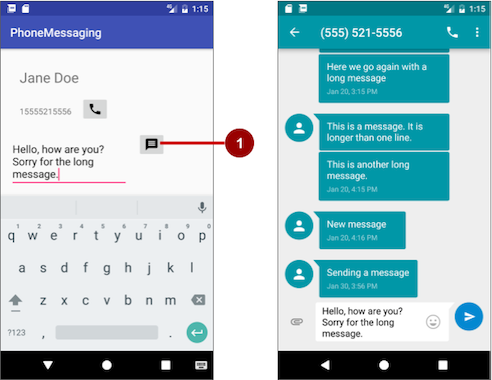
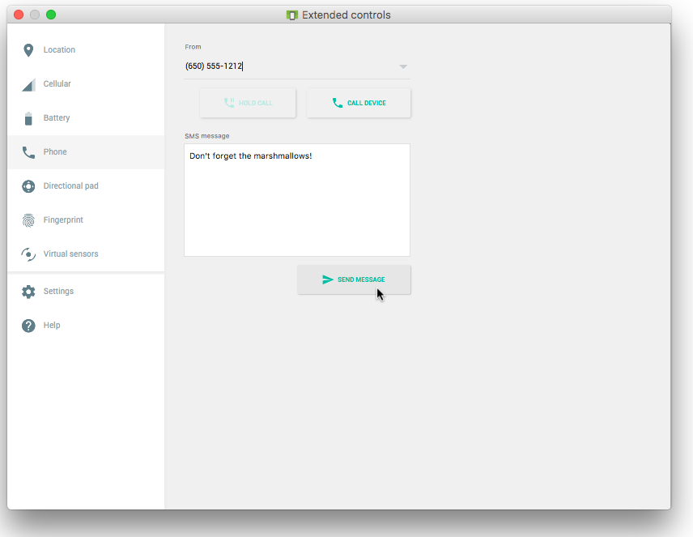
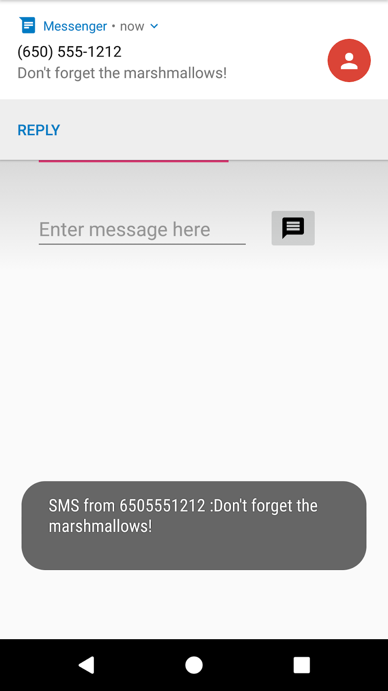
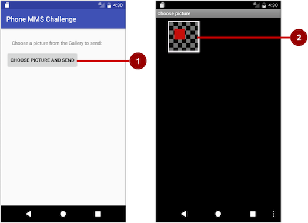
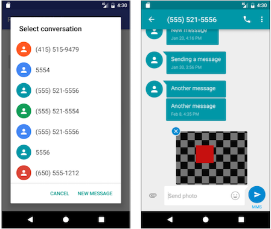

# P 03.2: Sending and Receiving SMS Messages

[Codelab Feedback](https://github.com/khammami/codelabs-enetcom/issues)


## Welcome


### Introduction

Android smartphones can send and receive messages to or from any other phone that supports Short Message Service (SMS). You have two choices for sending SMS messages:

1. Use an implicit  [Intent](https://developer.android.com/reference/android/content/Intent.html) to launch a messaging app with the  [ACTION_SENDTO](https://developer.android.com/reference/android/content/Intent.html#ACTION_SENDTO) intent action.

* This is the simplest choice for sending messages. The user can add a picture or other attachment in the messaging app, if the messaging app supports adding attachments.
* Your app doesn't need code to request permission from the user.
* If the user has multiple SMS messaging apps installed on the Android phone, the App chooser will appear with a list of these apps, and the user can choose which one to use. (Android smartphones will have at least one, such as Messenger.)
* The user can change the message in the messaging app before sending it.
* The user navigates back to your app using the **Back** button.

2. Send the SMS message using the  [sendTextMessage()](https://developer.android.com/reference/android/telephony/SmsManager.html#sendTextMessage(java.lang.String,%20java.lang.String,%20java.lang.String,%20android.app.PendingIntent,%20android.app.PendingIntent)) method or other methods of the  [SmsManager](https://developer.android.com/reference/android/telephony/SmsManager.html) class.

* This is a good choice for sending messages from your app without having to use another installed app.
* Your app must ask the user for permission before sending the SMS message, if the user hasn't already granted permission.
* The user stays in your app during and after sending the message.
* You can manage SMS operations such as dividing a message into fragments, sending a multipart message, get carrier-dependent configuration values, and so on.

To receive SMS messages, use the  [onReceive()](https://developer.android.com/reference/android/content/BroadcastReceiver.html#onReceive(android.content.Context,%20android.content.Intent)) method of the  [BroadcastReceiver](https://developer.android.com/reference/android/content/BroadcastReceiver.html) class.

### What you should already know

* Create an `onClick` method for a button with the `android:onClick` attribute.
* Use an implicit intent to perform a function with another app.
* Use a broadcast receiver to receive system events.

### What you'll learn

* Launch an SMS messaging app from your app with a phone number and message.
* Send an SMS message from within an app.
* Check for the SMS permission, and request permission if necessary.
* Receive SMS events using a broadcast receiver.
* Extract an SMS message from an SMS event.

### What you'll do

* Create an app that uses an implicit intent to launch a messaging app.
* Pass data (the phone number) and the message with the implicit intent.
* Create an app that sends SMS messages using the  [SmsManager](https://developer.android.com/reference/android/telephony/SmsManager.html) class.
* Check for the SMS permission, which can change at any time.
* Request permission from the user, if necessary, to send SMS messages.
* Receive and process an SMS message.


## App overview


You will create two new apps based on apps you created previously about making phone calls:

*  [PhoneMessaging](https://github.com/khammami/android-fundamentals-phone-sms/tree/master/PhoneMessaging): Rename and refactor the `PhoneCallDial` app from the previous chapter, and add code to enable a user to not only dial a hard-coded phone number but also send an SMS message to the phone number. It uses an implicit intent using `ACTION_SENDTO` and the phone number to launch a messaging app to send the message.
As shown in the figure below, the `PhoneCallDial` app already has `TextEdit` views for the contact name and the hard-coded phone number, and an `ImageButton` for making a phone call. You will copy the app, rename it to `PhoneMessaging`, and modify the layout to include an `EditText` for entering the message, and another `ImageButton` with an icon that the user can tap to send the message.


*  [SMS Messaging](https://github.com/khammami/android-fundamentals-phone-sms/tree/master/SmsMessaging): Change the `PhoneCallingSample` app from the previous chapter to enable a user to enter a phone number, enter an SMS message, and send the message from within the app. It checks for permission and then uses the  [SmsManager](https://developer.android.com/reference/android/telephony/SmsManager.html) class to send the message.
As shown in the figure below, the `PhoneCallingSample` app already has an `EditText` view for entering the phone number and an `ImageButton` for making a phone call. You will copy the app, rename it to **SmsMessaging**, and modify the layout to include another `EditText` for entering the message, and change the `ImageButton` to an icon that the user can tap to send the message.




## Task 1: Launch a messaging app to send a message


In this task you create an app called **PhoneMessaging**, a new version of the **PhoneCallDial** app from a previous project. The new app launches a messaging app with an implicit intent, and passes a fixed phone number and a message entered by the user.

The user can tap the messaging icon in your app to send the message. In the messaging app launched by the intent, the user can tap to send the message, or change the message or the phone number before sending the message. After sending the message, the user can navigate back to your app using the **Back** button.

### 1.1 Modify the app and layout

1. Copy the  [PhoneCallDial](https://github.com/khammami/android-fundamentals-phone-sms/tree/master/PhoneCallDial) project folder, rename it to **PhoneMessaging**, and refactor it to populate the new name throughout the app project.
2. Add an icon for the messaging button by following these steps:

* Select drawable in the Project: Android view and choose **File &gt; New &gt; Vector Asset**.
* Click the Android icon next to "Icon:" to choose an icon. To find a messaging icon, choose **Communication** in the left column.
* Select the icon, click **OK**, click **Next**, and then click **Finish**.

3. Add the following `EditText` to the existing layout after the `phone_icon` `ImageButton`:

```
...
<ImageButton
    android:id="@+id/phone_icon"
    ... />

<EditText
    android:id="@+id/sms_message"
    android:layout_width="200dp"
    android:layout_height="wrap_content"
    android:layout_below="@id/number_to_call"
    android:layout_marginTop="@dimen/activity_vertical_margin"
    android:layout_marginRight="@dimen/activity_horizontal_margin"
    android:hint="Enter message here"
    android:inputType="textMultiLine"/>
```

You will use the `android:id` `sms_message` to retrieve the message in your code. You can use `@dimen/activity_horizontal_margin` and `@dimen/activity_vertical_margin` for the `EditText` margins because they are already defined in the **dimens.xml** file. The `EditText` view uses the `android:inputType` attribute set to `"textMultiLine"` for entering multiple lines of text.

4. After adding hard-coded strings and dimensions, extract them into resources:

* `android:layout_width="@dimen/edittext_width"`: The width of the `EditText` message (200dp).
* `android:hint="@string/enter_message_here"`: The hint for the `EditText` ("Enter message here").

5. Add the following `ImageButton` to the layout after the above `EditText`:

```
<ImageButton
    android:id="@+id/message_icon"
    android:contentDescription="Send a message"
    android:layout_width="wrap_content"
    android:layout_height="wrap_content"
    android:layout_marginTop="@dimen/activity_vertical_margin"
    android:layout_toRightOf="@id/sms_message"
    android:layout_toEndOf="@id/sms_message"
    android:layout_below="@id/phone_icon"
    android:src="@drawable/ic_message_black_24dp"
    android:onClick="smsSendMessage"/>
```

You will use the `android:id` `message_icon` to refer to the `ImageButton` for launching the messaging app. Use the vector asset you added previously (such as `ic_message_black_24dp` for a messaging icon) for the `ImageButton`.

6. After adding the hard-coded string for the `android:contentDescription` attribute, extract it into the resource `send_a_message`.
The `smsSendMessage()` method referred to in the `android:onClick` attribute remains highlighted until you create this method in the `MainActivity`, which you will do in the next step.
7. Click `smsSendMessage` in the `android:onClick` attribute, click the red light bulb that appears, and then select **Create smsSendMessage(View) in 'MainActivity'**. Android Studio automatically creates the `smsSendMessage()` method in `MainActivity` as `public`, returning `void`, with a `View` parameter. This method is called when the user taps the `message_icon` `ImageButton`.

```
public void smsSendMessage(View view) {
}
```

Your app's layout should now look like the following figure:


### 1.2 Edit the onClick method in MainActivity

1. Inside the `smsSendMessage()` method in **MainActivity**, get the phone number from the `number_to_call` `TextView`, and concatenate it with the `smsto:` prefix (as in `smsto:14155551212`) to create the phone number URI string `smsNumber`:

```
...
TextView textView = (TextView) findViewById(R.id.number_to_call);
// Use format with "smsto:" and phone number to create smsNumber.
String smsNumber = String.format("smsto: %s",
                             textView.getText().toString());
...
```

2. Get the string of the message entered into the `EditText` view:

```
...
// Find the sms_message view.
EditText smsEditText = (EditText) findViewById(R.id.sms_message);
// Get the text of the SMS message.
String sms = smsEditText.getText().toString();
...
```

3. Create an implicit intent (`smsIntent`) with the intent action `ACTION_SENDTO`, and set the phone number and text message as intent data and extended data, using `setData()` and `putExtra`:

```
...
// Create the intent.
Intent smsIntent = new Intent(Intent.ACTION_SENDTO);
// Set the data for the intent as the phone number.
smsIntent.setData(Uri.parse(smsNumber));
  // Add the message (sms) with the key ("sms_body").
smsIntent.putExtra("sms_body", sms);
...
```

The  [putExtra()](https://developer.android.com/reference/android/content/Intent.html#putExtra(java.lang.String,%20java.lang.String)) method needs two strings: the key identifying the type of data (`"sms_body"`) and the data itself, which is the text of the message (`sms`). For more information about common intents and the `putExtra()` method, see  [Common Intents: Text Messaging](https://developer.android.com/guide/components/intents-common.html#Messaging).

4. Add a check to see if the implicit intent resolves to a package (a messaging app). If it does, send the intent with `startActivity()`, and the system launches the app. If it does not, log an error.

```
...
// If package resolves (target app installed), send intent.
if (smsIntent.resolveActivity(getPackageManager()) != null) {
    startActivity(smsIntent);
} else {
    Log.e(TAG, "Can't resolve app for ACTION_SENDTO Intent");
}
...
```

The full method should now look like the following:

```
public void smsSendMessage(View view) {
    TextView textView = (TextView) findViewById(R.id.number_to_call);
    // Use format with "smsto:" and phone number to create smsNumber.
    String smsNumber = String.format("smsto: %s",
                                        textView.getText().toString());
    // Find the sms_message view.
    EditText smsEditText = (EditText) findViewById(R.id.sms_message);
    // Get the text of the sms message.
    String sms = smsEditText.getText().toString();
    // Create the intent.
    Intent smsIntent = new Intent(Intent.ACTION_SENDTO);
    // Set the data for the intent as the phone number.
    smsIntent.setData(Uri.parse(smsNumber));
    // Add the message (sms) with the key ("sms_body").
    smsIntent.putExtra("sms_body", sms);
    // If package resolves (target app installed), send intent.
    if (smsIntent.resolveActivity(getPackageManager()) != null) {
        startActivity(smsIntent);
    } else {
        Log.d(TAG, "Can't resolve app for ACTION_SENDTO Intent");
    }
}
```

### 1.3 Run the app

1. Run the app on either an emulator or a device.
2. Enter a message, and tap the messaging icon (marked "1" in the left side of the figure below). The messaging app appears, as shown on the right side of the figure below.



3. Use the **Back** button to return to the PhoneMessaging app. You may need to tap or click it more than once to leave the SMS messaging app.

##### **Solution code**

Android Studio project:  [PhoneMessaging](https://github.com/khammami/android-fundamentals-phone-sms/tree/master/PhoneMessaging)


## Task 2: Send an SMS message from within an app


In this task you will copy the  [PhoneCallingSample](https://github.com/khammami/android-fundamentals-phone-sms/tree/master/PhoneCallingSample) app from the lesson on making a phone call, rename and refactor it to **SmsMessaging**, and modify its layout and code to create an app that enables a user to enter a phone number, enter an SMS message, and send the message from within the app.

In the first step you will add the code to send the message, but the app will work only if you first turn on SMS permission manually for the app in Settings on your device or emulator.

In subsequent steps you will do away with setting this permission manually by requesting SMS permission from the app's user if it is not already set.

### 2.1 Create the app and layout and add permission

1. Copy the  [**PhoneCallingSample**](https://github.com/khammami/android-fundamentals-phone-sms/tree/master/PhoneCallingSample) project folder, rename it to **SmsMessaging**, and refactor it to populate the new name throughout the app project.
2. Open **strings.xml** and change the `app_name` string resource to `"SMS Messaging"`.
3. Add the `android.permission.SEND_SMS` permission to the **AndroidManifest.xml** file, and remove the `CALL_PHONE` and `READ_PHONE_STATE` permissions for phone use, so that you have only one permission:
 

```
<uses-permission android:name="android.permission.SEND_SMS" />
```


Sending an SMS message is permission-protected. Your app can't use SMS without the `SEND_SMS` permission line in **AndroidManifest.xml**. This permission line enables a setting for the app in the Settings app that gives the user the choice of allowing or disallowing use of SMS. (In the next task you will add a way for the user to grant that permission from within the app.)

4. Add a messaging icon as you did in the previous task, and remove the phone icon from the drawable folder.
5. Open **activity_main.xml** and edit the `EditText` view and replace the `android:layout_margin` attribute with the following:

```
...
android:layout_marginTop="@dimen/activity_vertical_margin"
android:layout_marginRight="@dimen/activity_horizontal_margin"
...
```

You can use `@dimen/activity_horizontal_margin` and `@dimen/activity_vertical_margin` because they are already defined in the **dimens.xml** file.

6. Add the following `EditText` to the layout after the first `EditText` (for an image of the layout, see the figure at the end of these steps):

```
...
<EditText
    android:id="@+id/sms_message"
    android:layout_width="@dimen/edittext_width"
    android:layout_height="wrap_content"
    android:layout_below="@id/editText_main"
    android:layout_margin="@dimen/activity_horizontal_margin"
    android:hint="Enter message here"
    android:inputType="textMultiLine"/>
```

You will use the `android:id` attribute to `sms_message` to identify it as the `EditText` for the message. The `EditText` view uses the `android:inputType` attribute set to `"textMultiLine"` for entering multiple lines of text.

7. After adding the hard-coded string `"Enter message here"` for the `android:hint` attribute, extract it into the text resource `"enter_message_here"`.
8. Change the `android:layout_below` attribute for the `button_retry` Button to refer to the `sms_message` `EditText` view. The Button should appear below the SMS message in the layout if it becomes visible:

```
android:layout_below="@id/sms_message"
```


The `button_retry` Button is set to invisible. It appears only if the app detected that telephony is not enabled, or if the user previously denied phone permission when the app requested it.

9. Replace the `phone_icon` `ImageButton` from the existing layout with the following:

```
<ImageButton
    android:id="@+id/message_icon"
    android:contentDescription="Send a message"
    android:layout_width="wrap_content"
    android:layout_height="wrap_content"
    android:layout_marginTop="@dimen/activity_vertical_margin"
    android:layout_toRightOf="@id/sms_message"
    android:layout_toEndOf="@id/sms_message"
    android:layout_below="@id/editText_main"
    android:src="@drawable/ic_message_black_24dp"
    android:visibility="visible"
    android:onClick="smsSendMessage"/>
```


You will use the `android:id` `message_icon` in your code to refer to the `ImageButton` for sending the message. Use the vector asset you added previously (such as `ic_message_black_24dp` for a messaging icon) for the `ImageButton`. Make sure you include the `android:visibility` attribute set to `"visible"`. You will control the visibility of this `ImageButton` from your code.

10. After adding a hard-coded string for the `android:contentDescription` attribute, extract it to the `send_a_message` string resource.
The `smsSendMessage()` method referred to in the `android:onClick` attribute for the `ImageButton` remains highlighted until you create this method in the **MainActivity**, which you will do in the next step.
11. Click `smsSendMessage` in the `android:onClick` attribute, click the red light bulb that appears, and then select **Create smsSendMessage(View) in 'MainActivity'**. Android Studio automatically creates the `smsSendMessage()` method in **MainActivity** as `public`, returning `void`, with a `View` parameter. This method is called when the user taps the `message_icon` `ImageButton`.

```
public void smsSendMessage(View view) {
}
```

Your app's layout should look like the following figure (the `button_retry` Button is invisible):


### 2.2 Edit the onClick method in MainActivity

1. Open **MainActivity** and find the new s`msSendMessage()` method you created in the last step.
2. Add statements to the method to get the string for the phone number from the `editText_main` view, and get the string for the SMS message from the `sms_message` view:

```
public void smsSendMessage(View view) {
   EditText editText = (EditText) findViewById(R.id.editText_main);
   // Set the destination phone number to the string in editText.
   String destinationAddress = editText.getText().toString();
   // Find the sms_message view.
   EditText smsEditText = (EditText) findViewById(R.id.sms_message);
   // Get the text of the sms message.
   String smsMessage = smsEditText.getText().toString();
   ...
}
```

3. Declare additional string and `PendingIntent` parameters for the  [sendTextMessage()](https://developer.android.com/reference/android/telephony/SmsManager.html#sendTextMessage(java.lang.String,%20java.lang.String,%20java.lang.String,%20android.app.PendingIntent,%20android.app.PendingIntent)) method, which will send the message (`destinationAddress` is already declared as the string for the phone number to receive the message):

* `scAddress`: A string for the service center address, or `null` to use the current default SMSC. A Short Message Service Center (SMSC) is a network element in the mobile telephone network. The mobile network operator usually presets the correct service center number in the default profile of settings stored in the device's SIM card.
* `smsMessage`: A string for the body of the message to send.
* `sentIntent`: A `PendingIntent`. If not `null`, this is broadcast when the message is successfully sent or if the message failed.
* `deliveryIntent`: A `PendingIntent`. If not `null`, this is broadcast when the message is delivered to the recipient.

```
...
// Set the service center address if needed, otherwise null.
String scAddress = null;
// Set pending intents to broadcast
// when message sent and when delivered, or set to null.
PendingIntent sentIntent = null, deliveryIntent = null;
...
```

4. Use the  [SmsManager](https://developer.android.com/reference/android/telephony/SmsManager.html) class to create `smsManager`, which automatically imports `android.telephony.SmsManager`, and use `sendTextMessage()` to send the message:

```
...
// Use SmsManager.
SmsManager smsManager = SmsManager.getDefault();
smsManager.sendTextMessage
       (destinationAddress, scAddress, smsMessage,
                       sentIntent, deliveryIntent);
...
```

The full method should now look like the following:

```
public void smsSendMessage(View view) {
    EditText editText = (EditText) findViewById(R.id.editText_main);
    // Set the destination phone number to the string in editText.
    String destinationAddress = editText.getText().toString();
    // Find the sms_message view.
    EditText smsEditText = (EditText) findViewById(R.id.sms_message);
    // Get the text of the SMS message.
    String smsMessage = smsEditText.getText().toString();
    // Set the service center address if needed, otherwise null.
    String scAddress = null;
    // Set pending intents to broadcast
    // when message sent and when delivered, or set to null.
    PendingIntent sentIntent = null, deliveryIntent = null;
    // Use SmsManager.
    SmsManager smsManager = SmsManager.getDefault();
    smsManager.sendTextMessage
                  (destinationAddress, scAddress, smsMessage,
                                 sentIntent, deliveryIntent);
}
```

If you run the app now, on either a device or an emulator, the app may crash depending on whether the device or emulator has been previously set to allow the app to use SMS. In some versions of Android, this permission is turned on by default. In other versions, this permission is turned off by default.

To set the app's permission on a device or emulator instance, choose **Settings &gt; Apps &gt; SMS Messaging &gt; Permissions**, and turn on the SMS permission for the app. Since the user can turn on or off SMS permission at any time, you need to add a check in your app for this permission, and request it from the user if necessary. You will do this in the next step.

### 2.3 Check for and request permission for SMS

Your app must always get permission to use anything that is not part of the app itself. In Step 2.1 you added the following permission to the **AndroidManifest.xml** file:

```
<uses-permission android:name="android.permission.SEND_SMS" />
```

This permission enables a permission setting in the Settings app for your app. The user can allow or disallow this permission at any time from the Settings app. You can add code to request permission from the user if the user has turned off SMS permission for the app. Follow these steps:

1. At the top of **MainActivity**, below the class definition, change the global constant for the `MY_PERMISSIONS_REQUEST_CALL_PHONE` request code to the following:

```
private static final int MY_PERMISSIONS_REQUEST_SEND_SMS = 1;
```


When a result returns in the activity, it will contain the `MY_PERMISSIONS_REQUEST_SEND_SMS` `requestCode` so that your code can identify it.

2. Remove the constant declarations for `mTelephonyManager` and `MyPhoneCallListener`.
3. Remove the `isTelephonyEnabled()` method, and remove all of the code in the `onCreate()` method that starts with the `mTelephonyManager` assignment, leaving only the first two lines:

```
@Override
protected void onCreate(Bundle savedInstanceState) {
   super.onCreate(savedInstanceState);
   setContentView(R.layout.activity_main);
}
```

4. Refactor/rename the existing `disableCallButton()` method to `disableSmsButton()` and edit the method to do the following:

1. Display a toast to notify the user that SMS usage is disabled.
2. Find and then set the `smsButton` (the message icon) to be invisible so that the user can't send a message.
3. Set the **Retry** button to be visible, so that the user can restart the activity and allow permission.

```
private void disableSmsButton() {
   Toast.makeText(this, "SMS usage disabled", Toast.LENGTH_LONG).show();
   ImageButton smsButton = (ImageButton) findViewById(R.id.message_icon);
   smsButton.setVisibility(View.INVISIBLE);
   Button retryButton = (Button) findViewById(R.id.button_retry);
   retryButton.setVisibility(View.VISIBLE);
}
```

Extract a string resource (`sms_disabled`) for the hard-coded string `"SMS usage disabled"` in the toast statement.

5. Refactor/rename the existing `enableCallButton()` method to `enableSmsButton()` to set the SMS message icon button to be visible:

```
private void enableSmsButton() {
   ImageButton smsButton = (ImageButton) findViewById(R.id.message_icon);
   smsButton.setVisibility(View.VISIBLE);
}
```

6. Modify the existing `retryApp()` method in `MainActivity` to remove the call to `enableCallButton()`.
7. In **MainActivity**, rename and refactor the `checkForPhonePermission()` method to `checkForSmsPermission()`, and change the code to the following:

```
private void checkForSmsPermission() {
   if (ActivityCompat.checkSelfPermission(this,
                Manifest.permission.SEND_SMS) !=
                PackageManager.PERMISSION_GRANTED) {
       Log.d(TAG, getString(R.string.permission_not_granted));
       // Permission not yet granted. Use requestPermissions().
       // MY_PERMISSIONS_REQUEST_SEND_SMS is an
       // app-defined int constant. The callback method gets the
       // result of the request.
       ActivityCompat.requestPermissions(this,
                new String[]{Manifest.permission.SEND_SMS},
                MY_PERMISSIONS_REQUEST_SEND_SMS);
   } else {
       // Permission already granted. Enable the SMS button.
       enableSmsButton();
   }
}
```

Use  [checkSelfPermission()](https://developer.android.com/reference/android/support/v4/content/ContextCompat.html#checkSelfPermission(android.content.Context,%20java.lang.String)) to determine whether your app has been granted a particular permission by the user. If permission has not been granted by the user, use the  [requestPermissions()](https://developer.android.com/reference/android/support/v4/app/ActivityCompat.html#requestPermissions(android.app.Activity,%20java.lang.String[],%20int)) method to display a standard dialog for the user to grant permission.
When your app calls  [requestPermissions()](https://developer.android.com/reference/android/support/v4/app/ActivityCompat.html#requestPermissions(android.app.Activity,%20java.lang.String[],%20int)), the system shows a standard dialog for each permission to the user, as shown in the figure below.


8. When the user responds to the request permission dialog, the system invokes your app's  [onRequestPermissionsResult()](https://developer.android.com/reference/android/support/v4/app/ActivityCompat.OnRequestPermissionsResultCallback.html#onRequestPermissionsResult(int,%20java.lang.String[],%20int[])) method, passing it the user response. Find the `onRequestPermissionsResult()` method you created for the previous version of this app.
Your implementation of `onRequestPermissionsResult()` already uses a `switch` statement based on the value of `requestCode`. A `case` for checking phone permission is already implemented using `MY_PERMISSIONS_REQUEST_CALL_PHONE`. Replace `MY_PERMISSIONS_REQUEST_CALL_PHONE` with `MY_PERMISSIONS_REQUEST_SEND_SMS`, and replace `CALL_PHONE` with `SEND_SMS`. The switch block should now look like the following:

```
...
switch (requestCode) {
    case MY_PERMISSIONS_REQUEST_SEND_SMS: {
        if (permissions[0].equalsIgnoreCase
            (Manifest.permission.SEND_SMS)
            && grantResults[0] ==
            PackageManager.PERMISSION_GRANTED) {
            // Permission was granted. Enable sms button.
            enableSmsButton();
        } else {
            // Permission denied.
            Log.d(TAG, getString(R.string.failure_permission));
            Toast.makeText(this,
                        getString(R.string.failure_permission),
                        Toast.LENGTH_LONG).show();
            // Disable the sms button.
            disableSmsButton();
        }
    }
}
```

If the user allows the permission request, the message button is re-enabled with `enableSmsButton()` in case it was made invisible by lack of permission.
If the user denies the permission requests, your app should take appropriate action. For example, your app might disable the functionality that depends on a specific permission and show a dialog explaining why it could not perform it. For now, log a debug message, display a toast to show that permission was not granted, and disable the message button with `disableSmsButton()`.

9. In the `onCreate()` method of **MainActivity**, add a call to the `checkForSmsPermission()` method:

```
@Override
protected void onCreate(Bundle savedInstanceState) {
   super.onCreate(savedInstanceState);
   setContentView(R.layout.activity_main);
   checkForSmsPermission();
}
```

10. Remove the `callNumber()` method and the `MyPhoneCallListener` inner class (including the `onCallStateChanged()` method, as you are no longer using the Telephony Manager).
11. Remove the `onDestroy()` method since you are no longer using a listener.
12. Since the user might turn off SMS permission while the app is still running, add a check for SMS permission in the `smsSendMessage()` method after setting the `sentIntent` but before using the `SmsManager` class:

```
...
PendingIntent sentIntent = null, deliveryIntent = null;
// Check for permission first.
checkForSmsPermission();
// Use SmsManager.
...
```

### 2.4 Run the app and test permissions

1. Run your app. Enter a phone number (or the emulator port number if using emulators), and enter the message to send. Tap the messaging icon to send the message.
2. After running the app, choose **Settings &gt; Apps &gt; SMS Messaging &gt; Permissions** and turn off SMS permission for the app.
3. Run the app again. You should see the SMS permission request dialog as shown below.


4. Click **Deny**. In the app's UI, the message icon button no longer appears, and a **Retry** button appears, as shown below.


5. Click **Retry**, and then click **Allow** for SMS permission.
6. Test the app's ability to send a message:

* Enter a phone number.
* Enter a message.
* Tap the messaging icon.


## Task 3: Receive SMS messages with a broadcast receiver


To receive SMS messages, use the  [onReceive()](https://developer.android.com/reference/android/content/BroadcastReceiver.html#onReceive(android.content.Context,%20android.content.Intent)) method of the  [BroadcastReceiver](https://developer.android.com/reference/android/content/BroadcastReceiver.html) class. The Android framework sends out system broadcasts of events such as receiving an SMS message, containing intents that are meant to be received using a BroadcastReceiver. You need to add the `RECEIVE_SMS` permission to your app's **AndroidManifest.xml** file.

### 3.1 Add permission and create a broadcast receiver

To add `RECEIVE_SMS` permission and create a broadcast receiver, follow these steps:

1. Open the **AndroidManifest.xml** file and add the `android.permission.RECEIVE_SMS` permission below the other permission for SMS use:

```
  <uses-permission android:name="android.permission.SEND_SMS" />
  <uses-permission android:name="android.permission.RECEIVE_SMS" />
```

Receiving an SMS message is permission-protected. Your app can't receive SMS messages without the `RECEIVE_SMS` permission line in **AndroidManifest.xml**.

2. Select the package name in the Project:Android: view and choose **File &gt; New &gt; Other &gt; Broadcast Receiver**.
3. Name the class "**MySmsReceiver**" and make sure "**Exported**" and "**Enabled**" are checked.
The "**Exported**" option allows your app to respond to outside broadcasts, while "**Enabled**" allows it to be instantiated by the system.
4. Open the **AndroidManifest.xml** file again. Note that Android Studio automatically generates a `&lt;receiver&gt;` tag with your chosen options as attributes:

```
<receiver
    android:name=
        "com.example.android.smsmessaging.MySmsReceiver"
    android:enabled="true"
    android:exported="true">
</receiver>
```

### 3.2 Register the broadcast receiver

In order to receive any broadcasts, you must register for specific broadcast intents. In the  [Intent documentation](https://developer.android.com/reference/android/content/Intent.html), under "Standard Broadcast Actions", you can find some of the common broadcast intents sent by the system. In this app, you use the `android.provider.Telephony.SMS_RECEIVED` intent.

Add the following inside the `&lt;receiver&gt;` tags to register your receiver:

```
<receiver
    android:name="com.example.android.smsmessaging.MySmsReceiver"
    android:enabled="true"
    android:exported="true">
    <intent-filter>
         <action android:name="android.provider.Telephony.SMS_RECEIVED"/>
    </intent-filter>
</receiver>
```

### 3.3 Implement the onReceive() method

Once the BroadcastReceiver intercepts a broadcast for which it is registered (`SMS_RECEIVED`), the intent is delivered to the receiver's `onReceive()` method, along with the context in which the receiver is running.

1. Open **MySmsReceiver** and add under the class declaration a string constant `TAG` for log messages and a string constant `pdu_type` for identifying PDUs in a bundle:

```
public class MySmsReceiver extends BroadcastReceiver {
   private static final String TAG =
                          MySmsReceiver.class.getSimpleName();
   public static final String pdu_type = "pdus";
   ...
```

2. Delete the default implementation inside the supplied `onReceive()` method.
3. In the blank `onReceive()` method:

* Add the `@TargetAPI` annotation for the method, because it performs a different action depending on the build version.
* Retrieve a map of extended data from the intent to a `bundle`.
* Define the `msgs` array and `strMessage` string.
* Get the `format` for the message from the `bundle`.

```
@TargetApi(Build.VERSION_CODES.M)
@Override
public void onReceive(Context context, Intent intent) {
   // Get the SMS message.
   Bundle bundle = intent.getExtras();
   SmsMessage[] msgs;
   String strMessage = "";
   String format = bundle.getString("format");
   ...
```

As you enter `SmsMessage[]`, Android Studio automatically imports `android.telephony.SmsMessage`.

4. Retrieve from the `bundle` one or more pieces of data in the protocol data unit (PDU) format, which is the industry-standard format for an SMS message:

```
...
// Retrieve the SMS message received.
Object[] pdus = (Object[]) bundle.get(pdu_type);
...
```

5. If there are messages (`pdus`), check for Android version 6.0 (Marshmallow) and newer versions. You will use this boolean to check if your app needs the deprecated signature  [createFromPdu(byte[] pdu)](https://developer.android.com/reference/android/telephony/SmsMessage.html#createFromPdu(byte[])) (deprecated) for earlier versions of Android:

```
...
if (pdus != null) {
   // Check the Android version.
   boolean isVersionM = (Build.VERSION.SDK_INT >=
                         Build.VERSION_CODES.M);
   ...
```

6. Initialize the `msgs` array, and use its length in the `for` loop:

```
...
// Fill the msgs array.
  msgs = new SmsMessage[pdus.length];
      for (int i = 0; i < msgs.length; i++) {
          // Check Android version and use appropriate createFromPdu.
          if (isVersionM) {
              // If Android version M or newer:
              msgs[i] =
                   SmsMessage.createFromPdu((byte[]) pdus[i], format);
          } else {
              // If Android version L or older:
              msgs[i] = SmsMessage.createFromPdu((byte[]) pdus[i]);
          }
          ...
```

Use  [createFromPdu(byte[] pdu, String format)](https://developer.android.com/reference/android/telephony/SmsMessage.html#createFromPdu(byte[],%20java.lang.String)) to fill the `msgs` array for Android version 6.0 (Marshmallow) and newer versions. For earlier versions of Android, use the deprecated signature  [createFromPdu(byte[] pdu)](https://developer.android.com/reference/android/telephony/SmsMessage.html#createFromPdu(byte[])).

7. Build the `strMessage` to show in a toast message:

* Get the originating address using the `getOriginatingAddress()` method.
* Get the message body using the `getMessageBody()` method.
* Add an ending character for an end-of-line.

```
...
// Build the message to show.
strMessage += "SMS from " + msgs[i].getOriginatingAddress();
strMessage += " :" + msgs[i].getMessageBody() + "\n";
...
```

8. Log the resulting `strMessage` and display a toast with it:

```
...
// Log and display the SMS message.
Log.d(TAG, "onReceive: " + strMessage);
Toast.makeText(context, strMessage, Toast.LENGTH_LONG).show();
...
```

The complete `onReceive()` method is shown below:

```
@TargetApi(Build.VERSION_CODES.M)
@Override
public void onReceive(Context context, Intent intent) {
    // Get the SMS message.
    Bundle bundle = intent.getExtras();
    SmsMessage[] msgs;
    String strMessage = "";
    String format = bundle.getString("format");
    // Retrieve the SMS message received.
    Object[] pdus = (Object[]) bundle.get(pdu_type);
    if (pdus != null) {
        // Check the Android version.
        boolean isVersionM =
                        (Build.VERSION.SDK_INT >= Build.VERSION_CODES.M);
        // Fill the msgs array.
        msgs = new SmsMessage[pdus.length];
        for (int i = 0; i < msgs.length; i++) {
            // Check Android version and use appropriate createFromPdu.
            if (isVersionM) {
                // If Android version M or newer:
                msgs[i] = SmsMessage.createFromPdu((byte[]) pdus[i], format);
            } else {
                // If Android version L or older:
                msgs[i] = SmsMessage.createFromPdu((byte[]) pdus[i]);
            }
            // Build the message to show.
            strMessage += "SMS from " + msgs[i].getOriginatingAddress();
            strMessage += " :" + msgs[i].getMessageBody() + "\n";
            // Log and display the SMS message.
            Log.d(TAG, "onReceive: " + strMessage);
            Toast.makeText(context, strMessage, Toast.LENGTH_LONG).show();
        }
    }
}
```

### 3.4 Run the app and send a message

Run the app on a device. If possible, have someone send you an SMS message from a different device.

You can also receive an SMS text message when testing on an emulator. Follow these steps:

1. Run the app on an emulator.
2. Click the ... (More) icon at the bottom of the emulator's toolbar on the right side, as shown in the figure below:


3. The extended controls for the emulator appear. Click **Phone** in the left column to see the extended phone controls:



4. You can now enter a message (or use the default "marshmallows" message) and click **Send Message** to have the emulator send an SMS message to itself.
5. The emulator responds with a notification about receiving an SMS message. The app should also display a toast message showing the message and its originating address, as shown below:



### Solution Code

Android Studio project:  [SmsMessaging](https://github.com/khammami/android-fundamentals-phone-sms/tree/master/SmsMessaging)


## Coding challenge


> aside positive
> 
> **Note**: All coding challenges are optional.

Create a simple app with one button, **Choose Picture and Send**, that enables the user to select an image from the Gallery and send it as a Multimedia Messaging Service (MMS) message. After tapping the button, a choice of apps may appear, including the Messenger app. The user can select the Messenger app, and select an existing conversation or create a new conversation, and then send the image as a message.

The following are hints:

* To access and share an image from the Gallery, you need the following permission in the **AndroidManifest.xml** file:

```
<uses-permission
         android:name="android.permission.READ_EXTERNAL_STORAGE" />
```

* To enable the above permission, follow the model shown previously in this chapter to check for the `READ_EXTERNAL_STORAGE` permission, and request permission if necessary.
* Use the following intent for picking an image:

```
Intent galleryIntent = new Intent(Intent.ACTION_PICK,
   android.provider.MediaStore.Images.Media.EXTERNAL_CONTENT_URI);
startActivityForResult(galleryIntent, IMAGE_PICK);
```

* Override the  [onActivityResult](https://developer.android.com/reference/android/app/Activity.html#onActivityResult(int,%20int,%20android.content.Intent)) method to retrieve the intent result, and use `getData()` to get the `Uri` of the image in the result:

```
protected void onActivityResult
    (int requestCode, int resultCode, Intent imageReturnedIntent) {
    ...
    Uri mSelectedImage = imageReturnedIntent.getData();
}
```

* Set the image's `Uri`, and use an intent with `ACTION_SEND`, `putExtra()`, and `setType()`:

```
Intent smsIntent = new Intent(Intent.ACTION_SEND);
smsIntent.putExtra(Intent.EXTRA_STREAM, mSelectedImage);
smsIntent.setType("image/*");
```

* Android Studio emulators can't pass MMS messages to and from each other. You must test this app on real Android devices.
* For more information about sending multimedia messages, see  [Sending MMS with Android](http://jtribe.blogspot.com/2008/12/sending-mms-with-android.html).





Android Studio project:  [MMSChallenge](https://github.com/khammami/android-fundamentals-phone-sms/tree/master/MMSChallenge)


## Summary


* To send an intent to an SMS messaging app with a phone number, your app needs to prepare a URI for the phone number as a string prefixed by `"smsto:"` (as in `smsto:14155551212`).
* Use an implicit intent with `ACTION_SENDTO` to launch an SMS app, and set the phone number and message for the intent with `setData()` and `putExtra`.
* To send SMS messages from within your app, add the `"android.permission.SEND_SMS"` permission to the **AndroidManifest.xml** file:
* Use the  [sendTextMessage()](https://developer.android.com/reference/android/telephony/SmsManager.html#sendTextMessage(java.lang.String,%20java.lang.String,%20java.lang.String,%20android.app.PendingIntent,%20android.app.PendingIntent)) method of the  [SmsManager](https://developer.android.com/reference/android/telephony/SmsManager.html) class to send the message, which takes the following parameters:
* `destinationAddress`: The string for the phone number to receive the message.
* `scAddress`: A string for the service center address, or `null` to use the current default Short Message Service Center (SMSC).
* `smsMessage`: A string for the body of the message to send.
* `sentIntent`: A `PendingIntent`. If not `null`, this is broadcast when the message is successfully sent or if the message failed.
* `deliveryIntent`: A `PendingIntent`. If not `null`, this is broadcast when the message is delivered to the recipient.
* Use  [checkSelfPermission()](https://developer.android.com/reference/android/support/v4/content/ContextCompat.html#checkSelfPermission(android.content.Context,%20java.lang.String)) to determine whether your app has been granted a particular permission by the user. If permission has not been granted, use the  [requestPermissions()](https://developer.android.com/reference/android/support/v4/app/ActivityCompat.html#requestPermissions(android.app.Activity,%20java.lang.String[],%20int)) method to display a standard dialog for the user to grant permission.
* Create a broadcast receiver to receive SMS messages using the  [onReceive()](https://developer.android.com/reference/android/content/BroadcastReceiver.html#onReceive(android.content.Context,%20android.content.Intent)) method of the  [BroadcastReceiver](https://developer.android.com/reference/android/content/BroadcastReceiver.html) class.
* Add the `"android.provider.Telephony.SMS_RECEIVED"` intent filter between the `&lt;receiver&gt;` tags in **AndroidManifest.xml** to register your receiver for SMS messages.
* Use `getExtras()` to get the message from the intent:

```
Bundle bundle = intent.getExtras();
```

* Retrieve the messages from the PDU format:
  

```
Object[] pdus = (Object[]) bundle.get("pdus");
```

* Use the following `createFromPdu()` signature for Android version 6.0 (Marshmallow) and newer versions:
  

```
msgs[i] = SmsMessage.createFromPdu((byte[]) pdus[i], format);
```

* Use the following `createFromPdu()` signature for versions older than Android version 6.0:
  

```
msgs[i] = SmsMessage.createFromPdu((byte[]) pdus[i]);
```

* To send an SMS message to an app running in an emulator, click the ... (More) icon at the bottom of the emulator's toolbar on the right side, choose **Phone**, enter a message (or use the default "marshmallows" message), and click **Send Message**.


## Learn more


Android Developer Reference:

*  [Intent](http://developer.android.com/reference/android/content/Intent.html)
*  [Common Intents: Text Messaging](https://developer.android.com/guide/components/intents-common.html#Messaging)
*  [Intents and Intent Filters](http://developer.android.com/guide/components/intents-filters.html)
*  [SmsManager](https://developer.android.com/reference/android/telephony/SmsManager.html)
*  [Requesting Permissions at Run Time](https://developer.android.com/training/permissions/requesting.html)
*  [checkSelfPermission](https://developer.android.com/reference/android/support/v4/content/ContextCompat.html#checkSelfPermission(android.content.Context,%20java.lang.String))
*  [Run Apps on the Android Emulator](https://developer.android.com/studio/run/emulator.html)

Stack Overflow:  [Simulating incoming call or sms in Android Studio](http://stackoverflow.com/questions/27638462/simulating-incoming-call-or-sms-in-android-studio)

Android blog:  [Getting Your SMS Apps Ready for KitKat](http://android-developers.blogspot.com/2013/10/getting-your-sms-apps-ready-for-kitkat.html)


